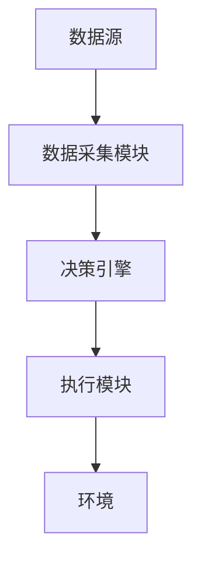
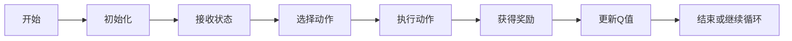

                 

# 企业AI Agent的强化学习应用：持续优化决策

> 关键词：AI Agent，强化学习，企业决策优化，深度强化学习，Q-learning，系统架构

> 摘要：本文深入探讨了企业AI Agent在强化学习中的应用，重点分析了强化学习的核心原理、AI Agent的设计与实现、系统架构与实现，以及在实际项目中的应用案例。通过详细讲解强化学习算法、系统设计和项目实战，本文为读者提供了从理论到实践的全面指导，帮助企业在决策优化中持续改进和创新。

---

## 第一部分: 强化学习与AI Agent概述

### 第1章: 强化学习与AI Agent概述

#### 1.1 强化学习的基本概念

##### 1.1.1 强化学习的定义与特点
强化学习（Reinforcement Learning, RL）是一种机器学习范式，通过智能体与环境的交互，学习如何做出决策以最大化累积奖励。与监督学习和无监督学习不同，强化学习强调实时反馈和长期策略优化。

##### 1.1.2 AI Agent的定义与分类
AI Agent（人工智能代理）是指能够感知环境并采取行动以实现目标的智能实体。根据智能体的决策方式，可分为基于规则的AI Agent和基于强化学习的AI Agent。

##### 1.1.3 强化学习在AI Agent中的作用
强化学习通过与环境的交互，不断优化决策策略，使AI Agent能够在动态变化的环境中做出最优决策。

#### 1.2 企业AI Agent的应用背景

##### 1.2.1 企业决策优化的挑战
企业在运营过程中面临诸多决策问题，如供应链优化、库存管理、资源分配等。传统方法难以应对动态变化和复杂场景。

##### 1.2.2 强化学习在企业决策中的优势
强化学习能够处理复杂决策问题，适应动态变化，并通过实时反馈不断优化决策策略。

##### 1.2.3 企业AI Agent的应用场景
企业AI Agent可应用于供应链优化、库存管理、客户关系管理等领域，通过强化学习提升决策效率和效果。

#### 1.3 本章小结
本章介绍了强化学习和AI Agent的基本概念，并探讨了它们在企业决策优化中的应用背景和优势。

---

## 第二部分: 强化学习的核心原理

### 第2章: 强化学习的核心原理

#### 2.1 强化学习的基本原理

##### 2.1.1 状态、动作、奖励的定义
- **状态（State）**：智能体所处的环境情况。
- **动作（Action）**：智能体根据当前状态做出的决策。
- **奖励（Reward）**：环境对智能体动作的反馈，用于指导学习方向。

##### 2.1.2 Q-learning算法的数学模型
Q-learning是一种经典的强化学习算法，其数学模型如下：
$$ Q(s,a) = Q(s,a) + \alpha (r + \gamma \max Q(s',a') - Q(s,a)) $$
其中，$\alpha$为学习率，$\gamma$为折扣因子。

##### 2.1.3 策略与价值函数的对比
- **策略（Policy）**：定义智能体在给定状态下的动作选择概率。
- **价值函数（Value Function）**：评估某个状态或动作的期望奖励。

#### 2.2 深度强化学习的原理

##### 2.2.1 DQN算法的流程
DQN（Deep Q-Network）通过深度神经网络近似Q值函数，避免了传统强化学习方法的离散化问题。

##### 2.2.2 深度神经网络在强化学习中的应用
深度神经网络用于处理高维状态空间，提取特征并预测最优动作。

#### 2.3 强化学习与监督学习的对比
| 对比维度 | 监督学习 | 强化学习 |
|----------|----------|----------|
| 数据类型 | 标签数据 | 奖励信号 |
| 目标函数 | 最小化预测误差 | 最大化累积奖励 |

#### 2.4 本章小结
本章详细讲解了强化学习的核心原理，包括Q-learning算法和深度强化学习的基本概念与数学模型。

---

## 第三部分: AI Agent的设计与实现

### 第3章: AI Agent的设计与实现

#### 3.1 AI Agent的设计原则

##### 3.1.1 多智能体协作机制
在企业环境中，多个AI Agent需要协作完成任务，需设计合理的协作机制。

##### 3.1.2 状态空间与动作空间的设计
状态空间和动作空间的设计直接影响AI Agent的决策能力。

##### 3.1.3 奖励机制的设计
合理的奖励机制能够引导AI Agent朝着预期目标行动。

#### 3.2 AI Agent的实现步骤

##### 3.2.1 环境建模
定义环境的状态、动作和奖励函数。

##### 3.2.2 策略网络的构建
使用深度神经网络近似策略或Q值函数。

##### 3.2.3 算法实现
实现强化学习算法，并在环境中进行训练。

#### 3.3 本章小结
本章探讨了AI Agent的设计原则和实现步骤，强调了环境建模和算法实现的重要性。

---

## 第四部分: 系统架构与实现

### 第4章: 系统架构与实现

#### 4.1 企业AI Agent系统架构

##### 4.1.1 系统功能模块
- 数据采集模块
- 决策引擎模块
- 执行模块

##### 4.1.2 系统架构图

#### 4.2 系统实现细节

##### 4.2.1 算法流程图

#### 4.3 系统接口设计
- 数据接口：定义数据格式和通信协议。
- API接口：提供标准接口供其他系统调用。

#### 4.4 本章小结
本章详细讲解了企业AI Agent系统的架构设计和实现细节。

---

## 第五部分: 项目实战

### 第5章: 项目实战

#### 5.1 项目背景与目标
以供应链优化为例，探讨如何通过强化学习优化库存管理。

#### 5.2 项目实施步骤

##### 5.2.1 环境部署
安装Python、TensorFlow等依赖库。

##### 5.2.2 代码实现
实现强化学习算法，并在供应链优化问题上进行训练。

##### 5.2.3 案例分析
分析训练结果，评估算法性能。

#### 5.3 项目小结
本章通过具体案例展示了强化学习在企业AI Agent中的应用，验证了算法的有效性。

---

## 第六部分: 最佳实践与未来展望

### 第6章: 最佳实践与未来展望

#### 6.1 最佳实践

##### 6.1.1 数据质量的重要性
高质量的数据是强化学习算法性能的基础。

##### 6.1.2 算法选择的策略
根据具体问题选择合适的强化学习算法。

##### 6.1.3 系统优化的建议
优化算法参数和系统架构，提升运行效率。

#### 6.2 小结
本文详细探讨了企业AI Agent的强化学习应用，从理论到实践，为读者提供了全面的指导。

#### 6.3 未来展望
随着技术进步，强化学习在企业决策优化中的应用将更加广泛和深入。

---

## 作者：AI天才研究院/AI Genius Institute & 禅与计算机程序设计艺术 /Zen And The Art of Computer Programming

---

### 附录：参考文献
1. DeepMind. "Deep Q-Networks (DQN): Reinforcement Learning." [链接]
2. Sutton, Richard S., and Andrew G. Barto. "Reinforcement Learning: An Introduction." [链接]
3. Mnih, Volodymyr, et al. "Human-level control through deep reinforcement learning." [链接]

