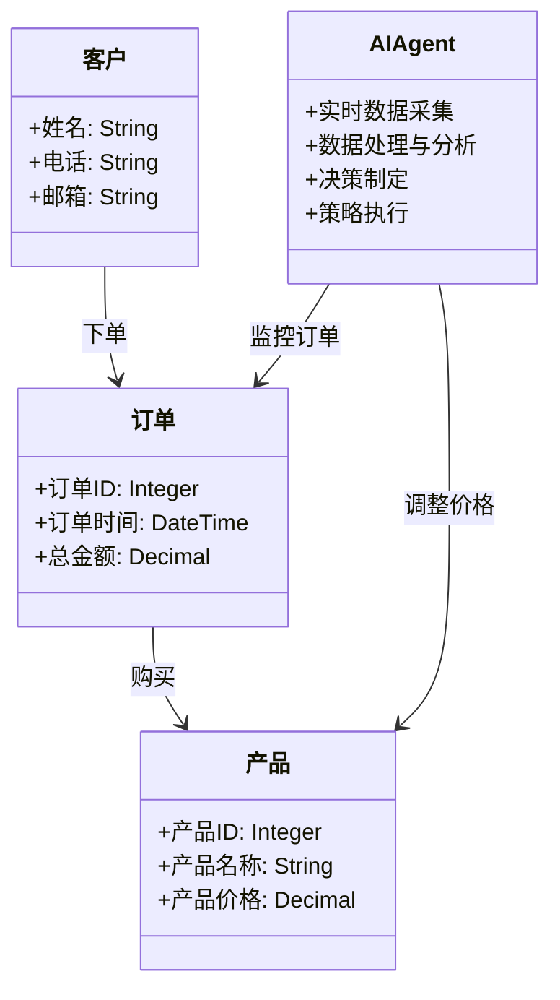
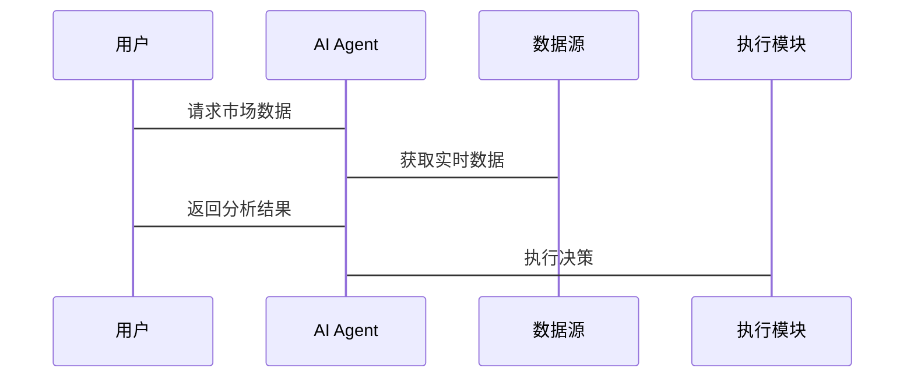

                 


# 企业AI Agent的快速适应框架：应对瞬息万变的市场环境

> **关键词**：企业AI Agent，快速适应框架，市场环境，动态适应，智能化转型，AI技术  
> 
> **摘要**：在当前快速变化的市场环境中，企业需要一种高效的方法来快速适应市场变化。企业AI Agent作为一种智能化工具，能够帮助企业实现快速决策和动态调整，从而在竞争激烈的市场中占据优势。本文将深入探讨企业AI Agent的核心概念、算法原理、系统架构以及实际应用，为企业提供一套快速适应市场环境的框架。

---

## 第一部分：企业AI Agent的背景与核心概念

### 第1章：企业AI Agent的背景与问题背景

#### 1.1 问题背景
企业面临的瞬息万变的市场环境要求其必须具备快速适应的能力。然而，传统的决策方式依赖于人工分析和固定流程，难以应对市场的快速变化。企业AI Agent作为一种智能化工具，能够通过实时数据分析和自主决策，帮助企业在复杂多变的市场环境中快速调整策略。

#### 1.2 问题描述
企业在面对市场变化时，常常面临以下挑战：
- **信息滞后**：传统决策依赖于历史数据，无法实时捕捉市场动态。
- **决策延迟**：人工决策过程繁琐，难以快速响应市场变化。
- **策略调整困难**：企业难以快速调整策略以适应新的市场环境。

#### 1.3 问题解决
企业AI Agent通过以下方式解决这些问题：
- **实时数据分析**：AI Agent能够实时收集和分析市场数据，提供实时反馈。
- **自主决策**：基于实时数据，AI Agent能够自主制定决策，快速响应市场变化。
- **动态调整策略**：根据市场反馈，AI Agent能够动态优化企业策略，确保其适应性。

#### 1.4 边界与外延
企业AI Agent的边界在于其核心功能，即实时数据处理和自主决策。其外延包括与企业现有系统（如ERP、CRM）的集成，以及与其他AI工具的协同工作。

---

### 第2章：企业AI Agent的核心概念与联系

#### 2.1 核心概念原理
企业AI Agent的核心原理是通过实时数据分析和机器学习算法，实现对市场变化的快速响应。其主要功能包括数据采集、分析、决策制定和执行。

#### 2.2 核心概念属性对比
| **属性**       | **传统方法**                     | **企业AI Agent**                  |
|----------------|----------------------------------|-----------------------------------|
| 数据处理       | 周期性数据采集，依赖历史数据       | 实时数据采集，依赖实时数据       |
| 决策速度       | 依赖人工分析，速度较慢            | 自主决策，速度快                 |
| 策略调整       | 需要人工重新制定策略              | 动态优化策略，自动调整            |

#### 2.3 ER实体关系图
```mermaid
er
  entity 客户 {
    key 客户ID
    attribute 姓名, 电话, 邮箱
  }

  entity 订单 {
    key 订单ID
    attribute 订单时间, 总金额
    relation 订单-客户关系 (订单ID, 客户ID)
  }

  entity 产品 {
    key 产品ID
    attribute 产品名称, 产品价格
    relation 订单-产品关系 (订单ID, 产品ID)
  }
```

---

## 第二部分：企业AI Agent的算法原理

### 第3章：企业AI Agent的算法原理

#### 3.1 算法原理概述
企业AI Agent的核心算法是基于强化学习的Q-learning算法。该算法通过状态-动作-奖励机制，帮助AI Agent在动态环境中做出最优决策。

#### 3.2 算法原理的数学模型
Q-learning算法的数学模型如下：
$$ Q(s, a) = Q(s, a) + \alpha \left[r + \gamma Q(s', a) - Q(s, a)\right] $$
其中：
- \( Q(s, a) \)：状态 \( s \) 下执行动作 \( a \) 的价值。
- \( \alpha \)：学习率。
- \( r \)：执行动作 \( a \) 后获得的奖励。
- \( \gamma \)：折扣因子。
- \( s' \)：执行动作 \( a \) 后进入的新状态。

#### 3.3 算法实现的详细步骤
1. 初始化Q表，所有状态-动作对的初始值为0。
2. 采集当前状态 \( s \)。
3. 根据当前状态 \( s \)，选择一个动作 \( a \)（探索与利用策略）。
4. 执行动作 \( a \)，观察新状态 \( s' \) 和奖励 \( r \)。
5. 更新Q表：$$ Q(s, a) = Q(s, a) + \alpha (r + \gamma \max Q(s', a')) - Q(s, a) $$。
6. 重复步骤2-5，直到达到预设的终止条件。

---

### 第4章：企业AI Agent的系统分析与架构设计

#### 4.1 系统分析
**问题场景**：某企业需要快速调整其市场策略，以应对竞争对手的价格变动。

**项目目标**：通过AI Agent实时监控市场数据，动态调整产品价格。

#### 4.2 系统功能设计


#### 4.3 系统架构设计


#### 4.4 接口设计与交互流程


---

## 第三部分：企业AI Agent的项目实战

### 第5章：项目实战

#### 5.1 环境安装
- **工具安装**：安装Python、TensorFlow、Mermaid CLI。
- **数据源获取**：获取市场数据（如股票价格、竞争对手信息）。

#### 5.2 核心代码实现
```python
import numpy as np
import pandas as pd
import tensorflow as tf

# 定义Q-learning模型
class AI-Agent:
    def __init__(self, state_space, action_space):
        self.state_space = state_space
        self.action_space = action_space
        self.Q = np.zeros((state_space, action_space))

    def act(self, state, epsilon=0.1):
        if np.random.random() < epsilon:
            return np.random.randint(self.action_space)
        else:
            return np.argmax(self.Q[state, :])

    def learn(self, state, action, reward, next_state):
        alpha = 0.1
        gamma = 0.9
        self.Q[state, action] += alpha * (reward + gamma * np.max(self.Q[next_state, :]) - self.Q[state, action])
```

#### 5.3 代码应用解读
- **数据采集模块**：实时采集市场数据。
- **数据处理模块**：对数据进行清洗和特征提取。
- **决策模块**：基于Q-learning算法，制定最优决策。
- **执行模块**：根据决策执行操作（如调整价格、优化供应链）。

#### 5.4 案例分析
以某企业为例，假设其产品价格受到竞争对手价格的影响。通过AI Agent实时监控竞争对手价格变化，动态调整自身价格，最终提高了市场份额。

#### 5.5 项目小结
通过项目实战，验证了企业AI Agent在实际应用中的有效性和高效性。

---

## 第四部分：最佳实践与总结

### 第6章：最佳实践

- **数据质量**：确保数据的实时性和准确性。
- **算法选择**：根据具体场景选择合适的算法。
- **系统集成**：确保AI Agent与企业现有系统的无缝集成。

### 第7章：总结与展望

- **总结**：企业AI Agent通过实时数据分析和自主决策，帮助企业快速适应市场变化。
- **展望**：未来，随着AI技术的不断发展，企业AI Agent将在更多领域发挥重要作用。

### 第8章：注意事项与拓展阅读

- **注意事项**：在实际应用中，需注意数据隐私和算法的可解释性。
- **拓展阅读**：推荐阅读《强化学习入门》、《企业智能化转型指南》。

---

**作者：AI天才研究院/AI Genius Institute & 禅与计算机程序设计艺术/Zen And The Art of Computer Programming**

