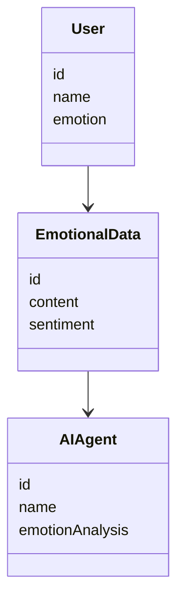
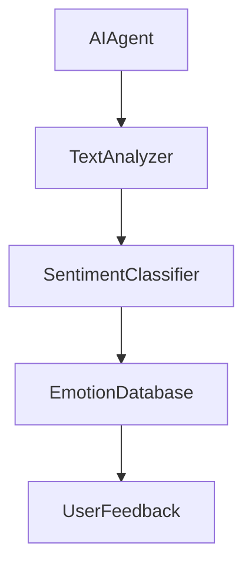
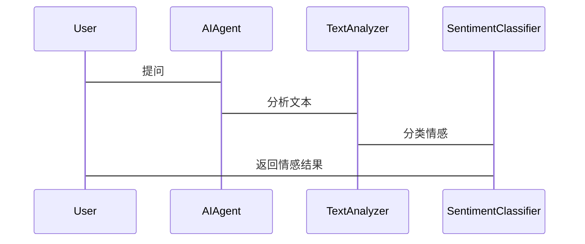

                 


# 企业AI Agent的情感计算应用：提升用户体验

> 关键词：AI Agent, 情感计算, 用户体验, 情感分析, 情感推理, 深度学习

> 摘要：本文深入探讨了企业AI Agent中的情感计算应用，分析了其在提升用户体验中的重要性。通过介绍情感计算的核心概念、算法原理、系统架构设计及实际项目案例，展示了如何利用情感计算技术优化企业AI Agent的表现，实现更自然、更智能的用户交互。

---

## 第一部分：企业AI Agent情感计算的背景与概念

### 第1章：情感计算的基本概念

#### 1.1 什么是情感计算
情感计算（Emotion Computing）是一种通过分析和理解人类情感、情绪和心理状态，从而做出更智能决策的技术。它结合了心理学、人工智能和计算机科学的原理，旨在使计算机能够像人类一样理解和回应情感信息。

#### 1.2 情感计算在企业中的应用背景
在企业环境中，情感计算的应用越来越广泛。例如，客户支持系统可以通过分析用户的语气和情绪，自动调整响应策略；企业聊天机器人可以识别用户的负面情绪，并及时采取措施解决问题。

#### 1.3 情感计算的核心目标与价值
情感计算的核心目标是通过分析和理解用户的情感信息，提供更个性化、更贴心的服务。其价值体现在提升用户体验、增强客户忠诚度、优化企业运营效率等方面。

---

### 第2章：AI Agent在企业中的应用现状

#### 2.1 AI Agent的基本概念
AI Agent（人工智能代理）是一种能够感知环境、自主决策并执行任务的智能系统。它可以在企业中承担多种角色，如客户支持、信息检索、流程自动化等。

#### 2.2 AI Agent的典型应用场景
AI Agent在企业中的典型应用场景包括：
- **客户支持**：通过自然语言处理技术，解决用户的问题。
- **信息检索**：帮助用户快速找到所需信息。
- **流程自动化**：自动化处理企业内部流程。

#### 2.3 情感计算在AI Agent中的重要性
情感计算使AI Agent能够理解用户的情感状态，从而提供更个性化的服务。例如，当用户表现出焦虑时，AI Agent可以调整语气，提供更温暖的支持。

---

### 第3章：情感计算的核心概念与联系

#### 3.1 情感计算的核心原理
情感计算的核心原理包括情感分析、情感推理和情感生成：
- **情感分析**：识别文本中的情感倾向（如正面、负面、中性）。
- **情感推理**：理解情感背后的原因和上下文。
- **情感生成**：根据情感信息生成相应的文本或行动。

#### 3.2 情感计算与AI Agent的联系
情感计算为AI Agent提供了情感理解能力，使其能够更好地与用户互动。例如，AI Agent可以根据用户的情感状态调整对话策略，提供更贴心的服务。

#### 3.3 情感计算与传统数据分析的对比
| 对比维度 | 情感计算 | 传统数据分析 |
|----------|----------|--------------|
| 数据来源 | 文本、语音、面部表情 | 结构化数据 |
| 分析目标 | 用户情感状态 | 数据模式、趋势 |
| 应用场景 | 客户支持、个性化推荐 | 报表生成、趋势分析 |

---

## 第二部分：情感计算的算法原理

### 第4章：情感分析算法

#### 4.1 基于规则的情感分析
基于规则的情感分析通过预定义的规则和情感词典，对文本进行情感分类。例如，如果文本中包含“很好”、“满意”等正面词汇，则判定为正面情感。

#### 4.2 基于机器学习的情感分析
基于机器学习的情感分析通过训练数据学习情感特征，从而实现情感分类。常用算法包括支持向量机（SVM）和朴素贝叶斯（Naive Bayes）。

#### 4.3 基于深度学习的情感分析
基于深度学习的情感分析利用神经网络（如循环神经网络和卷积神经网络）进行情感分类。这种方法能够捕捉文本中的语义信息，提高情感分析的准确性。

---

### 第5章：情感推理与生成算法

#### 5.1 情感推理算法
情感推理算法旨在理解情感背后的原因和上下文。例如，可以使用注意力机制来识别文本中的关键情感词。

#### 5.2 情感生成算法
情感生成算法用于根据情感信息生成相应的文本或行动。例如，可以使用生成对抗网络（GAN）生成情感化的文本。

---

## 第三部分：系统分析与架构设计

### 第6章：系统功能设计

#### 6.1 领域模型设计


#### 6.2 系统架构设计


#### 6.3 系统接口设计


---

## 第四部分：项目实战

### 第7章：环境安装与核心代码实现

#### 7.1 环境安装
安装必要的Python库：
```bash
pip install numpy
pip install scikit-learn
pip install transformers
```

#### 7.2 核心代码实现
```python
from transformers import pipeline

# 初始化情感分析模型
sentiment_analyzer = pipeline("sentiment-analysis")

# 情感分析函数
def analyze_emotion(text):
    result = sentiment_analyzer(text)
    return result[0]['label']

# 示例用法
text = "I love this product!"
print(analyze_emotion(text))  # 输出: 'POSITIVE'
```

---

### 第8章：实际案例分析

#### 8.1 案例背景
某企业希望优化其客户支持系统的用户体验。通过情感计算分析用户反馈，调整AI Agent的响应策略。

#### 8.2 案例分析
通过对用户反馈的分析，发现用户在某些情况下表现出负面情绪。AI Agent可以根据这些信息调整语气，提供更贴心的支持。

---

## 第五部分：总结与展望

### 第9章：最佳实践与注意事项

#### 9.1 数据质量的重要性
情感计算依赖于高质量的数据。确保数据的多样性和代表性，可以提高模型的准确性。

#### 9.2 模型的可解释性
在实际应用中，模型的可解释性非常重要。确保用户能够理解AI Agent的决策过程，可以增强信任感。

#### 9.3 用户隐私保护
在处理用户情感数据时，必须严格遵守隐私保护法规，确保用户数据的安全。

---

### 第10章：小结与拓展阅读

#### 10.1 小结
本文深入探讨了企业AI Agent中的情感计算应用，分析了其在提升用户体验中的重要性。通过介绍情感计算的核心概念、算法原理、系统架构设计及实际项目案例，展示了如何利用情感计算技术优化企业AI Agent的表现。

#### 10.2 拓展阅读
建议进一步阅读以下内容：
- 情感计算与自然语言处理的结合
- 深度学习在情感计算中的应用
- 情感计算在不同领域的实际应用案例

---

## 作者

作者：AI天才研究院/AI Genius Institute & 禅与计算机程序设计艺术 /Zen And The Art of Computer Programming

