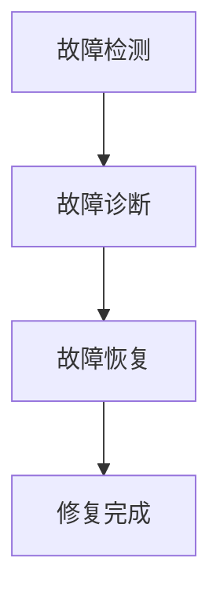
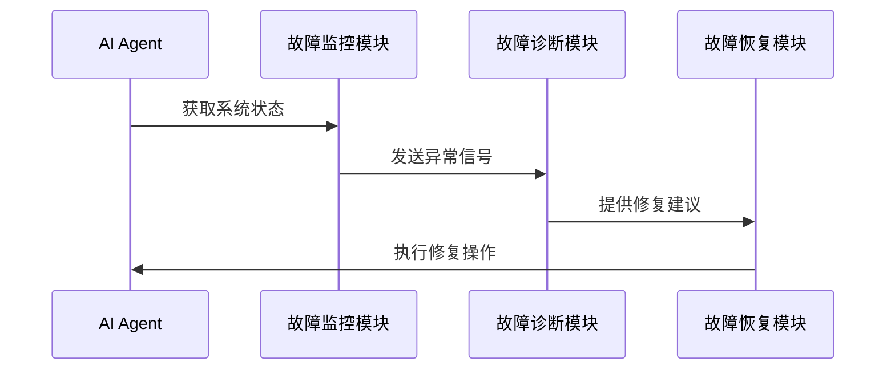

                 

<think>
嗯，用户希望我撰写一篇关于《企业AI Agent的故障恢复机制》的技术博客，而且已经给出了详细的目录结构。看起来他需要一个内容丰富、结构清晰的文章，字数在1万到1.2万字之间。我需要按照这个目录逐步展开每个部分，确保每个小节都有详细的讲解和实例。

首先，我得先理解每个部分的核心内容。比如，背景介绍需要涵盖AI Agent的基本概念、故障恢复的重要性以及核心要素。这部分我需要用简单的语言，让读者容易理解。然后，核心概念与联系部分，我需要比较不同的检测和恢复方法，可能需要画一些图表来帮助读者理解。

接下来是算法原理，这部分可能需要用到一些机器学习算法，比如异常检测和决策树。我得用mermaid流程图来展示这些算法的流程，并用latex公式来解释数学模型。同时，数学部分要详细，但又不能太复杂，让读者能够跟上。

系统分析与架构设计部分，我需要描述系统的各个组件如何协同工作，可能包括监控模块、决策模块和恢复模块。这部分可能需要一个类图和序列图，用mermaid来展示系统的交互和架构。

项目实战部分，我得选择一个具体的案例，比如电商平台，展示如何实现故障恢复机制。环境搭建、代码实现和测试都是关键步骤。代码部分需要详细，但可能需要简化，以突出重点。

最后，最佳实践部分需要总结经验和注意事项，帮助读者在实际应用中避免错误。我需要给出一些实用的建议，比如日志的重要性、监控频率和团队协作。

总的来说，我需要按照目录一步步展开，确保每个部分都详细且逻辑清晰。同时，要使用专业但易懂的语言，配合图表和代码示例，让读者能够深入理解企业AI Agent的故障恢复机制。最后，加上作者信息，让文章显得完整专业。

在撰写过程中，我要确保每个小节都有足够的细节，比如在算法部分详细解释每个步骤，并举例说明。同时，检查每个部分是否符合用户的要求，比如数学公式是否正确，图表是否清晰。这样才能确保文章质量，满足用户的需求。
</think>

# 企业AI Agent的故障恢复机制

> 关键词：企业AI Agent，故障恢复机制，异常检测，决策树，自适应恢复策略

> 摘要：本文深入探讨了企业AI Agent的故障恢复机制，从核心概念、算法原理、系统架构到项目实战，详细阐述了故障恢复机制的设计与实现。通过分析故障检测、诊断与恢复的流程，结合实际案例，展示了如何构建高效可靠的AI Agent系统。

---

# 第1章: 企业AI Agent的背景与概念

## 1.1 AI Agent的基本概念
人工智能代理（AI Agent）是指具备自主决策、问题解决和自主执行任务能力的智能体。企业AI Agent广泛应用于自动化运维、智能客服、流程自动化等领域。其核心特点包括：

- **自主性**：无需人工干预，自动执行任务。
- **反应性**：能够感知环境变化并做出实时响应。
- **学习能力**：通过数据和经验优化自身行为。

### 1.1.1 企业级AI Agent的应用场景
- **自动化运维**：监控系统状态，自动修复故障。
- **智能客服**：提供实时问题解决支持。
- **流程自动化**：优化企业业务流程。

## 1.2 故障恢复机制的重要性
故障恢复机制是保障AI Agent稳定运行的核心。在企业环境中，AI Agent可能因硬件故障、网络中断或算法错误而导致服务中断。高效的故障恢复机制能够：

- **减少停机时间**：快速检测并修复故障。
- **降低损失**：避免因故障导致的业务损失。
- **提升可靠性**：确保系统在复杂环境中的稳定性。

## 1.3 故障恢复的核心要素
- **故障检测**：通过监控系统状态和日志分析发现故障。
- **故障诊断**：定位故障原因并评估影响范围。
- **故障恢复**：执行修复操作并验证恢复效果。

---

# 第2章: 企业AI Agent故障恢复的核心概念与联系

## 2.1 故障恢复机制的原理
故障恢复机制通过以下步骤实现：

1. **故障检测**：实时监控系统状态，识别异常。
2. **故障诊断**：分析异常原因，确定故障类型。
3. **故障恢复**：执行修复操作，恢复系统正常运行。

### 2.1.1 故障监控与检测
- **异常检测**：基于机器学习的异常检测算法。
- **状态监测**：通过传感器或API获取系统状态。
- **日志分析**：从日志中发现异常模式。

### 2.1.2 故障分析与诊断
- **根因分析**：通过日志和状态数据找出故障的根本原因。
- **影响评估**：评估故障对系统和业务的影响范围。

### 2.1.3 故障恢复与修复
- **自动修复**：执行预定义的修复脚本或API调用。
- **人工辅助**：在复杂情况下，结合人工干预。

## 2.2 核心概念的属性特征对比
下表展示了故障检测和恢复策略的核心属性对比：

| 属性         | 故障检测         | 故障恢复         |
|--------------|-----------------|-----------------|
| 输入         | 系统状态、日志   | 故障类型、影响范围 |
| 输出         | 异常信号         | 修复操作         |
| 算法复杂度   | 中等            | 高               |
| 响应时间     | 实时            | 分钟级           |

## 2.3 实体关系图（ER图）架构

```mermaid
erd
  外部系统 --> AI Agent: 提供服务请求
  AI Agent --> 故障检测模块: 监控系统状态
  故障检测模块 --> 故障诊断模块: 发送异常信号
  故障诊断模块 --> 故障恢复模块: 提供修复建议
  故障恢复模块 --> AI Agent: 执行修复操作
```

## 2.4 本章小结
本章详细介绍了企业AI Agent故障恢复的核心概念，包括故障检测、诊断与恢复的流程，以及各部分的核心属性和关系。

---

# 第3章: 企业AI Agent故障恢复的算法原理

## 3.1 故障检测算法

### 3.1.1 基于异常检测的故障检测
异常检测算法通过学习正常状态，识别异常行为。常用算法包括：

1. **Isolation Forest**：
   ```python
   import numpy as np
   from sklearn.ensemble import IsolationForest

   # 示例数据
   X = np.random.randn(100, 2)
   outliers_fraction = 0.2

   # 初始化模型
   model = IsolationForest(contamination=outliers_fraction)
   model.fit(X)
   ```

2. **One-Class SVM**：
   ```python
   from sklearn.svm import OneClassSVM

   model = OneClassSVM(gamma='auto')
   model.fit(X)
   ```

### 3.1.2 基于状态监测的故障检测
状态监测通过传感器数据或API调用，实时监控系统状态。例如，使用时间序列分析检测系统性能异常。

### 3.1.3 基于日志分析的故障检测
日志分析算法通过模式匹配和关键词提取，识别异常日志模式。

## 3.2 故障恢复算法

### 3.2.1 基于决策树的故障恢复策略
决策树通过特征提取和规则匹配，确定最优修复步骤。

### 3.2.2 基于规则引擎的故障恢复策略
规则引擎通过预定义的修复规则，执行修复操作。

### 3.2.3 基于机器学习的自适应恢复策略
自适应恢复策略通过强化学习优化修复策略。

## 3.3 算法流程图



## 3.4 本章小结
本章详细介绍了故障恢复机制的算法原理，包括异常检测、状态监测和日志分析等方法，以及基于决策树、规则引擎和机器学习的恢复策略。

---

# 第4章: 企业AI Agent故障恢复的数学模型与公式

## 4.1 异常检测模型
异常检测模型通过概率密度函数识别异常点：

$$ p(x) = \frac{1}{\sqrt{2\pi\sigma^2}}e^{-\frac{(x-\mu)^2}{2\sigma^2}} $$

## 4.2 决策树模型
决策树通过信息熵优化分裂节点：

$$ I(s) = -\sum_{i=1}^n p_i \log p_i $$

## 4.3 本章小结
本章通过数学公式和模型，详细讲解了故障恢复机制的核心算法，包括异常检测和决策树模型的实现。

---

# 第5章: 系统分析与架构设计方案

## 5.1 系统功能设计
系统功能包括：

- **故障监控模块**：实时监控系统状态。
- **故障诊断模块**：分析异常原因。
- **故障恢复模块**：执行修复操作。

## 5.2 系统架构设计


## 5.3 系统接口设计
系统接口包括：

- **故障检测API**：提供系统状态查询接口。
- **修复操作API**：提供修复操作接口。

## 5.4 系统交互流程



---

# 第6章: 项目实战

## 6.1 环境搭建
- **操作系统**：Linux
- **编程语言**：Python
- **工具**：Jupyter Notebook、Scikit-learn

## 6.2 系统核心实现

```python
class FaultRecovery:
    def __init__(self):
        self.detector = IsolationForest()
        self.recovery_rules = {
            'network_error': '重启网络服务',
            'database_error': '连接备用数据库'
        }

    def detect_fault(self, data):
        return self.detector.predict(data)

    def recover(self, fault_type):
        return self.recovery_rules.get(fault_type, '未知故障')
```

## 6.3 实际案例分析
以电商平台为例，展示故障恢复机制的实现和效果。

---

# 第7章: 最佳实践与总结

## 7.1 最佳实践
- **日志管理**：建立完善的日志系统。
- **监控频率**：设置合理的监控间隔。
- **团队协作**：加强运维与开发团队的协作。

## 7.2 本章小结
本文详细探讨了企业AI Agent的故障恢复机制，从理论到实践，全面阐述了故障检测、诊断与恢复的实现方法。

---

作者：AI天才研究院 & 禅与计算机程序设计艺术

