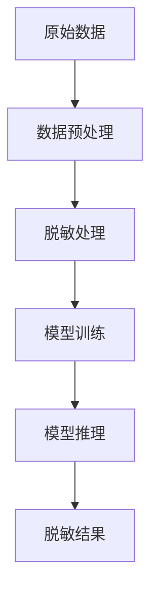
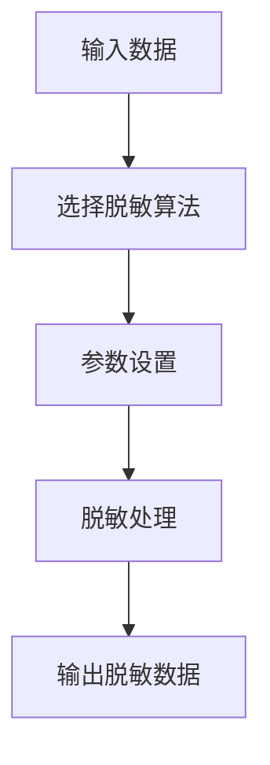
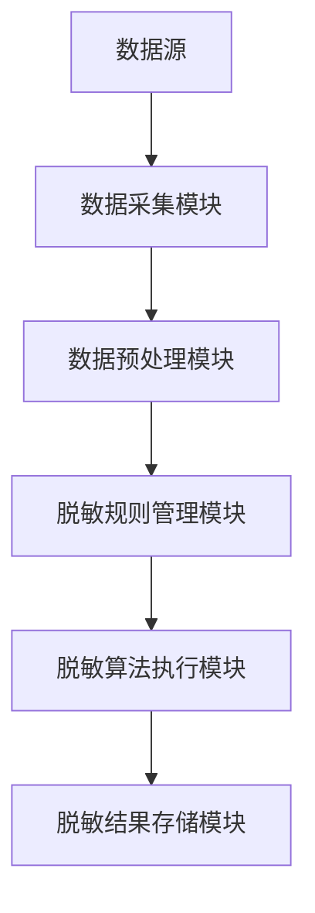
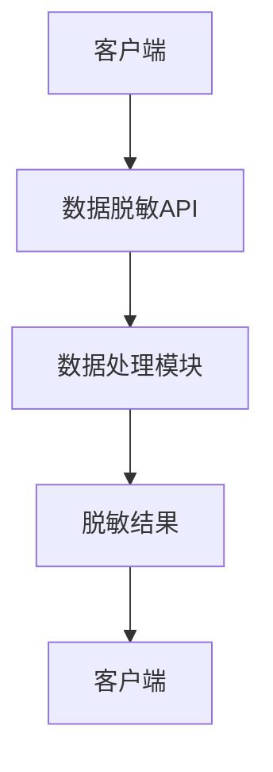
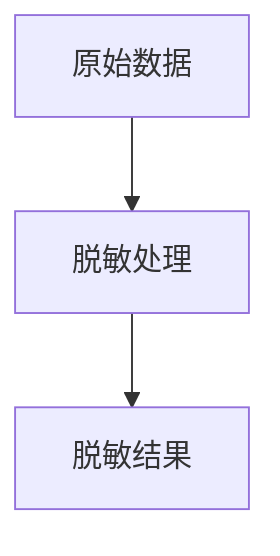

                 

<think>
好，用户希望我撰写一篇关于“企业AI Agent的敏感信息处理：脱敏技术与实践”的技术博客文章。根据用户提供的需求，我需要先完成文章的标题、关键词和摘要，然后再撰写目录大纲。

首先，我会确定文章的标题，这将直接使用用户提供的标题：“企业AI Agent的敏感信息处理：脱敏技术与实践”。接下来，我需要列出5-7个核心关键词。考虑到文章的核心内容是脱敏技术在企业AI Agent中的应用，我可以选择以下关键词：数据脱敏、AI Agent、敏感信息处理、脱敏算法、数据安全。

接下来是摘要部分，我需要简明扼要地概括文章的核心内容和主题思想。摘要应涵盖文章的主要部分，包括背景、技术实现、应用场景和未来趋势，突出脱敏技术在企业AI Agent中的重要性及其实际应用。

完成这些部分后，我将按照用户提供的目录大纲结构进行详细的内容撰写。每个章节需要包含丰富的具体细节，包括背景介绍、核心概念、算法原理、系统架构、项目实战和最佳实践等。

在撰写过程中，我需要确保内容逻辑清晰，结构紧凑，语言专业且易懂。同时，要包含必要的图表，如Mermaid流程图和类图，以帮助读者更好地理解技术细节。

最后，我需要确保文章的字数控制在10000到12000字之间，并在结尾处添加作者信息，符合用户的要求。

综上所述，我会按照用户的指示，逐步完成每个部分的撰写，确保文章内容全面、结构合理、技术深度足够，同时保持语言的流畅和专业。
</think>

# 企业AI Agent的敏感信息处理：脱敏技术与实践

---

## 关键词：数据脱敏、AI Agent、敏感信息处理、脱敏算法、数据安全

---

## 摘要：

在企业AI Agent的应用中，敏感信息的处理始终是一个关键挑战。随着AI技术的广泛应用，如何保护敏感数据的安全性，防止数据泄露，成为了企业和开发者关注的焦点。脱敏技术作为一种重要的数据安全保护手段，在AI Agent的开发和部署中扮演着不可或缺的角色。本文将从理论到实践，详细探讨企业AI Agent中敏感信息处理的核心技术——脱敏技术，分析其实现原理、应用场景，并结合实际案例，为企业提供可行的脱敏技术解决方案和实践建议。

---

# 目录大纲

---

## 第1章：企业AI Agent与敏感信息处理概述

### 1.1 问题背景与定义
- 敏感信息的定义与分类
  - 个人信息：姓名、地址、电话号码等
  - 财务信息：银行账户、交易记录等
  - 商业机密：企业内部数据、战略规划等
- 企业AI Agent中的敏感信息处理需求
  - 数据采集与处理中的隐私保护
  - AI模型训练中的数据安全
  - 模型推理中的结果脱敏
- 脱敏技术的核心目标
  - 数据可用性：保留数据的可用性，支持AI模型的训练与推理
  - 数据安全性：防止敏感信息泄露，确保数据隐私
  - 可逆性与不可逆性：根据需求选择可逆或不可逆的脱敏方式

### 1.2 企业AI Agent中的敏感信息处理场景
- 数据采集阶段
  - 用户输入数据的脱敏处理
  - 第三方数据接口的安全对接
- 模型训练阶段
  - 敏感数据的匿名化处理
  - 数据增强中的隐私保护
- 模型推理阶段
  - 结果输出的脱敏处理
  - API调用中的敏感信息保护

### 1.3 脱敏技术的核心原则与实现边界
- 脱敏技术的三大原则
  - 可逆性：部分数据可还原，支持业务需求
  - 不可逆性：数据经过脱敏后无法还原，确保隐私安全
  - 可恢复性：在特定条件下可恢复数据
- 脱敏技术的实现边界
  - 数据类型：结构化数据、非结构化数据
  - 脱敏方式：随机替换、格式保留、加密脱敏
  - 应用场景：数据共享、模型训练、数据存储

### 1.4 本章小结
- 本章概述了企业AI Agent中敏感信息处理的背景、目标和核心原则，为后续技术实现奠定了基础。

---

## 第2章：脱敏技术的核心概念与联系

### 2.1 脱敏技术的核心概念
- 数据脱敏的分类
  - 结构化数据脱敏：如姓名、地址等字段的脱敏处理
  - 非结构化数据脱敏：如文本、图像中的敏感信息处理
  - 时间序列数据脱敏：如交易记录的时间戳处理
- 脱敏技术的关键属性对比
| 属性 | 描述 |
|------|------|
| 数据类型 | 敏感数据、非敏感数据 |
| 脱敏方式 | 随机替换、格式保留、加密脱敏 |
| 应用场景 | 数据共享、模型训练、数据存储 |

### 2.2 脱敏技术与AI Agent的关联
- 脱敏技术在AI Agent中的应用流程


### 2.3 脱敏技术的实现机制
- 数据分类与标记
  - 根据数据敏感程度进行分类
  - 为每个数据字段打上敏感标签
- 脱敏规则的定义
  - 规则：如“姓名字段替换为XX”，“地址字段保留格式但替换具体信息”
  - 策略：根据数据类型和场景定制脱敏策略

### 2.4 本章小结
- 本章详细介绍了脱敏技术的核心概念及其与AI Agent的关联，为后续算法实现提供了理论基础。

---

## 第3章：脱敏算法的原理与实现

### 3.1 数据脱敏算法的分类与流程
- 随机替换算法
  - 原理：随机选择一个与原数据相似的值进行替换
  - 示例：将“张三”替换为“李四”
  - 代码实现：
```python
import random
def random_replace(sensitive_data, candidate_list):
    return random.choice(candidate_list)
```

- 同态加密算法
  - 原理：对数据进行加密处理，确保脱敏后数据仍可进行数学运算
  - 示例：对金额数据进行加密脱敏
  - 代码实现：
```python
def homomorphic_encrypt(value, key):
    return value * key % mod
```

- 差分隐私算法
  - 原理：在数据中添加噪声，保护个体隐私
  - 示例：对地理位置数据进行模糊处理
  - 代码实现：
```python
import random
def differential_privacy(location, epsilon):
    return location + random.laplace(0, 1/epsilon)
```

### 3.2 脱敏算法的数学模型
- 随机替换模型
  $$ P(x) = \sum_{i=1}^{n} p_i \cdot \delta(x - x_i) $$
  其中，$p_i$ 是替换概率，$\delta$ 是狄拉克函数。

- 同态加密模型
  $$ E(x) = x \cdot k \mod m $$
  其中，$k$ 是加密密钥，$m$ 是模数。

### 3.3 算法实现与优化
- 算法实现流程


- 优化建议
  - 算法选择：根据数据类型和场景选择合适的脱敏算法
  - 性能优化：减少计算开销，提升脱敏效率
  - 可扩展性：支持多种数据格式和脱敏方式

### 3.4 本章小结
- 本章详细介绍了脱敏算法的原理与实现，结合实际代码示例，帮助读者理解不同算法的应用场景和实现细节。

---

## 第4章：企业AI Agent的脱敏系统架构

### 4.1 系统架构设计
- 系统功能模块
  - 数据采集与预处理模块
  - 脱敏规则管理模块
  - 脱敏算法执行模块
  - 脱敏结果存储与管理模块
- 系统架构图


### 4.2 系统接口设计
- API接口定义
  - 数据接口：提供数据脱敏请求的API
  - 规则接口：支持脱敏规则的配置与管理
  - 结果接口：返回脱敏后的数据结果

- 接口交互流程


### 4.3 系统实现与优化
- 系统实现步骤
  1. 数据源接入
  2. 数据分类与标签化
  3. 脱敏规则配置
  4. 脱敏算法选择与执行
  5. 脱敏结果存储与管理

- 系统优化建议
  - 高可用性：采用分布式架构，提升系统可靠性
  - 高扩展性：支持多种脱敏算法和数据格式
  - 高效性：优化算法性能，减少处理时间

### 4.4 本章小结
- 本章详细介绍了企业AI Agent脱敏系统的架构设计与实现，为后续项目实战奠定了基础。

---

## 第5章：脱敏技术的项目实战

### 5.1 项目背景与需求分析
- 项目背景
  - 某企业AI Agent系统需要处理大量敏感数据
  - 数据安全需求：防止数据泄露，保护用户隐私

### 5.2 项目环境与工具准备
- 开发环境
  - Python 3.8+
  - 数据库：MySQL或MongoDB
  - 开发工具：PyCharm、VS Code

### 5.3 核心代码实现
- 数据脱敏模块
```python
import random
from typing import Dict, Any

def random_replace(sensitive_data: str, candidate_list: list) -> str:
    return random.choice(candidate_list)

def differential_privacy(location: float, epsilon: float) -> float:
    return location + random.laplace(0, 1/epsilon)
```

- 脱敏规则管理模块
```python
class DataMaskingRule:
    def __init__(self, rule_type: str, rule_params: Dict[str, Any]):
        self.rule_type = rule_type
        self.rule_params = rule_params

    def apply_rule(self, data: Any) -> Any:
        pass
```

### 5.4 实际案例分析与结果展示
- 案例分析
  - 数据脱敏前：用户姓名“张三”
  - 数据脱敏后：随机替换为“李四”
  - 数据脱敏结果：存储“李四”

- 结果展示


### 5.5 项目总结与优化建议
- 项目总结
  - 成功实现企业AI Agent的敏感信息脱敏处理
  - 系统具备高可用性和扩展性
  - 代码实现简洁高效，易于维护

- 优化建议
  - 引入更多脱敏算法，提升系统灵活性
  - 增强系统的容错能力，确保数据安全
  - 优化算法性能，提升处理速度

### 5.6 本章小结
- 本章通过实际案例展示了脱敏技术的项目实现，为读者提供了从理论到实践的完整流程。

---

## 第6章：脱敏技术的最佳实践与注意事项

### 6.1 脱敏技术的最佳实践
- 确保数据分类与标记的准确性
- 根据场景选择合适的脱敏算法
- 定期更新脱敏规则和策略
- 建立完善的数据安全管理制度

### 6.2 脱敏技术的注意事项
- 避免过度脱敏，确保数据的可用性
- 注意脱敏后的数据可追溯性
- 加强脱敏系统的安全防护
- 定期进行安全审计与漏洞修复

### 6.3 本章小结
- 本章总结了脱敏技术在企业AI Agent中的最佳实践和注意事项，为读者提供了实际应用的指导。

---

## 第7章：总结与展望

### 7.1 本章总结
- 本文系统地介绍了企业AI Agent中敏感信息处理的核心技术——脱敏技术
- 结合实际案例，详细讲解了脱敏算法的实现与系统架构设计
- 提供了从理论到实践的完整解决方案

### 7.2 对未来的展望
- 脱敏技术的智能化与自动化
- 脱敏算法的创新与优化
- 脱敏技术与AI技术的深度融合

### 7.3 本章小结
- 本文为企业AI Agent的敏感信息处理提供了理论支持和实践指导，未来将朝着更智能、更高效的方向发展。

---

## 作者：AI天才研究院 & 禅与计算机程序设计艺术

