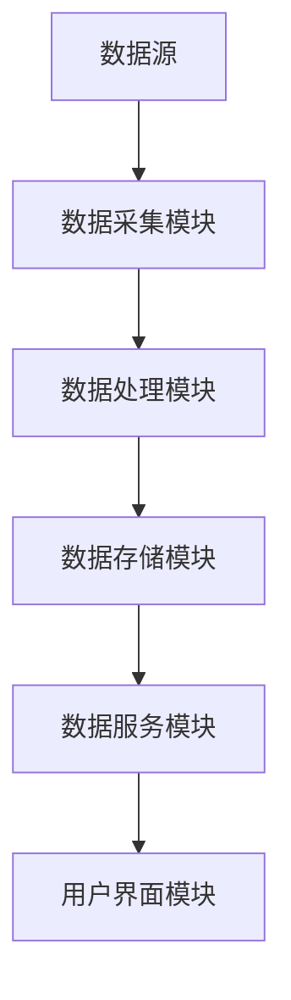

                 


# 企业AI Agent的数据治理策略

**关键词**：数据治理、AI Agent、企业数据、算法原理、系统架构

**摘要**：  
随着人工智能技术的快速发展，企业AI Agent在数据处理和决策支持中的应用越来越广泛。然而，AI Agent的高效运作离不开高质量的数据支持。本文将深入探讨企业AI Agent的数据治理策略，从数据清洗、数据分析到模型训练，结合实际案例，系统性地分析如何通过数据治理提升AI Agent的性能和可靠性。

---

## 第1章 数据治理的背景与重要性

### 1.1 数据治理的背景
在数字化转型的浪潮中，数据已成为企业的核心资产。企业AI Agent通过处理大量数据为企业提供智能化决策支持，但数据的质量和安全性直接影响AI Agent的性能。数据治理是确保数据准确、完整和安全的关键环节。

### 1.2 数据治理的核心目标
数据治理的目标包括：
1. **数据质量管理**：确保数据的准确性、一致性和完整性。
2. **数据安全管理**：保护数据的隐私性和机密性。
3. **数据使用规范**：明确数据的使用权限和责任。

### 1.3 数据治理的挑战
- 数据孤岛问题：企业内部数据分散在不同系统中，难以统一治理。
- 数据隐私保护：随着《通用数据保护条例》（GDPR）等法规的实施，数据隐私保护要求日益严格。
- 数据量爆炸式增长：企业每天产生的数据量巨大，传统的数据治理方法难以应对。

---

## 第2章 AI Agent的核心概念与技术特征

### 2.1 AI Agent的定义
AI Agent是一种智能代理系统，能够感知环境、自主决策并执行任务。它通常具备以下特征：
- **自主性**：无需人工干预即可运行。
- **反应性**：能够实时感知环境变化并做出反应。
- **学习能力**：通过机器学习算法不断优化自身的决策能力。

### 2.2 AI Agent的数据处理流程
AI Agent的数据处理流程通常包括以下步骤：
1. **数据采集**：从多种数据源（如数据库、API、传感器等）获取数据。
2. **数据清洗**：去除噪声数据，填补缺失值。
3. **数据分析与建模**：通过统计分析和机器学习算法对数据进行建模。
4. **数据可视化**：将分析结果以可视化形式呈现，辅助决策。

### 2.3 数据治理对AI Agent的影响
数据治理的完善性直接影响AI Agent的性能：
- **高质量数据**：确保AI Agent的决策基于可靠的数据。
- **数据安全性**：防止数据泄露和滥用。
- **数据可追溯性**：便于对AI Agent的决策进行追溯和优化。

---

## 第3章 数据治理的算法原理与数学模型

### 3.1 数据清洗算法
数据清洗是数据治理的重要环节，常用的算法包括：
- **基于规则的清洗**：根据预定义的规则（如数据格式、范围）过滤无效数据。
- **基于统计的清洗**：通过统计方法（如均值、中位数）填补缺失值。
- **基于机器学习的清洗**：利用聚类算法识别异常数据点。

### 3.2 数据分析与建模
数据分析与建模是数据治理的关键步骤，常用的算法包括：
- **特征工程**：提取数据中的关键特征，提高模型的准确性。
- **模型训练**：使用机器学习算法（如随机森林、支持向量机）训练模型。
- **模型优化**：通过交叉验证和超参数调优优化模型性能。

### 3.3 数据治理的数学模型
以下是一个简单的数据质量评估模型：
$$
Q = \sum_{i=1}^{n} w_i \cdot q_i
$$
其中，$Q$ 表示数据质量，$w_i$ 表示第$i$个质量维度的权重，$q_i$ 表示第$i$个质量维度的评分。

---

## 第4章 数据治理的系统架构与设计方案

### 4.1 企业级数据治理平台架构
企业级数据治理平台通常包括以下模块：
- **数据采集模块**：从多种数据源采集数据。
- **数据处理模块**：清洗、转换和存储数据。
- **数据服务模块**：提供数据分析和可视化服务。
- **用户界面模块**：供用户查看数据治理结果和操作记录。

### 4.2 数据治理平台的架构图


### 4.3 系统接口设计
- 数据采集模块接口：
  ```python
  def collect_data(source):
      # 从数据源获取数据
      return data
  ```
- 数据处理模块接口：
  ```python
  def clean_data(data):
      # 清洗数据
      return cleaned_data
  ```

---

## 第5章 项目实战：企业AI Agent数据治理案例

### 5.1 项目背景
以金融行业为例，某银行希望通过AI Agent监控交易数据，识别异常交易行为。

### 5.2 项目环境与工具安装
- 数据采集工具：Python的`requests`库。
- 数据处理工具：Pandas库。
- 数据可视化工具：Matplotlib库。

### 5.3 核心代码实现
```python
import pandas as pd
import numpy as np

# 数据采集
def collect_data():
    url = "https://api.example.com/transactions"
    response = requests.get(url)
    data = response.json()
    return pd.DataFrame(data)

# 数据清洗
def clean_data(df):
    df['amount'] = df['amount'].fillna(df['amount'].mean())
    df = df.drop_duplicates()
    return df

# 数据分析
def analyze_data(df):
    from sklearn.ensemble import IsolationForest
    model = IsolationForest(n_estimators=100)
    model.fit(df)
    predictions = model.predict(df)
    return predictions

# 数据可视化
def visualize_data(predictions):
    import matplotlib.pyplot as plt
    plt.hist(predictions)
    plt.title('Anomaly Detection Results')
    plt.show()
```

### 5.4 案例分析与结果解读
通过上述代码，AI Agent能够识别异常交易行为，帮助企业预防欺诈交易。

---

## 第6章 数据治理的最佳实践与注意事项

### 6.1 最佳实践
- **数据质量管理**：制定数据质量标准，定期进行数据审计。
- **数据安全保护**：采用加密技术和访问控制，确保数据安全。
- **数据可视化与报告**：通过可视化工具向管理层展示数据治理结果。

### 6.2 注意事项
- 数据治理需要企业内部多部门协作，确保数据的准确性和一致性。
- 在实施数据治理时，应充分考虑数据隐私保护法规。

### 6.3 拓展阅读
- 《Data Governance: A Comprehensive Guide》
- 《Artificial Intelligence in Business》

---

## 作者

作者：AI天才研究院/AI Genius Institute & 禅与计算机程序设计艺术/Zen And The Art of Computer Programming

---

通过本文的系统性分析，企业可以更好地理解AI Agent的数据治理策略，并通过实际案例和最佳实践提升数据治理能力，从而充分发挥AI Agent的潜力。

