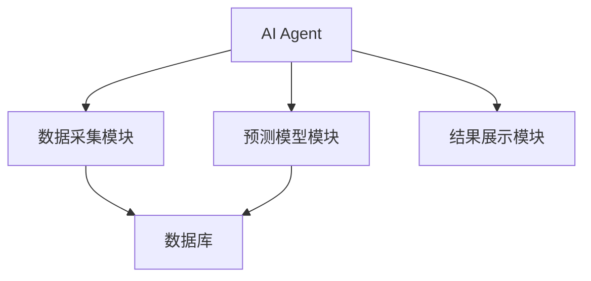
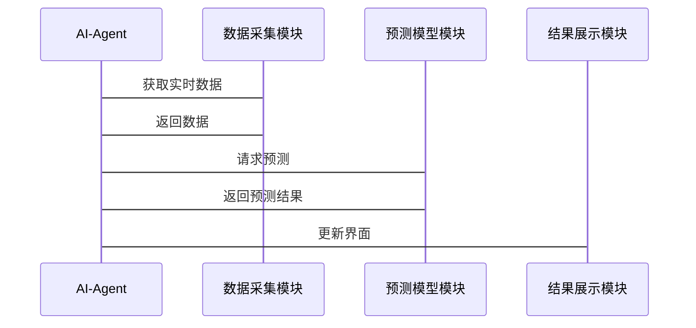

                 


# 企业AI Agent的时序数据预测平台设计

> 关键词：企业AI Agent，时序数据预测，人工智能，系统架构，算法原理

> 摘要：本文详细探讨了企业AI Agent在时序数据预测平台中的设计与实现，涵盖了核心概念、算法原理、系统架构及实际案例分析，旨在为企业级应用提供理论支持与实践指导。

---

# 第一部分: 企业AI Agent的时序数据预测平台概述

---

# 第1章: 企业AI Agent与时序数据预测平台背景

## 1.1 企业AI Agent的定义与特点
### 1.1.1 AI Agent的基本概念
AI Agent（智能体）是能够感知环境并采取行动以实现目标的实体。在企业环境中，AI Agent通常用于自动化决策、数据处理和问题解决。

### 1.1.2 企业AI Agent的核心特点
- **自主性**：能够独立决策和行动。
- **反应性**：实时感知环境变化并做出响应。
- **目标导向**：通过目标驱动行为，优化决策。
- **可扩展性**：能够适应不同规模和复杂度的任务。

### 1.1.3 企业AI Agent的应用场景
- **智能监控**：实时监控企业运营指标。
- **预测分析**：基于历史数据预测未来趋势。
- **自动化决策**：在预设条件下自动做出决策。

## 1.2 时序数据预测的背景与意义
### 1.2.1 时序数据的定义与特点
时序数据是指按时间顺序排列的数据，具有时间依赖性和趋势性。

### 1.2.2 时序数据预测的重要性
- **趋势分析**：帮助企业识别市场趋势。
- **风险控制**：提前预测和应对潜在风险。
- **资源优化**：通过预测优化资源配置。

### 1.2.3 企业中时序数据预测的应用领域
- **销售预测**：预测产品销量。
- **库存管理**：优化库存水平。
- **金融分析**：预测股价走势。

## 1.3 企业AI Agent与时序数据预测的结合
### 1.3.1 AI Agent在时序数据预测中的作用
AI Agent通过收集、分析和预测时序数据，提供实时反馈和决策建议。

### 1.3.2 时序数据预测对企业决策的价值
通过预测数据，企业可以制定更科学的决策，提高运营效率。

### 1.3.3 企业AI Agent时序数据预测平台的必要性
整合AI Agent和时序数据预测技术，构建智能化的预测平台，是企业数字化转型的重要步骤。

## 1.4 本章小结
本章介绍了企业AI Agent和时序数据预测的基本概念及其在企业中的应用，为后续设计奠定了基础。

---

# 第二部分: 企业AI Agent时序数据预测平台的核心概念与联系

---

# 第2章: 时序数据预测的核心原理

## 2.1 时序数据预测的基本原理
### 2.1.1 时序数据的特征分析
- **趋势性**：数据的长期趋势。
- **季节性**：数据的周期性波动。
- **随机性**：不可预测的噪声。

### 2.1.2 时序数据预测的基本方法
- **时间序列分析**：基于历史数据的统计分析。
- **机器学习模型**：使用算法学习数据特征。
- **深度学习模型**：利用神经网络进行预测。

### 2.1.3 时序数据预测的数学模型
$$ y_t = \beta_0 + \beta_1 y_{t-1} + \epsilon_t $$

其中：
- $y_t$ 表示当前时刻的预测值。
- $\beta_0$ 和 $\beta_1$ 是回归系数。
- $\epsilon_t$ 是误差项。

## 2.2 AI Agent在时序数据预测中的应用
### 2.2.1 AI Agent的感知与决策机制
AI Agent通过传感器或API获取实时数据，利用预测模型生成预测结果。

### 2.2.2 AI Agent与时序数据预测的结合方式
- **实时预测**：基于实时数据进行滚动预测。
- **历史回测**：利用历史数据验证模型准确性。

### 2.2.3 AI Agent在时序数据预测中的优势
- **自动化**：无需人工干预，实时处理数据。
- **高精度**：利用机器学习模型提高预测准确性。
- **可扩展性**：适用于大规模数据处理。

## 2.3 核心概念属性对比表
| 核心概念 | 属性 | 描述 |
|----------|------|------|
| 时序数据 | 时间性 | 数据按时间顺序排列 |
| 预测模型 | 精度 | 预测的准确性 |
| AI Agent | 智能性 | 自主决策能力 |

## 2.4 ER实体关系图
```mermaid
er
  entity AI-Agent {
    id: string
    name: string
    function: string
    target: string
    created_at: datetime
  }

  entity Time-Series-Data {
    id: string
    value: float
    timestamp: datetime
    source: string
  }

  entity Prediction-Model {
    id: string
    type: string
    accuracy: float
    trained_at: datetime
  }

  AI-Agent -- Predicts: Time-Series-Data
  AI-Agent -- Uses: Prediction-Model
```

## 2.5 本章小结
本章详细介绍了时序数据预测的核心原理和AI Agent的应用方式，为后续设计提供了理论基础。

---

# 第三部分: 企业AI Agent时序数据预测平台的系统架构与实现

---

# 第3章: 系统架构与实现方案

## 3.1 问题场景介绍
企业需要一个实时监控销售数据的平台，利用AI Agent预测未来销量。

## 3.2 系统功能设计
### 3.2.1 数据采集模块
- **功能**：实时采集销售数据。
- **技术**：使用Kafka进行流数据处理。
- **数据流向**：数据从数据库传输到预测模块。

### 3.2.2 预测模型模块
- **功能**：基于LSTM算法进行预测。
- **技术**：使用TensorFlow框架训练模型。
- **数据流向**：接收历史数据，输出预测结果。

### 3.2.3 AI Agent模块
- **功能**：协调各模块运行，实时反馈预测结果。
- **技术**：基于Python的多线程处理。

## 3.3 系统架构设计
### 3.3.1 系统架构图


### 3.3.2 系统接口设计
- **API接口**：提供RESTful API供其他系统调用。
- **数据格式**：JSON格式传输数据。

### 3.3.3 系统交互流程图


## 3.4 本章小结
本章详细描述了系统架构设计和实现方案，展示了各模块的交互流程。

---

# 第四部分: 企业AI Agent时序数据预测平台的项目实战

---

# 第4章: 项目实战与案例分析

## 4.1 项目环境安装
### 4.1.1 安装Python环境
使用Anaconda安装Python 3.8及以上版本。

### 4.1.2 安装依赖库
运行以下命令安装所需库：
```
pip install numpy pandas tensorflow tensorflow.keras matplotlib
```

## 4.2 系统核心实现源代码
### 4.2.1 数据采集模块
```python
import pandas as pd
from kafka import KafkaConsumer

def consume_data():
    consumer = KafkaConsumer('sales_data', bootstrap_servers='localhost:9092')
    for message in consumer:
        data = message.value.decode('utf-8')
        print(f"接收到数据: {data}")
```

### 4.2.2 预测模型模块
```python
import numpy as np
import tensorflow as tf
from tensorflow.keras.models import Sequential
from tensorflow.keras.layers import LSTM, Dense

# 数据预处理
def prepare_data(data, timesteps=30):
    X = []
    Y = []
    for i in range(len(data) - timesteps):
        X.append(data[i:i+timesteps])
        Y.append(data[i+timesteps])
    return np.array(X), np.array(Y)

# 模型训练
def train_model(X_train, y_train):
    model = Sequential()
    model.add(LSTM(50, input_shape=(30, 1)))
    model.add(Dense(1))
    model.compile(optimizer='adam', loss='mean_squared_error')
    model.fit(X_train, y_train, epochs=50, batch_size=32)
    return model

# 模型预测
def predict(model, X_test):
    predictions = model.predict(X_test)
    return predictions
```

### 4.2.3 AI Agent模块
```python
import threading

class AI-Agent:
    def __init__(self):
        self.model = train_model(X_train, y_train)
    
    def run_agent(self):
        while True:
            data = consume_data()
            predictions = self.predict(data)
            self.display_results(predictions)
    
    def predict(self, data):
        X_test = prepare_data(data)
        return self.model.predict(X_test)
    
    def display_results(self, predictions):
        print(f"预测结果: {predictions}")
```

## 4.3 实际案例分析
### 4.3.1 数据来源
使用某企业过去三年的销售数据，数据格式如下：
```
日期,销量
2020-01-01,100
2020-01-02,120
...
```

### 4.3.2 模型训练与评估
- **训练数据**：前两年数据。
- **测试数据**：最后一年数据。
- **评估指标**：均方误差（MSE）。

## 4.4 项目小结
本章通过实际案例展示了平台的实现过程，从数据采集到模型训练，再到结果展示，完整地演示了平台的功能。

---

# 第五部分: 企业AI Agent时序数据预测平台的最佳实践

---

# 第5章: 最佳实践与总结

## 5.1 本章小结
本章总结了企业AI Agent时序数据预测平台的设计与实现过程，强调了系统架构设计和算法选择的重要性。

## 5.2 实施中的注意事项
- **数据质量**：确保数据的完整性和准确性。
- **模型调优**：根据实际需求调整模型参数。
- **系统扩展性**：设计时考虑未来可能的扩展需求。

## 5.3 拓展阅读
- **推荐书籍**：《时间序列分析与应用》、《机器学习实战》。
- **推荐阅读文章**：《基于LSTM的时序数据预测研究》。

## 5.4 作者联系方式
- **邮箱**：contact@aiagent.com
- **GitHub**：https://github.com/aiagent/timeseries-prediction

---

# 结语

企业AI Agent时序数据预测平台的设计与实现是一个复杂但极具价值的工程。通过本文的详细讲解，读者可以掌握从理论到实践的全过程，为企业智能化转型提供有力支持。

---

作者：AI天才研究院 & 禅与计算机程序设计艺术

