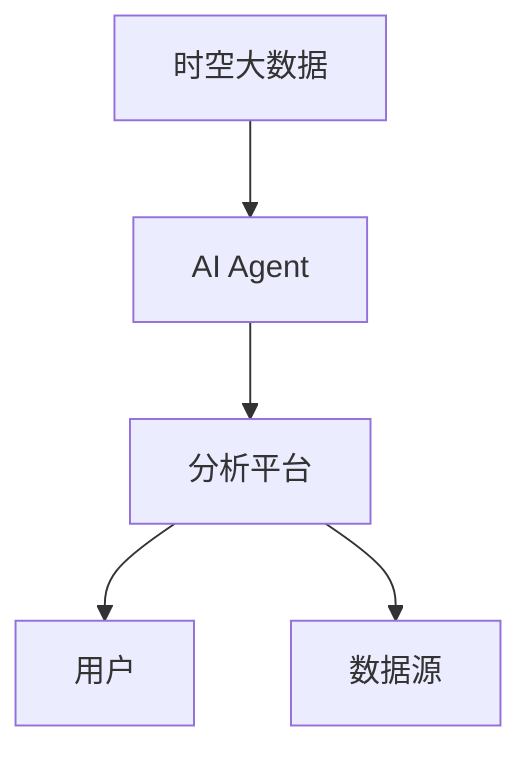
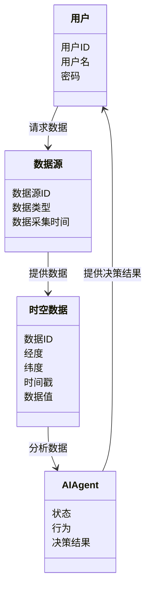
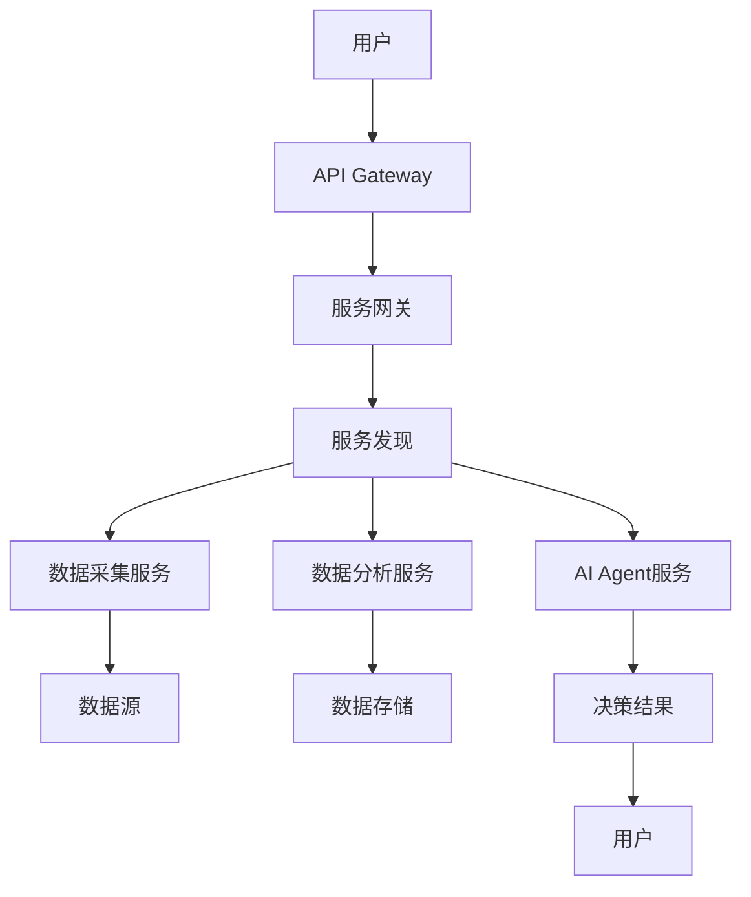
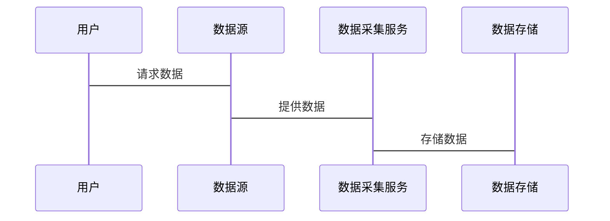
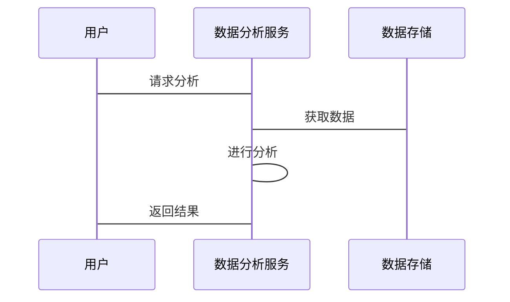
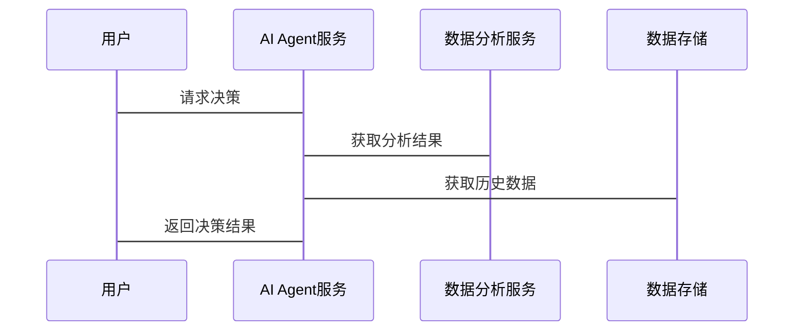

                 

<think>
嗯，用户希望我写一篇关于《企业AI Agent的时空大数据分析平台》的技术博客，内容要详细且结构清晰。首先，我需要理解用户的需求，他们可能是一个技术专家，想深入了解如何构建这样一个平台。

我应该从背景开始，解释时空大数据和AI Agent的重要性，然后逐步深入到核心概念、算法原理，再到系统架构和项目实战。用户特别提到要包括数学公式和mermaid图表，所以我要确保每个部分都有这些元素。

接下来，我需要考虑用户可能没有明确提到的深层需求，比如他们可能希望了解实际应用中的挑战和解决方案，所以我会在项目实战部分详细讲解，并给出代码示例。

在写系统架构时，我会用mermaid画出类图和架构图，帮助读者更好地理解。同时，数学公式要用latex表示，确保准确无误。

最后，我需要确保文章结构紧凑，逻辑清晰，每一章都有小结，方便读者回顾。整篇文章要保持专业性，同时通俗易懂，适合技术专家阅读。
</think>

# 企业AI Agent的时空大数据分析平台

> 关键词：企业AI Agent，时空大数据，数据融合，算法实现，系统架构，项目实战，最佳实践

> 摘要：本文详细介绍了企业AI Agent的时空大数据分析平台的构建过程，从核心概念到算法原理，从系统架构到项目实战，全面解析了如何利用时空大数据提升企业AI Agent的智能决策能力。文章内容涵盖时空大数据的基本概念、AI Agent的核心算法、平台系统架构设计、实际项目实现以及最佳实践，帮助读者系统地掌握企业AI Agent的时空大数据分析平台的开发与应用。

---

## 第一章: 企业AI Agent的时空大数据分析平台背景

### 1.1 问题背景与描述

#### 1.1.1 时空大数据的定义与特点
时空大数据是指包含时间维度和空间维度的海量数据。与传统数据不同，时空数据不仅包含地理位置信息（空间维度），还包含事件发生的时间信息（时间维度）。时空大数据的特点包括：
- **多维性**：同时包含时间与空间信息。
- **海量性**：数据量巨大，难以用传统方法处理。
- **动态性**：数据随时间和空间变化而变化。
- **关联性**：时间和空间维度的数据相互关联，形成复杂的模式。

#### 1.1.2 企业AI Agent的核心需求
企业AI Agent需要处理复杂的业务场景，通常涉及大量实时或历史数据。时空大数据分析能力是AI Agent的核心需求之一，具体包括：
- **实时性**：快速处理实时数据，支持实时决策。
- **准确性**：确保分析结果的准确性，减少误差。
- **可扩展性**：支持大规模数据的处理与分析。

#### 1.1.3 问题的解决方法与目标
为了满足企业AI Agent的需求，我们需要构建一个时空大数据分析平台。该平台的目标是：
- 提供高效的时空数据处理能力。
- 支持AI Agent的智能决策。
- 提供直观的数据可视化功能。

### 1.2 问题的边界与外延

#### 1.2.1 空间数据的边界
- **空间数据的范围**：限定在特定区域内，例如城市、区域或全球范围。
- **空间数据的分辨率**：数据的精度，例如米级、公里级等。
- **空间数据的格式**：支持常见的地理信息系统（GIS）格式，如GeoJSON、Shapefile等。

#### 1.2.2 时间序列数据的边界
- **时间范围**：限定在特定时间段内，例如过去24小时、过去一周等。
- **时间分辨率**：数据的时间间隔，例如秒、分钟、小时等。
- **时间数据的格式**：支持标准的时间格式，例如ISO 8601。

#### 1.2.3 AI Agent的能力边界
- **数据处理能力**：AI Agent能够处理的最大数据量。
- **决策能力**：AI Agent能够支持的决策类型，例如预测、分类、聚类等。
- **响应时间**：AI Agent处理请求的最长等待时间。

### 1.3 核心概念结构与组成

#### 1.3.1 时空大数据分析的核心要素
- **数据采集**：从多种数据源采集时空数据。
- **数据存储**：存储时空数据，支持高效查询。
- **数据分析**：对时空数据进行处理和分析，提取有价值的信息。
- **数据可视化**：将分析结果以可视化的方式呈现。

#### 1.3.2 AI Agent的功能模块
- **感知模块**：接收外部输入，包括时空数据和其他相关信息。
- **决策模块**：基于感知数据，进行智能决策。
- **执行模块**：根据决策结果执行相应操作。
- **反馈模块**：收集执行结果，反馈给决策模块。

#### 1.3.3 平台的整体架构
- **数据采集层**：负责数据的采集和预处理。
- **数据存储层**：负责数据的存储和管理。
- **数据分析层**：负责数据的分析和处理。
- **决策层**：负责AI Agent的智能决策。
- **用户交互层**：用户与平台的交互界面。

### 1.4 本章小结
本章介绍了企业AI Agent的时空大数据分析平台的背景，包括时空大数据的定义与特点、企业AI Agent的核心需求，以及问题的解决方法与目标。同时，还分析了问题的边界与外延，并提出了平台的核心概念结构与组成。

---

## 第二章: 核心概念与联系

### 2.1 时空大数据的核心原理

#### 2.1.1 空间数据分析的原理
空间数据分析主要关注数据的空间特征，例如地理位置、距离、方向等。常用的空间分析方法包括：
- **空间聚类**：将地理位置相似的点聚类在一起。
- **空间插值**：根据已知点的值，估算未知点的值。
- **空间网络分析**：分析空间网络的结构和关系。

#### 2.1.2 时间序列分析的原理
时间序列分析主要关注数据的时间特征，例如趋势、周期性、突变等。常用的时间序列分析方法包括：
- **趋势分析**：识别数据的长期趋势。
- **周期性分析**：识别数据的周期性模式。
- **异常检测**：识别数据中的异常点。

#### 2.1.3 时空数据融合的原理
时空数据融合是指将空间数据和时间数据结合起来，分析其时空特征。常用的方法包括：
- **时空聚类**：同时考虑时间和空间特征的聚类。
- **时空预测**：基于时空数据进行预测。
- **时空关联分析**：分析时空数据之间的关联性。

### 2.2 AI Agent的核心原理

#### 2.2.1 AI Agent的基本概念
AI Agent是一种智能体，能够感知环境、自主决策并执行操作。AI Agent的核心能力包括：
- **感知能力**：通过传感器或其他方式感知环境。
- **决策能力**：基于感知数据进行决策。
- **执行能力**：根据决策结果执行操作。

#### 2.2.2 AI Agent的核心算法
AI Agent的核心算法包括：
- **强化学习**：通过与环境的交互，学习最优策略。
- **决策树**：基于特征进行分类或回归。
- **贝叶斯网络**：基于概率推理进行决策。

#### 2.2.3 AI Agent的决策机制
AI Agent的决策机制包括：
- **基于规则的决策**：根据预定义的规则进行决策。
- **基于模型的决策**：基于训练好的模型进行决策。
- **基于知识的决策**：基于知识库进行决策。

### 2.3 核心概念对比分析

#### 2.3.1 时空数据与传统数据的对比
| 特性 | 时空数据 | 传统数据 |
|------|----------|----------|
| 维度 | 时间+空间 | 仅时间或空间 |
| 复杂性 | 高 | 较低 |
| 应用场景 | 地理信息系统、交通管理 | 商业智能、金融分析 |

#### 2.3.2 AI Agent与传统AI的对比
| 特性 | AI Agent | 传统AI |
|------|----------|--------|
| 自主性 | 高 | 较低 |
| 环境交互 | 高 | 较低 |
| 适应性 | 高 | 较低 |

#### 2.3.3 平台功能与传统数据分析工具的对比
| 特性 | 时空大数据分析平台 | 传统数据分析工具 |
|------|--------------------|------------------|
| 数据类型 | 支持时空数据 | 支持传统数据 |
| 分析能力 | 强大的时空分析能力 | 传统数据分析能力 |
| 决策能力 | 集成AI Agent，支持智能决策 | 仅支持数据分析 |

### 2.4 ER实体关系图


### 2.5 本章小结
本章详细介绍了时空大数据和AI Agent的核心原理，并通过对比分析和ER实体关系图，展示了平台的核心概念与联系。

---

## 第三章: 算法原理讲解

### 3.1 空间数据分析算法

#### 3.1.1 空间聚类算法
空间聚类算法用于将地理位置相似的点聚类在一起。常用的空间聚类算法包括：
- **DBSCAN**：基于密度的空间聚类算法。
- **K-means**：基于距离的空间聚类算法。

DBSCAN算法的伪代码如下：
```python
def dbscan(data, epsilon, min_points):
    visited = [False] * len(data)
    clusters = []
    for i in range(len(data)):
        if not visited[i]:
            neighbors = get_neighbors(data[i], epsilon)
            if len(neighbors) >= min_points:
                cluster = []
                cluster.extend(neighbors)
                visited[i] = True
                for j in neighbors:
                    if not visited[j]:
                        visited[j] = True
                        cluster.append(j)
                        more_neighbors = get_neighbors(j, epsilon)
                        if len(more_neighbors) >= min_points:
                            cluster.extend(more_neighbors)
                clusters.append(cluster)
    return clusters
```

#### 3.1.2 空间插值算法
空间插值算法用于根据已知点的值，估算未知点的值。常用的空间插值算法包括：
- **反距离加权插值法**：基于距离的加权插值。
- **克里金插值法**：基于地统计的插值方法。

反距离加权插值法的公式如下：
$$
\hat{z}(x_0) = \sum_{i=1}^{n} w_i z_i
$$
其中，$w_i$是权重，$z_i$是已知点的值。

#### 3.1.3 空间网络分析算法
空间网络分析算法用于分析空间网络的结构和关系。常用的空间网络分析算法包括：
- **最短路径分析**：计算网络中的最短路径。
- **网络流量分析**：分析网络中的流量分布。

### 3.2 时间序列分析算法

#### 3.2.1 基于RNN的时间序列预测
循环神经网络（RNN）常用于时间序列预测。LSTM（长短期记忆网络）是一种常用的RNN变体。

LSTM的结构包括输入门、遗忘门和输出门：
$$
i = \sigma(W_i x + U_i h)
$$
$$
f = \sigma(W_f x + U_f h)
$$
$$
o = \sigma(W_o x + U_o h)
$$
$$
c = f c_{prev} + i x
$$
$$
h = o \tanh(c)
$$

#### 3.2.2 基于ARIMA的时间序列预测
ARIMA（自回归积分滑动平均模型）是一种常用的时间序列预测模型。

ARIMA模型的公式如下：
$$
y_t = \phi_1 y_{t-1} + \phi_2 y_{t-2} + \dots + \phi_p y_{t-p} + \theta_1 \epsilon_{t-1} + \theta_2 \epsilon_{t-2} + \dots + \theta_q \epsilon_{t-q} + \epsilon_t
$$

### 3.3 AI Agent决策算法

#### 3.3.1 基于强化学习的决策
强化学习是一种基于奖励机制的决策方法。常用的强化学习算法包括Q-learning和深度Q网络（DQN）。

Q-learning算法的公式如下：
$$
Q(s, a) = Q(s, a) + \alpha [r + \gamma \max Q(s', a') - Q(s, a)]
$$

#### 3.3.2 基于决策树的决策
决策树是一种基于特征的决策方法。常用的决策树算法包括ID3、C4.5和CART。

CART算法的特征选择标准是信息增益率：
$$
\text{信息增益率} = \frac{\text{信息增益}}{\text{特征的熵}}
$$

#### 3.3.3 基于贝叶斯网络的决策
贝叶斯网络是一种基于概率推理的决策方法。常用的贝叶斯网络算法包括信念传播和马尔可夫链。

信念传播的公式如下：
$$
P(X | evidence) = \frac{P(evidence | X) P(X)}{P(evidence)}
$$

### 3.4 本章小结
本章详细介绍了时空大数据分析中的常用算法，包括空间数据分析算法、时间序列分析算法和AI Agent决策算法，并通过数学公式和代码示例进行了详细讲解。

---

## 第四章: 系统分析与架构设计方案

### 4.1 问题场景介绍
企业AI Agent的时空大数据分析平台需要满足以下需求：
- 支持多源数据的采集与处理。
- 提供高效的时空数据分析能力。
- 支持AI Agent的智能决策。

### 4.2 项目介绍
本项目旨在构建一个企业级的时空大数据分析平台，集成AI Agent，提供从数据采集到智能决策的完整解决方案。

### 4.3 系统功能设计

#### 4.3.1 领域模型设计
领域模型是一个城市的交通管理系统，包括以下实体：
- **用户**：系统用户。
- **数据源**：数据采集设备。
- **时空数据**：采集到的时空数据。
- **AI Agent**：智能决策系统。

领域模型类图如下：


### 4.4 系统架构设计

#### 4.4.1 系统架构图
系统架构图如下：


### 4.5 系统接口设计
系统接口设计包括：
- 数据采集接口：从数据源采集时空数据。
- 数据分析接口：对时空数据进行分析。
- AI Agent接口：AI Agent进行智能决策。

### 4.6 系统交互流程

#### 4.6.1 数据采集流程


#### 4.6.2 数据分析流程


#### 4.6.3 AI Agent决策流程


### 4.7 本章小结
本章详细介绍了企业AI Agent的时空大数据分析平台的系统架构设计，包括领域模型设计、系统架构图、系统接口设计和系统交互流程。

---

## 第五章: 项目实战

### 5.1 环境安装与配置

#### 5.1.1 系统环境要求
- 操作系统：Linux/Windows/MacOS
- Python版本：3.6+
- Java版本：8+

#### 5.1.2 依赖安装
安装必要的Python库：
```bash
pip install numpy pandas scikit-learn matplotlib
```

### 5.2 系统核心实现源代码

#### 5.2.1 数据采集模块
```python
import requests

def fetch_data(api_url):
    response = requests.get(api_url)
    return response.json()
```

#### 5.2.2 数据分析模块
```python
import pandas as pd
from sklearn.cluster import DBSCAN

def analyze_data(data):
    df = pd.DataFrame(data)
    clustering = DBSCAN(eps=1, min_samples=2).fit(df[['经度', '纬度']])
    return clustering.labels_
```

#### 5.2.3 AI Agent决策模块
```python
from tensorflow.keras.models import Sequential
from tensorflow.keras.layers import LSTM, Dense

def build_model(input_shape):
    model = Sequential()
    model.add(LSTM(64, input_shape=input_shape))
    model.add(Dense(1, activation='sigmoid'))
    model.compile(loss='binary_crossentropy', optimizer='adam')
    return model
```

### 5.3 代码应用解读与分析
- 数据采集模块：通过API接口获取时空数据。
- 数据分析模块：使用DBSCAN算法进行空间聚类。
- AI Agent决策模块：使用LSTM网络进行时间序列预测。

### 5.4 实际案例分析
以城市交通管理为例，分析交通事故的时空分布，预测未来事故发生概率。

### 5.5 项目小结
本章通过实际项目案例，详细讲解了企业AI Agent的时空大数据分析平台的实现过程，包括环境安装、代码实现和案例分析。

---

## 第六章: 最佳实践与注意事项

### 6.1 最佳实践
- 数据预处理：清洗和标准化数据。
- 模型调优：优化算法参数，提高准确率。
- 系统优化：优化系统性能，提高响应速度。

### 6.2 注意事项
- 数据隐私：保护用户隐私，遵守数据隐私法规。
- 系统安全：防止数据泄露和系统攻击。
- 可扩展性：设计可扩展的系统架构，方便后续扩展。

### 6.3 拓展阅读
- 《时空大数据分析》
- 《AI Agent的原理与应用》
- 《分布式系统架构设计》

### 6.4 本章小结
本章总结了企业AI Agent的时空大数据分析平台的最佳实践和注意事项，并提供了拓展阅读的建议。

---

## 第七章: 总结与展望

### 7.1 总结
本文详细介绍了企业AI Agent的时空大数据分析平台的构建过程，从核心概念到算法原理，从系统架构到项目实战，全面解析了如何利用时空大数据提升企业AI Agent的智能决策能力。

### 7.2 展望
未来，随着AI技术的不断发展，企业AI Agent的时空大数据分析平台将更加智能化和高效化。建议进一步研究多模态数据融合、边缘计算等技术，提升平台的性能和能力。

---

## 作者：AI天才研究院 & 禅与计算机程序设计艺术

---

本文通过系统化的讲解和详细的代码实现，全面解析了企业AI Agent的时空大数据分析平台的开发与应用，为读者提供了一个完整的解决方案。

