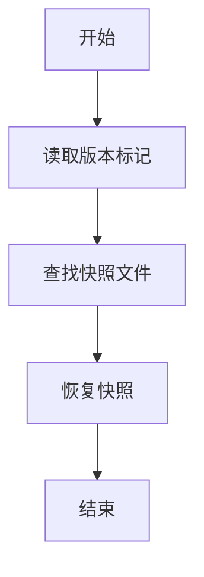
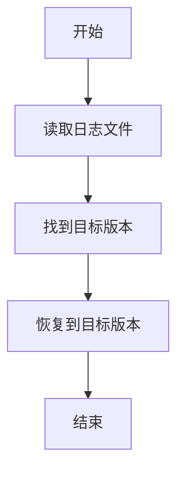
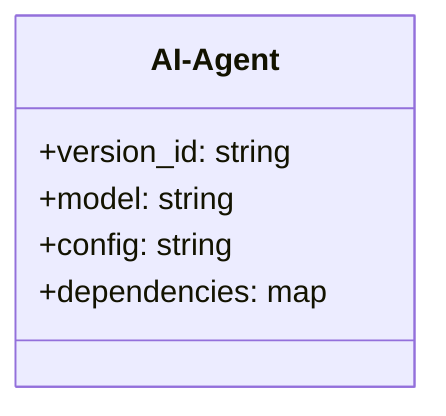
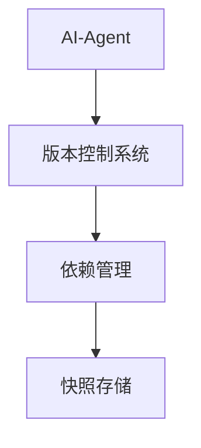
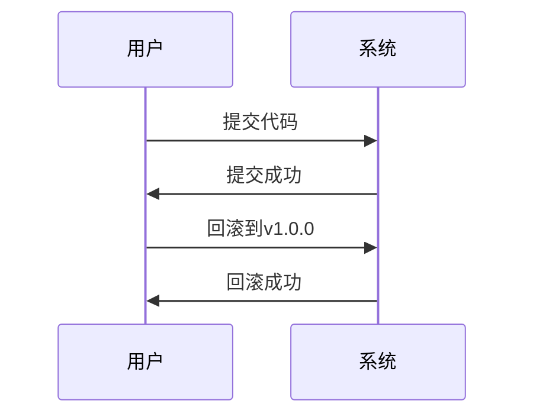

                 


# 企业AI Agent的版本控制与回滚机制

> **关键词**：企业AI Agent、版本控制、回滚机制、系统架构、算法实现、项目实战

> **摘要**：本文详细探讨了企业AI Agent在开发和应用中的版本控制与回滚机制。从背景介绍、核心概念、算法原理到系统设计、项目实战，层层剖析，结合实际案例，深入浅出地讲解了如何通过版本控制和回滚机制来提升企业AI Agent的可靠性和可维护性。

---

# 第1章: 企业AI Agent的背景与概念

## 1.1 问题背景与挑战

### 1.1.1 企业AI Agent的定义与特点
企业AI Agent是一种智能代理系统，能够理解并执行企业的目标和任务。其特点包括：
- **自主性**：能够自主决策和行动。
- **反应性**：能够实时感知环境并做出反应。
- **社会性**：能够与其他系统或人类交互。

### 1.1.2 AI Agent在企业中的应用场景
- **客户支持**：通过自然语言处理为用户提供服务。
- **流程自动化**：自动执行企业内部的业务流程。
- **数据分析**：实时分析企业数据，提供决策支持。

### 1.1.3 版本控制与回滚机制的重要性
在企业AI Agent的开发和部署中，版本控制用于管理代码和配置的变更，而回滚机制则用于在出现问题时快速恢复到稳定版本，确保系统的可用性和可靠性。

---

## 1.2 问题描述与解决思路

### 1.2.1 AI Agent开发中的版本控制问题
- **代码变更频繁**：AI Agent的算法和模型需要不断优化，导致版本变更频繁。
- **依赖管理复杂**：AI Agent通常依赖多种库和模块，版本管理需要考虑这些依赖的兼容性。

### 1.2.2 回滚机制在AI Agent中的作用
- **快速恢复**：当新版本出现问题时，回滚机制可以快速恢复到上一个稳定版本。
- **降低风险**：通过回滚机制，可以最大限度地降低版本更新的风险。

### 1.2.3 解决方案的初步构想
- **采用分布式版本控制系统**：如Git，用于代码和配置的版本管理。
- **设计回滚机制**：通过记录版本变更日志，支持快速回滚到任意版本。

---

## 1.3 本章小结

### 1.3.1 核心问题总结
企业AI Agent的版本控制和回滚机制是确保系统稳定性和可维护性的关键。

### 1.3.2 下文展开提示
下文将详细讲解版本控制的核心概念和回滚机制的实现原理。

---

# 第2章: AI Agent版本控制的核心概念

## 2.1 版本控制的基本原理

### 2.1.1 版本控制的定义与分类
版本控制是一种管理文件或项目版本的工具和技术，常见类型包括：
- **集中式版本控制系统**：如Subversion（ SVN），依赖中心服务器。
- **分布式版本控制系统**：如Git，每个仓库都是完整的。

### 2.1.2 分布式版本控制系统简介
Git是目前最流行的分布式版本控制系统，具有以下特点：
- **去中心化**：没有单一的中心服务器，每个开发者都有自己的仓库。
- **高效分支管理**：支持快速创建和合并分支，适合团队协作。

### 2.1.3 AI Agent版本控制的特殊性
AI Agent的版本控制需要考虑以下因素：
- **模型文件的版本管理**：AI模型通常以文件形式保存，如TensorFlow模型文件。
- **依赖管理**：AI Agent依赖多种第三方库，需要管理这些库的版本。

---

## 2.2 回滚机制的实现原理

### 2.2.1 回滚机制的定义
回滚机制是指在系统出现问题时，能够快速恢复到一个之前稳定的版本。

### 2.2.2 AI Agent回滚机制的设计要点
- **版本标记**：为每个版本打标记，记录版本的变更日志。
- **状态恢复**：回滚时不仅恢复代码，还需要恢复相关配置和依赖。

---

## 2.3 核心概念对比分析

### 2.3.1 版本控制与回滚机制的对比
| **特性**       | **版本控制**          | **回滚机制**          |
|-----------------|-----------------------|-----------------------|
| 目标            | 管理变更历史          | 恢复到特定版本        |
| 实现方式        | 提交、分支、合并      | 快照、日志、标记        |
| 依赖            | 代码、配置文件        | 版本标记、快照文件     |

### 2.3.2 AI Agent与其他类型Agent的版本控制差异
- **AI Agent**：依赖复杂的模型和数据，版本控制需要考虑模型文件和训练数据。
- **传统Agent**：通常依赖简单的配置文件，版本控制相对简单。

---

## 2.4 本章小结

### 2.4.1 核心概念总结
版本控制和回滚机制是确保AI Agent稳定运行的关键技术。

### 2.4.2 下文展开提示
下文将详细讲解版本控制和回滚机制的算法原理。

---

# 第3章: AI Agent版本控制的算法原理

## 3.1 版本控制算法概述

### 3.1.1 分布式版本控制算法
Git的实现基于以下核心算法：
- **对象数据库**：存储文件和对象的哈希值。
- **引用指针**：指向特定版本的对象。

### 3.1.2 基于区块链的版本控制算法
区块链可以用于版本控制，通过记录每个版本的哈希值，确保版本的不可篡改性。

---

## 3.2 回滚机制的实现算法

### 3.2.1 基于快照的回滚算法


### 3.2.2 基于日志的回滚算法


---

## 3.3 算法实现的数学模型

### 3.3.1 版本控制的数学模型
$$
\text{版本ID} = \text{哈希}(内容)
$$

### 3.3.2 回滚机制的数学模型
$$
\text{回滚操作} = \text{快照}[版本标记]
$$

---

## 3.4 本章小结

### 3.4.1 算法原理总结
版本控制和回滚机制的实现依赖于高效的算法和数据结构。

### 3.4.2 下文展开提示
下文将详细讲解系统架构与设计方案。

---

# 第4章: 系统架构与设计方案

## 4.1 系统分析与需求分析

### 4.1.1 系统功能需求
- **版本管理**：支持代码和模型文件的版本管理。
- **回滚功能**：支持快速回滚到任意版本。
- **依赖管理**：管理第三方库的版本。

### 4.1.2 系统性能需求
- **快速响应**：版本切换和回滚操作需要快速完成。
- **高可用性**：系统需要具备容错能力。

---

## 4.2 系统架构设计

### 4.2.1 领域模型


### 4.2.2 系统架构


---

## 4.3 系统接口设计

### 4.3.1 接口定义
- **获取版本历史**：`GET /versions`
- **回滚到指定版本**：`POST /rollback?version=1.0.0`

---

## 4.4 系统交互设计

### 4.4.1 交互流程


---

## 4.5 本章小结

### 4.5.1 系统架构总结
通过合理的系统架构设计，可以确保版本控制和回滚机制的高效实现。

### 4.5.2 下文展开提示
下文将详细讲解项目实战和最佳实践。

---

# 第5章: 项目实战与案例分析

## 5.1 项目环境安装

### 5.1.1 安装Git
```bash
sudo apt-get install git
```

### 5.1.2 安装Git LFS
```bash
git lfs install
```

---

## 5.2 系统核心实现

### 5.2.1 版本控制实现
```python
def save_version(tag):
    os.system(f"git tag -a v{tag} -m 'Version {tag}'")
```

### 5.2.2 回滚机制实现
```python
def rollback(tag):
    os.system(f"git checkout v{tag}")
```

---

## 5.3 代码应用解读与分析
通过上述代码，我们可以实现AI Agent的版本控制和回滚机制。`save_version`函数用于为当前版本打标签，`rollback`函数用于回滚到指定版本。

---

## 5.4 案例分析

### 5.4.1 案例背景
假设我们有一个AI聊天机器人项目，由于版本更新导致功能异常。

### 5.4.2 解决方案
通过回滚机制，快速恢复到上一个稳定版本。

### 5.4.3 实施步骤
1. 提交代码并打标签：`git tag -a v1.0.0 -m 'Initial release'`
2. 遇到问题，回滚到v1.0.0：`git checkout v1.0.0`

---

## 5.5 本章小结

### 5.5.1 项目实战总结
通过实际项目，我们验证了版本控制和回滚机制的有效性。

### 5.5.2 下文展开提示
下文将总结最佳实践和注意事项。

---

# 第6章: 最佳实践与小结

## 6.1 最佳实践

### 6.1.1 版本控制
- 定期提交代码，打标签。
- 使用Git LFS处理大文件。

### 6.1.2 回滚机制
- 定期备份，确保快照文件可用。
- 记录变更日志，方便回滚时查找。

---

## 6.2 小结

### 6.2.1 核心内容总结
企业AI Agent的版本控制与回滚机制是确保系统稳定性和可维护性的关键。

### 6.2.2 未来展望
随着AI技术的发展，版本控制和回滚机制将更加智能化和自动化。

---

## 6.3 注意事项

### 6.3.1 版本管理
- 确保版本标记清晰，避免混淆。
- 定期清理无用版本，减少存储压力。

### 6.3.2 回滚机制
- 确保回滚路径清晰，避免依赖冲突。
- 定期测试回滚流程，确保可用性。

---

## 6.4 拓展阅读

### 6.4.1 推荐书籍
- 《版本控制之道：使用Git》
- 《分布式系统的设计与实现》

### 6.4.2 推荐博客
- Git官方文档
- AI Agent相关技术博客

---

# 作者

**作者：AI天才研究院/AI Genius Institute & 禅与计算机程序设计艺术 /Zen And The Art of Computer Programming**

