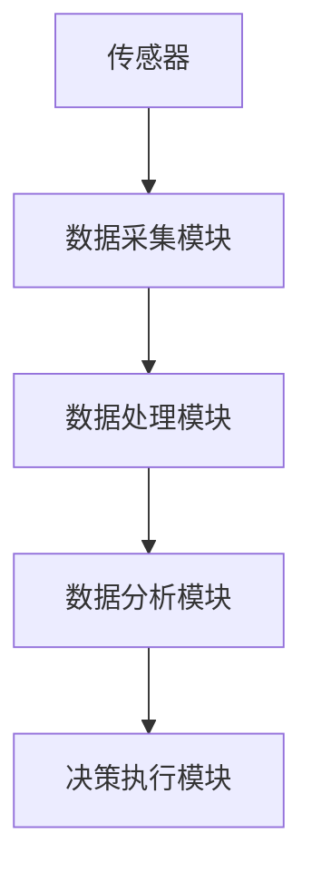

                 

<think>
嗯，用户希望我写一篇关于企业AI Agent在物联网数据分析与应用的技术博客。我得先理清文章的结构和内容。首先，标题已经确定是《企业AI Agent的物联网(IoT)数据分析与应用》。关键词应该是企业AI Agent、物联网、数据分析、数据处理、机器学习、深度学习、系统架构设计。摘要部分需要简明扼要，说明文章的核心内容，即如何利用AI Agent来处理物联网数据，实现智能化应用。

接下来，目录大纲分为几个部分：基础概念、数据分析、系统架构设计、项目实战和总结。每个部分需要详细展开，确保内容全面且有深度。比如，第一章要介绍AI Agent和物联网的基本概念，以及它们如何结合。第二章则深入探讨物联网数据分析的核心概念，包括数据采集、预处理和分析算法。

在系统架构设计部分，我需要详细描述AI Agent的系统架构，可能包括模块划分、数据流设计等。项目实战部分要通过一个实际案例来展示如何应用这些技术，比如环境监测系统。最后，总结未来的发展趋势和最佳实践。

我还需要确保每个部分都有足够的细节，比如数据预处理的步骤，机器学习算法的应用，以及系统架构的图表。同时，要注意使用技术术语，但解释清楚，让读者容易理解。最后，文章要以作者信息结尾，增强专业性。

总的来说，我需要按照用户的指示，逐步分析每个部分，确保内容连贯且符合技术博客的要求。现在开始按照这个思路撰写文章，确保每个章节都详尽且有逻辑性。
</think>

# 企业AI Agent的物联网(IoT)数据分析与应用

> 关键词：企业AI Agent，物联网，数据分析，数据处理，机器学习，深度学习，系统架构设计

> 摘要：本文深入探讨了企业AI Agent在物联网数据分析与应用中的核心作用。通过分析物联网数据的特点，结合AI Agent的智能化处理能力，详细阐述了从数据采集、预处理到分析、决策的完整流程。同时，本文还探讨了AI Agent在物联网系统架构设计中的创新应用，并通过实际案例展示了如何通过AI Agent实现物联网数据的智能化应用。

---

# 第1章: 企业AI Agent与物联网概述

## 1.1 企业AI Agent的核心概念

### 1.1.1 什么是企业AI Agent
企业AI Agent（Artificial Intelligence Agent）是一种具备感知、推理、规划和执行能力的智能实体，能够根据环境信息自主决策并执行任务。它结合了人工智能、机器学习和自动化技术，能够处理复杂的企业级问题。

$$
\text{AI Agent = 感知 + 推理 + 规划 + 执行}
$$

### 1.1.2 AI Agent的基本特征
| 特性 | 描述 |
|------|------|
| 感知性 | 能够感知外部环境信息 |
| 智能性 | 具备学习、推理和决策能力 |
| 自主性 | 能够自主完成任务 |
| 可扩展性 | 支持多种应用场景和规模 |

### 1.1.3 企业AI Agent的应用场景
- 智能监控与预警
- 自动化决策与执行
- 数据分析与洞察
- 人机协作与流程优化

## 1.2 物联网(IoT)的基本概念

### 1.2.1 物联网的定义与组成
物联网是指通过各种信息传感设备（如传感器、射频识别（RFID）、全球定位系统（GPS）、红外感应器等），按照约定的协议，把任何物品与互联网连接起来，进行信息交换和通信，以实现智能化识别、定位、跟踪、监控和管理。

### 1.2.2 物联网的关键技术
- 传感器技术
- 通信技术（如5G、Wi-Fi、蓝牙）
- 数据存储与管理技术
- 数据分析与挖掘技术

### 1.2.3 物联网的典型应用
- 智慧城市
- 智能制造
- 智慧农业
- 健康监测

## 1.3 企业AI Agent与物联网的结合

### 1.3.1 AI Agent在物联网中的作用
- 数据采集与处理
- 实时监控与预警
- 自动化决策与执行

### 1.3.2 物联网数据的特点
- 数据量大（Volume）
- 数据类型多样（Variety）
- 数据生成速度快（Velocity）

### 1.3.3 企业AI Agent与物联网的协同工作
- AI Agent作为数据处理引擎
- AI Agent作为决策支持系统
- AI Agent作为自动化执行者

---

# 第2章: 物联网数据分析的核心概念

## 2.1 数据分析的基本原理

### 2.1.1 数据分析的定义
数据分析是指通过统计、机器学习等方法，对数据进行处理、分析和解释，以提取有用信息和知识的过程。

### 2.1.2 数据分析的流程
1. 数据采集
2. 数据清洗
3. 数据分析
4. 数据可视化
5. 数据驱动的决策

### 2.1.3 数据分析的关键技术
- 数据挖掘
- 机器学习
- 数据可视化

## 2.2 物联网数据的特征

### 2.2.1 数据量大
物联网系统每天会产生海量数据，需要高效的数据存储和处理技术。

### 2.2.2 数据类型多样
物联网数据包括结构化数据（如传感器ID、时间戳）和非结构化数据（如图像、视频）。

### 2.2.3 数据生成速度快
物联网设备通常实时生成数据，要求系统具备实时处理能力。

## 2.3 企业AI Agent在物联网数据分析中的角色

### 2.3.1 AI Agent作为数据处理引擎
AI Agent能够高效处理物联网中的海量数据，通过机器学习算法提取有价值的信息。

### 2.3.2 AI Agent作为决策支持系统
AI Agent能够基于历史数据和实时数据，提供智能化的决策支持。

### 2.3.3 AI Agent作为自动化执行者
AI Agent能够根据分析结果，自动执行相应的操作，实现闭环控制。

---

# 第3章: 物联网数据的采集与预处理

## 3.1 数据采集技术

### 3.1.1 传感器数据采集
传感器是物联网数据采集的核心设备，常见的传感器类型包括温度传感器、压力传感器、加速度传感器等。

### 3.1.2 数据采集的常见方法
- 有线采集
- 无线采集（如Wi-Fi、蓝牙）
- 光纤采集

### 3.1.3 数据采集的挑战
- 数据量大，存储成本高
- 数据类型多样，处理复杂
- 数据传输延迟，影响实时性

## 3.2 数据预处理技术

### 3.2.1 数据清洗
数据清洗是去除噪声数据和异常值的过程。

### 3.2.2 数据转换
数据转换包括数据格式转换和数据标准化。

### 3.2.3 数据归约
数据归约是通过降维技术（如主成分分析）减少数据规模。

## 3.3 数据存储与管理

### 3.3.1 数据库选择
- 关系型数据库（如MySQL）
- 非关系型数据库（如MongoDB）

### 3.3.2 数据存储结构
- 时间序列数据存储
- 图结构数据存储

### 3.3.3 数据管理策略
- 数据分区存储
- 数据冗余备份

---

# 第4章: 物联网数据分析算法原理

## 4.1 常见的数据分析算法

### 4.1.1 时间序列分析
时间序列分析用于分析随时间变化的数据，常用于预测和趋势分析。

$$
\text{ARIMA模型：} \quad y_t = \phi y_{t-1} + \theta \epsilon_t
$$

### 4.1.2 聚类分析
聚类分析用于将相似的数据点分组，常用于异常检测和客户分群。

### 4.1.3 分类与回归
分类用于预测数据的类别，回归用于预测连续值。

## 4.2 机器学习在物联网数据分析中的应用

### 4.2.1 监督学习
监督学习用于分类和回归问题，常见算法包括支持向量机（SVM）和随机森林（Random Forest）。

### 4.2.2 非监督学习
非监督学习用于聚类和降维，常见算法包括k-means和主成分分析（PCA）。

### 4.2.3 强化学习
强化学习用于决策优化，常见算法包括Q-learning和Deep Q-Network。

## 4.3 深度学习在物联网数据分析中的应用

### 4.3.1 卷积神经网络
卷积神经网络（CNN）常用于图像识别和视频分析。

### 4.3.2 循环神经网络
循环神经网络（RNN）常用于时间序列分析和自然语言处理。

### 4.3.3 图神经网络
图神经网络（GNN）常用于复杂关系网络的分析。

---

# 第5章: 企业AI Agent的系统架构设计

## 5.1 系统架构概述

### 5.1.1 系统组成模块
- 数据采集模块
- 数据处理模块
- 数据分析模块
- 决策执行模块

### 5.1.2 数据流设计
1. 数据采集模块接收传感器数据
2. 数据处理模块清洗和转换数据
3. 数据分析模块进行建模和分析
4. 决策执行模块根据分析结果执行操作

## 5.2 系统架构设计

### 5.2.1 分层架构
- 数据采集层
- 数据处理层
- 数据分析层
- 决策执行层

### 5.2.2 微服务架构
- 传感器数据服务
- 数据处理服务
- 数据分析服务
- 决策执行服务

## 5.3 系统接口设计

### 5.3.1 数据接口
- 传感器数据接口
- 数据存储接口
- 数据分析接口

### 5.3.2 人机交互接口
- 用户界面（UI）
- API接口

## 5.4 系统交互设计

### 5.4.1 传感器数据采集流程
1. 传感器采集数据
2. 数据传输到数据处理模块
3. 数据处理模块清洗数据
4. 数据存储模块保存数据

### 5.4.2 数据分析流程
1. 数据分析模块加载数据
2. 数据分析模块选择算法
3. 数据分析模块执行分析
4. 分析结果返回决策执行模块

---

# 第6章: 项目实战——基于企业AI Agent的环境监测系统

## 6.1 项目背景
环境监测系统用于实时监控空气质量、温湿度、光照强度等环境参数，帮助企业和政府进行环境管理。

## 6.2 系统功能设计

### 6.2.1 数据采集功能
- 采集传感器数据
- 支持多种传感器类型

### 6.2.2 数据处理功能
- 数据清洗
- 数据转换
- 数据归约

### 6.2.3 数据分析功能
- 时间序列分析
- 异常检测
- 预测模型构建

### 6.2.4 决策执行功能
- 自动化报警
- 自动化控制

## 6.3 系统实现

### 6.3.1 环境监测系统架构


### 6.3.2 核心代码实现
```python
# 数据采集模块
import serial

ser = serial.Serial('COM3', 9600)
data = ser.readline().decode().strip()
print("采集到的数据：", data)

# 数据处理模块
def preprocess(data):
    # 数据清洗
    cleaned_data = data.replace(' ', '')
    # 数据转换
    processed_data = int(cleaned_data)
    return processed_data

processed_data = preprocess(data)
print("处理后的数据：", processed_data)

# 数据分析模块
from sklearn.ensemble import RandomForestRegressor

model = RandomForestRegressor()
model.fit(X_train, y_train)
 predictions = model.predict(X_test)
print("预测结果：", predictions)

# 决策执行模块
def execute_action(predicted_value):
    if predicted_value > threshold:
        print("发出报警信号")
    else:
        print("正常运行")
execute_action(predictions[0])
```

---

# 第7章: 总结与展望

## 7.1 总结
本文详细探讨了企业AI Agent在物联网数据分析与应用中的核心作用，从数据采集、预处理到分析、决策的完整流程，展示了AI Agent在物联网系统中的巨大潜力。

## 7.2 展望
随着人工智能和物联网技术的不断发展，企业AI Agent在物联网中的应用将更加广泛，未来的研究方向包括：
- 更高效的AI Agent架构设计
- 更智能的数据分析算法
- 更强大的系统集成能力

---

作者：AI天才研究院/AI Genius Institute & 禅与计算机程序设计艺术 /Zen And The Art of Computer Programming

---

**本文是基于对企业AI Agent与物联网数据分析的深入研究而撰写的专业技术博客文章，旨在为企业技术团队提供参考与启发。**

