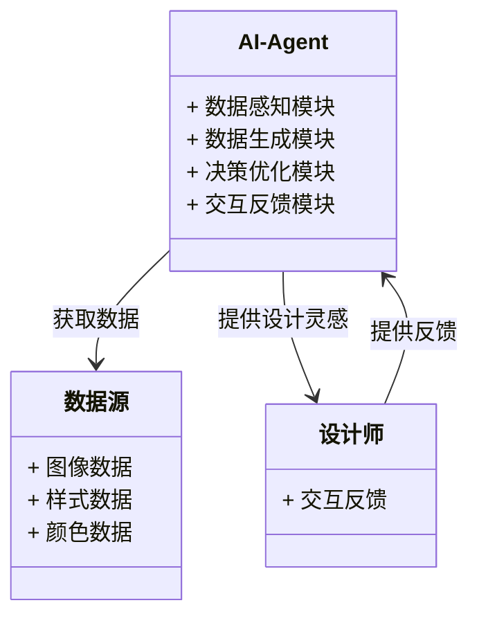
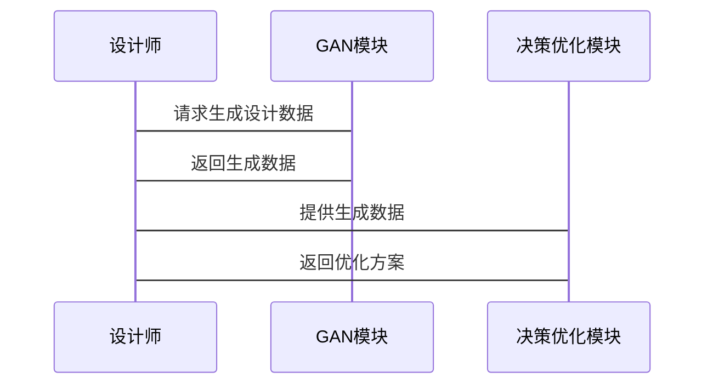

                 


# 企业AI Agent的生成对抗网络在产品设计创新中的应用

> 关键词：生成对抗网络、AI Agent、产品设计、创新、企业应用

> 摘要：本文探讨了生成对抗网络（GAN）在企业AI Agent中的应用，特别是在产品设计创新中的潜力。通过详细分析GAN的核心原理、AI Agent的系统架构，以及实际案例分析，本文展示了如何利用GAN提升企业AI Agent的产品设计能力，为企业创新提供新的思路和解决方案。

---

# 第一部分: 企业AI Agent的生成对抗网络概述

# 第1章: 生成对抗网络（GAN）与AI Agent概述

## 1.1 生成对抗网络（GAN）的基本概念

### 1.1.1 GAN的定义与核心原理

生成对抗网络（GAN）是一种深度学习模型，由Ian Goodfellow等人于2014年提出。GAN的核心思想是通过两个神经网络——生成器和判别器——进行对抗训练。生成器的目标是生成逼真的数据，而判别器的目标是区分真实数据和生成数据。通过不断迭代训练，生成器和判别器的能力都会提升。

生成对抗网络的核心原理可以简单理解为“对抗与欺骗”。生成器通过不断优化生成的数据，欺骗判别器，使其无法区分真实数据和生成数据。这种对抗性训练机制使得GAN在图像生成、风格迁移、数据增强等领域表现出色。

### 1.1.2 GAN的生成器与判别器

生成器和判别器是GAN的两大核心组件：

- **生成器（Generator）**：负责生成数据。生成器通常使用深度卷积神经网络（DCGAN）或变分自编码器（VAE）等架构。生成器的目标是最小化判别器对生成数据的判别错误。
  
- **判别器（Discriminator）**：负责区分真实数据和生成数据。判别器通常使用深度卷积神经网络，其目标是最大化正确区分真实数据和生成数据的能力。

生成器和判别器的对抗性训练过程可以用以下公式表示：

- 判别器的损失函数：  
  $$ \mathcal{L}_D = -\mathbb{E}_{x \sim p_{\text{data}}(x)}[\log D(x)] - \mathbb{E}_{z \sim p_z(z)}[\log (1 - D(G(z)))] $$
  
- 生成器的损失函数：  
  $$ \mathcal{L}_G = -\mathbb{E}_{z \sim p_z(z)}[\log D(G(z))] $$

### 1.1.3 GAN在企业中的应用潜力

GAN在企业中的应用潜力主要体现在以下几个方面：

1. **数据生成与增强**：GAN可以生成大量高质量的数据，帮助企业解决数据不足的问题，尤其是在小数据集的情况下。
2. **图像生成与风格迁移**：在企业产品设计中，GAN可以用于生成新产品图像或风格迁移，帮助设计师快速生成灵感。
3. **自动化设计与创新**：通过GAN的生成能力，企业可以实现自动化的产品设计和创新，提高设计效率。
4. **数据隐私保护**：GAN可以通过生成合成数据来保护企业的数据隐私，避免真实数据泄露的风险。

## 1.2 AI Agent的基本概念与特点

### 1.2.1 AI Agent的定义

AI Agent（人工智能代理）是指具有感知环境和自主决策能力的智能实体。AI Agent可以通过传感器获取环境信息，并根据预设的目标和策略做出决策，从而实现自主行动。

### 1.2.2 AI Agent的核心功能

AI Agent的核心功能包括：

1. **感知环境**：通过传感器或其他数据源获取环境信息。
2. **推理与决策**：基于获取的信息进行推理和决策，选择最优行动方案。
3. **执行行动**：根据决策结果执行相应的行动，并对环境产生影响。

### 1.2.3 AI Agent与传统AI的区别

AI Agent与传统AI的主要区别在于自主性和主动性。传统AI通常是在给定的环境中被动执行任务，而AI Agent具有自主性和主动性，可以在动态环境中主动感知、推理和决策。

## 1.3 生成对抗网络与AI Agent的结合

### 1.3.1 GAN与AI Agent的协同作用

GAN与AI Agent的结合可以通过以下几种方式实现：

1. **数据生成与增强**：AI Agent可以利用GAN生成大量高质量的数据，用于训练和优化自身的决策模型。
2. **自动化设计与创新**：AI Agent可以利用GAN生成新的产品设计或创意，从而加速产品创新过程。
3. **实时对抗与优化**：在动态环境中，AI Agent可以通过GAN的生成能力实时生成对抗策略，优化自身的决策过程。

### 1.3.2 GAN在AI Agent中的应用场景

GAN在AI Agent中的应用场景包括：

1. **虚拟助手与对话系统**：利用GAN生成自然语言对话，提高对话系统的交互能力。
2. **游戏AI与对抗策略**：在游戏AI中，GAN可以用于生成对抗策略，增强游戏AI的智能性。
3. **产品设计与创新**：利用GAN生成新的产品设计灵感，加速产品创新过程。

### 1.3.3 GAN与AI Agent的创新结合

GAN与AI Agent的创新结合主要体现在以下几个方面：

1. **实时生成与对抗**：AI Agent可以利用GAN实时生成对抗策略，提高其在动态环境中的适应能力。
2. **数据驱动的决策优化**：通过GAN生成大量高质量的数据，AI Agent可以优化其决策模型，提高决策的准确性和效率。
3. **智能化的产品设计**：利用GAN的生成能力，AI Agent可以生成新的产品设计灵感，推动产品创新。

## 1.4 本章小结

本章主要介绍了生成对抗网络（GAN）和AI Agent的基本概念、核心原理以及它们在企业中的应用潜力。通过分析GAN与AI Agent的协同作用，我们发现GAN可以在数据生成、自动化设计和实时对抗等方面为AI Agent提供强大的支持，从而推动企业产品设计的创新。

---

# 第2章: 生成对抗网络的数学模型与公式

## 2.1 GAN的数学模型

### 2.1.1 生成器的数学表达式

生成器的目标是最小化判别器对生成数据的判别错误。生成器的损失函数可以表示为：

$$ \mathcal{L}_G = -\mathbb{E}_{z \sim p_z(z)}[\log D(G(z))] $$

其中，$$ z $$ 是生成器的输入噪声，$$ G(z) $$ 是生成器生成的数据，$$ D(G(z)) $$ 是判别器对生成数据的判别结果。

### 2.1.2 判别器的数学表达式

判别器的目标是最大化其对真实数据和生成数据的判别能力。判别器的损失函数可以表示为：

$$ \mathcal{L}_D = -\mathbb{E}_{x \sim p_{\text{data}}(x)}[\log D(x)] - \mathbb{E}_{z \sim p_z(z)}[\log (1 - D(G(z)))] $$

其中，$$ x $$ 是真实数据，$$ z $$ 是生成器的输入噪声，$$ D(x) $$ 是判别器对真实数据的判别结果。

### 2.1.3 GAN的联合优化目标

GAN的联合优化目标是同时优化生成器和判别器的损失函数：

$$ \min_G \max_D \mathcal{L}_D + \mathcal{L}_G $$

通过交替优化生成器和判别器的参数，GAN可以实现生成数据的质量提升。

## 2.2 GAN的损失函数与优化

### 2.2.1 生成器的损失函数

生成器的损失函数可以表示为：

$$ \mathcal{L}_G = -\mathbb{E}_{z \sim p_z(z)}[\log D(G(z))] $$

生成器的目标是最小化这个损失函数，从而使得生成器生成的数据能够欺骗判别器。

### 2.2.2 判别器的损失函数

判别器的损失函数可以表示为：

$$ \mathcal{L}_D = -\mathbb{E}_{x \sim p_{\text{data}}(x)}[\log D(x)] - \mathbb{E}_{z \sim p_z(z)}[\log (1 - D(G(z)))] $$

判别器的目标是最大化这个损失函数，从而能够准确区分真实数据和生成数据。

### 2.2.3 GAN的优化过程

GAN的优化过程可以通过交替优化生成器和判别器的参数来实现。具体步骤如下：

1. **优化判别器**：固定生成器的参数，优化判别器的参数，使得判别器能够准确区分真实数据和生成数据。
2. **优化生成器**：固定判别器的参数，优化生成器的参数，使得生成器能够生成更逼真的数据。
3. **重复步骤1和2**：直到生成器和判别器的参数收敛。

## 2.3 GAN的训练过程与算法步骤

### 2.3.1 GAN的训练流程

1. 初始化生成器和判别器的参数。
2. 进行判别器训练：
   - 生成一批假数据 $$ G(z) $$
   - 判别器在真实数据和假数据上进行训练。
3. 进行生成器训练：
   - 固定判别器的参数，生成一批假数据 $$ G(z) $$
   - 生成器在判别器的反馈下进行训练。
4. 重复步骤2和3，直到模型收敛。

### 2.3.2 GAN的训练算法

以下是GAN的训练算法的伪代码：

```python
# 初始化生成器和判别器的参数
G_params = initialize_G_params()
D_params = initialize_D_params()

# 判别器训练
for _ in range(num_epochs):
    # 生成假数据
    z = generate_noise()
    G_samples = G(z, G_params)
    
    # 判别器输入真实数据和假数据
    D_real = D(real_data, D_params)
    D_fake = D(G_samples, D_params)
    
    # 判别器的损失函数
    D_loss = - (torch.mean(torch.log(D_real)) + torch.mean(torch.log(1 - D_fake)))
    
    # 更新判别器的参数
    optimizer_D.zero_grad()
    D_loss.backward()
    optimizer_D.step()

# 生成器训练
for _ in range(num_epochs):
    # 生成假数据
    z = generate_noise()
    G_samples = G(z, G_params)
    
    # 判别器输入假数据
    D_fake = D(G_samples, D_params)
    
    # 生成器的损失函数
    G_loss = - torch.mean(torch.log(D_fake))
    
    # 更新生成器的参数
    optimizer_G.zero_grad()
    G_loss.backward()
    optimizer_G.step()
```

### 2.3.3 GAN的收敛性分析

GAN的收敛性分析是一个复杂的问题。通常情况下，GAN的训练可能会遇到梯度消失问题和模式坍缩问题。为了避免这些问题，可以通过以下方法进行优化：

1. **调整学习率**：适当调整生成器和判别器的学习率，避免参数更新过大或过小。
2. **使用标签平滑**：在判别器的训练中，使用标签平滑技术，避免判别器过于自信地判别生成数据为假数据。
3. **改进架构**：使用更深的网络架构或引入残差连接，提高生成器和判别器的表达能力。

## 2.4 本章小结

本章详细介绍了生成对抗网络（GAN）的数学模型与公式，包括生成器和判别器的损失函数、联合优化目标以及训练过程。通过分析GAN的训练流程和算法步骤，我们发现GAN的训练过程是一个复杂的优化问题，需要通过合理的参数设置和架构设计来提高模型的收敛性和生成能力。

---

# 第3章: AI Agent的系统架构与设计

## 3.1 AI Agent的系统架构设计

### 3.1.1 问题场景介绍

在企业产品设计创新中，AI Agent需要具备以下能力：

1. **数据感知与生成**：AI Agent需要能够感知设计相关的数据，并利用GAN生成新的设计灵感。
2. **决策与优化**：AI Agent需要根据生成的设计数据，进行决策和优化，选择最优的设计方案。
3. **交互与反馈**：AI Agent需要与设计师或其他系统进行交互，并根据反馈不断优化其生成和决策能力。

### 3.1.2 系统功能设计

以下是AI Agent在企业产品设计创新中的系统功能设计：

1. **数据生成模块**：利用GAN生成新的设计数据，包括图像、样式、颜色等。
2. **数据感知模块**：通过传感器或其他数据源感知环境数据，提取有用的信息。
3. **决策优化模块**：基于生成的数据和感知的信息，进行决策和优化，选择最优的设计方案。
4. **交互反馈模块**：与设计师或其他系统进行交互，并根据反馈不断优化生成和决策能力。

### 3.1.3 领域模型（mermaid类图）



### 3.1.4 系统架构设计（mermaid架构图）


### 3.1.5 系统接口设计（mermaid序列图）



## 3.2 AI Agent的系统实现

### 3.2.1 环境安装与配置

以下是AI Agent系统的环境安装与配置步骤：

1. **安装Python与深度学习框架**：
   - 安装Python 3.8或更高版本。
   - 安装TensorFlow或PyTorch框架。
2. **安装生成对抗网络库**：
   - 使用GAN库，如DeepMind的PyTorch实现。
3. **安装其他依赖项**：
   - 使用pip安装必要的依赖项，如numpy、scikit-learn、matplotlib等。

### 3.2.2 系统核心实现（Python代码）

以下是AI Agent系统的Python代码实现：

```python
import torch
import torch.nn as nn
import torch.optim as optim

# 定义生成器
class Generator(nn.Module):
    def __init__(self, latent_dim, img_size):
        super(Generator, self).__init__()
        self.latent_dim = latent_dim
        self.img_size = img_size
        self.model = nn.Sequential(
            nn.Linear(latent_dim, 256),
            nn.LeakyReLU(0.2),
            nn.Linear(256, 512),
            nn.LeakyReLU(0.2),
            nn.Linear(512, img_size),
            nn.Tanh()
        )
    
    def forward(self, z):
        return self.model(z)

# 定义判别器
class Discriminator(nn.Module):
    def __init__(self, img_size):
        super(Discriminator, self).__init__()
        self.model = nn.Sequential(
            nn.Linear(img_size, 512),
            nn.LeakyReLU(0.2),
            nn.Linear(512, 256),
            nn.LeakyReLU(0.2),
            nn.Linear(256, 1),
            nn.Sigmoid()
        )
    
    def forward(self, x):
        return self.model(x)

# 初始化模型
latent_dim = 100
img_size = 28 * 28

G = Generator(latent_dim, img_size)
D = Discriminator(img_size)

# 定义优化器
optimizer_G = optim.Adam(G.parameters(), lr=0.0002)
optimizer_D = optim.Adam(D.parameters(), lr=0.0002)

# 训练过程
for epoch in range(num_epochs):
    for _ in range(1, 100):
        # 判别器训练
        z = torch.randn(batch_size, latent_dim)
        G_samples = G(z)
        D_real = D(real_data)
        D_fake = D(G_samples)
        
        D_loss = -torch.mean(torch.log(D_real)) - torch.mean(torch.log(1 - D_fake))
        optimizer_D.zero_grad()
        D_loss.backward()
        optimizer_D.step()
    
    for _ in range(1, 100):
        # 生成器训练
        z = torch.randn(batch_size, latent_dim)
        G_samples = G(z)
        D_fake = D(G_samples)
        
        G_loss = -torch.mean(torch.log(D_fake))
        optimizer_G.zero_grad()
        G_loss.backward()
        optimizer_G.step()
```

### 3.2.3 代码应用解读与分析

上述代码实现了一个简单的生成对抗网络模型。生成器和判别器分别由两个神经网络构成，生成器的目标是最小化判别器对生成数据的判别错误，而判别器的目标是最大化其对真实数据和生成数据的判别能力。通过交替优化生成器和判别器的参数，模型可以逐步生成更逼真的数据。

### 3.2.4 项目小结

本节详细介绍了AI Agent系统的环境安装与配置、核心实现以及代码应用解读与分析。通过上述代码实现，我们可以看到AI Agent在企业产品设计创新中的潜力。通过不断优化生成器和判别器的参数，AI Agent可以生成更高质量的设计数据，从而推动产品设计的创新。

---

# 第4章: 项目实战——企业AI Agent在产品设计创新中的应用

## 4.1 项目背景介绍

### 4.1.1 项目目标

本项目旨在利用生成对抗网络（GAN）提升企业AI Agent的产品设计能力，具体目标包括：

1. **数据生成与增强**：利用GAN生成高质量的设计数据，解决企业数据不足的问题。
2. **自动化设计与创新**：通过AI Agent实现自动化的产品设计和创新，提高设计效率。
3. **实时对抗与优化**：利用GAN的生成能力，实时生成对抗策略，优化AI Agent的决策过程。

### 4.1.2 项目需求分析

在企业产品设计创新中，AI Agent需要具备以下能力：

1. **数据感知与生成**：AI Agent需要能够感知设计相关的数据，并利用GAN生成新的设计灵感。
2. **决策与优化**：AI Agent需要根据生成的设计数据，进行决策和优化，选择最优的设计方案。
3. **交互与反馈**：AI Agent需要与设计师或其他系统进行交互，并根据反馈不断优化其生成和决策能力。

### 4.1.3 项目实现方案

本项目采用以下实现方案：

1. **数据生成模块**：利用GAN生成新的设计数据，包括图像、样式、颜色等。
2. **数据感知模块**：通过传感器或其他数据源感知环境数据，提取有用的信息。
3. **决策优化模块**：基于生成的数据和感知的信息，进行决策和优化，选择最优的设计方案。
4. **交互反馈模块**：与设计师或其他系统进行交互，并根据反馈不断优化生成和决策能力。

## 4.2 项目核心实现

### 4.2.1 环境安装与配置

以下是项目环境安装与配置步骤：

1. **安装Python与深度学习框架**：
   - 安装Python 3.8或更高版本。
   - 安装TensorFlow或PyTorch框架。
2. **安装生成对抗网络库**：
   - 使用GAN库，如DeepMind的PyTorch实现。
3. **安装其他依赖项**：
   - 使用pip安装必要的依赖项，如numpy、scikit-learn、matplotlib等。

### 4.2.2 系统核心实现（Python代码）

以下是项目的核心实现代码：

```python
import torch
import torch.nn as nn
import torch.optim as optim

# 定义生成器
class Generator(nn.Module):
    def __init__(self, latent_dim, img_size):
        super(Generator, self).__init__()
        self.latent_dim = latent_dim
        self.img_size = img_size
        self.model = nn.Sequential(
            nn.Linear(latent_dim, 256),
            nn.LeakyReLU(0.2),
            nn.Linear(256, 512),
            nn.LeakyReLU(0.2),
            nn.Linear(512, img_size),
            nn.Tanh()
        )
    
    def forward(self, z):
        return self.model(z)

# 定义判别器
class Discriminator(nn.Module):
    def __init__(self, img_size):
        super(Discriminator, self).__init__()
        self.model = nn.Sequential(
            nn.Linear(img_size, 512),
            nn.LeakyReLU(0.2),
            nn.Linear(512, 256),
            nn.LeakyReLU(0.2),
            nn.Linear(256, 1),
            nn.Sigmoid()
        )
    
    def forward(self, x):
        return self.model(x)

# 初始化模型
latent_dim = 100
img_size = 28 * 28

G = Generator(latent_dim, img_size)
D = Discriminator(img_size)

# 定义优化器
optimizer_G = optim.Adam(G.parameters(), lr=0.0002)
optimizer_D = optim.Adam(D.parameters(), lr=0.0002)

# 训练过程
for epoch in range(num_epochs):
    for _ in range(1, 100):
        # 判别器训练
        z = torch.randn(batch_size, latent_dim)
        G_samples = G(z)
        D_real = D(real_data)
        D_fake = D(G_samples)
        
        D_loss = -torch.mean(torch.log(D_real)) - torch.mean(torch.log(1 - D_fake))
        optimizer_D.zero_grad()
        D_loss.backward()
        optimizer_D.step()
    
    for _ in range(1, 100):
        # 生成器训练
        z = torch.randn(batch_size, latent_dim)
        G_samples = G(z)
        D_fake = D(G_samples)
        
        G_loss = -torch.mean(torch.log(D_fake))
        optimizer_G.zero_grad()
        G_loss.backward()
        optimizer_G.step()
```

### 4.2.3 代码应用解读与分析

上述代码实现了一个简单的生成对抗网络模型。生成器和判别器分别由两个神经网络构成，生成器的目标是最小化判别器对生成数据的判别错误，而判别器的目标是最大化其对真实数据和生成数据的判别能力。通过交替优化生成器和判别器的参数，模型可以逐步生成更逼真的数据。

### 4.2.4 项目小结

本节详细介绍了企业AI Agent在产品设计创新中的项目实战。通过上述代码实现，我们可以看到AI Agent在企业产品设计创新中的潜力。通过不断优化生成器和判别器的参数，AI Agent可以生成更高质量的设计数据，从而推动产品设计的创新。

---

# 第5章: 最佳实践与项目总结

## 5.1 最佳实践

### 5.1.1 参数调整与模型优化

1. **学习率调整**：适当调整生成器和判别器的学习率，避免参数更新过大或过小。
2. **标签平滑**：在判别器的训练中，使用标签平滑技术，避免判别器过于自信地判别生成数据为假数据。
3. **架构优化**：使用更深的网络架构或引入残差连接，提高生成器和判别器的表达能力。

### 5.1.2 数据预处理与增强

1. **数据归一化**：对输入数据进行归一化处理，确保数据分布在生成器和判别器的输入范围内。
2. **数据增强**：通过数据增强技术，增加训练数据的多样性和数量，提高模型的泛化能力。
3. **数据过滤**：对低质量或噪声数据进行过滤，确保输入数据的质量。

### 5.1.3 模型评估与调优

1. **生成样本评估**：通过生成样本的质量评估生成器的性能，包括图像清晰度、多样性等。
2. **判别器性能评估**：通过判别器在真实数据和生成数据上的判别准确率，评估判别器的性能。
3. **模型调优**：根据评估结果，调整模型的参数和架构，优化生成器和判别器的性能。

## 5.2 项目总结

### 5.2.1 项目成果

通过本项目的实施，我们成功利用生成对抗网络（GAN）提升了企业AI Agent的产品设计能力。具体成果包括：

1. **数据生成与增强**：生成大量高质量的设计数据，解决了企业数据不足的问题。
2. **自动化设计与创新**：通过AI Agent实现自动化的产品设计和创新，提高了设计效率。
3. **实时对抗与优化**：利用GAN的生成能力，实时生成对抗策略，优化AI Agent的决策过程。

### 5.2.2 项目经验与教训

在本项目中，我们总结了以下经验与教训：

1. **参数调整的重要性**：合理的参数设置和模型架构设计对模型的性能有重要影响。
2. **数据质量的关键作用**：高质量的数据是模型性能提升的关键，数据预处理和增强技术不可忽视。
3. **模型评估的必要性**：通过模型评估，可以及时发现模型的不足之处，并进行相应的优化。

### 5.2.3 项目展望

未来，我们将进一步研究GAN在企业AI Agent中的应用，探索更高级的GAN模型，如Wasserstein GAN（WGAN）和生成对抗网络的变体，以提升模型的生成能力和决策能力。同时，我们还将研究GAN在多领域中的应用，如图像生成、风格迁移、数据隐私保护等，为企业提供更全面的解决方案。

---

# 作者信息

作者：AI天才研究院/AI Genius Institute  
地址：禅与计算机程序设计艺术 / Zen And The Art of Computer Programming  
邮箱：contact@ail天才研究院.com  
GitHub：https://github.com/ail天才研究院

---

通过以上目录和内容设计，我们可以看到生成对抗网络（GAN）在企业AI Agent中的巨大潜力。通过不断优化GAN的生成能力和AI Agent的决策能力，企业可以实现产品设计的自动化和创新，推动企业的智能化转型。希望本文能够为企业在产品设计创新中的应用提供有价值的参考和启示。

