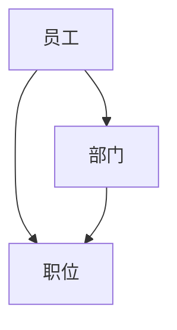
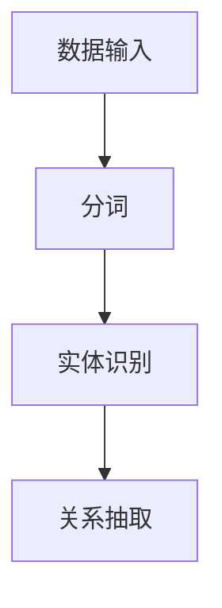
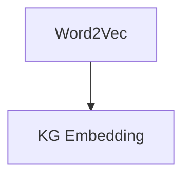
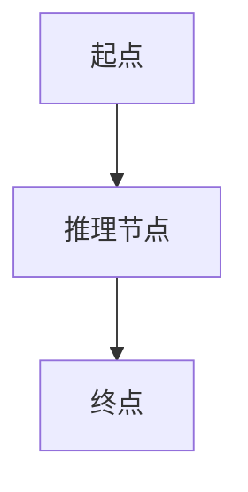
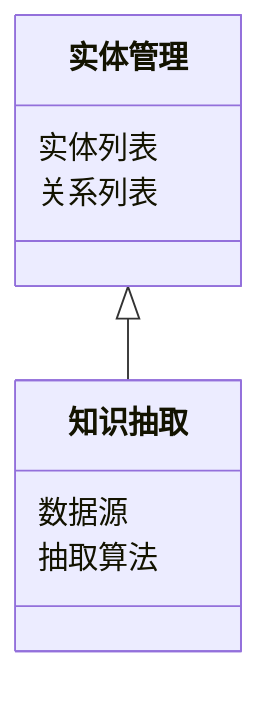
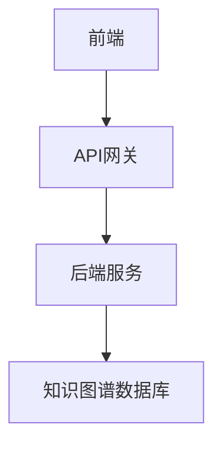
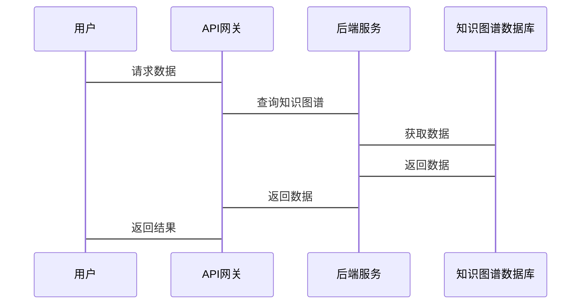

                 


# 企业AI Agent的知识图谱构建与应用

**关键词**：知识图谱、AI Agent、企业应用、构建算法、系统架构

**摘要**：  
本文深入探讨了知识图谱在企业AI Agent中的构建与应用，从核心概念到算法原理，再到系统架构与实战案例，全面分析了如何利用知识图谱提升企业AI Agent的智能水平。文章首先介绍了知识图谱与AI Agent的基本概念和背景，接着详细讲解了知识图谱的构建算法和AI Agent的应用架构，最后通过实际案例展示了知识图谱在企业中的具体应用。通过本文的分析，读者可以全面理解知识图谱在企业AI Agent中的重要性及其实现方法。

---

## 第1章: 知识图谱与AI Agent的背景介绍

### 1.1 知识图谱的定义与核心概念

#### 1.1.1 问题背景与问题描述
知识图谱是一种以结构化方式表示知识的图数据，能够将实体及其关系以图的形式表示，从而实现知识的组织与推理。在企业AI Agent中，知识图谱是其智能决策的核心基础。

#### 1.1.2 知识图谱的构建目标与边界
知识图谱的构建目标是将企业中的数据转化为可计算的知识，支持AI Agent的智能决策。其边界包括数据来源、实体范围和关系深度。

#### 1.1.3 知识图谱的核心要素与概念结构
知识图谱的核心要素包括实体、关系和属性。实体是知识图谱的基本单元，关系描述实体之间的联系，属性则进一步丰富实体的信息。

### 1.2 AI Agent的基本概念与应用场景

#### 1.2.1 AI Agent的定义与分类
AI Agent是一种能够感知环境并自主决策的智能体，根据智能水平可分为反应式和认知式AI Agent。

#### 1.2.2 企业AI Agent的核心功能与特点
企业AI Agent具备知识表示、推理、学习和自适应能力，能够处理复杂任务。

#### 1.2.3 知识图谱在AI Agent中的作用与价值
知识图谱为AI Agent提供知识基础，支持其进行推理和决策，提升智能水平。

---

## 第2章: 知识图谱的核心概念与联系

### 2.1 知识图谱的核心概念

#### 2.1.1 实体与关系的定义与属性特征对比
实体是知识图谱的基本单元，关系描述实体间的联系。属性用于丰富实体信息。

#### 2.1.2 知识图谱的构建流程与关键步骤
构建流程包括数据获取、清洗、抽取、建模和存储。关键步骤是实体识别和关系抽取。

#### 2.1.3 知识图谱的存储与表示方法
常用存储方式包括RDF和图数据库，表示方法有RDF和知识图谱嵌入。

### 2.2 知识图谱的ER实体关系图

#### 2.2.1 实体关系的定义与建模
通过ER图展示实体间的关系，例如员工-部门的关系。

#### 2.2.2 Mermaid流程图展示（示例）


---

## 第3章: 知识图谱构建的算法原理

### 3.1 知识抽取算法

#### 3.1.1 实体识别与关系抽取
使用规则和深度学习方法进行实体识别，如CRF和RNN。

#### 3.1.2 基于规则与深度学习的抽取方法
规则方法适用于结构化数据，深度学习适用于非结构化数据。

#### 3.1.3 Mermaid流程图展示（示例）


### 3.2 知识表示学习

#### 3.2.1 基于向量的表示方法
使用Word2Vec将实体和关系映射为向量。

#### 3.2.2 Word2Vec与KG Embedding的原理
Word2Vec训练词向量，KG Embedding将知识图谱嵌入向量空间。

#### 3.2.3 Mermaid流程图展示（示例）


### 3.3 知识推理算法

#### 3.3.1 基于规则的推理方法
使用规则进行简单的推理，如逻辑推理。

#### 3.3.2 基于图的推理算法
使用图遍历算法进行复杂推理，如BFS和DFS。

#### 3.3.3 Mermaid流程图展示（示例）


---

## 第4章: 企业AI Agent的知识图谱应用架构

### 4.1 企业AI Agent的系统功能设计

#### 4.1.1 领域模型类图展示（Mermaid示例）


### 4.2 系统架构设计

#### 4.2.1 系统架构图展示（Mermaid示例）


### 4.3 系统接口与交互设计

#### 4.3.1 系统接口定义与交互流程
接口包括数据接口和推理接口，交互流程涉及数据请求和结果返回。

#### 4.3.2 序列图展示（Mermaid示例）


---

## 第5章: 企业AI Agent的知识图谱应用实战

### 5.1 项目实战环境与工具安装

#### 5.1.1 开发环境搭建
使用Python和Jupyter Notebook进行开发。

#### 5.1.2 知识图谱构建工具安装
安装networkx和py2neo。

#### 5.1.3 AI Agent开发框架选择与安装
选择Rasa框架进行开发。

### 5.2 知识图谱构建核心代码实现

#### 5.2.1 实体识别
使用spaCy进行实体识别：
```python
import spacy

nlp = spacy.load("en_core_web_sm")
doc = nlp("Apple is a company.")
for ent in doc.ents:
    print(ent.text, ent.label_)
```

### 5.3 项目小结

通过构建知识图谱，企业AI Agent能够更智能地处理任务，提升企业效率。

---

## 作者：AI天才研究院 & Zen And The Art of Computer Programming

---

**总结**：本文系统地介绍了知识图谱在企业AI Agent中的构建与应用，从理论到实践，为读者提供了全面的指导。通过本文的分析，读者可以掌握知识图谱的核心概念、构建算法和应用架构，为企业智能化转型提供有力支持。

