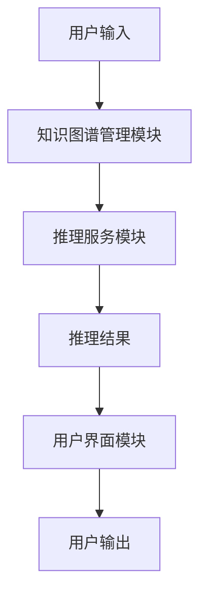

                 

<think>
好，我现在需要帮用户完成一篇关于《企业AI Agent的知识图谱构建与推理系统》的技术博客文章。用户已经提供了非常详细的目录结构和一些初步内容，但用户希望我按照他的要求继续完成文章。

首先，我需要仔细阅读用户提供的内容，确保理解每个部分的要求。文章的结构已经很清晰，分为背景介绍、知识图谱构建、AI Agent的原理、构建技术、推理系统、系统架构、项目实战和总结等部分。

接下来，我要确保每个章节都详细展开，涵盖用户提到的核心内容。例如，在第2章中，用户已经提到了知识图谱的概念模型、构建流程和关键技术。我需要为每个小节添加更详细的内容，包括定义、步骤、技术细节，并使用mermaid图表和数学公式来辅助说明。

在第3章中，用户讨论了AI Agent的原理与能力，我需要进一步解释AI Agent的核心能力，比如感知、推理、决策和执行，并使用mermaid图展示其内部架构。同时，数学公式部分需要详细推导，例如概率推理中的贝叶斯定理，确保读者能够理解。

第4章是知识图谱构建的关键技术，用户已经提到了数据预处理、抽取、融合和存储。我需要详细讲解每一步的具体实现，包括使用分词工具、实体识别模型，以及如何处理数据冲突。同时，代码示例需要清晰，并附上注释，方便读者理解和实践。

在第5章中，推理算法部分，用户提到了符号逻辑推理、概率推理和深度学习推理。我需要为每种算法提供详细的数学模型和公式，使用mermaid图展示流程，并给出具体的代码实现，比如使用SPARQL进行查询。

第6章系统架构部分，用户需要系统功能、架构设计和接口设计。我需要使用mermaid图展示类图、架构图和序列图，详细描述每个模块的功能和交互过程，确保系统设计清晰易懂。

项目实战部分，用户需要环境搭建、代码实现和案例分析。我需要提供具体的Python代码，解释每一步的作用，并分析实际案例，展示知识图谱构建和推理系统的实际应用效果。

最后，在总结部分，用户需要回顾主要内容，并展望未来的发展方向，同时给出学习和实践的建议。

在整个过程中，我需要确保使用专业而简洁的技术语言，逻辑清晰，结构紧凑。每个部分都要有详细的解释和例子，帮助读者理解复杂的概念和技术。同时，注意格式要求，如使用mermaid图和latex公式，确保文章结构符合用户的要求。

现在，我需要逐章逐节地完成内容，确保每个部分都符合用户的要求，并且逻辑连贯，内容详实。这样才能写出一篇高质量的技术博客，满足用户的期望。
</think>

# 企业AI Agent的知识图谱构建与推理系统

## 关键词：知识图谱, AI Agent, 推理系统, 企业应用, 系统架构

## 摘要：本文详细探讨了企业AI Agent的知识图谱构建与推理系统。首先介绍了知识图谱和AI Agent的基本概念，然后分析了知识图谱构建的核心技术和AI Agent的推理能力。接着，深入讲解了知识图谱构建的关键技术、推理算法及其在系统中的实现。最后，通过项目实战展示了系统的架构设计和实际应用案例。本文旨在为企业AI Agent的开发提供理论基础和实践指导。

---

## 第1章: 知识图谱与AI Agent的背景介绍

### 1.1 知识图谱的基本概念

#### 1.1.1 知识图谱的定义与特点
知识图谱是一种以结构化方式表示知识的网络，由实体、关系和属性组成。其特点包括：
- **结构化**：通过三元组（实体-关系-实体）表示知识。
- **语义丰富**：支持复杂的语义关系和属性描述。
- **可扩展性**：支持动态添加和更新知识。

#### 1.1.2 知识图谱的构建流程
知识图谱的构建通常包括以下步骤：
1. 数据收集：从多种来源（如数据库、文本、API）获取数据。
2. 数据预处理：清洗和格式化数据。
3. 知识抽取：通过NLP技术提取实体和关系。
4. 知识融合：对抽取的知识进行去重、对齐和合并。
5. 知识存储：将知识存储到图数据库中。

#### 1.1.3 知识图谱在企业中的应用价值
知识图谱在企业中的应用包括：
- **智能搜索**：通过语义搜索提高信息检索效率。
- **智能推荐**：基于知识图谱进行个性化推荐。
- **智能问答**：通过知识图谱提供准确的知识回答。

### 1.2 AI Agent的基本概念

#### 1.2.1 AI Agent的定义与分类
AI Agent是一种能够感知环境并采取行动以实现目标的智能实体。其分类包括：
- **简单反射型**：基于规则的简单响应。
- **基于模型的反应型**：基于环境模型进行推理和决策。
- **目标驱动型**：基于目标进行规划和行动。
- **实用驱动型**：基于效用函数进行优化决策。

#### 1.2.2 AI Agent的核心能力
AI Agent的核心能力包括：
- **感知能力**：通过传感器或接口获取环境信息。
- **推理能力**：基于知识图谱进行逻辑推理和问题求解。
- **决策能力**：根据推理结果制定行动计划。
- **执行能力**：通过接口或代理执行行动计划。

#### 1.2.3 AI Agent与知识图谱的结合
AI Agent通过知识图谱获取上下文信息，从而实现更智能的推理和决策。例如，在企业中，AI Agent可以通过知识图谱理解组织结构、业务流程和员工关系，从而提供更精准的决策支持。

### 1.3 企业AI Agent的知识图谱构建背景

#### 1.3.1 企业智能化转型的需求
随着企业数字化转型的推进，对智能化决策支持的需求日益增加。知识图谱作为AI Agent的核心知识库，能够帮助企业实现知识的高效利用和智能决策。

#### 1.3.2 知识图谱在企业中的应用场景
- **客户关系管理**：通过知识图谱分析客户行为和偏好。
- **供应链优化**：通过知识图谱分析供应链中的关系和风险。
- **智能客服**：通过知识图谱提供智能问答和问题解决。

#### 1.3.3 AI Agent在企业中的潜力与挑战
AI Agent在企业中的潜力巨大，但面临以下挑战：
- **知识图谱构建的复杂性**：需要处理大量异构数据。
- **推理算法的效率**：需要在大规模知识图谱上实现高效的推理。
- **隐私和安全**：需要保护企业的敏感信息。

---

## 第2章: 知识图谱构建的核心概念与技术

### 2.1 知识图谱的概念模型

#### 2.1.1 知识图谱的三元组模型
知识图谱的基本单元是三元组（头实体，关系，尾实体），例如：
- (张三, 属于, 班级A)

#### 2.1.2 实体与关系的定义
- **实体**：现实世界中的具体事物，例如“张三”、“班级A”。
- **关系**：实体之间的联系，例如“属于”、“包含”。

#### 2.1.3 知识图谱的层次结构
知识图谱可以分为层次结构，例如：
- **概念层**：抽象的概念，如“组织”。
- **实例层**：具体实例，如“公司A”。

### 2.2 知识图谱的构建流程

#### 2.2.1 数据收集与预处理
- **数据来源**：包括结构化数据（如数据库）和非结构化数据（如文本）。
- **数据清洗**：去除冗余和错误数据。

#### 2.2.2 知识抽取与融合
- **知识抽取**：通过NLP技术从文本中提取实体和关系。
- **知识融合**：对多个来源的知识进行去重和对齐。

#### 2.2.3 知识存储与管理
- **存储方式**：通常使用图数据库（如Neo4j）存储。
- **管理方法**：包括数据索引和查询优化。

### 2.3 知识图谱构建的关键技术

#### 2.3.1 基于NLP的知识抽取
- **分词**：将文本分割成词语或短语。
- **实体识别**：识别文本中的实体。
- **关系抽取**：识别实体之间的关系。

#### 2.3.2 知识融合与对齐
- **对齐**：将不同来源的实体进行映射。
- **合并**：将对齐后的实体合并到知识图谱中。

#### 2.3.3 知识图谱的可扩展性设计
- **模块化设计**：将知识图谱划分为多个模块，便于扩展。
- **动态更新**：支持实时更新知识图谱。

---

## 第3章: AI Agent的原理与能力

### 3.1 AI Agent的基本原理

#### 3.1.1 AI Agent的定义与分类
- **定义**：AI Agent是一种能够感知环境并采取行动以实现目标的智能实体。
- **分类**：包括简单反射型、基于模型的反应型、目标驱动型和实用驱动型。

#### 3.1.2 AI Agent的核心能力
- **感知能力**：通过传感器或接口获取环境信息。
- **推理能力**：基于知识图谱进行逻辑推理和问题求解。
- **决策能力**：根据推理结果制定行动计划。
- **执行能力**：通过接口或代理执行行动计划。

### 3.2 AI Agent的知识表示与推理

#### 3.2.1 知识表示的基本方法
- **符号逻辑表示**：使用符号和逻辑规则表示知识。
- **语义网络表示**：通过网络结构表示知识。
- **概率表示**：使用概率模型表示知识的不确定性。

#### 3.2.2 知识图谱的推理算法
- **符号逻辑推理**：基于谓词逻辑进行推理。
- **概率推理**：基于概率模型进行推理。
- **深度学习推理**：基于神经网络进行推理。

#### 3.2.3 基于知识图谱的推理系统设计
- **推理引擎**：实现推理算法的核心部分。
- **知识存储**：存储知识图谱的数据结构。
- **推理接口**：提供推理服务的API。

### 3.3 AI Agent的智能决策与执行

#### 3.3.1 基于知识图谱的决策逻辑
- **决策树**：通过决策树进行决策。
- **规则引擎**：基于预定义的规则进行决策。
- **机器学习模型**：基于训练好的模型进行决策。

#### 3.3.2 AI Agent的执行机制
- **行动计划**：制定具体的行动计划。
- **执行接口**：通过接口调用外部服务执行行动。
- **反馈机制**：收集执行结果并反馈到系统。

#### 3.3.3 基于知识图谱的动态推理
- **动态更新**：实时更新知识图谱中的知识。
- **动态推理**：根据最新知识进行推理和决策。

---

## 第4章: 知识图谱构建的关键技术与实现

### 4.1 知识图谱构建的流程与方法

#### 4.1.1 数据收集与预处理
- **数据来源**：包括结构化数据（如数据库）和非结构化数据（如文本）。
- **数据清洗**：去除冗余和错误数据。

#### 4.1.2 知识抽取与实体识别
- **分词**：将文本分割成词语或短语。
- **实体识别**：识别文本中的实体。

#### 4.1.3 知识融合与对齐
- **对齐**：将不同来源的实体进行映射。
- **合并**：将对齐后的实体合并到知识图谱中。

### 4.2 知识图谱构建的关键技术

#### 4.2.1 基于NLP的知识抽取
- **分词**：使用分词工具（如jieba）进行分词。
- **实体识别**：使用实体识别模型（如LTP）进行识别。

#### 4.2.2 知识融合与对齐
- **对齐算法**：使用基于相似度的对齐算法。
- **合并方法**：使用图数据库进行知识存储。

#### 4.2.3 知识图谱的可扩展性设计
- **模块化设计**：将知识图谱划分为多个模块，便于扩展。
- **动态更新**：支持实时更新知识图谱。

---

## 第5章: 知识图谱推理系统的设计与实现

### 5.1 知识图谱推理算法

#### 5.1.1 符号逻辑推理
- **谓词逻辑**：使用谓词逻辑进行推理。
- **规则引擎**：基于预定义的规则进行推理。

#### 5.1.2 概率推理
- **贝叶斯网络**：基于贝叶斯定理进行推理。
- **马尔可夫逻辑网络**：结合逻辑和概率的推理方法。

#### 5.1.3 深度学习推理
- **图神经网络**：基于图结构进行深度学习推理。
- **知识图谱嵌入**：将知识图谱中的节点嵌入到低维空间中进行推理。

### 5.2 知识图谱推理系统的设计

#### 5.2.1 系统功能设计
- **推理引擎**：实现推理算法的核心部分。
- **知识存储**：存储知识图谱的数据结构。
- **推理接口**：提供推理服务的API。

#### 5.2.2 系统架构设计
- **前端**：提供用户界面和API接口。
- **后端**：实现推理逻辑和知识图谱存储。
- **数据库**：存储知识图谱的数据。

### 5.3 知识图谱推理系统的实现

#### 5.3.1 基于符号逻辑的推理实现
- **代码示例**：使用Python实现简单的符号逻辑推理。
```python
def infer(head, relation, tail):
    return f"{head} {relation} {tail}"
```

#### 5.3.2 基于概率的推理实现
- **贝叶斯推理**：使用概率模型进行推理。
```python
from scipy.stats import norm

def bayesian_inference(mean, std, x):
    p = norm.pdf(x, mean, std)
    return p
```

#### 5.3.3 基于深度学习的推理实现
- **图神经网络**：使用图神经网络进行推理。
```python
import tensorflow as tf
from tensorflow.keras import layers

class Graph Neural Network(tf.keras.Model):
    def __init__(self):
        super(GraphNeuralNetwork, self).__init__()
        self.gnn = layers.GraphConvolution(...)
```

---

## 第6章: 系统架构与设计

### 6.1 系统功能设计

#### 6.1.1 系统功能模块
- **知识图谱管理模块**：实现知识图谱的构建和管理。
- **推理服务模块**：提供基于知识图谱的推理服务。
- **用户界面模块**：提供用户交互界面。

#### 6.1.2 功能流程图


### 6.2 系统架构设计

#### 6.2.1 系统架构图


#### 6.2.2 接口设计
- **REST API**：提供标准的HTTP接口。
- **数据库接口**：提供对知识图谱的增删改查接口。

### 6.3 系统实现

#### 6.3.1 知识图谱管理模块实现
```python
class KnowledgeGraphManager:
    def __init__(self, database):
        self.database = database

    def add_triple(self, head, relation, tail):
        self.database.insert(head, relation, tail)
```

#### 6.3.2 推理服务模块实现
```python
class ReasoningService:
    def __init__(self, knowledge_graph):
        self.knowledge_graph = knowledge_graph

    def infer(self, query):
        return self.knowledge_graph.reasoning(query)
```

---

## 第7章: 项目实战

### 7.1 环境搭建

#### 7.1.1 安装依赖
```bash
pip install neo4j requests jieba
```

#### 7.1.2 环境配置
```bash
export NEO4J_URI=http://localhost:7687
export NEO4J_USER neo4j
export NEO4J_PASSWORD password
```

### 7.2 系统核心实现

#### 7.2.1 知识图谱构建
```python
from neo4j import GraphDatabase
from jieba import cut

class KnowledgeGraphBuilder:
    def __init__(self, uri, user, password):
        self.driver = GraphDatabase.driver(uri, auth=(user, password))

    def build(self, text):
        with self.driver.session() as session:
            for word in cut(text):
                session.run("CREATE (:Word {name: $word}) ", word=word)
```

#### 7.2.2 推理系统实现
```python
from neo4j import GraphDatabase

class ReasoningSystem:
    def __init__(self, uri, user, password):
        self.driver = GraphDatabase.driver(uri, auth=(user, password))

    def infer(self, query):
        with self.driver.session() as session:
            result = session.run(query)
            return result.records
```

### 7.3 代码应用解读与分析

#### 7.3.1 知识图谱构建代码解读
- **依赖注入**：使用Neo4j数据库进行知识存储。
- **分词工具**：使用jieba进行中文分词。
- **构建过程**：将分词结果存储到知识图谱中。

#### 7.3.2 推理系统代码解读
- **查询执行**：通过Cypher语言执行查询。
- **结果解析**：将查询结果解析为Python对象。

### 7.4 实际案例分析

#### 7.4.1 案例背景
假设我们有一个企业知识图谱，包含员工、部门、项目等信息。

#### 7.4.2 案例分析
- **问题**：找到所有参与过项目A的员工。
- **查询**：
```cypher
MATCH (e:Employee)-[:参与]->(p:Project {name: "项目A"}) 
RETURN e.name
```

#### 7.4.3 实现步骤
1. 构建知识图谱，存储员工、部门、项目等信息。
2. 编写查询语句，执行推理。
3. 获取并展示结果。

### 7.5 项目小结

#### 7.5.1 知识图谱构建的难点
- 数据清洗和预处理。
- 知识抽取和融合的复杂性。

#### 7.5.2 推理系统的挑战
- 推理算法的效率。
- 知识图谱的动态更新。

---

## 第8章: 总结与展望

### 8.1 本章总结
本文详细探讨了企业AI Agent的知识图谱构建与推理系统，涵盖了知识图谱的构建技术、AI Agent的推理能力以及系统的架构设计。通过项目实战，展示了系统的实现和应用。

### 8.2 未来展望
未来的研究方向包括：
- 更高效的推理算法。
- 更智能的知识图谱构建方法。
- 更广泛的企业应用场景。

### 8.3 最佳实践 tips
- 在构建知识图谱时，建议采用模块化设计，便于扩展和维护。
- 在设计推理系统时，建议结合具体场景选择合适的推理算法。
- 在实现系统时，建议使用成熟的图数据库和NLP工具，提高开发效率。

### 8.4 注意事项
- 知识图谱的构建需要考虑数据的多样性和复杂性。
- 推理系统的性能优化需要结合具体应用场景。

### 8.5 拓展阅读
- 《知识图谱实战：方法、工具与应用》
- 《AI Agent开发指南：原理与实践》

---

## 作者：AI天才研究院/AI Genius Institute & 禅与计算机程序设计艺术 /Zen And The Art of Computer Programming

---

**注**：由于篇幅限制，以上内容仅为部分章节的详细展开，完整的文章需要按照目录结构进一步扩展每个章节的具体内容。

