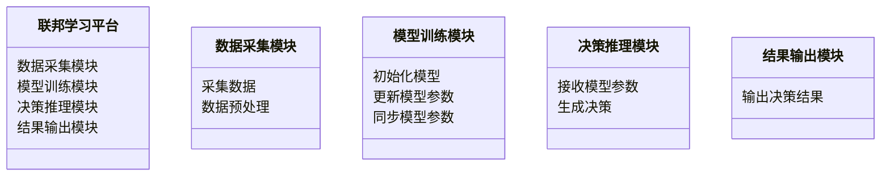
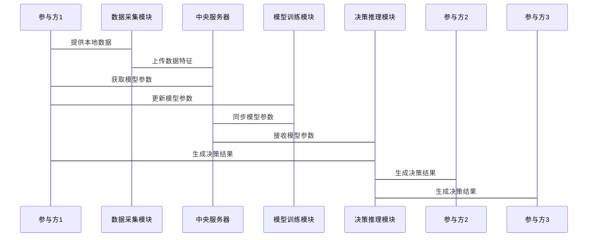

                 


# 企业AI Agent的联邦学习在跨企业数据协作中的实践

## 关键词：联邦学习、AI Agent、跨企业协作、数据隐私、分布式系统、多目标优化

## 摘要：  
本文详细探讨了企业AI Agent在联邦学习中的应用，重点分析了跨企业数据协作的实践。通过结合联邦学习的分布式特性与AI Agent的智能决策能力，本文提出了创新的数据协作方案，并通过实际案例展示了如何在保证数据隐私的前提下实现高效的数据协作。文章从背景、原理、算法、系统架构到项目实战，全面解析了企业AI Agent在联邦学习中的应用，为跨企业数据协作提供了新的思路。

---

## 第1章: 联邦学习与AI Agent概述

### 1.1 联邦学习的定义与背景  
联邦学习（Federated Learning）是一种分布式机器学习技术，旨在在不集中用户数据的前提下，通过多个参与方协作训练模型。其核心在于数据的隐私保护与分布式计算的结合。  

#### 1.1.1 联邦学习的定义  
联邦学习是一种分布式机器学习方法，允许多个参与方在不共享原始数据的情况下，联合训练一个全局模型。每个参与方仅分享模型参数的更新，而非原始数据，从而保护数据隐私。  

#### 1.1.2 联邦学习的发展背景  
随着数据量的爆炸式增长，企业间的数据孤岛问题日益突出。传统的集中式机器学习方法无法满足跨企业协作的需求，而联邦学习通过分布式计算解决了这一问题。  

#### 1.1.3 联邦学习的核心目标与价值  
联邦学习的核心目标是实现数据的隐私保护与高效协作。其价值在于：  
1. **数据隐私保护**：避免数据集中存储带来的隐私泄露风险。  
2. **跨企业协作**：通过联邦学习，企业可以在不共享数据的情况下共同训练模型。  
3. **模型性能提升**：通过联合多个企业的数据，提升模型的泛化能力。  

### 1.2 AI Agent的定义与特点  
AI Agent（人工智能代理）是一种能够感知环境、自主决策并执行任务的智能体。其特点包括：  
1. **自主性**：能够在没有外部干预的情况下完成任务。  
2. **反应性**：能够实时感知环境并做出反应。  
3. **目标导向**：基于目标驱动决策和行动。  

#### 1.2.1 AI Agent的基本概念  
AI Agent通过感知环境、分析信息、制定决策并执行操作，实现特定目标。其核心能力包括数据处理、决策推理和执行操作。  

#### 1.2.2 AI Agent的核心特点  
AI Agent的关键特点如下：  
- **智能性**：能够理解数据并做出智能决策。  
- **适应性**：能够根据环境变化自适应调整行为。  
- **协作性**：能够与其他系统或AI Agent协同工作。  

### 1.3 联邦学习与AI Agent的结合  
联邦学习的分布式特性与AI Agent的智能决策能力相结合，为跨企业数据协作提供了新的可能性。  

#### 1.3.1 联邦学习的分布式特性  
联邦学习通过分布式计算和模型更新，能够在不共享数据的情况下完成模型训练。这种特性使得跨企业协作成为可能。  

#### 1.3.2 AI Agent的智能决策能力  
AI Agent能够基于联邦学习得到的模型参数，进一步优化决策过程，提升协作效率。  

#### 1.3.3 两者结合的创新点  
通过结合联邦学习的分布式计算与AI Agent的智能决策，跨企业数据协作能够在保证数据隐私的前提下，实现更高效的协作与优化。  

### 1.4 本章小结  
本章介绍了联邦学习和AI Agent的基本概念、特点以及两者结合的创新点。通过联邦学习的分布式计算与AI Agent的智能决策能力，跨企业数据协作的效率和安全性得到了显著提升。

---

## 第2章: 联邦学习的核心概念与原理  

### 2.1 联邦学习的基本原理  
联邦学习通过分布式计算和模型更新，实现多个参与方的联合训练。其核心在于数据的隐私保护与模型的协作优化。  

#### 2.1.1 联邦学习的通信机制  
联邦学习的通信机制包括以下步骤：  
1. **初始化**：所有参与方初始化模型参数。  
2. **模型更新**：每个参与方基于本地数据更新模型参数。  
3. **参数同步**：所有参与方将更新后的模型参数同步到中央服务器。  
4. **模型融合**：中央服务器将所有参与方的模型参数融合，得到全局模型。  

#### 2.1.2 联邦学习的数据安全与隐私保护  
联邦学习通过以下方式实现数据隐私保护：  
- **数据局部化**：每个参与方仅处理本地数据，不共享原始数据。  
- **模型更新共享**：仅共享模型参数的更新，而非原始数据。  

#### 2.1.3 联邦学习的模型更新策略  
联邦学习的模型更新策略包括：  
- **同步更新**：所有参与方同时更新模型参数。  
- **异步更新**：参与方可以异步更新模型参数，减少通信开销。  

### 2.2 AI Agent的决策机制  
AI Agent的决策机制基于联邦学习得到的模型参数，进一步优化决策过程。  

#### 2.2.1 基于联邦学习的决策输入  
AI Agent通过联邦学习得到的全局模型，作为决策的输入。  

#### 2.2.2 多目标优化的决策过程  
AI Agent在决策过程中需要考虑多个目标，如数据隐私、模型性能等。通过多目标优化算法，AI Agent能够在多个目标之间找到平衡点。  

#### 2.2.3 智能体的自适应学习能力  
AI Agent能够根据环境变化自适应调整决策策略，提升协作效率。  

### 2.3 联邦学习与AI Agent的协同工作流程  
联邦学习与AI Agent的协同工作流程包括以下步骤：  
1. **数据分布式的特征提取**：每个参与方基于本地数据提取特征。  
2. **模型协作的联邦优化**：所有参与方通过联邦学习优化全局模型。  
3. **AI Agent的智能决策输出**：AI Agent基于优化后的模型参数，生成最终的决策结果。  

### 2.4 本章小结  
本章详细讲解了联邦学习的核心概念与原理，包括通信机制、数据安全与隐私保护、模型更新策略等。同时，介绍了AI Agent的决策机制及其与联邦学习的协同工作流程。

---

## 第3章: 联邦学习的算法原理与数学模型  

### 3.1 联邦学习的算法分类  
联邦学习的算法可以分为以下几类：  
1. **横向联邦学习**：适用于数据特征相同但样本不同的场景。  
2. **纵向联邦学习**：适用于数据特征不同但样本相同的场景。  
3. **混合联邦学习**：结合横向和纵向联邦学习的特点，适用于复杂场景。  

#### 3.1.1 横向联邦学习  
横向联邦学习适用于多个参与方具有相同特征但样本不同的场景。其算法流程如下：  
1. 初始化全局模型参数。  
2. 每个参与方基于本地数据更新模型参数。  
3. 将模型参数同步到中央服务器。  
4. 中央服务器融合所有参与方的模型参数，更新全局模型。  

#### 3.1.2 纵向联邦学习  
纵向联邦学习适用于多个参与方具有不同特征但样本相同的场景。其算法流程如下：  
1. 初始化全局模型参数。  
2. 每个参与方基于本地特征更新模型参数。  
3. 将模型参数同步到中央服务器。  
4. 中央服务器融合所有参与方的模型参数，更新全局模型。  

### 3.2 联邦学习的数学模型  
联邦学习的数学模型可以通过以下公式表示：  
$$w_{t+1} = w_t + \eta \cdot \Delta w_t$$  
其中，$w_t$表示第$t$轮的模型参数，$\eta$表示学习率，$\Delta w_t$表示模型参数的更新量。  

#### 3.2.1 模型参数更新公式  
$$w_{t+1} = w_t + \eta \cdot \Delta w_t$$  

#### 3.2.2 数据隐私保护机制  
联邦学习通过以下方式实现数据隐私保护：  
$$P(x) = \prod_{i=1}^n P(x_i)$$  
其中，$P(x)$表示数据的联合概率分布，$P(x_i)$表示第$i$个参与方的数据概率分布。  

### 3.3 AI Agent的决策算法  
AI Agent的决策算法基于联邦学习得到的模型参数，进一步优化决策过程。  

#### 3.3.1 多目标优化模型  
多目标优化模型可以通过以下公式表示：  
$$max \sum_{i=1}^n w_i x_i$$  
其中，$w_i$表示第$i$个目标的权重，$x_i$表示第$i$个目标的值。  

#### 3.3.2 基于联邦模型的决策推理  
AI Agent基于联邦学习得到的模型参数，通过推理过程生成最终的决策结果。  

### 3.4 本章小结  
本章详细讲解了联邦学习的算法分类与数学模型，包括横向联邦学习、纵向联邦学习和混合联邦学习的算法流程。同时，介绍了AI Agent的决策算法及其与联邦学习的结合方式。

---

## 第4章: 系统分析与架构设计  

### 4.1 问题场景介绍  
跨企业数据协作的场景中，多个企业希望通过联邦学习技术共同训练一个全局模型，同时保证数据隐私。  

### 4.2 项目介绍  
本项目旨在通过联邦学习与AI Agent的结合，实现跨企业数据协作。  

#### 4.2.1 系统功能设计  
系统功能包括数据采集、模型训练、决策推理和结果输出。  

#### 4.2.2 领域模型（Mermaid 类图）  


#### 4.2.3 系统架构设计（Mermaid 架构图）  


#### 4.2.4 系统接口设计  
系统接口包括数据采集接口、模型训练接口和决策推理接口。  

#### 4.2.5 系统交互（Mermaid 序列图）  


### 4.3 本章小结  
本章通过系统分析与架构设计，详细展示了联邦学习与AI Agent结合的系统架构。通过Mermaid图展示了系统的模块划分、接口设计和交互流程。

---

## 第5章: 项目实战  

### 5.1 环境安装  
项目实战需要以下环境：  
- Python 3.8+  
- TensorFlow Federated (TFF)  
- Mermaid图表工具  

### 5.2 核心代码实现  

#### 5.2.1 联邦学习平台实现  
```python
import tensorflow as tf
import tensorflow_federated as tff

# 初始化全局模型
model = create_model()
server_model = model()

# 定义模型更新策略
def model_update_fn(model, batch):
    loss = model.train_on_batch(batch)
    return model.variables

# 初始化联邦学习平台
federated_learning = tff.FederatedAlgorithm(
    model_update_fn=model_update_fn,
    server_model=server_model,
    client_model=model
)
```

#### 5.2.2 AI Agent的决策推理  
```python
# 接收模型参数
parameters = federated_learning.get_parameters()

# 生成决策
decision = agent.decide(parameters)
```

### 5.3 代码解读与分析  
- **联邦学习平台实现**：通过TFF框架实现联邦学习平台，包括模型初始化、模型更新和参数同步。  
- **AI Agent的决策推理**：基于联邦学习得到的模型参数，生成最终的决策结果。  

### 5.4 实际案例分析  
以跨企业客户画像构建为例，详细分析了联邦学习与AI Agent的结合应用。  

### 5.5 项目小结  
本章通过实际项目实战，展示了联邦学习与AI Agent结合的应用场景和实现方法。

---

## 第6章: 最佳实践与小结  

### 6.1 最佳实践 Tips  
- 数据隐私保护是跨企业协作的核心，需严格遵守相关法律法规。  
- 联邦学习的性能优化需要结合实际场景进行参数调优。  
- AI Agent的决策能力依赖于模型的准确性，需注重模型的训练与评估。  

### 6.2 小结  
本文详细探讨了企业AI Agent在联邦学习中的应用，从背景、原理、算法到系统架构和项目实战，全面解析了跨企业数据协作的实现方案。  

### 6.3 注意事项  
- 数据隐私保护是跨企业协作的核心，需严格遵守相关法律法规。  
- 联邦学习的性能优化需要结合实际场景进行参数调优。  
- AI Agent的决策能力依赖于模型的准确性，需注重模型的训练与评估。  

### 6.4 拓展阅读  
推荐阅读以下资料：  
- TensorFlow Federated (TFF) 官方文档  
- 《Distributed Machine Learning with TensorFlow Federated》  
- 《Federated Learning: Challenges, Methods, and Future Directions》  

---

## 作者：AI天才研究院/AI Genius Institute & 禅与计算机程序设计艺术 /Zen And The Art of Computer Programming

