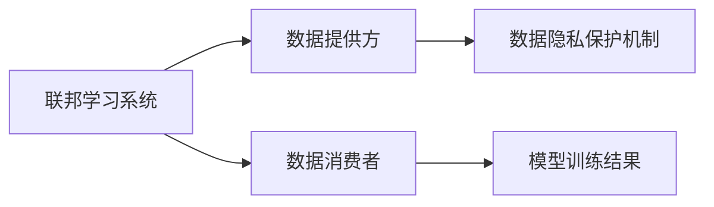
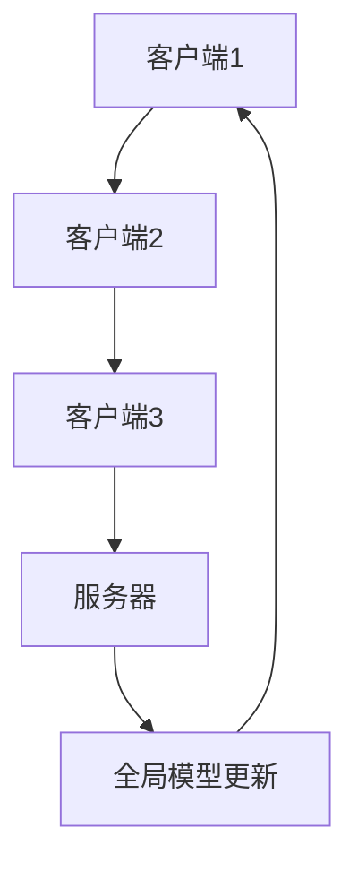
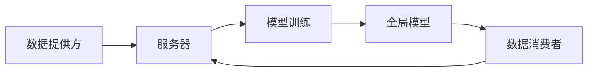

                 


# 企业AI Agent的联邦学习在跨部门数据协作中的实践

> **关键词**：联邦学习，跨部门数据协作，企业AI Agent，数据隐私，协作机制

> **摘要**：  
本文详细探讨了联邦学习在企业跨部门数据协作中的应用，通过分析其核心概念、算法原理和系统架构，结合实际案例，展示了如何利用联邦学习实现数据隐私保护下的高效协作。文章内容包括背景介绍、核心概念、算法实现、系统设计、项目实战和总结展望，为读者提供全面而深入的技术解读。

---

## 第一部分：企业AI Agent与联邦学习概述

### 第1章：企业AI Agent与联邦学习的背景介绍

#### 1.1 问题背景与问题描述  
企业在数字化转型中，各部门积累了大量数据，但由于数据孤岛问题，这些数据难以有效整合和利用。跨部门协作需要共享数据，但数据隐私和安全问题成为主要障碍。  

#### 1.2 联邦学习的提出与目标  
联邦学习是一种分布式机器学习技术，通过在数据源端进行模型训练，避免数据集中化，保护数据隐私。其目标是实现数据可用性最大化的同时，确保数据安全与隐私。

#### 1.3 核心概念结构  
- **数据提供方**：拥有数据的部门或系统。  
- **数据消费者**：需要数据进行模型训练的部门或系统。  
- **服务器**：协调联邦学习过程的中心节点。  
- **数据隐私保护机制**：如同态加密、差分隐私等。

---

## 第二部分：联邦学习的核心概念与原理

### 第2章：联邦学习的核心概念与联系

#### 2.1 联邦学习的原理  
联邦学习通过分布式训练，客户端（数据提供方）在本地数据上训练模型，只上传模型参数更新到服务器，服务器将所有客户端的更新汇总，形成全局模型。

#### 2.2 核心概念对比表  
| 概念                | 联邦学习                  | 分布式学习                |
|---------------------|--------------------------|--------------------------|
| 数据共享           | 不共享数据，只共享模型更新| 数据可能共享             |
| 数据隐私           | 高                     | 较低                     |
| 网络通信           | 低                     | 高                     |

#### 2.3 实体关系图  


---

## 第三部分：联邦学习的算法原理

### 第3章：联邦学习算法的实现

#### 3.1 联邦平均算法（FedAvg）

**算法流程图**  


**算法实现代码**  
```python
def fed_avg(client_models):
    avg_model = {}
    for layer in client_models[0].keys():
        avg_model[layer] = sum([model[layer] for model in client_models])/len(client_models)
    return avg_model
```

**数学模型与公式**  
- 算法公式：  
$$ \theta_{server} = \frac{1}{n}\sum_{i=1}^{n}\theta_{client_i} $$
- 更新公式：  
$$ \theta_{client_i}^{new} = \theta_{client_i} - \eta (\nabla L_i(\theta_{client_i})) $$

---

## 第四部分：系统架构与设计

### 第4章：跨部门数据协作系统的架构设计

#### 4.1 系统功能设计  
- **数据提供方**：负责本地数据训练，上传模型更新。  
- **数据消费者**：请求全局模型，进行预测或进一步训练。  
- **服务器**：协调客户端训练，汇总模型参数。

#### 4.2 系统架构图  


---

## 第五部分：项目实战与案例分析

### 第5章：企业AI Agent的联邦学习实战

#### 5.1 环境安装  
- 安装必要的依赖：`pip install fedlearn`。

#### 5.2 核心实现代码  
```python
import fedlearn

# 初始化服务器
server = fedlearn.Server()

# 初始化客户端
client1 = fedlearn.Client(data_set='sales')
client2 = fedlearn.Client(data_set='marketing')

# 启动联邦学习过程
server.start_training([client1, client2])

# 获取全局模型
global_model = server.get_global_model()
```

#### 5.3 案例分析  
以销售和营销部门的数据协作为例，展示如何通过联邦学习提升客户预测模型的准确性，同时保护各部门的数据隐私。

---

## 第六部分：总结与展望

### 第6章：总结与未来展望

#### 6.1 核心内容回顾  
- 联邦学习的核心原理。  
- 跨部门数据协作的实际应用。  
- 数据隐私保护的重要性。

#### 6.2 未来展望  
- 更高效的联邦学习算法。  
- 更广泛的应用场景。  
- 数据隐私保护技术的进一步发展。

#### 6.3 最佳实践Tips  
- 确保数据提供方的数据质量。  
- 定期更新模型以适应数据变化。  
- 加强数据隐私保护机制的监控与维护。

---

## 结语

企业AI Agent的联邦学习为跨部门数据协作提供了新的解决方案。通过分布式训练和数据隐私保护，企业可以在不泄露数据的情况下，实现高效的数据协作和模型训练。未来，随着技术的不断发展，联邦学习将在更多领域发挥重要作用。

---

**作者：AI天才研究院/AI Genius Institute & 禅与计算机程序设计艺术 /Zen And The Art of Computer Programming**

