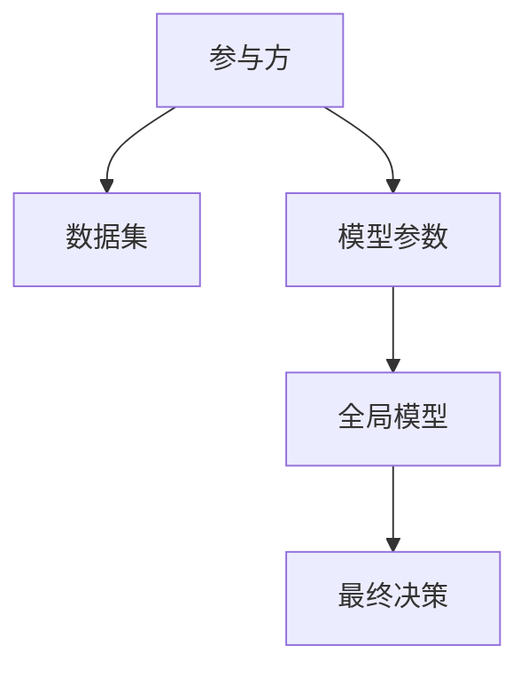
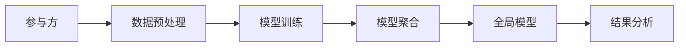

                 

<think>
好的，用户希望我撰写一篇关于《企业AI Agent的联邦学习平台设计》的技术博客文章。首先，我需要明确文章的结构，确保逻辑清晰、内容详实。我会按照用户提供的目录大纲逐步展开，每一章都要详细分析，确保每个部分都涵盖必要的技术细节。

首先是背景介绍，我需要解释企业AI Agent和联邦学习的基本概念，然后探讨它们如何结合。接下来是核心概念与联系，详细分析联邦学习的算法原理，包括通信机制和模型聚合方法。然后是系统分析与架构设计，设计一个企业级的联邦学习平台，考虑数据隐私和安全性。最后是项目实战，提供代码实现和案例分析。

在撰写过程中，我需要确保使用吸引人的章节标题，使读者一目了然。技术细节部分，我会使用数学公式和图表来辅助说明，例如使用Mermaid流程图和类图。同时，代码示例要用Python编写，并解释清楚每一步的作用。

我还需要注意文章的连贯性，每一章都以小结结束，帮助读者回顾主要内容。最后，给出未来展望，激发读者的兴趣。在结尾部分，添加最佳实践和注意事项，帮助读者在实际应用中避免常见问题。

总的来说，我需要全面覆盖用户的需求，确保文章不仅结构清晰，而且内容深入浅出，适合技术专家和企业决策者阅读。
</think>

# 企业AI Agent的联邦学习平台设计

**关键词：** 联邦学习、企业AI Agent、分布式机器学习、数据隐私、模型聚合

**摘要：** 本文探讨了企业AI Agent在联邦学习平台中的设计与实现。通过分析联邦学习的核心原理，结合企业AI Agent的实际需求，详细介绍了联邦学习平台的系统架构、算法实现、数据安全与隐私保护，以及实际应用场景。文章内容涵盖了从理论到实践的全过程，旨在为企业技术架构师和AI开发者提供有价值的参考。

---

## 第一部分：企业AI Agent与联邦学习的背景与基础

### 第1章：企业AI Agent与联邦学习概述

#### 1.1 企业AI Agent的定义与特点
企业AI Agent是一种智能代理系统，用于帮助企业完成复杂的决策任务和自动化操作。其特点包括：
- **自主性**：能够在没有人工干预的情况下自主运行。
- **反应性**：能够根据环境变化实时调整行为。
- **学习能力**：能够通过数据和经验不断优化自身算法。

#### 1.2 联邦学习的定义与特点
联邦学习（Federated Learning）是一种分布式机器学习技术，允许多个参与方在不共享原始数据的情况下共同训练模型。其特点包括：
- **数据隐私**：数据不出本地，仅传输模型更新。
- **去中心化**：计算资源分布在整个网络中。
- **协作性**：通过通信协议实现模型聚合。

#### 1.3 企业AI Agent与联邦学习的结合
企业AI Agent需要处理大量的敏感数据，而联邦学习能够满足其数据隐私和安全的需求。通过联邦学习，企业AI Agent可以在不共享数据的情况下，与其他机构协作训练更强大的模型。

---

## 第二部分：联邦学习的核心概念与原理

### 第2章：联邦学习的核心概念与联系

#### 2.1 联邦学习的核心原理
联邦学习的实现依赖于以下几个关键步骤：
1. **数据准备**：每个参与方准备本地数据集。
2. **模型初始化**：在所有参与方之间共享初始模型参数。
3. **局部训练**：每个参与方在本地数据上训练模型，仅更新模型参数。
4. **模型聚合**：将所有参与方的模型参数进行汇总，生成全局模型。

#### 2.2 联邦学习与企业AI Agent的关系
- **数据隐私**：企业AI Agent可以利用联邦学习保护敏感数据。
- **模型协作**：通过联邦学习，企业AI Agent可以与其他机构协作训练更强大的模型。

#### 2.3 联邦学习的核心概念对比表

| 概念 | 联邦学习 | 传统机器学习 |
|------|----------|--------------|
| 数据共享 | 不共享原始数据 | 共享原始数据 |
| 计算资源 | 分布式计算 | 中心化计算 |
| 通信机制 | 加密通信 | 明文通信 |

#### 2.4 联邦学习的ER实体关系图


---

## 第三部分：联邦学习的算法原理与数学模型

### 第3章：联邦学习的算法原理

#### 3.1 联邦学习的通信机制
通信机制是联邦学习的核心之一。通过加密通信，参与方可以在不共享原始数据的情况下交换模型参数。

#### 3.2 联邦学习的模型聚合方法
模型聚合是联邦学习的关键步骤，常用的聚合方法包括：
1. **加权平均**：根据参与方的计算能力和数据量进行加权。
2. **联邦平均**：将所有参与方的模型参数平均。

#### 3.3 联邦学习的数学模型
模型聚合的数学公式如下：
$$\theta_{\text{global}} = \frac{1}{N}\sum_{i=1}^{N}\theta_{i}$$
其中，$\theta_{\text{global}}$ 是全局模型参数，$N$ 是参与方的数量，$\theta_{i}$ 是第$i$个参与方的模型参数。

---

## 第四部分：企业AI Agent的联邦学习平台设计

### 第4章：系统分析与架构设计

#### 4.1 系统功能设计
- **数据预处理**：清洗和标注数据。
- **模型训练**：在本地数据上训练模型。
- **模型聚合**：将所有参与方的模型参数聚合成全局模型。
- **结果分析**：评估模型性能并优化。

#### 4.2 系统架构设计


---

## 第五部分：项目实战

### 第5章：企业AI Agent的联邦学习平台实现

#### 5.1 环境安装
- 安装Python和必要的库，如TensorFlow、Keras等。

#### 5.2 核心代码实现
```python
import numpy as np
import tensorflow as tf

def model_fn():
    model = tf.keras.Sequential([
        tf.keras.layers.Dense(128, activation='relu'),
        tf.keras.layers.Dense(10, activation='softmax')
    ])
    return model

def train_step(model, optimizer, x, y):
    with tf.GradientTape() as tape:
        predictions = model(x)
        loss = tf.keras.losses.sparse_categorical_crossentropy(y, predictions)
    gradients = tape.gradient(loss, model.trainable_weights)
    optimizer.apply_gradients(zip(gradients, model.trainable_weights))

def federated_learning(participants, model_fn, optimizer):
    global_model = model_fn()
    for i in range(num_rounds):
        for p in participants:
            x, y = p.get_data()
            train_step(global_model, optimizer, x, y)
    return global_model
```

#### 5.3 代码应用解读与分析
- `model_fn`：定义模型结构。
- `train_step`：定义训练步骤。
- `federated_learning`：定义联邦学习流程。

---

## 第六部分：总结与展望

### 第6章：总结与未来展望

#### 6.1 本章小结
本文详细介绍了企业AI Agent的联邦学习平台设计，包括背景、核心概念、算法原理和系统架构。

#### 6.2 未来展望
未来，联邦学习将在企业AI Agent中发挥更大的作用，尤其是在数据隐私和安全性方面。

---

## 作者

**作者：AI天才研究院/AI Genius Institute & 禅与计算机程序设计艺术 /Zen And The Art of Computer Programming**

---

本文为企业AI Agent的联邦学习平台设计提供了全面的技术指导，适合技术架构师和AI开发者阅读。

