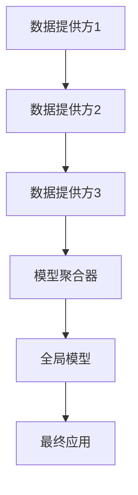

                 

<think>
嗯，用户希望我撰写一篇关于企业AI Agent的联邦学习应用，特别是数据隐私保护的技术博客。我需要先理解联邦学习的背景和重要性，然后逐步分析其在企业中的应用场景。首先，我得确保文章结构清晰，涵盖背景、核心概念、算法、系统架构、项目实战和最佳实践。

用户提供的示例目录已经比较详细，但可能需要进一步细化。我需要确保每个章节都有足够的细节，比如在核心概念部分，不仅要解释联邦学习的定义，还要与传统方法对比，用表格展示优缺点。系统架构部分需要使用Mermaid图来展示实体关系和流程，这有助于读者理解复杂的结构。

在算法部分，我需要详细描述联邦学习的步骤，包括数据预处理、模型训练和聚合，同时提供Python代码示例。数学公式如模型更新公式要用LaTeX展示，确保准确无误。项目实战部分，我需要指导读者如何安装环境，提供代码，并分析实际案例，这样读者可以跟着操作，加深理解。

最后，最佳实践部分要给出实用的小贴士，帮助读者在实际应用中避免常见问题。小结部分要回顾主要内容，并建议进一步阅读的资料。整个思考过程要逻辑清晰，一步步推进，确保文章深度和可读性。
</think>

# 企业AI Agent的联邦学习应用：数据隐私保护

## 关键词：
- 联邦学习
- 数据隐私保护
- AI Agent
- 分布式机器学习
- 联邦学习算法
- 数据安全

## 摘要：
随着人工智能技术的快速发展，企业对AI Agent的需求日益增长。然而，数据隐私保护成为企业在应用AI Agent时面临的主要挑战。联邦学习作为一种新兴的分布式机器学习技术，能够在不共享原始数据的前提下，实现模型的联合训练，从而有效保护数据隐私。本文将深入探讨联邦学习在企业AI Agent中的应用，分析其核心原理、算法实现、系统架构以及实际案例，为企业在数据隐私保护下的AI Agent应用提供理论支持和实践指导。

---

# 第一部分: 联邦学习与数据隐私保护概述

## 第1章: 联邦学习的背景与定义

### 1.1 联邦学习的起源与定义
- **联邦学习的起源**：随着大数据和人工智能技术的发展，企业需要在不共享原始数据的前提下进行模型训练，联邦学习应运而生。
- **联邦学习的定义**：一种分布式机器学习技术，允许多个参与方在不共享数据的情况下联合训练模型。
- **与传统数据共享的区别**：传统数据共享需要交换原始数据，而联邦学习仅交换模型更新信息，保护数据隐私。

### 1.2 数据隐私保护的背景与挑战
- **数据隐私的重要性**：数据是企业的核心资产，保护数据隐私是企业合规和信任的基础。
- **数据共享中的主要挑战**：数据孤岛问题、数据泄露风险、法律合规要求。
- **联邦学习的作用**：通过局部模型更新和模型聚合，实现数据不出域的联合训练。

### 1.3 企业AI Agent的应用场景
- **企业AI Agent的基本概念**：AI Agent是一种能够感知环境、自主决策的智能体，广泛应用于推荐系统、自动化运维等领域。
- **联邦学习在AI Agent中的应用**：通过联邦学习，多个企业的AI Agent可以在不共享数据的情况下协同训练，提升模型性能。
- **数据隐私与AI Agent的结合**：联邦学习确保了AI Agent在联合训练中的数据隐私，同时提升了模型的泛化能力。

---

# 第二部分: 联邦学习的核心概念与原理

## 第2章: 联邦学习的核心概念与联系

### 2.1 联邦学习的原理
- **数据预处理**：对参与方的数据进行清洗、格式化，确保数据一致性。
- **模型训练**：每个参与方在本地数据上训练模型，生成梯度或权重更新。
- **模型聚合**：将各参与方的模型更新进行加权平均，生成全局模型。

### 2.2 联邦学习的核心概念对比
| 对比维度 | 联邦学习 | 分布式学习 | 数据加密技术 |
|----------|----------|------------|---------------|
| 数据共享 | 不共享原始数据，仅共享模型更新 | 需要共享数据或模型 | 数据加密后共享 |
| 计算效率 | 较高，仅需交换模型更新 | 较低，需频繁同步数据 | 较低，加密解密计算量大 |
| 数据隐私 | 高，数据不出域 | 中，依赖数据共享方式 | 高，数据加密后共享 |

### 2.3 联邦学习的ER实体关系图


---

# 第三部分: 联邦学习的算法原理与数学模型

## 第3章: 联邦学习的算法原理

### 3.1 联邦学习的算法流程
1. **数据预处理**：
   - 对各参与方的数据进行清洗和格式化。
   - 示例代码：
     ```python
     def preprocess(data):
         # 数据清洗和格式化
         return processed_data
     ```

2. **模型训练**：
   - 在本地数据上训练模型，生成梯度或权重更新。
   - 示例代码：
     ```python
     def train_model(local_data, model):
         # 在本地数据上训练模型
         return updated_weights
     ```

3. **模型聚合**：
   - 将各参与方的模型更新进行加权平均，生成全局模型。
   - 数学公式：
     $$w_{t+1} = \sum_{i=1}^{n} \lambda_i w_i^{(t)}$$
     其中，$w_i^{(t)}$ 表示第 $i$ 个参与方在第 $t$ 轮的模型参数，$\lambda_i$ 表示权重系数。

### 3.2 联邦学习的数学模型
- **模型更新公式**：
  $$w_{t+1} = \sum_{i=1}^{n} \lambda_i w_i^{(t)}$$
  其中，$\lambda_i$ 可以根据参与方的数据量或模型表现进行调整。

- **模型聚合过程**：
  ```mermaid
  graph LR
      A[参与方1] --> B[模型聚合器]
      C[参与方2] --> B
      D[参与方3] --> B
      B --> E[全局模型]
  ```

---

# 第四部分: 联邦学习的系统架构与应用场景

## 第4章: 联邦学习的系统架构设计

### 4.1 系统功能设计
- **领域模型设计**：
  ```mermaid
  classDiagram
      class 数据提供方 {
          id
          数据
      }
      class 模型聚合器 {
          接收更新
          发送模型
      }
      class 全局模型 {
          权重
          参数
      }
      数据提供方 --> 模型聚合器
      模型聚合器 --> 全局模型
  ```

- **系统架构设计**：
  ```mermaid
  graph TD
      A[参与方1] --> B[联邦学习平台]
      C[参与方2] --> B
      D[参与方3] --> B
      B --> E[全局模型]
      E --> F[最终应用]
  ```

### 4.2 系统接口设计
- **数据接口**：
  - 数据提供方通过API向联邦学习平台提供数据。
- **模型接口**：
  - 模型聚合器通过API接收各参与方的模型更新，并发送全局模型。

### 4.3 系统交互流程
1. 数据提供方将数据上传至联邦学习平台。
2. 联邦学习平台将数据分发至各参与方。
3. 各参与方在本地数据上训练模型，生成模型更新。
4. 各参与方将模型更新发送至模型聚合器。
5. 模型聚合器对各参与方的模型更新进行加权平均，生成全局模型。
6. 全局模型应用于实际业务场景。

---

# 第五部分: 联邦学习的项目实战与案例分析

## 第5章: 联邦学习的项目实战

### 5.1 项目环境安装
- 安装必要的库：
  ```bash
  pip install numpy pandas scikit-learn
  ```

### 5.2 核心代码实现
```python
import numpy as np
from sklearn.linear_model import LogisticRegression

def preprocess(data):
    # 数据预处理
    return processed_data

def train_model(local_data, model):
    # 在本地数据上训练模型
    model.fit(local_data)
    return model.coef_

def aggregate_models(weights, weights_sum):
    # 模型聚合
    return weights * weights_sum

# 示例代码
data_providers = [preprocess(data1), preprocess(data2), preprocess(data3)]
models = [LogisticRegression() for _ in range(len(data_providers))]
weights = []

for i in range(len(data_providers)):
    local_weights = train_model(data_providers[i], models[i])
    weights.append(local_weights)

# 模型聚合
global_weights = aggregate_models(weights, sum(weights))
```

### 5.3 项目案例分析
- **案例背景**：某企业需要在多个分支机构之间进行联合模型训练，同时保护各分支机构的数据隐私。
- **实施步骤**：
  1. 数据预处理：对各分支机构的数据进行清洗和格式化。
  2. 模型训练：各分支机构在本地数据上训练模型，生成模型更新。
  3. 模型聚合：将各分支机构的模型更新进行加权平均，生成全局模型。
  4. 模型应用：将全局模型应用于企业的统一业务系统中。

### 5.4 项目小结
- 通过联邦学习，企业可以在不共享原始数据的前提下，实现模型的联合训练，保护数据隐私，同时提升模型性能。

---

# 第六部分: 联邦学习的最佳实践与注意事项

## 第6章: 联邦学习的最佳实践

### 6.1 数据预处理技巧
- 数据清洗：确保数据质量，剔除异常值。
- 数据格式化：统一各参与方的数据格式，确保模型训练的一致性。

### 6.2 模型调优建议
- 选择合适的模型：根据业务需求选择适合的模型，如线性回归、逻辑回归等。
- 调整模型参数：根据数据分布和业务需求，调整模型参数，优化模型性能。

### 6.3 数据隐私保护注意事项
- 数据加密：对敏感数据进行加密处理，确保数据传输过程中的安全性。
- 安全协议：选择合适的安全协议，如安全多方计算、同态加密等，进一步增强数据隐私保护。

### 6.4 系统架构优化
- 优化通信机制：减少数据传输量，提高通信效率。
- 分层架构：将系统分为数据层、模型层和应用层，确保各层之间的松耦合。

---

# 第七部分: 总结与展望

## 第7章: 总结与展望

### 7.1 本章总结
- 联邦学习作为一种新兴的分布式机器学习技术，能够在不共享原始数据的前提下，实现模型的联合训练，有效保护数据隐私。
- 本文详细介绍了联邦学习的核心概念、算法原理、系统架构以及实际案例，为企业在数据隐私保护下的AI Agent应用提供了理论支持和实践指导。

### 7.2 未来展望
- **技术发展**：随着人工智能和区块链技术的结合，联邦学习将更加注重数据隐私保护和模型安全性。
- **应用场景**：联邦学习将在金融、医疗、教育等领域得到更广泛的应用，推动企业智能化发展。
- **挑战与机遇**：数据隐私保护与模型性能优化之间的平衡仍需进一步探索，联邦学习为企业提供了新的技术思路和解决方案。

---

# 作者：AI天才研究院/AI Genius Institute & 禅与计算机程序设计艺术 /Zen And The Art of Computer Programming

---

以上是关于“企业AI Agent的联邦学习应用：数据隐私保护”的完整目录和内容概述。希望对您有所帮助！

