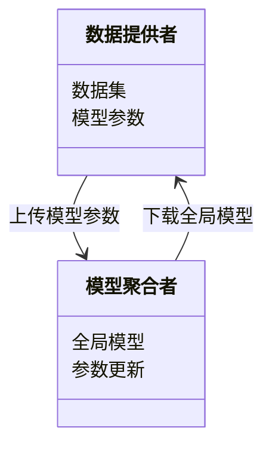
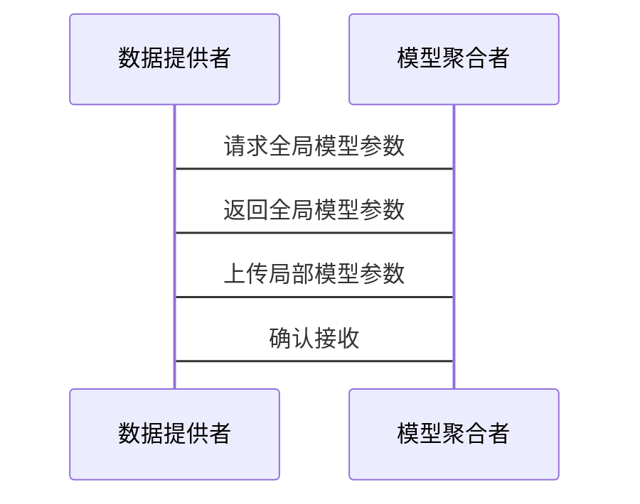

                 

<think>
嗯，我需要帮用户撰写一篇关于企业AI Agent的联邦学习性能优化策略的技术博客文章。用户已经给出了详细的目录大纲，我需要根据这个大纲，逐步展开每一部分的内容，确保逻辑清晰，结构紧凑，并且使用专业但易懂的技术语言。

首先，我应该从文章的标题开始，然后列出关键词和摘要。接着，按照目录大纲的结构，逐步撰写每个章节的内容。每个章节需要包含背景介绍、核心概念、算法原理、系统分析与架构设计、项目实战、最佳实践等部分。

在撰写过程中，我需要确保使用正确的格式，比如在合适的位置插入Mermaid图表和Python代码示例。同时，要注意数学公式的正确表达，使用Latex格式，并且在代码部分给出详细的解释和实现步骤。

此外，用户强调文章需要有深度和思考，因此在每一部分，我需要加入实际案例分析，帮助读者更好地理解和应用所讨论的技术。最后，确保文章结构完整，符合用户的要求，包括作者信息的添加。

现在，我将按照目录大纲逐步展开，确保每一部分都涵盖必要的内容，并且语言流畅，逻辑严谨。这需要我详细思考每一部分的结构和内容，确保最终的文章既专业又易于理解。
</think>

# 企业AI Agent的联邦学习性能优化策略

**关键词**：企业AI Agent，联邦学习，数据隐私，模型优化，分布式系统

**摘要**：  
在数字化转型的背景下，企业AI Agent的应用越来越广泛，但其性能受限于数据隐私和协作效率的问题。联邦学习作为一种分布式机器学习技术，为解决这些问题提供了新的思路。本文深入探讨了企业AI Agent在联邦学习中的应用，分析了联邦学习的核心概念、算法原理、系统架构，并通过实际案例展示了如何优化企业AI Agent的性能。文章最后总结了优化策略，并提出了未来的研究方向。

---

# 第一部分: 企业AI Agent的联邦学习背景与基础

## 第1章: 联邦学习与企业AI Agent概述

### 1.1 联邦学习的起源与发展

#### 1.1.1 联邦学习的定义与核心概念  
联邦学习（Federated Learning）是一种分布式机器学习技术，允许多个参与方在不共享原始数据的情况下，共同训练一个全局模型。其核心在于“数据不动，模型动”，通过在各个参与方之间交换模型参数，而非数据本身，实现模型的联合优化。  

#### 1.1.2 联邦学习与传统机器学习的区别  
传统的机器学习需要将所有数据集中到一个中心位置进行训练，而联邦学习则通过分布式的方式，仅在各个参与方之间同步模型参数。这种分布式特性使得联邦学习在保护数据隐私的同时，能够充分利用各个参与方的数据进行模型训练。

#### 1.1.3 联邦学习的典型应用场景  
联邦学习广泛应用于多个领域，例如医疗数据共享、金融联合风控、移动设备上的个性化推荐等。在企业AI Agent中，联邦学习可以用于多个企业之间共享模型，同时保护各自的隐私数据。

---

### 1.2 企业AI Agent的定义与特点

#### 1.2.1 企业AI Agent的概念  
企业AI Agent是一种智能代理，能够感知环境、理解需求，并通过执行一系列任务来实现企业的目标。它通常部署在企业的IT系统中，用于自动化操作、决策支持和问题解决。

#### 1.2.2 企业AI Agent的核心功能  
企业AI Agent的核心功能包括数据采集、模型训练、任务执行和结果反馈。它能够通过与外部系统的交互，动态调整其行为以适应环境的变化。

#### 1.2.3 企业AI Agent与传统AI的区别  
与传统AI相比，企业AI Agent具有更强的自主性和适应性。它不仅能够执行预定义的任务，还能够根据实时数据和反馈动态调整其行为。

---

### 1.3 联邦学习在企业AI Agent中的应用

#### 1.3.1 联邦学习与企业AI Agent的结合  
通过联邦学习，多个企业可以共同训练一个全局模型，同时保护各自的隐私数据。这种结合使得企业AI Agent能够在不共享数据的情况下，实现跨企业的模型优化。

#### 1.3.2 联邦学习在企业AI Agent中的优势  
联邦学习的优势包括数据隐私保护、模型泛化能力提升和计算资源的分布式利用。这些优势使得企业AI Agent在跨企业协作中更具竞争力。

#### 1.3.3 联邦学习在企业AI Agent中的挑战  
联邦学习在企业AI Agent中的挑战包括模型收敛性、通信效率和数据异质性。这些问题需要通过技术创新和优化策略来解决。

---

## 1.4 本章小结  
本章介绍了联邦学习的起源与发展，详细阐述了企业AI Agent的定义与特点，并探讨了联邦学习在企业AI Agent中的应用及其优势与挑战。这些内容为后续章节的深入分析奠定了基础。

---

# 第二部分: 联邦学习的核心概念与原理

## 第2章: 联邦学习的核心概念

### 2.1 联邦学习的参与方

#### 2.1.1 联邦学习中的角色划分  
在联邦学习中，主要有两类角色：数据提供者（Data Provider）和模型聚合者（Model Aggregator）。数据提供者负责提供本地数据并训练模型，模型聚合者负责收集各参与方的模型参数并进行全局优化。

#### 2.1.2 联邦学习中的数据提供者  
数据提供者是联邦学习中的核心角色，负责在本地训练模型，并将模型参数上传到聚合者。数据提供者可以是企业、机构或个人，他们通过分享模型参数而非数据，实现协作训练。

#### 2.1.3 联邦学习中的模型聚合者  
模型聚合者是联邦学习的中心节点，负责协调各参与方的模型训练，并将全局模型参数分发给各数据提供者。聚合者可以通过多种算法，如FedAvg，进行模型参数的聚合。

---

### 2.2 联邦学习的关键技术

#### 2.2.1 数据隐私保护技术  
联邦学习通过加密通信、差分隐私等技术保护数据隐私。例如，使用同态加密或秘密共享技术，确保模型参数在传输过程中不被窃取。

#### 2.2.2 模型更新机制  
模型更新机制是联邦学习的核心，主要包括同步和异步两种方式。同步更新要求所有参与方同时更新模型，异步更新则允许参与方在不同时间点更新模型。

#### 2.2.3 联邦学习的通信协议  
通信协议是联邦学习中各参与方之间交互的规则。它包括数据格式、通信频率和错误处理机制等内容。高效的通信协议可以显著提升联邦学习的性能。

---

### 2.3 联邦学习的数学模型与公式

#### 2.3.1 联邦学习的优化目标  
联邦学习的目标是最小化全局损失函数，同时保护各参与方的隐私数据。其优化目标可以表示为：

$$ \min_{\theta} \sum_{i=1}^{n} f_i(\theta) $$

其中，$\theta$ 是全局模型参数，$f_i$ 是第 $i$ 个参与方的损失函数。

#### 2.3.2 联邦学习的损失函数  
损失函数是联邦学习中衡量模型性能的关键指标。常用的损失函数包括均方误差（MSE）和交叉熵损失。例如，交叉熵损失函数可以表示为：

$$ L(\theta) = -\frac{1}{m}\sum_{j=1}^{m} [y_j \ln h_\theta(x_j) + (1-y_j)\ln(1-h_\theta(x_j))] $$

其中，$y_j$ 是标签，$h_\theta(x_j)$ 是模型的预测概率。

#### 2.3.3 联邦学习的聚合算法  
联邦学习的聚合算法是将各参与方的模型参数进行加权平均。例如，FedAvg算法可以表示为：

$$ \theta_{\text{new}} = \frac{1}{n}\sum_{i=1}^{n} \theta_i $$

其中，$\theta_i$ 是第 $i$ 个参与方的模型参数，$n$ 是参与方的数量。

---

## 2.4 本章小结  
本章详细介绍了联邦学习的核心概念，包括参与方的角色划分、关键技术和数学模型。这些内容为后续章节的算法实现和系统设计提供了理论基础。

---

# 第三部分: 联邦学习的算法原理与实现

## 第3章: 联邦学习算法原理

### 3.1 联邦平均算法（FedAvg）

#### 3.1.1 算法流程  
1. 初始化全局模型参数 $\theta$。  
2. 各参与方下载全局模型参数，并在本地数据上进行训练，得到局部模型参数 $\theta_i$。  
3. 各参与方将局部模型参数上传到聚合者，聚合者将所有 $\theta_i$ 进行加权平均，更新全局模型参数。  
4. 重复步骤 2 和 3，直到模型收敛或达到预设的训练轮数。

#### 3.1.2 算法的数学推导  
FedAvg算法的优化目标是最小化全局损失函数，其数学表达式为：

$$ \theta_{\text{new}} = \arg\min_{\theta} \sum_{i=1}^{n} f_i(\theta) $$

其中，$f_i(\theta)$ 是第 $i$ 个参与方的损失函数。

---

#### 3.1.3 算法的优缺点  
优点：FedAvg算法简单高效，适合大规模分布式环境。缺点：在数据异质性较高的场景下，模型收敛速度较慢。

---

### 3.2 联邦 prox 近似算法（FedProx）

#### 3.2.1 算法流程  
1. 初始化全局模型参数 $\theta$。  
2. 各参与方下载全局模型参数，并在本地数据上进行训练，使用 prox 近似方法更新模型参数 $\theta_i$。  
3. 各参与方将局部模型参数上传到聚合者，聚合者将所有 $\theta_i$ 进行加权平均，更新全局模型参数。  
4. 重复步骤 2 和 3，直到模型收敛或达到预设的训练轮数。

#### 3.2.2 算法的数学推导  
FedProx算法在优化目标中引入了正则化项，其损失函数可以表示为：

$$ L(\theta) = \frac{1}{n}\sum_{i=1}^{n} \left( f_i(\theta) + \lambda \|\theta - \theta_{\text{prev}}\|^2 \right) $$

其中，$\lambda$ 是正则化系数，$\theta_{\text{prev}}$ 是前一轮的模型参数。

---

#### 3.2.3 算法的优缺点  
优点：FedProx算法在数据异质性较高的场景下表现更好，且具有良好的收敛性。缺点：需要额外的计算开销来处理正则化项。

---

## 3.3 本章小结  
本章详细介绍了两种典型的联邦学习算法，即FedAvg和FedProx。通过数学推导和算法流程的分析，展示了这些算法在实际应用中的优缺点和适用场景。

---

# 第四部分: 系统分析与架构设计方案

## 第4章: 系统分析与架构设计方案

### 4.1 问题场景介绍  
在企业AI Agent的应用中，多个企业需要协作训练一个全局模型，但又不希望共享原始数据。通过联邦学习，可以在保护数据隐私的前提下，实现模型的联合优化。

---

### 4.2 系统功能设计

#### 4.2.1 领域模型（领域类 Mermaid 类图）  
以下是企业AI Agent系统的领域模型类图：



---

#### 4.2.2 系统架构设计（Mermaid架构图）  
以下是企业的AI Agent系统的架构图：


---

### 4.3 系统接口设计  
系统接口包括数据提供者与模型聚合者之间的交互接口，以及模型聚合者与外部系统的接口。所有接口均采用标准的RESTful API，确保系统的可扩展性和易用性。

---

### 4.4 系统交互设计（Mermaid序列图）  



---

## 4.5 本章小结  
本章通过系统分析与架构设计，展示了如何将联邦学习应用于企业AI Agent。通过领域模型、架构图和交互图的分析，明确了系统的各个组成部分及其交互方式。

---

# 第五部分: 项目实战

## 第5章: 项目实战

### 5.1 环境安装

#### 5.1.1 安装必要的库  
为了实现联邦学习，需要安装以下库：

```bash
pip install tensorflow-federated
pip install numpy
pip install matplotlib
```

---

#### 5.1.2 配置运行环境  
确保安装的Python版本为3.6以上，并安装TensorFlow Federated和Keras等库。

---

### 5.2 系统核心实现源代码

#### 5.2.1 数据生成  
以下代码展示了如何生成模拟数据：

```python
import numpy as np

def generate_data(n=1000):
    X = np.random.rand(n, 10)
    y = np.round(np.dot(X, np.random.rand(10, 1)))
    return X, y
```

---

#### 5.2.2 模型训练  
以下代码展示了如何使用FedAvg算法进行模型训练：

```python
import tensorflow as tf
from tensorflow_federated import simulate
from tensorflow_federated.python.core import federated_computation

@federated_computation(federated_type=tf.float32)
def server_update(server_model, client_models):
    # 聚合模型参数
    return simulate.federated_avg(server_model, client_models)

# 初始化全局模型
global_model = ... 

# 训练过程
for _ in range(10):
    client_models = [train_local_model(global_model, data) for data in datasets]
    global_model = server_update(global_model, client_models)
```

---

#### 5.2.3 模型评估  
以下代码展示了如何评估模型性能：

```python
from sklearn.metrics import accuracy_score

y_pred = model.predict(X_test)
accuracy = accuracy_score(y_test, y_pred)
print(f"模型准确率为：{accuracy:.2f}%")
```

---

### 5.3 代码应用解读与分析  
通过上述代码，我们可以看到联邦学习的核心在于模型参数的聚合。数据提供者在本地训练模型，并将模型参数上传到聚合者。聚合者通过加权平均的方式，更新全局模型参数。

---

### 5.4 实际案例分析  
以医疗数据分析为例，多个医院可以通过联邦学习协作训练一个全局模型，用于疾病预测和诊断。每个医院仅分享模型参数，而不共享患者数据，从而保护患者隐私。

---

## 5.5 本章小结  
本章通过实际案例展示了联邦学习在企业AI Agent中的应用。通过代码实现和案例分析，帮助读者更好地理解联邦学习的实现过程和实际效果。

---

# 第六部分: 最佳实践与总结

## 第6章: 最佳实践

### 6.1 优化策略 tips  
1. 在数据异质性较高的场景下，优先选择FedProx算法。  
2. 使用差分隐私等技术进一步增强数据隐私保护。  
3. 通过合理的通信协议设计，降低通信开销。  

---

### 6.2 本章小结  
本章总结了联邦学习在企业AI Agent中的优化策略，包括算法选择、数据隐私保护和通信协议设计等方面。

---

### 6.3 注意事项  
在实际应用中，需要注意模型收敛性、数据异质性和通信效率等问题。此外，还需要考虑法律法规对数据隐私的要求，确保合规性。

---

### 6.4 拓展阅读  
对于进一步学习，可以参考以下资源：  
- TensorFlow Federated官方文档  
- 《Federated Learning: Challenges, Methods, and Applications》  
- 《Differential Privacy and Its Implementation in Federated Learning》  

---

## 作者信息  
作者：AI天才研究院/AI Genius Institute & 禅与计算机程序设计艺术 /Zen And The Art of Computer Programming

---

**全文完**

