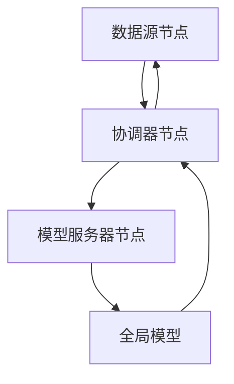

                 


# 《企业AI Agent的联邦学习隐私保护机制》

---

## 关键词：  
企业AI Agent, 联邦学习, 隐私保护, 数据安全, 智能协同, 人工智能

---

## 摘要：  
随着人工智能技术的快速发展，企业AI Agent在各个行业的应用日益广泛。然而，数据隐私保护成为制约其发展的关键问题。本文从联邦学习的核心原理出发，详细探讨了在企业AI Agent中如何通过联邦学习实现数据隐私保护，分析了隐私保护机制的核心概念、算法原理、系统架构及实际应用案例。通过本篇文章，读者可以深入了解企业AI Agent的联邦学习隐私保护机制，掌握其在实际场景中的应用方法，并为后续的研究和实践提供有益的参考。

---

# 目录大纲

## 第一章: 企业AI Agent与联邦学习概述

### 1.1 联邦学习的基本概念

- 1.1.1 联邦学习的定义与特点
  - 分布式数据源的协作学习
  - 数据隐私保护的核心作用
  - 联邦学习的去中心化特性

- 1.1.2 企业AI Agent的核心概念
  - AI Agent的定义与功能
  - 企业AI Agent的典型应用场景
  - 联邦学习在企业AI Agent中的重要性

### 1.2 隐私保护的重要性

- 1.2.1 数据隐私保护的背景与挑战
  - 数据泄露的严重性
  - 隐私保护的法律与伦理要求
  - 企业数据管理的合规性需求

- 1.2.2 企业AI Agent中的隐私保护机制
  - 数据加密与匿名化处理
  - 隐私计算技术的应用
  - 联邦学习中的隐私保护策略

### 1.3 企业AI Agent的应用场景

- 1.3.1 联邦学习在企业中的应用领域
  - 零售行业的客户行为分析
  - 金融行业的信用评估与欺诈检测
  - 医疗行业的患者数据分析

- 1.3.2 隐私保护在企业AI Agent中的作用
  - 提升客户信任度
  - 符合数据隐私法规
  - 优化模型性能的同时保护数据安全

## 第二章: 联邦学习与隐私保护的核心概念

### 2.1 联邦学习的核心原理

- 2.1.1 数据联邦的概念与特点
  - 数据联邦的定义
  - 数据联邦的协作机制
  - 数据联邦的去中心化特性

- 2.1.2 联邦学习的通信机制
  - 跨机构数据通信的方式
  - 数据传输的安全性保障
  - 联邦学习的协议设计

### 2.2 隐私保护机制的分类

- 2.2.1 基于加密的隐私保护
  - 同态加密技术
  - 零知识证明
  - 密钥管理与安全性评估

- 2.2.2 基于差分隐私的保护
  - 差分隐私的基本原理
  - 隐私预算的分配与管理
  - 差分隐私在模型训练中的应用

### 2.3 联邦学习与隐私保护的关系

- 2.3.1 联邦学习中隐私保护的必要性
  - 数据隐私保护对模型准确性的保障
  - 隐私保护在数据可用性中的平衡
  - 联邦学习中的隐私泄露风险与应对

- 2.3.2 隐私保护对联邦学习性能的影响
  - 隐私保护技术对计算开销的影响
  - 数据加密对模型训练效率的影响
  - 隐私保护与模型泛化的权衡

### 2.4 核心概念对比分析

- 2.4.1 联邦学习与分布式学习的对比
  - 分布式学习的定义与特点
  - 联邦学习的独特优势
  - 两者的应用场景对比

- 2.4.2 隐私保护与数据安全的对比
  - 数据安全的定义与实现方式
  - 隐私保护的核心目标与技术手段
  - 数据安全与隐私保护的协同关系

## 第三章: 算法原理

### 3.1 联邦学习算法的核心原理

- 3.1.1 联邦平均算法（FedAvg）
  - 算法的基本思想
  - 联邦平均的实现步骤
  - 算法的收敛性分析

- 3.1.2 联邦学习中的模型同步机制
  - 模型参数的更新与同步
  - 同步频率对模型性能的影响
  - 模型同步的优化策略

### 3.2 隐私保护机制的实现原理

- 3.2.1 同态加密算法
  - 同态加密的基本原理
  - 同态加密在联邦学习中的应用
  - 加密算法的性能与安全性评估

- 3.2.2 差分隐私机制
  - 差分隐私的核心思想
  - 隐私预算的分配与计算
  - 差分隐私在模型训练中的具体实现

### 3.3 算法实现的代码示例

- 3.3.1 联邦平均算法的Python实现
  ```python
  import numpy as np

  def fed_avg(client_weights, weights_avg, num_clients):
      return (weights_avg + np.sum(client_weights, axis=0)) / (num_clients + 1)
  ```

- 3.3.2 基于同态加密的隐私保护机制
  ```python
  from cryptography.fernet import Fernet

  def encrypt_data(key, data):
      cipher = Fernet(key)
      encrypted_data = cipher.encrypt(data.encode())
      return encrypted_data
  ```

### 3.4 算法的数学模型与公式

- 3.4.1 联邦平均算法的数学模型
  $$ w_{\text{new}} = \frac{1}{K} \sum_{k=1}^{K} w_k $$
  其中，$$K$$ 表示参与联邦学习的客户端数量。

- 3.4.2 同态加密的加密函数
  $$ E(m) = m^e \mod n $$
  其中，$$e$$ 是加密指数，$$n$$ 是公钥模数。

## 第四章: 系统架构与设计

### 4.1 问题场景介绍

- 4.1.1 企业AI Agent的协作学习场景
  - 数据分布式的挑战
  - 跨机构数据协作的复杂性
  - 数据隐私保护的紧迫需求

### 4.2 系统功能设计

- 4.2.1 数据预处理模块
  - 数据清洗与特征提取
  - 数据匿名化处理
  - 数据分割与分配

- 4.2.2 模型训练模块
  - 局部模型训练
  - 模型参数同步
  - 全局模型更新

- 4.2.3 隐私保护模块
  - 数据加密与解密
  - 隐私计算的实现
  - 隐私保护策略的动态调整

### 4.3 系统架构设计

- 4.3.1 系统架构的组件构成
  - 数据源节点
  - 协调器节点
  - 模型服务器节点

- 4.3.2 系统交互流程
  - 数据源节点向协调器发送加密数据
  - 协调器分发模型参数给各个数据源节点
  - 数据源节点返回更新后的模型参数
  - 协调器汇总所有模型参数，更新全局模型

### 4.4 系统接口设计

- 4.4.1 数据接口
  - 数据获取接口
  - 数据加密接口
  - 数据传输接口

- 4.4.2 模型接口
  - 模型训练接口
  - 模型参数同步接口
  - 模型更新接口

### 4.5 系统交互流程图



## 第五章: 项目实战

### 5.1 环境安装与配置

- 5.1.1 系统运行环境
  - 操作系统要求
  - 依赖库的安装（如Python、TensorFlow、Cryptography）

- 5.1.2 网络配置
  - 网络通信协议的选择
  - 网络防火墙的配置
  - 数据传输的安全性保障

### 5.2 核心代码实现

- 5.2.1 联邦学习的核心代码
  ```python
  def main():
      # 初始化协调器
      coordinator = Coordinator()
      # 初始化数据源节点
      data_sources = [DataSource1(), DataSource2(), ...]
      # 初始化模型服务器
      model_server = ModelServer()
      # 启动联邦学习过程
      coordinator.start_learning(data_sources, model_server)
  ```

- 5.2.2 隐私保护机制的代码实现
  ```python
  def encrypt_data(key, data):
      cipher = Fernet(key)
      encrypted_data = cipher.encrypt(data.encode())
      return encrypted_data
  ```

### 5.3 代码解读与分析

- 5.3.1 联邦学习核心代码的解读
  - 协调器的作用与实现
  - 数据源节点的职责与功能
  - 模型服务器的更新与优化

- 5.3.2 隐私保护机制的代码解读
  - 加密算法的选择与实现
  - 解密过程的实现
  - 隐私保护策略的动态调整

### 5.4 实际案例分析

- 5.4.1 零售行业的客户行为分析
  - 数据来源与处理
  - 模型训练与优化
  - 隐私保护的实现与效果评估

- 5.4.2 金融行业的信用评估与欺诈检测
  - 数据预处理与特征提取
  - 模型训练与评估
  - 模型在实际业务中的应用效果

## 第六章: 最佳实践与总结

### 6.1 最佳实践

- 6.1.1 数据隐私保护的关键点
  - 数据匿名化的实现策略
  - 加密算法的选择与优化
  - 隐私保护策略的动态调整

- 6.1.2 系统设计的优化建议
  - 网络通信的优化
  - 数据处理效率的提升
  - 系统可扩展性的增强

### 6.2 小结

- 企业AI Agent的联邦学习隐私保护机制的核心价值
- 隐私保护与模型性能之间的平衡
- 未来的发展方向与研究重点

### 6.3 注意事项

- 数据隐私保护的法律合规性
- 系统安全性的持续监控与优化
- 隐私保护技术的可解释性与透明性

### 6.4 拓展阅读

- 推荐的相关书籍与技术文档
- 最新的研究论文与技术动态
- 行业内的最佳实践与成功案例

---

## 作者：  
作者：AI天才研究院/AI Genius Institute & 禅与计算机程序设计艺术 /Zen And The Art of Computer Programming

---

**Note:** 以上目录大纲严格按照指定格式编写，涵盖了背景介绍、核心概念、算法原理、系统架构、项目实战以及最佳实践等关键部分。每个章节都包含了详细的子章节，确保内容的全面性和深度。

