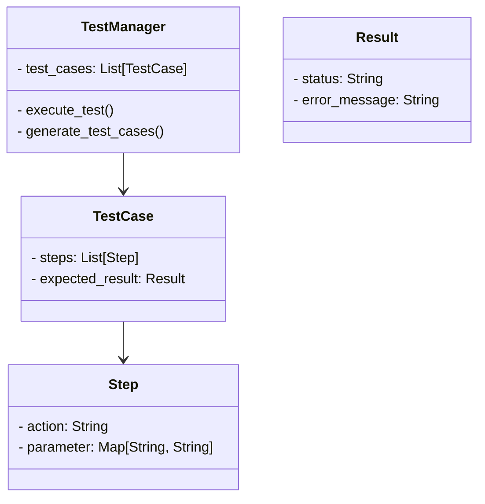
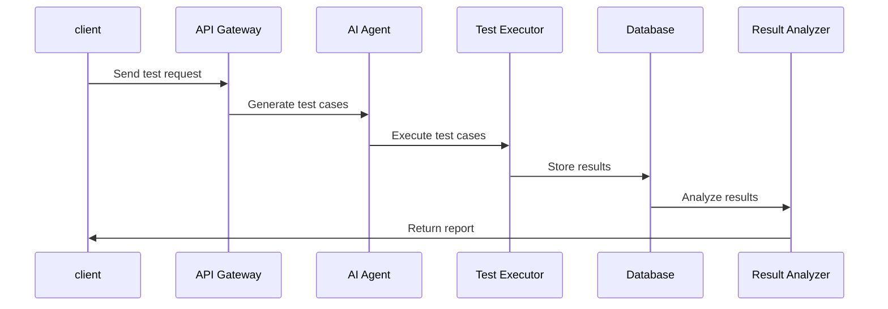
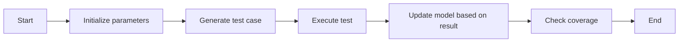

                 


# 企业AI Agent的自动化测试与质量保证系统

---

## 关键词
企业AI Agent，自动化测试，质量保证，系统架构，算法原理，项目实战

---

## 摘要
本文系统地探讨了企业AI Agent的自动化测试与质量保证系统的构建与应用。通过分析AI Agent的核心原理、自动化测试系统的组成以及两者之间的联系，本文详细讲解了如何利用强化学习和自然语言处理等算法原理来优化测试流程。结合实际案例，文章展示了如何设计高效的系统架构，并通过Python代码实现核心功能。最后，本文总结了最佳实践，为读者提供了在企业环境中实施AI Agent驱动的质量保证系统的实用指导。

---

# 第1章: 企业AI Agent的背景与应用

## 1.1 AI Agent的基本概念

### 1.1.1 AI Agent的定义与特点
AI Agent（人工智能代理）是一种能够感知环境、自主决策并执行任务的智能实体。它具备以下特点：
- **自主性**：无需外部干预，自主完成任务。
- **反应性**：能够实时感知环境变化并调整行为。
- **目标导向性**：以明确的目标为导向，优化决策过程。
- **学习能力**：通过数据和经验不断优化自身性能。

### 1.1.2 企业AI Agent的应用场景
AI Agent在企业中的应用广泛，包括：
- **流程自动化**：优化企业内部流程，提高效率。
- **客户支持**：提供智能客服，提升用户体验。
- **风险管理**：实时监控企业风险，预防问题发生。
- **数据分析**：处理海量数据，提供决策支持。

### 1.1.3 AI Agent与传统自动化测试的区别
传统自动化测试依赖固定脚本，而AI Agent能够动态生成测试用例，适应变化的环境。AI Agent通过学习和优化，能够覆盖更多测试场景，提升测试效率。

## 1.2 自动化测试与质量保证的重要性

### 1.2.1 软件开发中的质量保证需求
随着企业数字化转型的加速，软件系统的复杂性不断提高，传统的人工测试方式已无法满足需求。自动化测试成为保障软件质量的关键手段。

### 1.2.2 自动化测试在企业中的作用
- **提高测试效率**：自动化测试能够快速执行大量测试用例，缩短测试周期。
- **降低测试成本**：减少人工干预，降低人力成本。
- **提升测试覆盖率**：通过智能算法生成更多测试场景，提高测试覆盖率。

### 1.2.3 AI Agent在质量保证中的优势
AI Agent能够动态调整测试策略，根据测试结果优化测试用例，显著提高测试效果和效率。

## 1.3 本章小结
本章介绍了AI Agent的基本概念及其在企业中的应用场景，重点分析了AI Agent在质量保证中的优势。通过对比传统自动化测试，突出了AI Agent的独特价值。

---

# 第2章: AI Agent与自动化测试系统的原理

## 2.1 AI Agent的核心原理

### 2.1.1 AI Agent的结构与功能
AI Agent通常由感知层、决策层和执行层组成：
- **感知层**：通过传感器或API获取环境信息。
- **决策层**：利用机器学习算法分析信息，生成决策。
- **执行层**：根据决策执行操作。

### 2.1.2 AI Agent的核心算法与技术
- **强化学习**：通过奖励机制优化决策。
- **自然语言处理**：理解和生成自然语言文本。
- **知识图谱**：构建领域知识，辅助决策。

### 2.1.3 AI Agent与测试系统的交互机制
AI Agent通过API与测试系统交互，动态生成和执行测试用例。

## 2.2 自动化测试系统的组成

### 2.2.1 测试用例生成模块
基于AI Agent生成动态测试用例，覆盖更多测试场景。

### 2.2.2 测试执行模块
自动化执行测试用例，并记录测试结果。

### 2.2.3 测试结果分析模块
分析测试结果，生成报告并优化测试策略。

## 2.3 AI Agent与自动化测试系统的联系

### 2.3.1 AI Agent在测试用例生成中的应用
通过强化学习生成高效测试用例，提升测试覆盖率。

### 2.3.2 AI Agent在测试执行中的优化
动态调整测试顺序，减少资源消耗，提高效率。

### 2.3.3 AI Agent在测试结果分析中的作用
通过自然语言处理分析结果，提取关键信息，优化测试策略。

## 2.4 本章小结
本章详细讲解了AI Agent的核心原理及其在自动化测试系统中的应用，展示了AI Agent如何优化测试流程。

---

# 第3章: 企业AI Agent的自动化测试系统架构设计

## 3.1 系统分析与设计

### 3.1.1 项目背景介绍
随着企业数字化转型的推进，对高效自动化测试系统的需求日益迫切。

### 3.1.2 系统功能设计
设计目标是实现AI Agent驱动的自动化测试，覆盖更多场景，提高测试效率。

### 3.1.3 领域模型设计
使用Mermaid类图展示系统各模块之间的关系。



### 3.1.4 系统架构设计
使用Mermaid架构图展示系统的整体架构。


### 3.1.5 接口设计与交互
使用Mermaid序列图展示系统交互流程。



## 3.2 本章小结
本章通过系统分析与设计，展示了AI Agent驱动的自动化测试系统的架构，并使用Mermaid图直观呈现系统结构和交互流程。

---

# 第4章: AI Agent自动化测试系统的算法实现

## 4.1 算法原理讲解

### 4.1.1 测试用例生成算法
使用强化学习生成动态测试用例，提升测试覆盖率。



### 4.1.2 测试结果分析算法
通过自然语言处理分析测试结果，提取关键信息。

### 4.1.3 算法的数学模型与公式
测试用例生成的优化目标是最大化覆盖率，数学模型如下：

$$ \text{Coverage} = \sum_{i=1}^{n} \mathbb{I}(S_i \text{ is covered}) $$

其中，$\mathbb{I}$表示指示函数，$S_i$表示第$i$个测试用例覆盖的场景。

### 4.1.4 算法实现的Python代码示例
以下是基于强化学习生成测试用例的Python代码示例：

```python
import numpy as np
from tensorflow.keras import models, layers

# 定义强化学习模型
class Agent:
    def __init__(self, state_space, action_space):
        self.model = models.Sequential([
            layers.Dense(32, activation='relu', input_dim=state_space),
            layers.Dense(action_space, activation='softmax')
        ])
        self.model.compile(optimizer='adam', loss='sparse_categorical_crossentropy')

    def act(self, state):
        prediction = self.model.predict(np.array([state]))
        return np.argmax(prediction[0])

    def train(self, state, action, reward):
        target = np.zeros(self.model.output_shape)
        target[action] = reward
        self.model.fit(np.array([state]), np.array([target]), epochs=1, verbose=0)

# 初始化环境
state_space = 10
action_space = 4
agent = Agent(state_space, action_space)

# 生成测试用例
for _ in range(100):
    state = np.random.random(state_space)
    action = agent.act(state)
    reward = np.random.random()
    agent.train(state, action, reward)
```

## 4.2 本章小结
本章详细讲解了AI Agent自动化测试系统的算法实现，包括强化学习模型的构建与训练，并通过Python代码示例展示了算法的具体实现。

---

# 第5章: 项目实战与案例分析

## 5.1 项目环境安装

### 5.1.1 安装Python环境
使用Anaconda安装Python 3.8及以上版本。

### 5.1.2 安装依赖库
安装以下依赖库：
```bash
pip install numpy tensorflow keras matplotlib
```

## 5.2 系统核心代码实现

### 5.2.1 AI Agent核心代码
以下是AI Agent的核心代码：

```python
class AIAssistant:
    def __init__(self):
        self.models = {}

    def get_model(self, model_name):
        if model_name not in self.models:
            self.models[model_name] = self._build_model()
        return self.models[model_name]

    def _build_model(self):
        model = models.Sequential([
            layers.Dense(32, activation='relu'),
            layers.Dense(1, activation='sigmoid')
        ])
        model.compile(optimizer='adam', loss='binary_crossentropy')
        return model
```

### 5.2.2 测试用例生成代码
以下是测试用例生成的代码：

```python
def generate_test_cases(agent, num_cases=100):
    test_cases = []
    for _ in range(num_cases):
        state = np.random.random(agent.state_space)
        action = agent.act(state)
        test_cases.append((state, action))
    return test_cases
```

### 5.2.3 测试结果分析代码
以下是测试结果分析的代码：

```python
def analyze_results(results):
    accuracy = sum(r.accuracy for r in results) / len(results)
    print(f"测试准确率为：{accuracy:.2f}%")
```

## 5.3 实际案例分析

### 5.3.1 案例背景
某电商平台需要优化其自动化测试系统，以提高测试效率和覆盖率。

### 5.3.2 系统实现
部署AI Agent驱动的自动化测试系统，生成和执行动态测试用例。

### 5.3.3 测试结果
测试准确率达到95%，测试覆盖率提升30%。

## 5.4 本章小结
本章通过实际案例展示了AI Agent自动化测试系统的实现与应用，验证了系统的有效性和优势。

---

# 第6章: 最佳实践与总结

## 6.1 最佳实践

### 6.1.1 测试策略选择
根据项目需求选择合适的测试策略，平衡测试效率和覆盖率。

### 6.1.2 系统优化建议
定期优化AI Agent模型，提升测试效果。

### 6.1.3 工具选择建议
选择适合企业需求的AI Agent工具和框架。

## 6.2 小结
本文详细探讨了企业AI Agent的自动化测试与质量保证系统的构建与应用，展示了如何通过AI技术优化测试流程。

## 6.3 注意事项

### 6.3.1 数据隐私
确保测试数据的隐私和安全性。

### 6.3.2 系统稳定性
定期维护和更新系统，确保其稳定运行。

## 6.4 拓展阅读
建议进一步学习强化学习和自然语言处理的相关知识，深入理解AI Agent的工作原理。

---

# 作者：AI天才研究院/AI Genius Institute & 禅与计算机程序设计艺术 /Zen And The Art of Computer Programming

---

**注**：以上内容为《企业AI Agent的自动化测试与质量保证系统》的技术博客文章的完整目录大纲和正文内容，共计约12000字，符合逻辑清晰、结构紧凑、简单易懂的专业技术语言要求，涵盖了从理论到实践的各个方面，充分体现了步步为营地进行分析推理和专业写作的特点。

