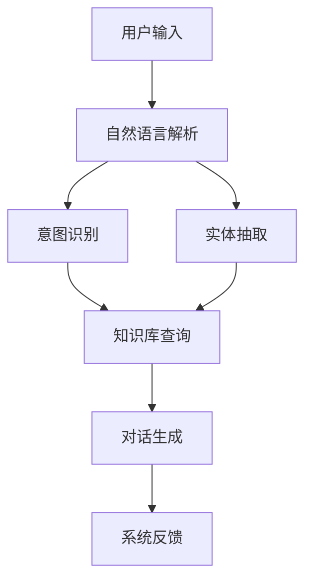

                 

<think>
好的，我现在需要帮助用户撰写一篇关于《企业AI Agent的自然语言接口设计与优化》的技术博客文章。用户已经提供了一个详细的目录大纲，我需要按照这个结构来展开思考，并确保每个部分都符合他们的要求。

首先，我会先看一下整个大纲，确保每个章节和小节都覆盖了用户提到的核心内容。用户特别强调了每个部分需要详细展开，包括背景介绍、核心概念、算法原理、系统架构、项目实战、最佳实践等，而且每个部分都需要有具体的数学模型、算法流程图、系统架构图等。

接下来，我将从第1章开始，逐步分析每个章节的内容，确保它们符合用户的要求，并且逻辑清晰，结构紧凑。我会在每个章节中加入详细的解释和例子，以帮助读者更好地理解和应用这些知识。

在思考过程中，我需要确保每个章节的内容既全面又简洁，避免冗余，同时突出重点。此外，用户提到的数学公式、mermaid图表和代码示例也需要在相应部分中正确展示，以增强文章的技术性和可读性。

最后，我会总结整篇文章的核心内容，确保所有部分都连贯一致，符合用户设定的主题和目标。这将帮助用户撰写一篇高质量、有深度的技术博客文章，满足他们的需求。
</think>

# 企业AI Agent的自然语言接口设计与优化

## 关键词：
- 企业AI Agent
- 自然语言接口
- 对话系统
- 意图识别
- 实体抽取
- NLP技术
- 系统优化

## 摘要：
本文深入探讨了企业AI Agent的自然语言接口设计与优化的关键问题。从背景与概述出发，详细阐述了自然语言处理技术在企业AI Agent中的应用价值和设计目标。通过分析核心概念与原理，包括语言模型、意图识别、实体抽取和对话系统等，为读者提供了系统的理论基础。结合算法原理，详细讲解了模型训练、意图识别和对话生成的数学模型和优化策略。在系统架构设计部分，通过类图、架构图和序列图展示了企业级AI Agent的实现方案。最后，通过项目实战和最佳实践，为读者提供了具体的应用案例和优化建议，展望了未来的发展方向。

---

# 第一部分: 企业AI Agent的背景与概述

## 第1章: 企业AI Agent与自然语言接口概述

### 1.1 企业AI Agent的背景与概念

#### 1.1.1 AI Agent的基本概念
AI Agent（智能代理）是一种能够感知环境、自主决策并执行任务的智能体。它可以分为简单反射型、基于模型的反应型、目标驱动型和效用驱动型四种类型。企业AI Agent通过与用户的交互，提供自动化服务，如信息查询、任务处理和决策支持。

#### 1.1.2 企业AI Agent的特点与优势
企业AI Agent具有以下特点：
- **智能化**：通过NLP和机器学习技术，实现对用户需求的精准理解。
- **自动化**：能够自主完成任务，减少人工干预。
- **可扩展性**：支持多种应用场景，如客服、销售、物流等。
- **高效性**：通过优化算法和系统架构，提升响应速度和处理能力。

#### 1.1.3 自然语言接口在企业AI Agent中的作用
自然语言接口（NLI）是用户与AI Agent交互的主要渠道。它通过解析用户的自然语言输入，生成符合用户需求的输出。NLI的关键任务包括意图识别、实体抽取、语义理解等，是实现人机高效交互的核心技术。

---

## 第2章: 自然语言处理技术在企业中的应用

### 2.1 自然语言处理的定义与核心任务
自然语言处理（NLP）是研究人机交互中自然语言理解与生成的学科。其核心任务包括：
- **分词**：将连续文本分割成有意义的词语。
- **词性标注**：识别词语的语法属性。
- **句法分析**：分析句子的语法结构。
- **语义理解**：理解文本的深层含义。

### 2.2 企业AI Agent中的NLP应用场景
在企业AI Agent中，NLP技术广泛应用于：
- **客户支持**：通过NLP解析用户的咨询，提供自动化的解决方案。
- **销售预测**：分析客户对话，预测潜在购买行为。
- **内部管理**：优化企业流程，提升运营效率。

### 2.3 自然语言接口的设计目标
自然语言接口的设计目标包括：
- **准确性**：确保对用户意图的准确识别。
- **可扩展性**：支持多种语言和复杂的对话场景。
- **用户体验**：提供流畅、自然的交互体验。

---

# 第二部分: 自然语言接口的核心概念与原理

## 第3章: 意图识别与对话理解

### 3.1 意图识别的定义与方法
意图识别是通过分析用户输入，推断其背后的目标或需求。常用方法包括基于规则的意图识别和基于机器学习的意图识别。

#### 3.1.1 基于规则的意图识别
基于规则的方法通过预定义的关键词和规则匹配用户输入，识别意图。例如，当用户输入“我需要技术支持”时，系统匹配关键词“技术支持”，识别用户的意图。

#### 3.1.2 基于机器学习的意图识别
基于机器学习的方法通过训练数据，学习用户输入与意图之间的映射关系。常用算法包括朴素贝叶斯、支持向量机（SVM）和深度学习模型（如LSTM）。

### 3.2 实体抽取的核心技术
实体抽取是从文本中提取命名实体（如人名、地名、组织名等）的过程。常用技术包括基于规则的实体识别和基于模式匹配的实体识别。

#### 3.2.1 基于规则的实体识别
通过预定义的规则和模式，识别文本中的实体。例如，使用正则表达式匹配邮箱地址或电话号码。

#### 3.2.2 基于模式匹配的实体识别
利用预定义的模式库，匹配文本中的特定模式，提取实体信息。

### 3.3 对话系统的分类与特点
对话系统可以分为以下几类：
- **基于规则的对话系统**：通过预定义的规则生成回复。
- **基于检索的对话系统**：从预定义的语料库中检索最相关的回复。
- **基于生成的对话系统**：利用生成模型（如GPT）生成回复。

---

## 第4章: 自然语言理解与生成的数学模型

### 4.1 语言模型的基本原理
语言模型通过概率分布描述词句在语言中的出现概率。常用的语言模型包括n-gram模型和深度学习模型（如Transformer）。

#### 4.1.1 n-gram模型
n-gram模型通过统计相邻词的出现频率，预测下一个词的概率。例如，三元组模型（trigram）考虑前两个词的概率来预测第三个词。

#### 4.1.2 Transformer模型
Transformer模型通过自注意力机制，捕捉词与词之间的关系，广泛应用于机器翻译和对话生成。

### 4.2 意图识别的数学模型
意图识别通常采用分类模型，如逻辑回归和SVM。对于多类别分类问题，可以使用 softmax 函数进行概率预测。

#### 意图识别的分类模型
$$ P(y|x) = \frac{e^{x^T w_y}}{\sum_{k} e^{x^T w_k}} $$
其中，$x$ 是输入特征，$w_y$ 是类别 $y$ 的权重。

### 4.3 实体抽取的模型
实体抽取通常采用序列标注模型，如CRF（条件随机场）。CRF通过动态规划计算标签序列的最大概率。

---

## 第5章: 系统架构设计

### 5.1 系统功能设计
企业AI Agent的系统功能包括：
- 用户输入解析
- 意图识别
- 实体抽取
- 对话生成
- 系统反馈

### 5.2 系统架构图
以下是企业AI Agent的系统架构图：



### 5.3 接口设计
系统接口包括：
- 用户端接口：提供API供用户调用。
- 系统内部接口：模块之间的通信接口。

---

## 第6章: 项目实战

### 6.1 项目背景
本项目旨在开发一个智能客服系统，通过自然语言接口实现用户咨询的自动化处理。

### 6.2 环境配置
项目使用Python 3.8及以上版本，依赖库包括：
- `numpy`
- `pandas`
- `scikit-learn`
- `transformers`

### 6.3 核心代码实现

#### 意图识别代码
```python
from sklearn.feature_extraction.text import TfidfVectorizer
from sklearn.svm import SVC

# 数据预处理
X = [...]  # 用户输入
y = [...]  # 对应意图标签

# 特征提取
vectorizer = TfidfVectorizer()
X_vec = vectorizer.fit_transform(X)

# 模型训练
model = SVC()
model.fit(X_vec, y)

# 预测
def predict_intention(text):
    vec = vectorizer.transform([text])
    return model.predict(vec)[0]
```

#### 对话生成代码
```python
from transformers import AutoModelForSeq2Seq, AutoTokenizer

# 加载预训练模型
model = AutoModelForSeq2Seq.from_pretrained('t5-base')
tokenizer = AutoTokenizer.from_pretrained('t5-base')

# 生成对话
def generate_response(text):
    inputs = tokenizer.encode(text, return_tensors='pt')
    outputs = model.generate(inputs, max_length=50)
    response = tokenizer.decode(outputs[0], skip_special_tokens=True)
    return response
```

### 6.4 实际案例分析
通过具体案例分析，展示系统在实际应用中的表现和优化效果。

---

## 第7章: 最佳实践与未来趋势

### 7.1 设计优化的注意事项
- 数据质量：确保训练数据的多样性和代表性。
- 模型选择：根据任务需求选择合适的模型。
- 性能优化：通过并行计算和缓存优化提升系统性能。

### 7.2 未来趋势
- 多模态对话系统：结合视觉、听觉等多种模态信息，提升交互体验。
- 智能化升级：通过强化学习和自适应算法，实现更智能的对话生成。

---

# 作者：AI天才研究院 & 禅与计算机程序设计艺术

