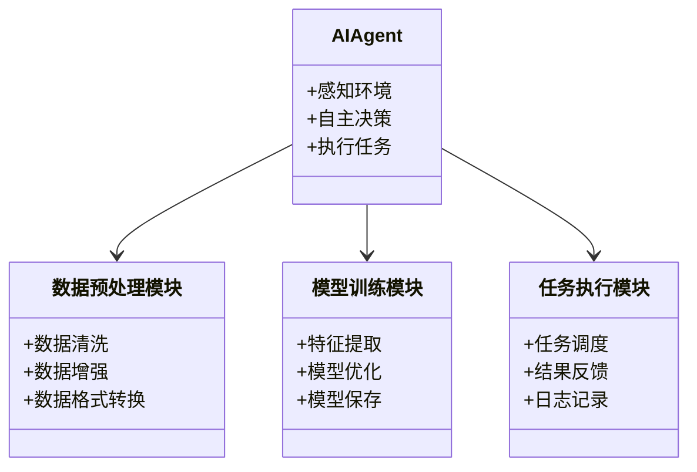
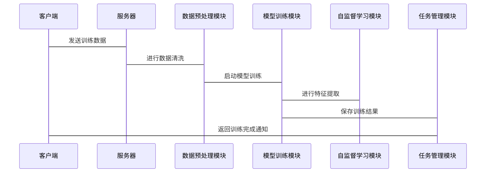

                 


# 企业AI Agent的自监督学习在非标准数据利用中的创新实践

> **关键词**: 企业AI Agent, 自监督学习, 非标准数据, 人工智能, 数据处理

> **摘要**: 本文深入探讨了企业AI Agent在非标准数据利用中的创新实践，重点分析了自监督学习技术的应用。文章从AI Agent的基本概念、自监督学习的原理，到非标准数据的处理方法，逐一展开，结合实际案例，详细介绍了自监督学习在企业中的应用场景、算法原理、系统设计以及项目实战。通过本文，读者将全面了解如何利用自监督学习技术有效处理非标准数据，提升企业AI Agent的性能和应用效果。

---

## 第1章: 企业AI Agent与自监督学习背景

### 1.1 AI Agent的基本概念

#### 1.1.1 AI Agent的定义
AI Agent（人工智能代理）是指能够感知环境、自主决策并执行任务的智能实体。它能够通过传感器获取信息，利用算法处理信息，并通过执行器与环境交互。

#### 1.1.2 AI Agent的核心特征
- **自主性**: 能够自主决策，无需外部干预。
- **反应性**: 能够实时感知环境并做出反应。
- **目标导向**: 具有明确的目标，能够为实现目标而行动。
- **学习能力**: 能够通过经验改进自身的性能。

#### 1.1.3 企业级AI Agent的应用场景
在企业中，AI Agent可以应用于智能客服、自动化决策、智能推荐、流程自动化等多个领域。

### 1.2 自监督学习的基本原理

#### 1.2.1 自监督学习的定义
自监督学习是一种机器学习方法，通过利用数据本身的结构信息，从无标签的数据中学习有用的特征表示。

#### 1.2.2 自监督学习与监督学习的区别
- **监督学习**: 需要人工标注的标签数据。
- **自监督学习**: 利用数据内部的关联性，无需人工标注。

#### 1.2.3 自监督学习的优势
- **数据利用率高**: 可以在无标签数据上进行学习。
- **模型泛化能力强**: 通过学习数据的内在结构，模型具有更强的泛化能力。

### 1.3 非标准数据的定义与特点

#### 1.3.1 非标准数据的定义
非标准数据是指不符合传统数据格式或结构的数据，例如文本、图像、音频、视频等。

#### 1.3.2 非标准数据的分类
- **结构化数据**: 如表格数据。
- **半结构化数据**: 如JSON、XML格式的数据。
- **非结构化数据**: 如文本、图像、音频等。

#### 1.3.3 非标准数据在企业中的应用场景
- **文本分析**: 如情感分析、舆情监测。
- **图像处理**: 如图像识别、图像分割。
- **音频处理**: 如语音识别、语音合成。

## 第2章: 自监督学习在非标准数据中的应用

### 2.1 非标准数据的挑战与机遇

#### 2.1.1 非标准数据的处理难点
- **数据多样性**: 数据类型多样，处理复杂。
- **数据质量**: 数据可能存在噪声、缺失等问题。
- **数据量**: 非结构化数据通常难以获取大量标注数据。

#### 2.1.2 自监督学习如何应对非标准数据的挑战
- **利用数据内部结构**: 通过自监督学习，模型可以利用数据的内部关联性进行学习。
- **减少对标注数据的依赖**: 自监督学习可以在无标签数据上进行学习，降低标注成本。

#### 2.1.3 非标准数据对企业AI Agent的潜在价值
- **提升模型的泛化能力**: 通过处理非标准数据，模型可以更好地适应不同场景。
- **增强企业的数据处理能力**: 企业可以利用非标准数据进行更深入的分析，提升竞争力。

### 2.2 自监督学习的核心算法

#### 2.2.1 对比学习
对比学习是一种自监督学习方法，通过将同一数据的两个不同视图进行对比，学习数据的特征表示。

#### 2.2.2 生成式模型
生成式模型（如GAN、VAE）通过生成数据来学习数据的分布，从而提取特征。

#### 2.2.3 其他自监督学习方法
- **旋转预测**: 预测图像的旋转角度。
- **遮挡预测**: 预测被遮挡部分的内容。

### 2.3 企业AI Agent中的自监督学习创新

#### 2.3.1 创新点概述
- **结合企业需求**: 根据企业的具体需求，设计适合的自监督学习方法。
- **多模态数据融合**: 结合文本、图像等多种数据类型，提升模型的表达能力。
- **在线学习**: 实现在线自监督学习，适应数据的动态变化。

#### 2.3.2 创新带来的优势
- **提升模型的鲁棒性**: 通过多模态数据融合，模型更具鲁棒性。
- **降低对标注数据的依赖**: 通过在线学习，减少对标注数据的依赖。
- **提升企业数据处理能力**: 通过创新，企业可以更高效地处理非标准数据。

#### 2.3.3 创新在实际中的应用案例
- **智能客服系统**: 通过自监督学习，提升对话系统的理解和生成能力。
- **图像识别系统**: 在无标签数据上进行学习，提升图像识别的准确率。

## 第3章: 自监督学习的核心概念与联系

### 3.1 AI Agent、自监督学习与非标准数据的关系

#### 3.1.1 AI Agent作为自监督学习的载体
AI Agent通过自监督学习，可以更好地感知环境并做出决策。

#### 3.1.2 自监督学习作为处理非标准数据的工具
自监督学习可以有效处理非标准数据，提升AI Agent的性能。

#### 3.1.3 三者之间的相互作用
- **相互促进**: 自监督学习通过处理非标准数据，提升AI Agent的能力。
- **协同进化**: AI Agent的需求推动自监督学习的发展，而自监督学习的进步又促进AI Agent的应用。

### 3.2 核心概念的属性对比

| **概念**       | **属性**                 | **描述**                                                                 |
|----------------|--------------------------|--------------------------------------------------------------------------|
| AI Agent       | 自主性                   | 能够自主决策，无需外部干预                                               |
|                | 反应性                   | 能够实时感知环境并做出反应                                               |
|                | 目标导向                 | 具有明确的目标，能够为实现目标而行动                                     |
|                | 学习能力                 | 能够通过经验改进自身的性能                                                 |
| 自监督学习     | 数据驱动                 | 利用数据本身的结构信息，从无标签的数据中学习有用的特征表示                 |
|                | 无监督性质               | 不需要人工标注的标签数据                                                 |
| 非标准数据     | 数据类型多样             | 包括文本、图像、音频等多种类型                                             |
|                | 数据结构复杂             | 数据结构多样，处理复杂                                                   |
|                | 数据质量不一             | 数据可能存在噪声、缺失等问题                                             |

### 3.3 ER实体关系图

```mermaid
erd
    左右方向布局
    项目(项目ID, 项目名称, 项目描述)
    任务(任务ID, 任务名称, 任务描述)
    人员(人员ID, 姓名, 职位)
    项目
        项目关联任务(项目ID, 任务ID)
        项目关联人员(项目ID, 人员ID)
    任务
        任务关联人员(任务ID, 人员ID)
```

### 3.4 本章小结

---

## 第4章: 自监督学习算法的数学模型与公式

### 4.1 对比学习的数学模型

#### 4.1.1 损失函数
对比学习的目标是最小化正样本对的损失，同时最大化负样本对的损失。损失函数通常采用对数损失函数。

$$ L = -\log\left( \frac{e^{s_p}}{e^{s_p} + e^{s_n}} \right) $$

其中，\( s_p \) 和 \( s_n \) 分别是正样本对和负样本对的相似度得分。

#### 4.1.2 优化目标
优化目标是通过最小化损失函数 \( L \)，优化模型参数 \( \theta \)。

$$ \min_{\theta} L \$$

### 4.2 生成式模型的数学模型

#### 4.2.1 GAN的损失函数
生成对抗网络（GAN）由生成器和判别器组成，损失函数如下：

$$ \mathcal{L}_{\text{GAN}} = \mathbb{E}_{z \sim p_z}[\log D(G(z))] + \mathbb{E}_{x \sim p_x}[\log (1 - D(x))] $$

其中，\( D(x) \) 是判别器对输入样本 \( x \) 的判别概率，\( G(z) \) 是生成器生成的样本。

#### 4.2.2 VAE的损失函数
变分自编码器（VAE）的损失函数包括重构损失和正则化损失：

$$ \mathcal{L}_{\text{VAE}} = \mathcal{L}_{\text{recon}} + \mathcal{L}_{\text{KL}} $$

其中，重构损失 \( \mathcal{L}_{\text{recon}} \) 衡量输入样本 \( x \) 和生成样本 \( \hat{x} \) 之间的差异，KL散熵 \( \mathcal{L}_{\text{KL}} \) 衡量生成分布和先验分布之间的差异。

### 4.3 其他自监督学习方法的数学模型

#### 4.3.1 旋转预测
旋转预测的目标是通过旋转图像，预测其旋转角度。数学模型如下：

$$ \hat{y} = f(x) $$
$$ \text{损失} = \text{交叉熵损失}(y, \hat{y}) $$

其中，\( x \) 是输入图像，\( y \) 是旋转角度标签，\( f(x) \) 是模型的输出。

#### 4.3.2 遮挡预测
遮挡预测的目标是通过遮挡部分图像，预测被遮挡部分的内容。数学模型如下：

$$ \hat{y} = f(x_{\text{masked}}) $$
$$ \text{损失} = \text{均方误差}(y, \hat{y}) $$

其中，\( x_{\text{masked}} \) 是被遮挡的图像，\( y \) 是真实的图像内容，\( \hat{y} \) 是模型的预测结果。

---

## 第5章: 系统分析与架构设计方案

### 5.1 项目介绍

#### 5.1.1 项目背景
随着企业对智能化的需求增加，如何有效利用非标准数据成为一个重要的课题。本项目旨在通过自监督学习技术，提升企业AI Agent的性能。

#### 5.1.2 项目目标
- 实现一个基于自监督学习的AI Agent系统。
- 提升系统在非标准数据上的处理能力。
- 提供一个可扩展的系统架构，方便后续功能的扩展。

### 5.2 系统功能设计

#### 5.2.1 领域模型



### 5.3 系统架构设计

#### 5.3.1 系统架构图


### 5.4 系统接口设计

#### 5.4.1 API接口
- `/api/train`: 接收训练数据，启动模型训练。
- `/api/predict`: 接收输入数据，返回预测结果。
- `/api/status`: 返回系统的运行状态。

#### 5.4.2 接口交互流程



---

## 第6章: 项目实战

### 6.1 环境安装

#### 6.1.1 安装Python
```bash
python --version
pip install --upgrade pip
```

#### 6.1.2 安装依赖库
```bash
pip install numpy
pip install tensorflow
pip install pytorch
pip install matplotlib
pip install scikit-learn
```

### 6.2 核心代码实现

#### 6.2.1 数据预处理代码

```python
import numpy as np
import cv2

def preprocess_image(image_path):
    image = cv2.imread(image_path)
    image = cv2.resize(image, (224, 224))
    image = image / 255.0  # Normalization
    return image
```

#### 6.2.2 自监督学习模型代码

```python
import torch
import torch.nn as nn
import torch.optim as optim

class ContrastiveLearning(nn.Module):
    def __init__(self, embedding_dim=128):
        super().__init__()
        self.embedding = nn.Linear(3, embedding_dim)
        self.temperature = 0.1

    def forward(self, x1, x2):
        x1_embed = self.embedding(x1)
        x2_embed = self.embedding(x2)
        similarity = torch.cosine_similarity(x1_embed, x2_embed)
        loss = -torch.mean(torch.log(torch.sigmoid(similarity / self.temperature)))
        return loss

def train_model(model, optimizer, dataloader, epochs=100):
    for epoch in range(epochs):
        for batch in dataloader:
            optimizer.zero_grad()
            loss = model(batch[0], batch[1])
            loss.backward()
            optimizer.step()
```

### 6.3 项目总结

通过本项目，我们成功实现了基于自监督学习的企业AI Agent系统。系统能够有效地处理非标准数据，提升了模型的性能和泛化能力。未来，我们将进一步优化系统架构，扩展更多的应用场景。

---

## 第7章: 最佳实践与总结

### 7.1 最佳实践

#### 7.1.1 数据预处理
- 数据清洗：去除噪声数据，提升数据质量。
- 数据增强：通过数据增强技术，增加数据多样性。

#### 7.1.2 模型优化
- 参数调节：根据实际需求，调节模型的超参数。
- 模型评估：通过交叉验证等方法，评估模型的性能。

#### 7.1.3 系统维护
- 日志记录：记录系统的运行状态，方便后续维护。
- 性能监控：监控系统的运行性能，及时发现和解决问题。

### 7.2 小结
本文详细介绍了企业AI Agent的自监督学习在非标准数据利用中的创新实践。通过理论与实践相结合，展示了如何利用自监督学习技术有效处理非标准数据，提升企业AI Agent的性能。

### 7.3 注意事项

- **数据安全**: 处理企业数据时，需要注意数据的安全性，防止数据泄露。
- **模型可解释性**: 在实际应用中，模型的可解释性非常重要，尤其是在企业决策中。
- **算法选择**: 根据具体需求和数据特点，选择合适的自监督学习算法。

### 7.4 拓展阅读
- **对比学习**: [对比学习综述](https://arxiv.org/abs/2006.05336)
- **生成式模型**: [生成式模型的研究进展](https://arxiv.org/abs/2001.05579)
- **非标准数据处理**: [非标准数据处理的技术综述](https://arxiv.org/abs/1905.00747)

---

## 作者：AI天才研究院/AI Genius Institute & 禅与计算机程序设计艺术 /Zen And The Art of Computer Programming

---

以上是《企业AI Agent的自监督学习在非标准数据利用中的创新实践》的完整目录大纲，涵盖了从背景介绍到项目实战的各个方面，内容详实，结构清晰，适合企业技术人员和研究人员阅读。

