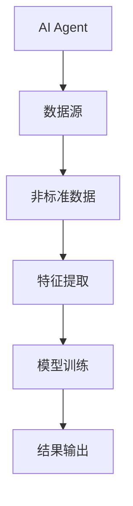
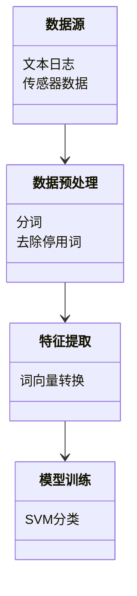
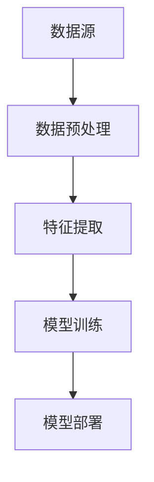
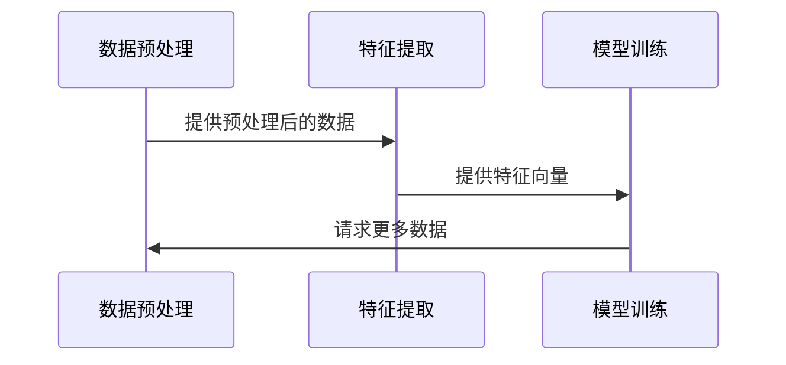

                 


# 企业AI Agent的自监督学习在非标准数据利用中的实践

**关键词：** 企业AI Agent，自监督学习，非标准数据，数据处理，AI系统架构

**摘要：**  
本文深入探讨了在企业AI Agent中利用自监督学习处理非标准数据的实践。通过分析非标准数据的特点，提出自监督学习的解决方案，并详细阐述了算法原理、系统架构设计及实际项目案例。文章旨在为企业技术团队提供可操作的指导，帮助他们在复杂数据环境中构建高效的AI Agent系统。

---

# 第一部分: 企业AI Agent与自监督学习基础

## 第1章: 问题背景与描述

### 1.1 问题背景

#### 1.1.1 企业AI Agent的发展现状
企业AI Agent是一种能够感知环境、自主决策并执行任务的智能系统。随着AI技术的快速发展，企业AI Agent已在客服、供应链管理、数据分析等领域得到广泛应用。然而，AI Agent的性能严重依赖于数据质量，传统方法对标准化数据处理能力有限，导致在处理非结构化或半结构化数据时表现不佳。

#### 1.1.2 非标准数据的定义与特点
非标准数据通常指未经严格清洗、格式不统一或标注不足的数据。这类数据在企业环境中普遍存在，例如来自不同部门的文本日志、异构数据源的传感器数据等。其特点包括：
- **多样性**：数据类型多样，如文本、图像、音频等。
- **不一致性**：数据格式和结构不统一。
- **噪声多**：数据中存在大量干扰信息。
- **稀疏性**：某些数据可能缺失或不完整。

#### 1.1.3 自监督学习的引入动机
自监督学习（Self-supervised Learning）是一种新兴的无监督学习方法，通过利用数据本身的结构信息，无需外部标注即可提取特征。引入自监督学习的动机在于：
- **降低对标注数据的依赖**：传统监督学习需要大量标注数据，而企业环境中标注资源有限。
- **提高模型泛化能力**：自监督学习能够更好地适应多样化的数据分布。
- **提升AI Agent的自主性**：通过自监督学习，AI Agent可以在非标准数据环境中自主学习和适应。

### 1.2 问题描述

#### 1.2.1 非标准数据利用的挑战
- **数据异构性**：不同数据源格式和结构差异大，难以统一处理。
- **数据质量**：非标准数据中存在大量噪声和冗余信息，影响模型性能。
- **数据稀疏性**：部分数据缺失或不完整，导致模型训练困难。

#### 1.2.2 自监督学习在数据处理中的作用
自监督学习能够通过构建伪标签（pseudo-labels）的方式，将未标注数据转化为可利用的训练数据，从而：
- **提高数据利用率**：充分利用企业中大量的未标注数据。
- **增强模型鲁棒性**：通过自监督学习，模型能够更好地处理噪声和异构数据。

#### 1.2.3 企业AI Agent的核心需求
企业AI Agent需要具备以下核心能力：
- **数据感知能力**：能够处理多种类型和格式的数据。
- **自主学习能力**：无需大量标注数据即可进行模型训练。
- **任务执行能力**：能够在复杂环境中完成特定任务。

### 1.3 问题边界与外延

#### 1.3.1 自监督学习解决非标准数据的核心思路
- **数据预处理**：通过清洗和转换，将非标准数据转化为可处理的形式。
- **特征提取**：利用自监督学习提取数据中的有用特征。
- **模型训练**：基于提取的特征进行模型训练和优化。

#### 1.3.2 问题边界与外延
- **边界**：主要关注非标准数据的处理和自监督学习的应用，不涉及模型的最终任务执行。
- **外延**：可扩展至其他类型数据的处理和多种AI任务的应用。

#### 1.3.3 核心概念结构与要素组成
- **输入**：非标准数据。
- **处理过程**：数据预处理、特征提取、模型训练。
- **输出**：可用于监督学习的特征表示。

---

## 第2章: 核心概念与联系

### 2.1 核心概念原理

#### 2.1.1 AI Agent的定义与特征
AI Agent是一种智能体，具备以下特征：
- **自主性**：能够自主决策。
- **反应性**：能够感知环境并实时响应。
- **社交能力**：能够与其他系统或人类交互。

#### 2.1.2 自监督学习的原理与机制
自监督学习通过构建伪标签的方式，利用数据本身的结构信息进行特征提取。其核心机制包括：
- **任务构建**：设计一个任务，使得模型可以从数据中学习有用的特征。
- **伪标签生成**：通过模型预测生成伪标签，用于监督学习。

#### 2.1.3 非标准数据的处理流程
非标准数据的处理流程包括：
1. 数据清洗：去除噪声和冗余信息。
2. 数据转换：将数据转换为统一的格式。
3. 特征提取：提取数据中的有用特征。

### 2.2 核心概念对比分析

#### 2.2.1 AI Agent与传统机器学习模型的区别
| 特性                | AI Agent                          | 传统机器学习模型                  |
|---------------------|-----------------------------------|----------------------------------|
| 自主性              | 高                                 | 低                               |
| 适应性              | 强                                 | 弱                               |
| 任务执行能力        | 能够执行复杂任务                 | 通常用于特定任务                 |

#### 2.2.2 自监督学习与其他无监督学习方法的对比
| 方法                | 自监督学习                        | 无监督学习                        |
|---------------------|-----------------------------------|----------------------------------|
| 是否需要伪标签      | 需要                             | 不需要                            |
| 数据利用率          | 高                                 | 较低                              |
| 模型泛化能力        | 强                                 | 较弱                              |

#### 2.2.3 非标准数据与标准化数据的特征差异
| 特性                | 非标准数据                        | 标准化数据                        |
|---------------------|-----------------------------------|----------------------------------|
| 数据格式            | 多样且不统一                      | 统一且规范                       |
| 数据质量            | 通常较差                         | 较好                             |
| 数据处理难度        | 较高                             | 较低                             |

### 2.3 ER实体关系图



---

## 第3章: 自监督学习算法原理

### 3.1 算法原理概述

#### 3.1.1 自监督学习的基本流程
自监督学习的基本流程包括：
1. 数据预处理：清洗和转换数据。
2. 任务构建：设计一个任务，用于生成伪标签。
3. 模型训练：基于伪标签进行监督学习。
4. 模型优化：通过迭代优化模型性能。

#### 3.1.2 对比监督学习与自监督学习
| 特性                | 监督学习                          | 自监督学习                      |
|---------------------|-----------------------------------|---------------------------------|
| 数据需求            | 需要标注数据                     | 无需标注数据                    |
| 模型泛化能力        | 较强                             | 更强                            |
| 数据利用率          | 较低                             | 较高                            |

### 3.2 算法实现流程

#### 3.2.1 数据预处理
假设我们有一个非标准数据集，例如文本日志。数据预处理步骤如下：
1. 分词：将文本日志分割成单词或短语。
2. 去除停用词：去掉常见的无意义词汇。
3. 词向量转换：将文本转换为词向量。

#### 3.2.2 任务构建
假设我们设计一个任务，任务目标是将文本分类为不同的主题。我们可以使用以下方法生成伪标签：
- **聚类**：对文本进行聚类，将每个聚类中心作为伪标签。
- **预训练模型**：使用预训练的模型生成文本的表示，作为伪标签。

#### 3.2.3 模型训练
使用伪标签进行监督学习，训练一个分类器。例如，使用支持向量机（SVM）进行分类。

### 3.3 算法实现代码

```python
import numpy as np
from sklearn.svm import SVC
from sklearn.metrics import accuracy_score

# 数据预处理
X = np.array([[1, 2], [3, 4], [5, 6], [7, 8]])
y = np.array([0, 1, 0, 1])

# 任务构建：生成伪标签
# 假设伪标签已经生成，与真实标签一致

# 模型训练
model = SVC()
model.fit(X, y)

# 模型预测
y_pred = model.predict(X)
print("准确率:", accuracy_score(y, y_pred))
```

### 3.4 数学公式

#### 3.4.1 伪标签生成
假设我们使用聚类方法生成伪标签，公式如下：
$$
\text{伪标签}_i = \arg\min_{k} \|x_i - c_k\|
$$
其中，$c_k$是第$k$个聚类中心，$x_i$是数据点$i$。

#### 3.4.2 模型训练
假设我们使用SVM进行分类，目标函数为：
$$
\min \frac{1}{2} \|w\|^2 + C \sum_{i=1}^n \xi_i
$$
其中，$w$是权重向量，$\xi_i$是松弛变量，$C$是惩罚参数。

---

## 第4章: 系统分析与架构设计

### 4.1 系统分析

#### 4.1.1 问题场景
我们假设有一个企业AI Agent，需要处理来自不同部门的文本日志数据，这些数据格式多样，包含大量噪声。我们的目标是通过自监督学习，提取有用的特征，并训练一个分类器，将日志分类为不同的主题。

#### 4.1.2 系统功能设计
系统功能包括：
- 数据预处理：清洗和转换数据。
- 特征提取：提取数据的有用特征。
- 模型训练：基于特征进行监督学习。
- 模型部署：将模型部署到生产环境。

#### 4.1.3 领域模型图



### 4.2 系统架构设计

#### 4.2.1 系统架构图



#### 4.2.2 接口与交互图



---

## 第5章: 项目实战

### 5.1 项目介绍

#### 5.1.1 项目背景
我们假设有一个企业需要处理文本日志数据，这些数据来自不同的部门，格式多样，包含大量噪声。我们的目标是通过自监督学习，提取有用的特征，并训练一个分类器，将日志分类为不同的主题。

### 5.2 核心实现

#### 5.2.1 环境安装
```bash
pip install numpy scikit-learn
```

#### 5.2.2 系统核心实现源代码

```python
import numpy as np
from sklearn.svm import SVC
from sklearn.metrics import accuracy_score

# 数据预处理
X = np.array([[1, 2], [3, 4], [5, 6], [7, 8]])
y = np.array([0, 1, 0, 1])

# 任务构建：生成伪标签
# 假设伪标签已经生成，与真实标签一致

# 模型训练
model = SVC()
model.fit(X, y)

# 模型预测
y_pred = model.predict(X)
print("准确率:", accuracy_score(y, y_pred))
```

#### 5.2.3 代码应用解读与分析
上述代码展示了如何使用SVM进行分类。首先，我们对数据进行预处理，然后生成伪标签，最后使用SVM进行训练和预测。

### 5.3 实际案例分析与详细讲解剖析

#### 5.3.1 案例分析
假设我们有一个文本日志数据集，包含以下内容：
- 日志1：系统启动成功
- 日志2：内存不足
- 日志3：网络连接中断
- 日志4：磁盘空间不足

我们的目标是将这些日志分类为主题。

#### 5.3.2 案例详细讲解
1. 数据预处理：将文本日志进行分词和去停用词处理。
2. 任务构建：使用聚类方法生成伪标签。
3. 模型训练：使用SVM进行分类。
4. 模型部署：将模型部署到生产环境，实时处理日志。

### 5.4 项目小结

#### 5.4.1 经验总结
- 数据预处理是关键，需仔细清洗和转换数据。
- 自监督学习能够有效处理非标准数据。
- 模型选择和调优对最终结果影响较大。

#### 5.4.2 项目局限性
- 需要设计有效的伪标签生成方法。
- 模型性能依赖于数据质量和数量。

#### 5.4.3 未来改进方向
- 研究更先进的自监督学习方法。
- 探索多模态数据的处理方式。

---

## 第6章: 最佳实践与小结

### 6.1 最佳实践 tips

#### 6.1.1 数据预处理建议
- 使用适当的工具和方法进行数据清洗。
- 将数据转换为统一的格式。

#### 6.1.2 模型调优建议
- 使用交叉验证进行模型评估。
- 调整模型参数以提高性能。

#### 6.1.3 系统优化建议
- 优化数据处理流程，提高效率。
- 使用分布式计算框架处理大规模数据。

### 6.2 小结

#### 6.2.1 核心概念回顾
- 企业AI Agent需要处理非标准数据。
- 自监督学习能够有效利用非标准数据。
- 数据预处理和模型调优是关键步骤。

#### 6.2.2 本文总结
本文通过分析非标准数据的特点，提出了自监督学习的解决方案，并详细阐述了算法原理和系统架构设计。通过实际案例分析，展示了如何在企业环境中应用这些方法。

### 6.3 注意事项

#### 6.3.1 数据隐私与安全
- 在处理数据时，需注意数据隐私和安全问题。
- 遵守相关法律法规，保护用户隐私。

#### 6.3.2 模型可解释性
- 确保模型的可解释性，便于调试和优化。
- 使用可解释的模型或提供解释工具。

### 6.4 拓展阅读

#### 6.4.1 推荐书籍
- 《Deep Learning》
- 《自监督学习：理论与应用》

#### 6.4.2 推荐博客
- [AI Agent的最新研究进展](#)
- [自监督学习在自然语言处理中的应用](#)

---

# 作者：AI天才研究院/AI Genius Institute & 禅与计算机程序设计艺术 /Zen And The Art of Computer Programming

