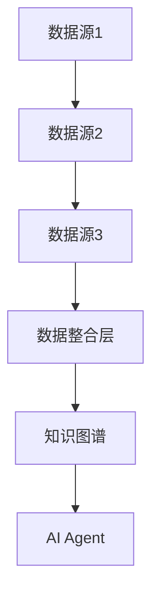
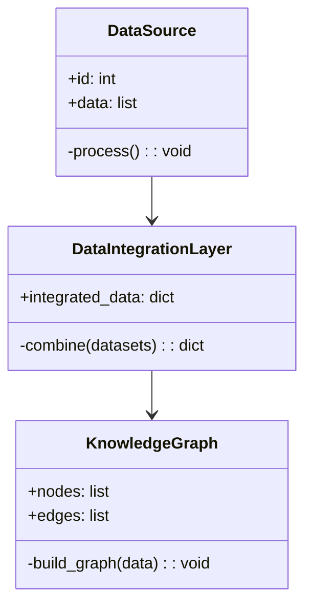
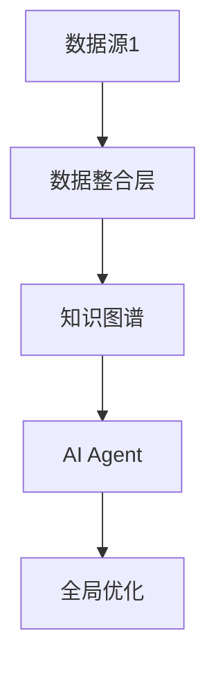
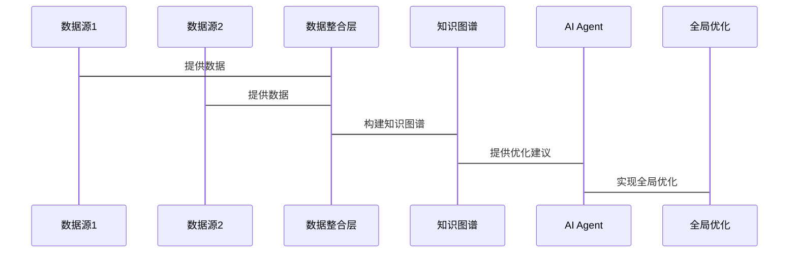

                 

<think>
好的，我需要帮用户撰写一篇关于企业AI Agent跨域学习的技术博客文章。首先，我需要理解用户的需求。用户提供了一个详细的目录大纲，要求文章结构清晰，内容丰富，使用专业而易懂的语言，并且包含图表和代码示例。

我应该从背景介绍开始，解释数据孤岛的问题及其对企业的负面影响。然后，引入AI Agent的概念，说明它如何帮助打破数据孤岛。接下来，详细阐述跨域学习的原理，包括其算法流程、数学模型和公式，以及如何应用于实际场景中。

在系统架构部分，我需要用图表展示领域模型和架构设计，帮助读者理解系统结构。项目实战部分，我需要提供具体的代码示例，指导读者如何安装环境并实现AI Agent。最后，总结经验，给出最佳实践建议。

确保每一部分都详细且逻辑连贯，同时符合用户的格式和内容要求。这样，读者能够系统地掌握相关知识，并能够在实际应用中运用这些技术。
</think>

# 企业AI Agent的跨域学习：打破数据孤岛，实现全局优化

## 关键词：企业AI Agent，跨域学习，数据孤岛，全局优化，多任务学习，知识图谱，分布式系统

## 摘要：本文详细探讨了企业AI Agent如何通过跨域学习打破数据孤岛，实现全局优化。文章从背景、概念、算法、系统架构到实战，全面解析了跨域学习在企业中的应用，提供了丰富的图表和代码示例，帮助读者深入理解并实践这一技术。

---

# 第1章: 企业AI Agent的背景与问题背景

## 1.1 数据孤岛与企业优化的挑战

### 1.1.1 数据孤岛的定义与表现形式
数据孤岛是指企业在不同部门、系统或业务单元中产生的数据无法有效整合和共享的现象。具体表现形式包括数据格式不统一、数据存储分散、数据访问权限限制等。

### 1.1.2 数据孤岛对企业全局优化的影响
数据孤岛导致企业无法充分利用数据资源，限制了决策的准确性和效率。例如，销售部门无法及时获取市场部的最新数据，导致错失市场机会。

### 1.1.3 跨域学习的必要性与核心目标
跨域学习通过整合不同领域或系统中的数据，提升AI Agent的决策能力和全局优化能力。其核心目标是实现数据的无缝整合与共享，打破信息孤岛。

## 1.2 企业AI Agent的定义与特点

### 1.2.1 AI Agent的基本概念
AI Agent是一种能够感知环境、执行任务并优化决策的智能体。它具备自主性、反应性、目标导向性和社交能力。

### 1.2.2 企业级AI Agent的独特属性
企业AI Agent具备高可用性、可扩展性、安全性以及对复杂业务场景的适应能力。

### 1.2.3 跨域学习在AI Agent中的作用
跨域学习使AI Agent能够跨越不同数据源和业务领域，实现全局优化。

## 1.3 跨域学习的核心概念与边界

### 1.3.1 跨域学习的定义与核心要素
跨域学习是指在多个领域或数据源之间进行知识迁移和数据整合的学习方法。

### 1.3.2 跨域学习与传统AI的区别
传统AI通常针对单一任务，而跨域学习能够处理多个任务和数据源。

### 1.3.3 跨域学习的边界与外延
跨域学习的边界包括数据源的数量和类型，外延则涉及数据融合和知识图谱构建。

## 1.4 本章小结
本章介绍了数据孤岛对企业的影响，AI Agent的基本概念，以及跨域学习的核心概念和边界。

---

# 第2章: 跨域学习的核心概念与联系

## 2.1 跨域学习的原理与机制

### 2.1.1 跨域学习的基本原理
跨域学习通过构建统一的知识表示，实现不同领域数据的融合与共享。

### 2.1.2 跨域学习的核心算法与流程
跨域学习的算法流程包括数据预处理、特征提取、模型训练和结果优化。

### 2.1.3 跨域学习的数学模型与公式
跨域学习的数学模型可以表示为联合概率分布：

$$P(x,y)$$

其中，$x$表示输入数据，$y$表示目标变量。

## 2.2 跨域学习与AI Agent的关系

### 2.2.1 跨域学习如何赋能AI Agent
跨域学习使AI Agent能够处理多种任务和数据源，提升其智能性。

### 2.2.2 AI Agent如何实现跨域数据整合
通过构建知识图谱，AI Agent可以整合不同领域数据，实现跨域学习。

### 2.2.3 跨域学习在AI Agent中的具体应用
跨域学习在AI Agent中的具体应用包括多任务学习、数据融合和知识迁移。

## 2.3 核心概念对比分析

### 2.3.1 跨域学习与数据集成的对比
| 对比维度 | 跨域学习 | 数据集成 |
|----------|----------|----------|
| 方法 | 知识迁移 | 数据合并 |
| 应用 | 多领域 | 单领域 |

### 2.3.2 跨域学习与多任务学习的对比
| 对比维度 | 跨域学习 | 多任务学习 |
|----------|----------|-----------|
| 数据源 | 多领域 | 多任务 |
| 目标 | 知识共享 | 性能提升 |

### 2.3.3 跨域学习与迁移学习的对比
| 对比维度 | 跨域学习 | 迁移学习 |
|----------|----------|----------|
| 数据 | 多领域 | 单领域 |
| 目标 | 全局优化 | 单点优化 |

## 2.4 ER实体关系图架构



## 2.5 本章小结
本章详细阐述了跨域学习的核心概念、原理和与AI Agent的关系，并通过对比分析和ER实体关系图帮助读者理解其应用。

---

# 第3章: 跨域学习的算法原理与实现

## 3.1 跨域学习算法的流程与步骤

### 3.1.1 数据预处理
数据预处理包括数据清洗、特征提取和格式统一。

### 3.1.2 跨域学习模型的构建
构建跨域学习模型需要选择合适的算法框架，如多任务学习或迁移学习。

### 3.1.3 模型训练与优化
通过分布式训练和超参数优化，提升模型的性能和泛化能力。

## 3.2 跨域学习的数学模型与公式

### 3.2.1 联合概率分布
跨域学习的目标是最大化联合概率分布：

$$P(x,y) = \arg\max \sum_{i=1}^{n} P(x_i, y_i)$$

### 3.2.2 条件概率模型
条件概率模型可以表示为：

$$P(y|x) = \arg\max \sum_{i=1}^{n} P(y_i|x_i)$$

## 3.3 跨域学习算法的Python实现

```python
import numpy as np
from sklearn.model_selection import train_test_split

def cross_domain_learning(data_sources):
    # 数据预处理
    processed_data = [preprocess(ds) for ds in data_sources]
    # 数据整合
    combined_data = combine(processed_data)
    # 模型训练
    model = train(combined_data)
    return model

def preprocess(ds):
    # 数据清洗和特征提取
    pass

def combine(datasets):
    # 数据合并
    pass

def train(data):
    # 模型训练
    pass
```

## 3.4 本章小结
本章详细讲解了跨域学习算法的流程、数学模型和Python实现，为读者提供了理论和实践的基础。

---

# 第4章: 系统分析与架构设计

## 4.1 问题场景介绍

### 4.1.1 业务背景
企业面临数据孤岛问题，需要通过跨域学习实现全局优化。

### 4.1.2 项目目标
构建一个基于AI Agent的跨域学习系统，整合多领域数据，提升企业决策能力。

## 4.2 系统功能设计

### 4.2.1 领域模型设计
领域模型包括数据源、数据整合层和知识图谱。



### 4.2.2 系统架构设计
系统架构包括数据源、数据整合层、知识图谱和AI Agent。



## 4.3 系统接口设计

### 4.3.1 数据源接口
数据源接口负责数据的获取和预处理。

### 4.3.2 数据整合接口
数据整合接口负责将不同数据源的数据合并到统一的数据结构中。

## 4.4 系统交互设计

### 4.4.1 系统交互流程
系统交互流程包括数据获取、数据整合、知识图谱构建和全局优化。



## 4.5 本章小结
本章通过系统分析和架构设计，展示了如何将跨域学习应用于企业AI Agent的构建中。

---

# 第5章: 项目实战与案例分析

## 5.1 环境安装与配置

### 5.1.1 Python环境配置
安装必要的Python库，如numpy、scikit-learn和networkx。

### 5.1.2 系统依赖安装
安装系统所需的依赖项，如数据可视化工具和AI框架。

## 5.2 核心代码实现

### 5.2.1 数据整合与知识图谱构建

```python
import networkx as nx

def build_knowledge_graph(data):
    graph = nx.DiGraph()
    for item in data:
        graph.add_node(item['name'])
        for relation in item['relations']:
            graph.add_edge(item['name'], relation['target'])
    return graph
```

### 5.2.2 AI Agent实现

```python
class AIAssistant:
    def __init__(self, knowledge_graph):
        self.knowledge_graph = knowledge_graph

    def query(self, question):
        # 在知识图谱中查询答案
        pass
```

## 5.3 代码解读与分析

### 5.3.1 数据整合代码解读
数据整合代码将多个数据源的数据合并到一个统一的数据结构中。

### 5.3.2 知识图谱构建代码解读
知识图谱构建代码基于整合后的数据，构建一个有向图，表示数据之间的关系。

## 5.4 实际案例分析

### 5.4.1 案例背景
某企业面临销售和市场数据孤岛问题，希望通过跨域学习实现全局优化。

### 5.4.2 数据整合与分析
通过数据整合和知识图谱构建，企业能够更好地理解销售和市场数据之间的关系。

### 5.4.3 全局优化实现
基于整合后的数据和知识图谱，AI Agent能够提供更准确的销售预测和市场策略建议。

## 5.5 本章小结
本章通过项目实战，展示了如何将跨域学习应用于企业AI Agent的构建中，并通过实际案例分析验证了其有效性。

---

# 第6章: 最佳实践与总结

## 6.1 最佳实践 tips

### 6.1.1 数据整合的关键点
确保数据格式统一，避免数据丢失和重复。

### 6.1.2 知识图谱构建的注意事项
选择合适的关系表示方法，确保知识图谱的可扩展性。

## 6.2 本章总结
本文详细探讨了企业AI Agent的跨域学习，从背景、概念、算法到系统架构和项目实战，为读者提供了全面的理论和实践指导。

## 6.3 展望与未来方向
未来，跨域学习将在企业AI Agent中发挥更大的作用，推动企业全局优化和智能决策。

---

# 作者：AI天才研究院/AI Genius Institute & 禅与计算机程序设计艺术 /Zen And The Art of Computer Programming

