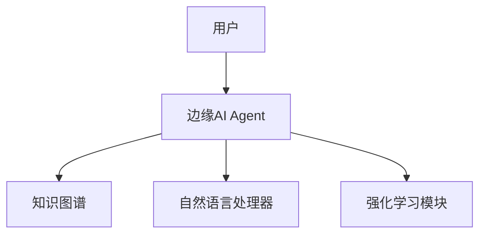

                 

<think>
嗯，用户希望我撰写一篇关于《企业AI Agent的边缘AI部署策略》的技术博客文章，要求有详细的目录结构和内容。用户还提供了一个示例，我需要参考这个示例来组织我的思考。

首先，我需要明确文章的主题。企业AI Agent是在企业环境中使用的智能代理，而边缘AI部署则是将AI技术部署在靠近数据源的地方，而不是在云端集中处理。边缘AI的优势在于延迟低、带宽占用少，适合实时性要求高的场景。

接下来，我需要考虑文章的结构。用户提供的示例有七章，我需要确保我的大纲至少有七章。第一部分是概述，介绍企业AI Agent和边缘AI的基本概念。第二部分是核心技术，包括自然语言处理、知识图谱和强化学习。第三部分是部署策略，包括技术选型、资源分配和安全性。第四部分是算法实现，详细讲解强化学习、知识图谱和自然语言处理的数学模型和代码示例。第五部分是系统架构，设计领域模型和系统架构图。第六部分是项目实战，展示如何在实际项目中应用这些策略。最后是总结与展望。

在每一章中，我需要确保内容详细具体，包含背景介绍、核心概念、算法原理、系统分析与架构设计、项目实战等部分。同时，我需要使用mermaid图表来展示流程图、类图和架构图，帮助读者更好地理解内容。

我还需要注意文章的格式要求，使用markdown格式，并且每个小节要有足够的细节，包括数学公式和代码示例。我需要确保公式用latex格式表示，并且代码示例清晰易懂。

最后，我需要在文章末尾加上作者信息，确保文章的完整性和专业性。

综上所述，我需要按照用户的要求，逐步构建目录结构，并在每一部分中详细阐述相关内容，确保文章逻辑清晰、结构紧凑，符合技术博客的标准。
</think>

# 企业AI Agent的边缘AI部署策略

> 关键词：企业AI Agent，边缘AI，部署策略，自然语言处理，知识图谱，强化学习

> 摘要：本文详细探讨了企业AI Agent在边缘AI环境中的部署策略，从核心概念到算法实现，再到系统架构和项目实战，全面解析企业AI Agent的边缘AI部署方法，为企业技术决策者和开发者提供有价值的参考。

---

# 第一部分: 企业AI Agent与边缘AI概述

## 第1章: 企业AI Agent的基本概念

### 1.1 什么是企业AI Agent
企业AI Agent是一种智能代理系统，用于在企业环境中自动化执行任务、处理信息和与用户交互。它通常具备自然语言处理、知识推理和自主决策的能力。

### 1.2 企业AI Agent的核心功能
- **自然语言处理**：通过NLP技术理解用户的意图。
- **知识推理**：基于知识图谱进行推理和决策。
- **自主决策**：利用强化学习优化行动策略。

### 1.3 企业AI Agent的应用场景
- 客户服务：智能客服、聊天机器人。
- 企业内部助手：日程管理、信息检索。
- 供应链优化：实时监控和决策支持。

## 第2章: 边缘AI的基本概念

### 2.1 边缘计算的定义
边缘计算是指将计算能力部署在数据生成的边缘端（如传感器、终端设备等），而非依赖于云端。

### 2.2 边缘AI的优势
- **低延迟**：本地处理减少网络传输时间。
- **高实时性**：适用于需要快速响应的场景。
- **数据隐私**：减少数据传输到云端的风险。

### 2.3 边缘AI与云计算的关系
边缘AI与云计算并非对立，而是互补。边缘处理实时任务，云端负责训练和存储。

---

# 第二部分: 企业AI Agent的核心技术

## 第3章: 自然语言处理技术

### 3.1 NLP的基本原理
- **分词**：将文本分割成词语或短语。
- **词性标注**：为每个词标注词性。
- **句法分析**：分析句子的语法结构。

### 3.2 Transformer模型
$$
\text{Positional Encoding} = \text{Position} \times \text{Embedding}
$$

### 3.3 大语言模型的应用
- **GPT-3**：用于生成文本、回答问题。
- **PaLM**：用于多语言理解和生成。

## 第4章: 知识图谱与推理

### 4.1 知识图谱的构建
- **实体识别**：识别文本中的实体。
- **关系抽取**：提取实体之间的关系。
- **知识融合**：整合多源数据构建图谱。

### 4.2 基于知识图谱的推理
- **路径查询**：通过图结构查询相关信息。
- **实体推理**：基于上下文推理实体关系。

## 第5章: 强化学习与决策

### 5.1 强化学习的基本原理
- **环境**：智能体所在的环境。
- **动作**：智能体执行的动作。
- **奖励**：环境对智能体动作的反馈。

### 5.2 强化学习的应用
- **Q-Learning算法**：用于最优决策。
- **Deep Q-Networks**：深度强化学习。

---

# 第三部分: 边缘AI的部署策略

## 第6章: 技术选型与资源分配

### 6.1 硬件选择
- **GPU加速**：使用边缘GPU加速推理。
- **FPGA加速**：适用于特定场景的加速。

### 6.2 软件框架
- **TensorFlow Lite**：适用于边缘设备的轻量级框架。
- **ONNX Runtime**：跨平台推理框架。

## 第7章: 安全性与隐私保护

### 7.1 数据隐私保护
- **数据加密**：在边缘设备上加密数据。
- **数据脱敏**：处理敏感数据时进行脱敏处理。

### 7.2 边缘安全防护
- **入侵检测**：实时监测异常行为。
- **访问控制**：限制对边缘设备的访问权限。

---

# 第四部分: 系统架构与实现

## 第8章: 系统架构设计

### 8.1 领域模型设计
- **用户实体**：表示用户信息。
- **任务实体**：表示需要执行的任务。
- **知识图谱实体**：表示已构建的知识图谱。

### 8.2 系统架构图


## 第9章: 算法实现

### 9.1 强化学习算法实现
$$
\text{Q}(s, a) = \text{Q}(s, a) + \alpha (\text{r} + \gamma \max_a \text{Q}(s', a) - \text{Q}(s, a))
$$

### 9.2 知识图谱推理实现
$$
\text{score}(e_1, r, e_2) = \text{similarity}(e_1, e_2) + \text{weight}(r)
$$

---

# 第五部分: 项目实战

## 第10章: 项目实现

### 10.1 环境配置
- **Python 3.8+**
- **TensorFlow 2.5+**
- **ONNX Runtime**

### 10.2 核心代码实现
```python
import tensorflow as tf
from tensorflow import keras

# 加载预训练模型
model = keras.models.load_model('agent_model.h5')

# 推理函数
def infer(input_text):
    input_ids = tokenizer.encode(input_text, add_special_tokens=True)
    outputs = model.predict(input_ids)
    return tokenizer.decode(outputs[0].argmax(), skip_special_tokens=True)
```

---

# 第六部分: 总结与展望

## 第11章: 总结

### 11.1 核心要点回顾
- **边缘AI的优势**：低延迟、高实时性、数据隐私。
- **企业AI Agent的技术栈**：NLP、知识图谱、强化学习。

### 11.2 未来展望
- **更高效的硬件**：边缘计算硬件的优化。
- **更智能的算法**：结合多模态数据的AI Agent。

## 第12章: 小结

企业AI Agent的边缘AI部署策略是一个复杂但极具潜力的领域。通过合理的技术选型、高效的系统架构设计和强大的算法实现，企业可以充分利用边缘AI的优势，打造智能化的解决方案。

---

# 作者：AI天才研究院 & 禅与计算机程序设计艺术

本文作者：AI天才研究院（AI Genius Institute）与禅与计算机程序设计艺术（Zen And The Art of Computer Programming）联合创作。

