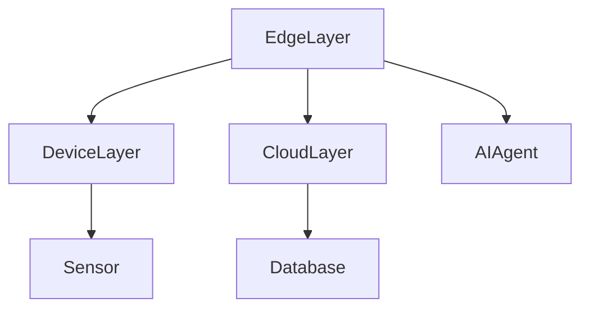
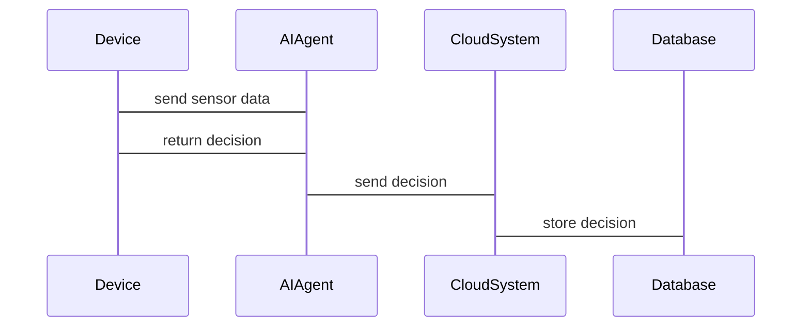
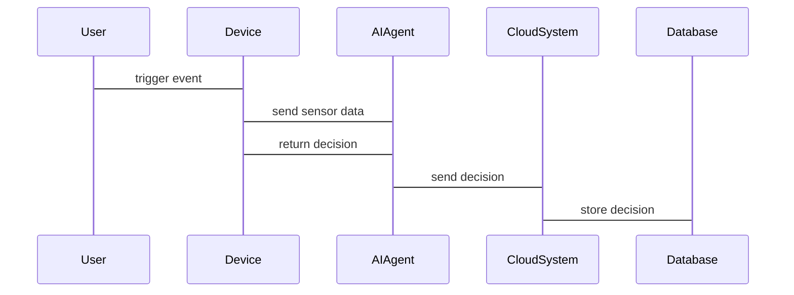

                 


```markdown
# 企业AI Agent的边缘计算在工业物联网中的实践

## 关键词：企业AI Agent，边缘计算，工业物联网，系统架构，项目实战

## 摘要：  
本文探讨了企业AI Agent在边缘计算中的应用及其在工业物联网中的实践。通过分析AI Agent的核心技术、边缘计算的技术细节以及工业物联网的系统架构，展示了如何将AI Agent与边缘计算结合，以提升工业物联网的智能化水平。文章详细介绍了系统的架构设计、项目实现案例，并提出了优化建议和最佳实践，为企业的技术决策提供了参考。

---

## 第1章: 企业AI Agent的边缘计算与工业物联网概述

### 1.1 企业AI Agent的概念与特点
#### 1.1.1 AI Agent的基本定义
AI Agent（人工智能代理）是一种能够感知环境并采取行动以实现目标的智能实体。它能够通过传感器获取数据，利用算法进行分析，并根据结果做出决策。

#### 1.1.2 企业AI Agent的核心特点
- **自主性**：能够在没有外部干预的情况下独立运行。
- **反应性**：能够实时感知环境变化并做出响应。
- **目标导向**：所有行动都是为了实现特定目标。

#### 1.1.3 AI Agent在企业中的作用与价值
- **优化流程**：通过自动化决策提升企业运营效率。
- **实时响应**：在工业物联网中实现快速问题解决。
- **降低成本**：通过预测性维护减少设备故障和维护成本。

### 1.2 边缘计算的概念与特点
#### 1.2.1 边缘计算的基本定义
边缘计算是一种分布式计算范式，将计算能力从云端转移到数据生成的边缘设备，如传感器、工业设备等。

#### 1.2.2 边缘计算的核心特点
- **低延迟**：数据在边缘处理，减少传输延迟。
- **高实时性**：能够快速响应实时事件。
- **数据隐私**：数据在边缘处理，减少传输过程中的隐私泄露风险。

#### 1.2.3 边缘计算与云计算的区别与联系
- **区别**：边缘计算将数据处理放在边缘设备，而云计算依赖中心化的云服务器。
- **联系**：边缘计算可以作为云计算的补充，两者结合可以实现更高效的资源利用。

### 1.3 工业物联网的概念与架构
#### 1.3.1 工业物联网的基本定义
工业物联网（IIoT）是将物联网技术应用于工业领域，通过连接各种工业设备、传感器和系统，实现智能化的生产、监测和管理。

#### 1.3.2 工业物联网的典型架构
工业物联网的典型架构包括感知层、网络层、平台层和应用层。

#### 1.3.3 工业物联网的应用场景与挑战
- **应用场景**：设备监控、预测性维护、质量控制、供应链管理等。
- **挑战**：数据量大、实时性要求高、设备多样性、安全性问题。

### 1.4 AI Agent与边缘计算的结合
#### 1.4.1 AI Agent在边缘计算中的作用
AI Agent可以作为边缘计算的核心，负责数据的采集、分析、决策和执行。

#### 1.4.2 边缘计算如何赋能工业物联网
边缘计算通过将AI Agent部署在边缘设备，实现了工业物联网的智能化和实时性。

#### 1.4.3 企业AI Agent的边缘计算实践中的关键问题
- **资源分配**：如何在边缘设备上合理分配计算资源。
- **数据隐私**：如何保护数据在边缘处理过程中的隐私和安全。
- **通信机制**：如何实现边缘设备与云端或其他设备之间的高效通信。

### 1.5 本章小结
本章介绍了企业AI Agent、边缘计算和工业物联网的基本概念和特点，并探讨了AI Agent与边缘计算在工业物联网中的结合及其关键问题。

---

## 第2章: AI Agent的核心技术与原理

### 2.1 AI Agent的定义与分类
#### 2.1.1 AI Agent的定义
AI Agent是一种能够感知环境、自主决策并采取行动以实现目标的智能实体。

#### 2.1.2 AI Agent的分类
AI Agent可以分为基于规则的Agent、基于模型的Agent、基于学习的Agent和基于进化计算的Agent。

#### 2.1.3 各类AI Agent的特点与应用场景
- **基于规则的Agent**：适用于规则明确、场景简单的任务。
- **基于模型的Agent**：适用于复杂环境，能够建模和推理。
- **基于学习的Agent**：能够通过学习不断优化自身行为。
- **基于进化计算的Agent**：适用于动态变化的复杂环境。

### 2.2 AI Agent的架构与设计原则
#### 2.2.1 AI Agent的典型架构
AI Agent的典型架构包括感知层、推理层、决策层和执行层。

#### 2.2.2 AI Agent的设计原则
- **目标明确**：明确AI Agent的目标和任务。
- **自主性**：能够独立感知环境并采取行动。
- **可扩展性**：能够适应不同的应用场景和规模。

#### 2.2.3 AI Agent的开发流程
AI Agent的开发流程包括需求分析、算法设计、系统实现、测试与优化。

### 2.3 AI Agent在边缘计算中的实现
#### 2.3.1 边缘计算环境下的AI Agent设计
在边缘计算环境中，AI Agent需要考虑计算资源的限制和实时性要求。

#### 2.3.2 边缘计算中AI Agent的资源分配与优化
- **资源分配**：根据任务优先级和资源需求合理分配计算资源。
- **优化方法**：通过算法优化和资源虚拟化技术实现资源的高效利用。

#### 2.3.3 边缘计算中AI Agent的通信机制
AI Agent在边缘计算中的通信机制需要考虑低延迟、高可靠性和数据隐私。

### 2.4 本章小结
本章详细介绍了AI Agent的核心技术与原理，探讨了其在边缘计算中的实现方法和优化策略。

---

## 第3章: 边缘计算的技术细节与实现

### 3.1 边缘计算的体系结构
#### 3.1.1 边缘计算的分层架构
边缘计算的分层架构包括设备层、边缘计算层和云端层。

#### 3.1.2 边缘计算中的设备层
设备层包括各种传感器和工业设备，负责数据的采集和初步处理。

#### 3.1.3 边缘计算中的计算层
计算层负责对数据进行分析、处理和决策，通常部署AI Agent。

### 3.2 边缘计算的关键技术
#### 3.2.1 边缘计算中的数据处理技术
数据处理技术包括数据清洗、特征提取和数据压缩。

#### 3.2.2 边缘计算中的资源管理技术
资源管理技术包括资源分配、负载均衡和资源调度。

#### 3.2.3 边缘计算中的安全性保障技术
安全性保障技术包括加密传输、访问控制和数据隐私保护。

### 3.3 边缘计算与工业物联网的结合
#### 3.3.1 工业物联网中的边缘计算架构
工业物联网中的边缘计算架构包括设备层、边缘层和云端层。

#### 3.3.2 边缘计算在工业物联网中的应用场景
边缘计算在工业物联网中的应用场景包括预测性维护、质量控制和供应链优化。

### 3.4 本章小结
本章详细介绍了边缘计算的技术细节与实现，探讨了其在工业物联网中的应用场景和优势。

---

## 第4章: AI Agent的系统架构设计

### 4.1 系统功能设计
#### 4.1.1 系统功能概述
系统功能包括数据采集、数据处理、AI推理和决策执行。

#### 4.1.2 系统功能设计的领域模型
领域模型包括设备、传感器、AI Agent和云端系统。

#### 4.1.3 系统功能设计的类图
```mermaid
classDiagram
    class Device {
        -id: int
        -name: string
        +readSensor(): SensorData
    }
    class Sensor {
        -id: int
        -type: string
        +getData(): float
    }
    class AIAgent {
        -id: int
        -model: string
        +processData(data: SensorData): Decision
    }
    class CloudSystem {
        -id: int
        -data: list[SensorData]
        +receiveDecision(decision: Decision): void
    }
    Device o Sensor
    Device --> AIAgent
    AIAgent --> CloudSystem
```

### 4.2 系统架构设计
#### 4.2.1 系统架构概述
系统架构包括设备层、边缘层和云端层。

#### 4.2.2 系统架构设计的架构图


### 4.3 系统接口设计
#### 4.3.1 系统接口概述
系统接口包括设备与边缘层的接口、边缘层与云端的接口。

#### 4.3.2 系统接口设计的接口图


### 4.4 系统交互设计
#### 4.4.1 系统交互概述
系统交互包括数据采集、数据处理、决策执行和数据存储。

#### 4.4.2 系统交互设计的交互图


### 4.5 本章小结
本章详细介绍了AI Agent的系统架构设计，包括功能设计、架构设计、接口设计和交互设计。

---

## 第5章: AI Agent的项目实战

### 5.1 项目背景与目标
#### 5.1.1 项目背景
项目旨在通过AI Agent实现工业设备的预测性维护。

#### 5.1.2 项目目标
通过部署AI Agent在边缘设备，实现设备故障的早期预测和维护。

### 5.2 项目环境搭建
#### 5.2.1 硬件环境
需要部署工业设备、传感器和边缘计算设备。

#### 5.2.2 软件环境
需要安装边缘计算框架、AI Agent框架和云端管理系统。

### 5.3 项目核心代码实现
#### 5.3.1 AI Agent的核心代码
```python
class AIAgent:
    def __init__(self, model):
        self.model = model

    def process_data(self, data):
        return self.model.predict(data)
```

#### 5.3.2 边缘计算的实现代码
```python
class EdgeCompute:
    def __init__(self, devices):
        self.devices = devices

    def process_data(self):
        for device in self.devices:
            data = device.read_sensor()
            decision = self.agent.process_data(data)
            device.execute_decision(decision)
```

### 5.4 项目案例分析与实现
#### 5.4.1 案例背景
某制造企业希望通过AI Agent实现设备的预测性维护。

#### 5.4.2 实现过程
- **数据采集**：传感器数据通过设备采集并传输到边缘计算设备。
- **数据处理**：边缘计算设备中的AI Agent对数据进行分析和预测。
- **决策执行**：AI Agent根据分析结果生成维护指令并执行。

### 5.5 项目总结
#### 5.5.1 项目成果
成功实现了工业设备的预测性维护，减少了设备故障率和维护成本。

#### 5.5.2 经验与教训
- **经验**：AI Agent的部署需要充分考虑边缘设备的计算能力和资源限制。
- **教训**：数据隐私和安全性问题需要在设计阶段充分考虑。

### 5.6 本章小结
本章通过一个实际项目展示了AI Agent在工业物联网中的应用，详细描述了项目的实施过程和成果。

---

## 第6章: AI Agent与边缘计算的优化与最佳实践

### 6.1 优化策略
#### 6.1.1 模型优化
通过模型压缩和剪枝技术优化AI Agent的计算效率。

#### 6.1.2 资源分配优化
根据任务需求和设备资源合理分配计算资源。

#### 6.1.3 数据隐私优化
通过加密和数据脱敏技术保护数据隐私。

### 6.2 边缘计算的优化策略
#### 6.2.1 网络优化
通过网络切片和边缘缓存技术优化网络性能。

#### 6.2.2 设备管理优化
通过设备虚拟化和设备协同技术优化设备管理。

### 6.3 最佳实践
#### 6.3.1 工具推荐
推荐使用Kubernetes、Docker和边缘计算框架如K3s。

#### 6.3.2 注意事项
- **数据一致性**：确保边缘设备与云端的数据一致性。
- **安全性**：加强数据传输和存储的安全性。
- **可扩展性**：设计可扩展的系统架构，以应对业务增长。

### 6.4 本章小结
本章提出了AI Agent与边缘计算的优化策略，并提供了最佳实践和工具推荐。

---

## 第7章: 总结与展望

### 7.1 全文总结
本文详细探讨了企业AI Agent在边缘计算中的应用及其在工业物联网中的实践。通过分析AI Agent的核心技术、边缘计算的技术细节以及工业物联网的系统架构，展示了如何将AI Agent与边缘计算结合，以提升工业物联网的智能化水平。

### 7.2 未来展望
未来，随着AI技术的不断发展和边缘计算的广泛应用，企业AI Agent将在工业物联网中发挥更加重要的作用。未来的研究方向包括AI Agent的自适应学习能力、边缘计算的资源优化和工业物联网的智能化升级。

### 7.3 本章小结
本章总结了全文的主要内容，并展望了未来的发展方向。

---

## 作者：AI天才研究院 & 禅与计算机程序设计艺术
```

