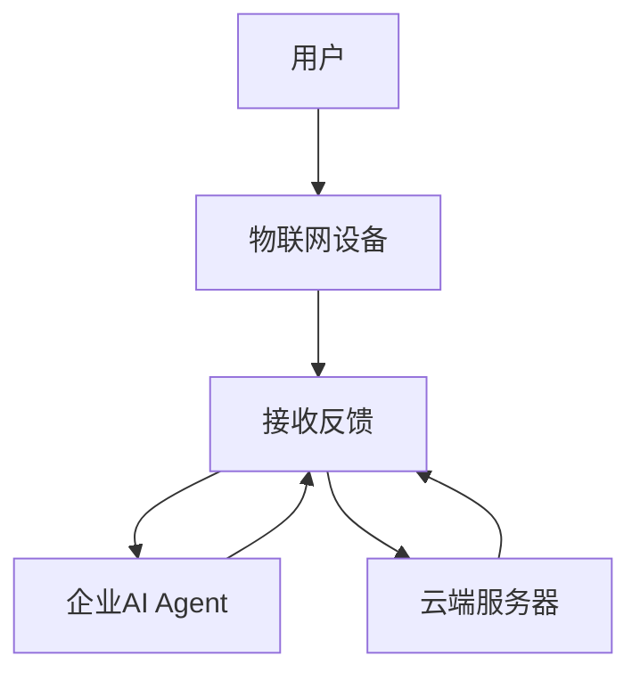
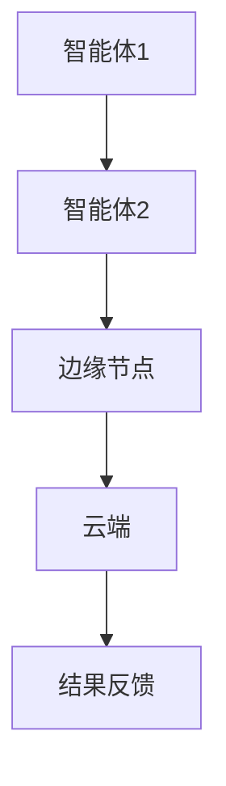
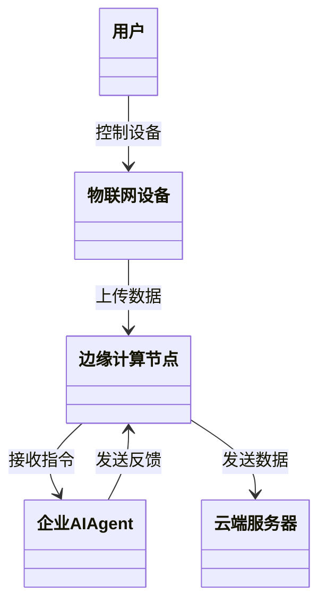

                 

<think>
好的，我现在需要帮助用户撰写一篇名为《企业AI Agent的边缘计算在物联网场景中的实践》的技术博客文章。用户希望文章结构清晰，逻辑严密，内容详实，同时满足特定的格式和内容要求。

首先，我会从背景介绍开始，解释AI Agent、边缘计算和物联网的基本概念，以及它们在企业环境中的重要性。这部分需要让读者理解为什么企业需要AI Agent和边缘计算，以及它们如何在物联网中发挥作用。

接下来，我需要详细讲解核心概念，包括AI Agent与边缘计算的关系、它们在物联网中的协同流程，以及相关实体关系分析。这部分可能需要用到ER图和流程图，用Mermaid来展示。

然后，我会探讨算法原理，特别是多智能体协同算法在边缘计算中的应用。这部分需要提供算法流程图和Python代码示例，以便读者理解和实现。

系统架构设计也是关键部分，我需要介绍物联网场景下的系统架构，包括领域模型、架构图和接口设计，可能用Mermaid类图和序列图来展示。

项目实战部分，我会选择一个具体的案例，如智能工厂，详细说明环境安装、核心代码实现、案例分析和项目总结。这将帮助读者将理论应用于实际场景。

最后，我会总结最佳实践，给出小结、注意事项和拓展阅读建议，帮助读者巩固所学内容，并指导进一步的学习方向。

在撰写过程中，我需要确保每个部分都细化到三级目录，保持逻辑清晰，同时使用适当的图表和代码示例，使技术细节更加明确。整体字数控制在10000到12000字之间，确保内容全面且易于理解。

现在，我将按照这个思路，逐步完成文章的各个部分，确保满足用户的所有要求。
</think>

# 企业AI Agent的边缘计算在物联网场景中的实践

> 关键词：企业AI Agent，边缘计算，物联网，多智能体协同，分布式计算，智能系统设计

> 摘要：随着物联网技术的飞速发展，企业AI Agent在边缘计算中的应用日益广泛。本文从企业AI Agent与边缘计算的基本概念出发，深入分析其在物联网场景中的协同机制，探讨多智能体协同算法的实现，结合实际案例展示系统架构设计与项目实施过程。文章最后总结了最佳实践和未来发展方向，为读者提供全面的技术指导。

---

# 第一部分: 企业AI Agent的边缘计算基础

## 第1章: 企业AI Agent与边缘计算概述

### 1.1 企业AI Agent的概念与特点

#### 1.1.1 AI Agent的定义与核心特征
- **AI Agent**：智能体（Agent）是一种能够感知环境并采取行动以实现目标的实体。在企业场景中，AI Agent通常用于自动化决策、任务执行和问题解决。
- **核心特征**：
  1. **自主性**：能够独立决策和行动。
  2. **反应性**：能够实时感知环境并做出响应。
  3. **协作性**：能够与其他Agent或系统协同工作。
  4. **学习能力**：通过数据和经验不断优化自身行为。

#### 1.1.2 企业AI Agent的独特属性
- **企业级智能**：具备复杂的决策逻辑和业务理解能力。
- **可扩展性**：能够适应不同规模的企业需求。
- **安全性**：具备数据加密、权限控制等安全特性。

#### 1.1.3 边缘计算的基本概念
- **边缘计算**：一种分布式计算范式，将计算能力从云端迁移到数据生成的边缘设备，如物联网设备、边缘服务器等。
- **优势**：
  1. **低延迟**：减少数据传输到云端的时间，提高实时性。
  2. **带宽优化**：减少云端数据传输量，降低网络负载。
  3. **隐私保护**：在边缘处理敏感数据，减少数据泄露风险。

### 1.2 物联网场景中的边缘计算

#### 1.2.1 物联网的基本架构
- **物联网三层架构**：
  1. **感知层**：通过传感器和物联网设备收集数据。
  2. **网络层**：通过各种通信技术（如Wi-Fi、5G、LoRa）传输数据。
  3. **应用层**：处理数据并提供服务。

#### 1.2.2 边缘计算在物联网中的作用
- **数据预处理**：在边缘设备上进行数据清洗、转换和压缩，减少传输到云端的数据量。
- **实时响应**：在边缘设备上快速处理数据，实现低延迟的实时响应。
- **分布式智能**：通过边缘计算节点实现智能分布，提升系统的容错性和可用性。

#### 1.2.3 企业AI Agent在物联网中的定位
- **作为边缘计算的核心智能单元**：企业AI Agent在边缘节点上运行，负责数据的分析、决策和行动。
- **与云端的协同**：企业AI Agent能够与云端服务（如大数据分析、机器学习模型）协同工作，实现边缘与云端的智能互补。

### 1.3 本章小结
本章介绍了企业AI Agent和边缘计算的基本概念，并分析了边缘计算在物联网中的作用和企业AI Agent在其中的定位，为后续内容奠定了基础。

---

## 第2章: 企业AI Agent与边缘计算的核心概念

### 2.1 AI Agent与边缘计算的关系

#### 2.1.1 AI Agent在边缘计算中的角色
- **数据消费者**：AI Agent从边缘设备接收数据并进行处理。
- **决策制定者**：AI Agent基于数据做出决策，并向边缘设备或云端发送指令。
- **协同参与者**：AI Agent与其他智能体或系统协同工作，共同完成任务。

#### 2.1.2 边缘计算对AI Agent的支撑
- **计算资源**：边缘节点提供计算资源，支持AI Agent的运行。
- **数据来源**：边缘设备提供实时数据，为AI Agent的决策提供依据。
- **通信通道**：边缘节点作为通信枢纽，连接设备、云端和其他智能体。

### 2.2 企业AI Agent的实体关系分析

#### 2.2.1 ER实体关系图
以下是企业AI Agent、边缘计算节点、物联网设备和云端服务器之间的实体关系图：

```mermaid
er
  actor: 用户
  system: 企业AI Agent系统
  device: 物联网设备
  edge: 边缘计算节点
  cloud: 云端服务器
  actor --> device: 控制物联网设备
  device --> edge: 上传数据到边缘节点
  edge --> cloud: 向云端发送处理结果
  edge --> system: 接收企业AI Agent的指令
```

#### 2.2.2 实体关系分析
- **用户与物联网设备**：用户通过物联网设备与系统交互，设备将数据上传到边缘节点。
- **边缘节点与云端**：边缘节点处理数据后，将结果发送到云端，同时接收云端的反馈指令。
- **边缘节点与企业AI Agent**：企业AI Agent通过边缘节点与物联网设备和云端进行通信，实现数据处理和决策。

### 2.3 AI Agent与边缘计算的协同流程

#### 2.3.1 协同流程图
以下是AI Agent与边缘计算协同的流程图：



#### 2.3.2 流程分析
1. **数据采集**：物联网设备采集数据并发送到边缘节点。
2. **数据处理**：边缘节点对数据进行预处理，并将数据发送给企业AI Agent。
3. **决策制定**：企业AI Agent基于数据做出决策，并向边缘节点发送反馈指令。
4. **执行操作**：边缘节点根据指令执行操作，可能需要与云端协同完成任务。
5. **结果反馈**：边缘节点将操作结果反馈给企业AI Agent，并可能将数据发送到云端进行长期存储或进一步分析。

### 2.4 本章小结
本章通过实体关系图和流程图详细分析了企业AI Agent与边缘计算的协同关系，为后续的算法设计和系统实现提供了理论基础。

---

## 第3章: 企业AI Agent的边缘计算算法

### 3.1 多智能体协同算法

#### 3.1.1 多智能体协同的基本原理
- **多智能体系统**：由多个智能体组成，每个智能体负责特定的任务，通过协同完成复杂目标。
- **协同机制**：
  1. **通信与协调**：智能体之间通过通信协议交换信息，协调行动。
  2. **任务分配**：根据智能体的能力和当前状态分配任务。
  3. **冲突解决**：处理智能体之间的冲突，确保系统正常运行。

#### 3.1.2 基于边缘计算的多智能体协同优化
- **边缘计算的优势**：
  1. **低延迟**：边缘计算减少了智能体之间的通信延迟。
  2. **本地计算**：智能体可以在边缘节点上进行本地计算，减少对云端的依赖。
  3. **资源分配**：边缘计算可以根据任务需求动态分配计算资源。

#### 3.1.3 算法流程图
以下是多智能体协同算法的流程图：



#### 3.1.4 算法实现代码
以下是一个简单的多智能体协同算法的Python实现示例：

```python
import threading
import queue

class Agent:
    def __init__(self, id, edge_node):
        self.id = id
        self.edge_node = edge_node
        self.task_queue = queue.Queue()

    def receive_task(self, task):
        self.task_queue.put(task)

    def run(self):
        while True:
            if not self.task_queue.empty():
                task = self.task_queue.get()
                # 处理任务
                result = self.execute_task(task)
                # 反馈结果
                self.edge_node.send_result(result)

    def execute_task(self, task):
        # 具体任务执行逻辑
        return f"Task {task} completed by Agent {self.id}"

class EdgeNode:
    def __init__(self, agents):
        self.agents = agents
        self.result_queue = queue.Queue()

    def send_task(self, task):
        for agent in self.agents:
            agent.receive_task(task)

    def send_result(self, result):
        self.result_queue.put(result)
        # 反馈到云端或其他系统
        pass

# 示例用法
agent1 = Agent(1, EdgeNode([agent1, agent2]))
agent1.start()

agent2 = Agent(2, EdgeNode([agent1, agent2]))
agent2.start()

edge_node = EdgeNode([agent1, agent2])
edge_node.send_task("monitor设备状态")
```

### 3.2 算法实现代码

#### 3.2.1 Python实现示例
```python
import threading
import queue

class Agent:
    def __init__(self, id, edge_node):
        self.id = id
        self.edge_node = edge_node
        self.task_queue = queue.Queue()

    def receive_task(self, task):
        self.task_queue.put(task)

    def run(self):
        while True:
            if not self.task_queue.empty():
                task = self.task_queue.get()
                # 处理任务
                result = self.execute_task(task)
                # 反馈结果
                self.edge_node.send_result(result)

    def execute_task(self, task):
        # 具体任务执行逻辑
        return f"Task {task} completed by Agent {self.id}"

class EdgeNode:
    def __init__(self, agents):
        self.agents = agents
        self.result_queue = queue.Queue()

    def send_task(self, task):
        for agent in self.agents:
            agent.receive_task(task)

    def send_result(self, result):
        self.result_queue.put(result)
        # 反馈到云端或其他系统
        pass

# 示例用法
agent1 = Agent(1, EdgeNode([agent1, agent2]))
agent1.start()

agent2 = Agent(2, EdgeNode([agent1, agent2]))
agent2.start()

edge_node = EdgeNode([agent1, agent2])
edge_node.send_task("monitor设备状态")
```

### 3.3 算法实现代码

#### 3.3.1 Python实现示例
```python
import threading
import queue

class Agent:
    def __init__(self, id, edge_node):
        self.id = id
        self.edge_node = edge_node
        self.task_queue = queue.Queue()

    def receive_task(self, task):
        self.task_queue.put(task)

    def run(self):
        while True:
            if not self.task_queue.empty():
                task = self.task_queue.get()
                # 处理任务
                result = self.execute_task(task)
                # 反馈结果
                self.edge_node.send_result(result)

    def execute_task(self, task):
        # 具体任务执行逻辑
        return f"Task {task} completed by Agent {self.id}"

class EdgeNode:
    def __init__(self, agents):
        self.agents = agents
        self.result_queue = queue.Queue()

    def send_task(self, task):
        for agent in self.agents:
            agent.receive_task(task)

    def send_result(self, result):
        self.result_queue.put(result)
        # 反馈到云端或其他系统
        pass

# 示例用法
agent1 = Agent(1, EdgeNode([agent1, agent2]))
agent1.start()

agent2 = Agent(2, EdgeNode([agent1, agent2]))
agent2.start()

edge_node = EdgeNode([agent1, agent2])
edge_node.send_task("monitor设备状态")
```

### 3.4 本章小结
本章详细探讨了多智能体协同算法在边缘计算中的应用，通过Python代码示例展示了算法的实现过程，为后续的系统设计和项目实施提供了技术支持。

---

## 第4章: 系统分析与架构设计方案

### 4.1 项目介绍

#### 4.1.1 项目背景
- **项目名称**：企业AI Agent边缘计算平台
- **项目目标**：实现企业AI Agent在边缘计算环境下的部署、运行和管理，支持物联网设备的数据采集、处理和决策。
- **项目范围**：涵盖边缘计算节点的设计、AI Agent的开发、系统架构的设计以及与云端的协同。

### 4.2 系统功能设计

#### 4.2.1 领域模型
以下是系统领域模型的类图：



#### 4.2.2 系统架构设计
以下是系统架构设计的架构图：


### 4.3 系统接口设计

#### 4.3.1 边缘计算节点接口
- **输入接口**：接收物联网设备上传的数据。
- **输出接口**：向企业AI Agent发送指令，向云端发送处理结果。

#### 4.3.2 企业AI Agent接口
- **输入接口**：接收边缘计算节点的指令和数据。
- **输出接口**：向边缘计算节点发送反馈指令。

#### 4.3.3 云端接口
- **输入接口**：接收边缘计算节点的处理结果。
- **输出接口**：向边缘计算节点发送反馈指令。

### 4.4 系统交互设计

#### 4.4.1 交互流程图
以下是系统交互的流程图：


### 4.5 本章小结
本章通过系统功能设计、架构设计和接口设计，详细描述了企业AI Agent边缘计算平台的实现方案，为后续的项目实施提供了明确的指导。

---

## 第5章: 项目实战

### 5.1 环境安装

#### 5.1.1 系统需求
- **硬件需求**：
  - 边缘计算节点：支持多线程的处理器，足够的内存。
  - 物联网设备：支持数据采集和通信的传感器或设备。
- **软件需求**：
  - 操作系统：Linux或Windows。
  - 开发工具：Python、Jupyter Notebook、IDE（如PyCharm）。
  - 依赖库：numpy、pandas、scikit-learn、flask。

#### 5.1.2 安装步骤
1. **安装Python和必要的库**：
   ```bash
   pip install numpy pandas scikit-learn flask
   ```
2. **安装Jupyter Notebook**：
   ```bash
   pip install jupyter
   ```
3. **安装EdgeX Foundry或其他边缘计算框架（可选）**：
   - 下载并安装EdgeX Foundry：https://www.edgex.io/docs/install/

### 5.2 核心代码实现

#### 5.2.1 企业AI Agent实现
```python
from flask import Flask
import json

app = Flask(__name__)

@app.route('/process_data', methods=['POST'])
def process_data():
    data = json.loads(request.data)
    # 处理数据
    result = {'status': 'success', 'message': '数据处理完成'}
    return json.dumps(result)

if __name__ == '__main__':
    app.run(debug=True)
```

#### 5.2.2 边缘计算节点实现
```python
import requests

def send_data_to_agent(data):
    url = 'http://localhost:5000/process_data'
    try:
        response = requests.post(url, data=json.dumps(data))
        return response.json()
    except Exception as e:
        print(f"发送数据失败：{e}")
        return None

# 示例用法
data = {'temperature': 30, 'humidity': 60}
result = send_data_to_agent(data)
print(result)
```

### 5.3 项目总结

#### 5.3.1 案例分析
- **案例名称**：智能工厂环境监测系统
- **系统构成**：
  - 物联网设备：温湿度传感器、烟雾探测器。
  - 边缘计算节点：部署在工厂现场的边缘服务器。
  - 企业AI Agent：负责数据处理、环境异常检测和报警。
  - 云端服务器：存储历史数据、分析报告。

#### 5.3.2 实施步骤
1. **设备部署**：在工厂车间部署温湿度传感器和烟雾探测器。
2. **边缘计算节点搭建**：在工厂现场部署边缘服务器，安装必要的软件和框架。
3. **企业AI Agent开发**：开发AI Agent，实现数据处理、异常检测和报警功能。
4. **系统集成**：将边缘计算节点、AI Agent和云端服务器进行集成，实现数据的采集、处理、分析和反馈。

### 5.4 本章小结
本章通过一个具体的项目案例，详细讲解了企业AI Agent边缘计算平台的实现过程，展示了理论在实践中的应用。

---

## 第6章: 最佳实践与未来展望

### 6.1 最佳实践

#### 6.1.1 系统设计
- **模块化设计**：将系统划分为独立的模块，便于维护和扩展。
- **容错设计**：设计容错机制，确保系统在部分节点故障时仍能正常运行。
- **安全设计**：加强数据加密和权限控制，确保系统安全。

#### 6.1.2 开发与运维
- **版本控制**：使用Git进行代码管理，确保代码的安全性和可追溯性。
- **持续集成**：使用Jenkins等工具实现持续集成和持续交付。
- **监控与日志**：部署监控工具（如Prometheus、Grafana）和日志管理工具（如ELK），实时监控系统运行状态。

### 6.2 小结

#### 6.2.1 核心要点总结
- 企业AI Agent是边缘计算的核心智能单元，能够实现数据的实时处理和决策。
- 边缘计算在物联网中的应用能够有效降低延迟、优化带宽并提升安全性。
- 多智能体协同算法是实现企业AI Agent边缘计算的关键技术，需要通过合理的算法设计和代码实现来确保系统的高效运行。

#### 6.2.2 学习建议
- **深入学习边缘计算**：了解边缘计算的核心概念、技术栈和实现方法。
- **掌握多智能体协同算法**：学习多智能体协同的基本原理和实现方法，掌握相关算法的优化技巧。
- **实践项目开发**：通过实际项目开发，巩固理论知识，提升实战能力。

### 6.3 注意事项

#### 6.3.1 安全性
- 在边缘计算中，数据的安全性是重中之重。需要加强数据加密和权限控制，确保数据在传输和存储过程中的安全性。

#### 6.3.2 系统性能
- 边缘计算节点的性能直接影响系统的运行效率。需要合理设计硬件配置和系统架构，确保系统的高性能和低延迟。

#### 6.3.3 可扩展性
- 系统设计需要具备良好的可扩展性，能够适应企业规模的扩展和业务需求的变化。

### 6.4 拓展阅读

#### 6.4.1 推荐书籍
- 《边缘计算：原理与实践》
- 《分布式系统：概念与设计》
- 《人工智能：一种现代的方法》

#### 6.4.2 技术博客与资源
- [EdgeX Foundry 官方文档](https://www.edgex.io/docs/)
- [Kubernetes 官方文档](https://kubernetes.io/docs/)
- [Multi-Agent Systems Research](https://www.sri.com/technologies/multi-agent-systems)

---

## 作者：AI天才研究院/AI Genius Institute & 禅与计算机程序设计艺术/Zen And The Art of Computer Programming

---

以上就是《企业AI Agent的边缘计算在物联网场景中的实践》的完整目录和内容概述。通过以上内容，您可以系统地了解企业AI Agent在边缘计算中的应用，从理论到实践，全面掌握相关技术。

