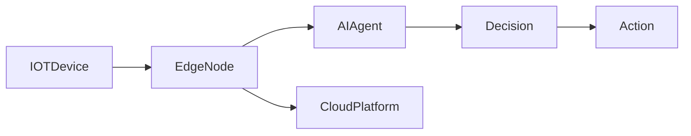
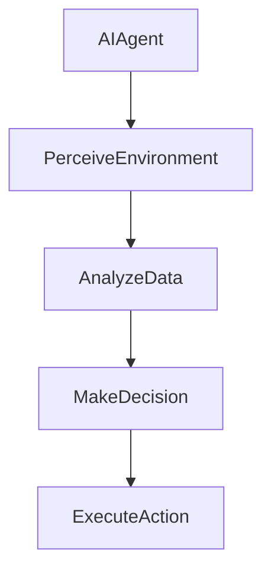
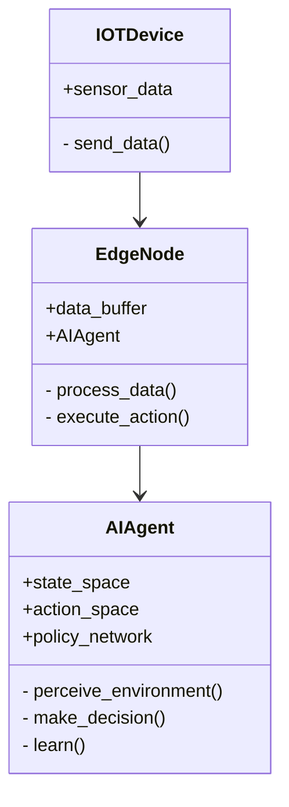
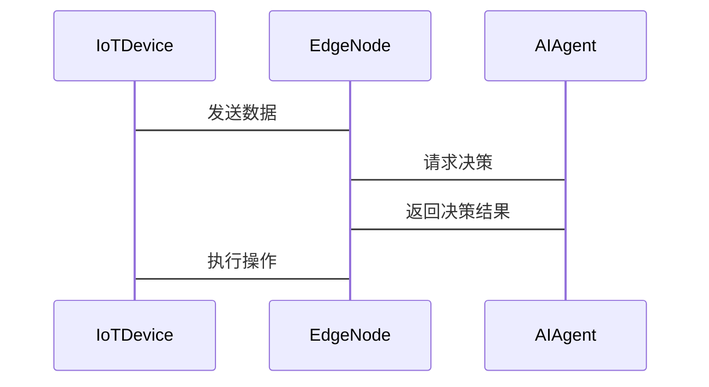

                 


# 企业AI Agent的边缘计算在物联网实时决策中的实践

> 关键词：AI Agent，边缘计算，物联网，实时决策，企业应用，算法原理，系统架构

> 摘要：本文深入探讨了企业AI Agent在边缘计算环境下的实时决策应用，分析了AI Agent与边缘计算的结合原理，详细讲解了相关算法和系统架构设计，通过实际案例展示了如何在物联网中实现高效的实时决策。

---

## 第一部分：企业AI Agent的边缘计算在物联网实时决策中的背景与概念

### 第1章：AI Agent与边缘计算概述

#### 1.1 AI Agent的基本概念
- **1.1.1 AI Agent的定义与特点**
  - AI Agent（人工智能代理）是一种能够感知环境、自主决策并执行任务的智能实体。
  - 其特点包括自主性、反应性、目标导向和学习能力。

- **1.1.2 AI Agent在企业中的应用场景**
  - 企业资源优化：如供应链管理、生产调度等。
  - 客户服务：智能客服、个性化推荐等。
  - 风险控制： fraud detection, market prediction.

- **1.1.3 AI Agent与传统决策系统的区别**
  - 独立性：AI Agent能够自主决策，而传统系统依赖于中央控制。
  - 实时性：AI Agent具备快速响应能力，传统系统可能需要较长时间处理。

#### 1.2 边缘计算的基本概念
- **1.2.1 边缘计算的定义与特点**
  - 边缘计算是在靠近数据源的地方进行计算和数据处理。
  - 其特点包括低延迟、高实时性、本地数据处理能力。

- **1.2.2 边缘计算在物联网中的作用**
  - 减少数据传输到云端的延迟。
  - 提高数据处理的实时性和可靠性。

- **1.2.3 边缘计算与云计算的区别**
  - 边缘计算强调数据的本地处理，云计算强调集中式处理。
  - 边缘计算适用于实时性要求高的场景，云计算适用于数据量大、处理复杂度高的场景。

#### 1.3 物联网实时决策的核心问题
- **1.3.1 物联网数据的特点与挑战**
  - 数据量大、类型多样、分布广泛。
  - 数据的实时性和安全性要求高。

- **1.3.2 实时决策在物联网中的重要性**
  - 提高决策效率，降低延迟。
  - 支持快速响应，提升用户体验。

- **1.3.3 AI Agent在物联网实时决策中的优势**
  - 能够自主感知环境，快速做出决策。
  - 适应动态变化的环境，具备学习和优化能力。

---

### 第2章：企业AI Agent的边缘计算在物联网中的核心概念与联系

#### 2.1 AI Agent与边缘计算的结合原理
- **2.1.1 AI Agent在边缘计算中的角色**
  - AI Agent作为边缘计算节点中的智能决策单元，负责处理和分析数据。
  - AI Agent能够实时感知环境变化，并根据数据做出决策。

- **2.1.2 边缘计算如何支持AI Agent的实时决策**
  - 边缘计算提供低延迟的数据处理环境，支持AI Agent快速响应。
  - 边缘设备上的计算资源为AI Agent提供了本地化的处理能力。

- **2.1.3 AI Agent与边缘计算的协同工作流程**
  - 数据采集：边缘设备收集环境数据。
  - 数据处理：AI Agent对数据进行分析，生成决策指令。
  - 执行决策：边缘设备根据AI Agent的决策执行操作。
  - 数据反馈：决策结果反馈到AI Agent，用于优化模型。

#### 2.2 核心概念的对比与分析
- **2.2.1 AI Agent与边缘计算的对比表格**

| 特性        | AI Agent                      | 边缘计算                  |
|-------------|-------------------------------|---------------------------|
| 定义         | 智能代理，自主决策            | 本地数据处理与计算        |
| 场景         | 企业决策、智能客服            | 物联网实时处理            |
| 优势         | 高自主性、实时性              | 低延迟、高效性            |

- **2.2.2 AI Agent与传统边缘计算的差异**
  - AI Agent具备自主决策能力，而传统边缘计算主要是数据处理。
  - AI Agent能够学习和优化，而传统边缘计算主要依赖预设规则。

- **2.2.3 边缘计算与物联网的实体关系图（Mermaid流程图）**



---

### 第3章：企业AI Agent的边缘计算在物联网中的算法原理

#### 3.1 AI Agent的算法原理
- **3.1.1 AI Agent的决策模型（Mermaid流程图）**



- **3.1.2 基于强化学习的AI Agent算法（Python代码示例）**

```python
class AIAgent:
    def __init__(self, state_space, action_space):
        self.state_space = state_space
        self.action_space = action_space
        # 初始化策略网络
        self.policy_network = PolicyNetwork(state_space, action_space)
        
    def perceive_environment(self, state):
        # 状态感知
        return state
    
    def make_decision(self, state):
        # 使用策略网络生成动作概率分布
        action_probs = self.policy_network.predict(state)
        # 采样动作
        action = np.random.choice(self.action_space, p=action_probs)
        return action
    
    def learn(self, reward):
        # 基于奖励更新策略网络
        self.policy_network.update(reward)
```

- **3.1.3 决策模型的数学模型和公式**
  - 状态空间：S = {s₁, s₂, ..., sₙ}
  - 动作空间：A = {a₁, a₂, ..., aₘ}
  - 策略函数：π: S → A
  - Q-learning算法的数学公式：
    $$ Q(s, a) = Q(s, a) + α(r + γ \max Q(s', a') - Q(s, a)) $$
    其中，α是学习率，γ是折扣因子。

---

## 第4章：企业AI Agent的边缘计算在物联网中的系统架构设计

### 4.1 系统功能设计
- **4.1.1 功能模块划分**
  - 数据采集模块：负责收集物联网设备的数据。
  - AI Agent模块：负责数据的分析和决策。
  - 执行模块：根据决策结果执行相应的操作。

- **4.1.2 系统功能设计的领域模型（Mermaid类图）**



### 4.2 系统架构设计
- **4.2.1 系统架构设计图（Mermaid架构图）**


- **4.2.2 系统接口设计**
  - 数据接口：AI Agent与边缘节点之间的数据传输接口。
  - 控制接口：用于接收和发送控制指令的接口。

### 4.3 系统交互设计
- **4.3.1 系统交互流程（Mermaid序列图）**



---

## 第5章：企业AI Agent的边缘计算在物联网中的项目实战

### 5.1 环境搭建
- **5.1.1 开发环境配置**
  - 安装Python、TensorFlow、Keras等框架。
  - 安装边缘计算框架（如K3s）。

- **5.1.2 数据采集与处理**
  - 使用IoT设备采集数据，并通过边缘节点进行初步处理。

### 5.2 系统核心实现
- **5.2.1 AI Agent的实现**
  - 编写AI Agent的感知、决策和学习模块。
  - 使用强化学习算法训练AI Agent。

- **5.2.2 边缘节点的实现**
  - 实现数据采集、处理和传输功能。
  - 部署AI Agent模块，进行实时决策。

### 5.3 代码实现与解读
- **5.3.1 AI Agent的代码实现**

```python
import numpy as np

class PolicyNetwork:
    def __init__(self, state_dim, action_dim):
        # 初始化策略网络参数
        self.theta = np.random.randn(state_dim, action_dim) / np.sqrt(state_dim)
        
    def predict(self, state):
        # 预测动作概率
        action_probs = np.exp(np.dot(state, self.theta)) / np.sum(np.exp(np.dot(state, self.theta)))
        return action_probs
    
    def update(self, reward):
        # 基于奖励更新策略网络
        self.theta += reward * np.dot(self.theta, np.ones(reward.shape))
```

- **5.3.2 边缘节点的代码实现**

```python
class EdgeNode:
    def __init__(self, device_count):
        self.device_count = device_count
        self.data_buffer = []
        
    def collect_data(self):
        # 模拟数据采集
        for _ in range(self.device_count):
            data = np.random.rand(10)
            self.data_buffer.append(data)
            
    def process_data(self):
        # 处理数据并请求AI Agent决策
        for data in self.data_buffer:
            action = self.ai_agent.make_decision(data)
            self.execute_action(action)
            
    def execute_action(self, action):
        # 执行决策动作
        print(f"执行动作：{action}")
```

### 5.4 实际案例分析
- **5.4.1 案例背景**
  - 某企业需要优化其供应链管理，使用AI Agent和边缘计算实现实时决策。

- **5.4.2 案例分析**
  - 数据采集：边缘节点收集供应链各环节的数据。
  - 数据处理：AI Agent分析数据，做出最优决策。
  - 决策执行：根据决策结果调整供应链策略。

---

## 第6章：企业AI Agent的边缘计算在物联网中的最佳实践

### 6.1 小结
- 本文详细介绍了AI Agent与边缘计算在物联网实时决策中的应用，分析了其核心概念和算法原理，并通过实际案例展示了系统的实现过程。

### 6.2 注意事项
- 数据安全：在边缘计算环境中，数据的安全性和隐私保护尤为重要。
- 系统优化：需要不断优化AI Agent的算法，提高决策的准确性和效率。

### 6.3 拓展阅读
- 推荐阅读《Deep Learning》（Ian Goodfellow等著），了解深度学习在AI Agent中的应用。
- 推荐学习边缘计算相关的书籍和文档，深入了解其技术细节。

---

## 作者：AI天才研究院/AI Genius Institute & 禅与计算机程序设计艺术 /Zen And The Art of Computer Programming

---

以上就是《企业AI Agent的边缘计算在物联网实时决策中的实践》的完整内容，希望对您有所帮助！

