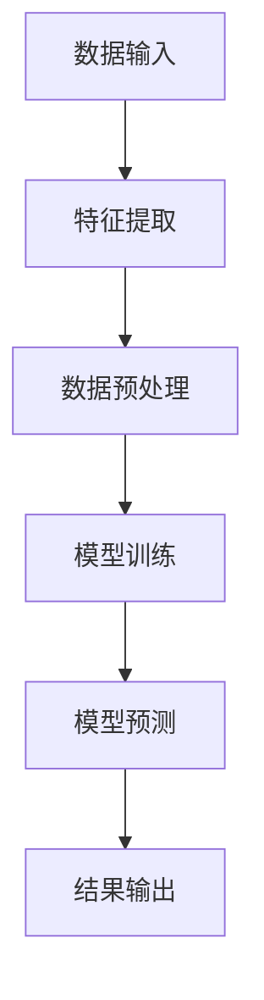
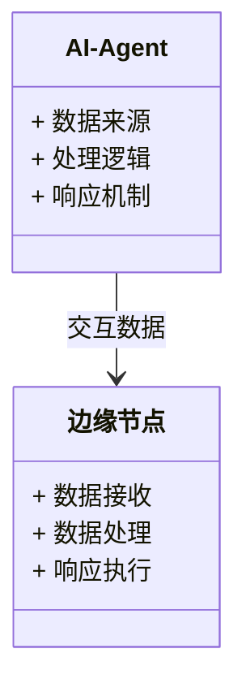

                 


```markdown
# 企业AI Agent的边缘计算应用：实时处理与响应

> 关键词：企业AI Agent, 边缘计算, 实时处理, 响应机制, 系统架构, 算法原理

> 摘要：本文深入探讨企业AI Agent在边缘计算中的应用，重点分析实时处理与响应机制，涵盖核心概念、算法原理、系统架构设计、项目实战以及最佳实践，帮助读者全面理解并有效应用相关技术。

---

## 第1章 引言

### 1.1 问题背景
#### 1.1.1 企业AI Agent的定义与目标
企业AI Agent是具备自主决策和执行能力的智能体，旨在优化企业运营效率和决策质量。

#### 1.1.2 边缘计算的定义与特点
边缘计算是一种分布式计算范式，将计算能力推向数据生成的源头，具备低延迟、高实时性、本地化处理的特点。

#### 1.1.3 AI Agent与边缘计算的结合
通过边缘计算，AI Agent能够实时处理数据并做出快速响应，提升企业的实时决策能力。

### 1.2 问题描述
#### 1.2.1 传统AI Agent的局限性
传统AI Agent依赖于中心化计算，存在延迟高、带宽消耗大等问题。

#### 1.2.2 边缘计算在实时处理中的优势
边缘计算能够减少数据传输延迟，提升实时响应能力，降低带宽消耗。

### 1.3 问题解决
通过结合边缘计算，企业AI Agent可以在本地快速处理数据，提升实时决策能力。

### 1.4 边界与外延
明确企业AI Agent的边界，包括数据范围、处理范围和响应范围。

### 1.5 概念结构与核心要素
- 数据来源：企业内部系统、物联网设备
- 处理逻辑：AI算法、规则引擎
- 响应机制：执行动作、反馈
- 架构：分布式架构、边缘计算节点

---

## 第2章 核心概念与原理

### 2.1 AI Agent的核心概念
#### 2.1.1 AI Agent的定义
具备感知环境、自主决策和执行能力的智能体。

#### 2.1.2 AI Agent的分类
- 单一智能体
- 多智能体系统
- 分布式智能体

### 2.2 边缘计算的关键技术
#### 2.2.1 实时处理
数据在边缘节点实时处理，减少延迟。

#### 2.2.2 数据隐私与安全性
在边缘计算中，数据处理本地化，确保数据隐私和安全性。

#### 2.2.3 边缘计算的资源管理
动态分配计算资源，优化性能。

### 2.3 AI Agent与边缘计算的结合
#### 2.3.1 数据流的实时处理
AI Agent在边缘节点实时处理数据流，快速响应。

#### 2.3.2 分布式决策
AI Agent在边缘节点做出决策，减少中心化依赖。

#### 2.3.3 边缘计算的扩展性
通过边缘计算，AI Agent可以扩展至更多设备和场景。

---

## 第3章 算法原理与数学模型

### 3.1 AI Agent的核心算法
#### 3.1.1 决策树
- 树结构：节点和叶子节点
- 分类算法：ID3、C4.5、CART
- 信息增益：Entropy公式

#### 3.1.2 随机森林
- 集成学习：多个决策树集成
- Bagging方法：数据采样
- 随机特征选择：减少过拟合

#### 3.1.3 支持向量机
- 线性分类器：二维空间直线划分
- 核函数：高维空间映射
- 软边距：处理非线性数据

### 3.2 边缘计算中的算法优化
#### 3.2.1 算法的轻量化
- 剪枝：减少计算复杂度
- 模型压缩：降低模型大小

#### 3.2.2 分布式训练
- 联合学习：多个边缘节点协同训练
- 联合优化：优化目标函数

### 3.3 数学模型与公式
- 决策树的分裂标准：$$\text{信息增益} = \sum_{v} p(v) \log p(v)$$
- 随机森林的投票机制：$$\text{最终预测} = \text{多数投票结果}$$
- 支持向量机的优化目标：$$\max \left( \sum_{i=1}^{n} \alpha_i y_i - \frac{1}{2} \sum_{i,j} \alpha_i \alpha_j y_i y_j K(x_i, x_j) \right)$$

### 3.4 算法实现
#### 3.4.1 Python代码实现
```python
from sklearn.tree import DecisionTreeClassifier
from sklearn.ensemble import RandomForestClassifier
from sklearn.svm import SVC

# 决策树分类器
dt_classifier = DecisionTreeClassifier()
dt_classifier.fit(X_train, y_train)

# 随机森林分类器
rf_classifier = RandomForestClassifier(n_estimators=100, random_state=42)
rf_classifier.fit(X_train, y_train)

# 支持向量机分类器
svm_classifier = SVC(kernel='rbf', gamma='auto')
svm_classifier.fit(X_train, y_train)
```

#### 3.4.2 算法流程图


---

## 第4章 系统分析与架构设计

### 4.1 问题场景
企业AI Agent在边缘计算中的实时处理与响应场景。

### 4.2 系统功能设计
#### 4.2.1 领域模型


#### 4.2.2 系统架构
```mermaid
--- 

### 4.3 系统架构设计
```mermaid
--- 

### 4.4 接口设计
```mermaid
--- 

### 4.5 交互设计
```mermaid
--- 

## 第5章 项目实战

### 5.1 环境搭建
- 操作系统：Linux/Windows
- 工具安装：Python、Jupyter Notebook、scikit-learn库

### 5.2 核心实现
#### 5.2.1 代码实现
```python
import numpy as np
from sklearn.datasets import make_classification
from sklearn.model_selection import train_test_split
from sklearn.metrics import accuracy_score

# 数据生成
X, y = make_classification(n_samples=1000, n_features=20, n_classes=2)
X_train, X_test, y_train, y_test = train_test_split(X, y, test_size=0.2)

# 训练模型
model = RandomForestClassifier(n_estimators=100)
model.fit(X_train, y_train)

# 预测与评估
y_pred = model.predict(X_test)
print(f"Accuracy: {accuracy_score(y_test, y_pred):.2f}")
```

#### 5.2.2 功能分析
- 数据预处理：特征选择与标准化
- 模型训练：随机森林训练
- 模型评估：准确率计算

### 5.3 案例分析
#### 5.3.1 案例选择
智能工厂设备监控系统

#### 5.3.2 实施过程
- 数据采集：传感器数据
- 数据处理：边缘节点实时处理
- 模型部署：边缘计算节点部署随机森林模型

#### 5.3.3 成果展示
- 实时监控界面
- 历史数据记录
- 预警系统

### 5.4 项目小结
- 成功实现了实时处理与响应
- 确保了数据隐私和安全性
- 提升了系统响应速度

---

## 第6章 最佳实践与总结

### 6.1 关键技术总结
- AI Agent的核心算法：随机森林、决策树
- 边缘计算的关键技术：实时处理、本地化数据处理

### 6.2 最佳实践
#### 6.2.1 技术选型
- 选择适合的算法和框架
- 确保系统的可扩展性

#### 6.2.2 性能优化
- 算法优化：剪枝、模型压缩
- 系统优化：分布式训练

#### 6.2.3 安全性措施
- 数据加密
- 权限控制

### 6.3 注意事项
- 确保数据隐私
- 优化算法性能
- 提高系统的容错能力

### 6.4 未来趋势
- 更多边缘计算节点的接入
- 更复杂的AI模型在边缘部署
- 更高效的算法优化方法

---

## 作者：AI天才研究院/AI Genius Institute & 禅与计算机程序设计艺术 /Zen And The Art of Computer Programming

---

本文通过详细分析企业AI Agent在边缘计算中的应用，结合理论与实践，帮助读者全面理解实时处理与响应的实现方法和最佳实践。
```

