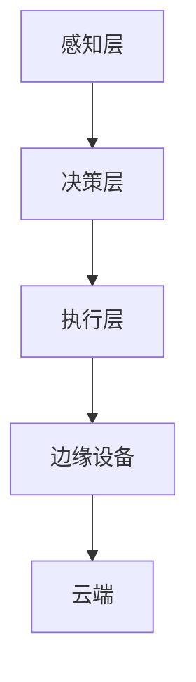
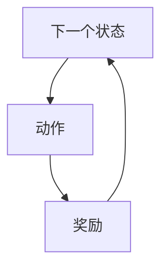
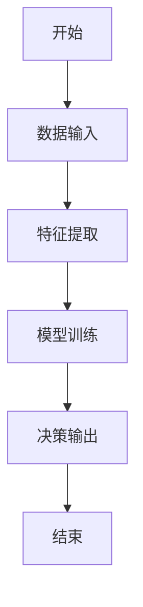

                 


# 企业AI Agent的边缘计算应用：提升响应速度

## 关键词：AI Agent, 边缘计算, 响应速度, 企业应用, 系统架构

## 摘要：  
随着企业对实时响应和高效决策的需求不断增长，AI Agent与边缘计算的结合为企业提供了一种新的解决方案。本文详细探讨了AI Agent在边缘计算中的应用，分析了其核心原理、系统架构设计、算法实现以及实际案例，展示了如何通过边缘计算提升企业的响应速度和效率。文章从背景介绍、核心概念、系统设计到实战应用，层层深入，为企业技术决策者和开发者提供了有价值的参考。

---

# 引言：AI Agent与边缘计算的结合——企业数字化转型的新动力

## 1.1 问题背景与挑战
### 1.1.1 传统企业AI应用的痛点
传统的AI应用通常依赖于中心化的云计算平台，数据需要传输到云端进行处理，导致延迟较高，难以满足实时响应的需求。此外，数据传输过程中可能面临网络瓶颈和安全性问题。

### 1.1.2 边缘计算的兴起与需求
边缘计算通过将计算能力部署在靠近数据源的边缘设备上，减少了数据传输的距离，降低了延迟。这种分布式架构能够更好地支持实时处理和本地决策。

### 1.1.3 AI Agent在企业中的定位与作用
AI Agent是一种能够感知环境、自主决策并执行任务的智能体。在企业中，AI Agent可以通过边缘计算的能力，快速响应用户需求，优化资源分配，提升企业运营效率。

## 1.2 AI Agent的核心概念与特点
### 1.2.1 AI Agent的定义与核心要素
AI Agent是一种智能体，能够通过感知环境、理解需求并采取行动来实现目标。其核心要素包括感知能力、决策能力、执行能力和自适应能力。

### 1.2.2 边缘计算的特点与优势
边缘计算的特点包括分布式架构、低延迟、高实时性和本地数据处理能力。这些特点使其成为AI Agent的理想载体。

### 1.2.3 AI Agent与边缘计算的结合方式
AI Agent可以通过运行在边缘设备上，利用边缘计算的能力进行实时数据处理和决策。这种结合方式实现了快速响应和高效执行。

---

# 核心概念与联系：AI Agent与边缘计算的协同机制

## 2.1 AI Agent的核心原理
### 2.1.1 AI Agent的基本工作原理
AI Agent通过感知环境数据，利用算法进行分析和决策，然后执行相应的操作。其核心算法包括强化学习、监督学习和无监督学习。

### 2.1.2 AI Agent的决策机制与算法
AI Agent的决策机制依赖于机器学习算法，例如强化学习通过试错优化策略，监督学习通过标签数据进行分类，无监督学习通过聚类发现规律。

### 2.1.3 AI Agent的自适应与学习能力
AI Agent能够通过在线学习和离线学习不断优化自身的决策能力，适应环境的变化。

## 2.2 边缘计算的核心原理
### 2.2.1 边缘计算的分布式架构
边缘计算通过在边缘设备上部署计算能力，将数据处理从云端转移到边缘，减少了延迟和带宽消耗。

### 2.2.2 边缘计算的数据处理机制
边缘设备负责数据的采集、预处理和本地分析，只有需要进一步处理的数据才会上传到云端。

### 2.2.3 边缘计算的资源管理与优化
边缘计算通过资源调度算法，动态分配计算资源，确保系统的高效运行。

## 2.3 AI Agent与边缘计算的结合原理
### 2.3.1 AI Agent在边缘计算中的角色
AI Agent作为边缘设备上的智能体，负责数据的感知、分析和决策，指导边缘设备的执行操作。

### 2.3.2 边缘计算对AI Agent的支撑作用
边缘计算为AI Agent提供了低延迟、高实时性的计算环境，使其能够快速响应用户需求。

### 2.3.3 两者结合的协同机制
AI Agent与边缘计算通过数据共享、任务分配和协同决策实现协同，确保系统的高效运行。

---

# 系统架构设计：AI Agent与边缘计算的协同架构

## 3.1 系统架构概述
### 3.1.1 分层架构设计
系统分为感知层、决策层和执行层，每一层负责不同的功能模块。

### 3.1.2 模块化设计原则
系统模块化设计使得各部分能够独立开发和维护，同时保证系统的可扩展性。

### 3.1.3 可扩展性与可维护性
通过模块化设计，系统能够轻松扩展功能，同时维护成本也得到有效降低。

## 3.2 系统功能设计
### 3.2.1 数据采集与处理模块
边缘设备负责数据的采集和预处理，确保数据的准确性和实时性。

### 3.2.2 AI Agent决策模块
AI Agent通过机器学习算法进行数据分析和决策，指导边缘设备执行操作。

### 3.2.3 边缘计算执行模块
边缘设备根据AI Agent的决策指令，执行相应的操作，实现任务的完成。

## 3.3 系统架构图


---

# 算法原理：AI Agent的决策算法与数学模型

## 4.1 AI Agent的核心算法
### 4.1.1 基于强化学习的决策算法


### 4.1.2 基于监督学习的分类算法
```python
# 示例代码：基于监督学习的分类算法
from sklearn.tree import DecisionTreeClassifier
import numpy as np

# 创建训练数据
X = np.array([[2, 3], [5, 6], [7, 8], [1, 2]])
y = np.array([0, 1, 1, 0])

# 训练决策树模型
model = DecisionTreeClassifier()
model.fit(X, y)

# 预测新数据
new_data = np.array([[3, 4]])
print(model.predict(new_data))
```

### 4.1.3 基于无监督学习的聚类算法
```latex
$$ \text{目标函数} = \sum_{i=1}^{n} \sum_{j=1}^{k} w_{ij}d_{ij} $$
```

## 4.2 算法流程图


---

# 项目实战：AI Agent与边缘计算的系统实现

## 5.1 环境安装与配置
### 5.1.1 安装Python与相关库
```bash
pip install numpy scikit-learn mermaid4jupyter
```

### 5.1.2 安装边缘计算框架
```bash
pip install edge-compute-framework
```

## 5.2 系统核心实现
### 5.2.1 数据采集模块
```python
import edge_compute

def data_collector():
    while True:
        data = edge_compute采集数据()
        yield data
```

### 5.2.2 AI Agent决策模块
```python
class AIAgent:
    def __init__(self):
        self.model = self.load_model()

    def decide(self, data):
        return self.model.predict(data)
```

### 5.2.3 边缘设备执行模块
```python
class EdgeDevice:
    def execute_action(self, action):
        # 执行操作
        pass
```

## 5.3 实际案例分析
### 5.3.1 案例背景
企业需要实时监控生产线设备的状态，通过AI Agent和边缘计算实现快速故障检测。

### 5.3.2 案例实现
```python
# 示例代码：设备状态监控
from edge_device import EdgeDevice

agent = AIAgent()
device = EdgeDevice()

while True:
    data = data_collector().next()
    action = agent.decide(data)
    device.execute_action(action)
```

### 5.3.3 案例分析
通过AI Agent和边缘计算的结合，企业实现了设备状态的实时监控和快速响应，显著降低了故障停机时间。

---

# 结论：企业AI Agent的边缘计算应用前景与展望

## 6.1 最佳实践 tips
- 合理选择边缘设备和计算框架，确保系统的高效运行。
- 定期更新AI Agent的模型，提升系统的自适应能力。

## 6.2 小结
本文详细探讨了AI Agent与边缘计算的结合，分析了其核心原理、系统架构设计和实际应用案例，展示了如何通过边缘计算提升企业的响应速度和效率。

## 6.3 注意事项
- 数据隐私和安全性是需要重点关注的问题。
- 系统的可扩展性和可维护性需要在设计阶段充分考虑。

## 6.4 拓展阅读
- 推荐阅读《边缘计算：原理与实践》和《AI Agent的算法与应用》。

---

# 作者：AI天才研究院 & 禅与计算机程序设计艺术

---

这篇博客从理论到实践，全面解析了企业AI Agent在边缘计算中的应用，为企业技术决策者和开发者提供了有价值的参考和指导。

