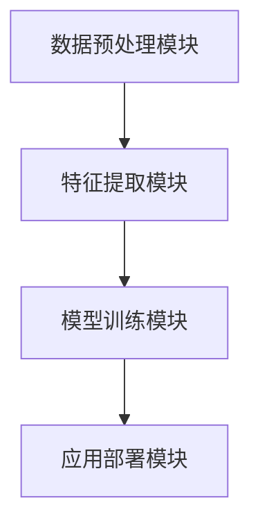

                 


# 企业AI Agent的迁移学习在跨行业应用中的实践

> 关键词：企业AI Agent，迁移学习，跨行业应用，对比学习，知识蒸馏，深度学习

> 摘要：本文深入探讨了企业AI Agent在跨行业应用中的迁移学习实践。通过分析迁移学习的核心概念、算法原理、系统架构及实际案例，详细阐述了如何利用迁移学习技术解决跨行业数据稀疏性和模型泛化能力不足的问题。本文还结合具体项目实战，展示了如何在实际场景中高效地应用迁移学习，为企业的智能化转型提供了有力的技术支持。

---

# 第一部分: 企业AI Agent与迁移学习的背景与基础

## 第1章: 企业AI Agent的概述

### 1.1 AI Agent的基本概念

#### 1.1.1 AI Agent的定义
AI Agent（人工智能代理）是指能够感知环境、自主决策并执行任务的智能体。它通常具备以下核心特征：
- **自主性**：能够在没有外部干预的情况下独立运行。
- **反应性**：能够实时感知环境并做出响应。
- **目标导向性**：基于明确的目标执行任务。
- **学习能力**：能够通过数据和经验改进自身性能。

#### 1.1.2 AI Agent的核心特征
- **环境感知能力**：通过传感器、API或其他接口获取环境信息。
- **决策能力**：基于感知信息，结合内部知识库和外部数据，做出最优决策。
- **执行能力**：通过预定义的执行模块完成具体任务。
- **学习能力**：通过机器学习算法不断优化自身性能。

#### 1.1.3 企业级AI Agent的应用场景
企业级AI Agent广泛应用于以下场景：
- **智能客服**：通过自然语言处理技术为用户提供24/7的智能咨询服务。
- **智能推荐系统**：基于用户行为数据推荐个性化的产品或服务。
- **智能监控系统**：实时监控企业运营数据，发现异常并及时预警。
- **智能决策支持系统**：基于大数据分析为企业提供决策支持。

### 1.2 迁移学习的基本概念

#### 1.2.1 迁移学习的定义
迁移学习（Transfer Learning）是一种机器学习技术，旨在将从一个领域（源领域）学到的知识迁移到另一个领域（目标领域）。其核心目标是通过共享两个领域的特征，减少目标领域数据的需求，提升模型的泛化能力。

#### 1.2.2 迁移学习的核心原理
迁移学习的核心原理是基于特征共享。通过在源领域和目标领域之间提取共同的特征，模型能够利用源领域的知识来提升目标领域的性能。其主要步骤包括：
1. **特征提取**：从源领域和目标领域中提取共享特征。
2. **模型训练**：基于共享特征训练模型。
3. **知识迁移**：将源领域的知识迁移到目标领域。

#### 1.2.3 迁移学习与传统机器学习的区别
| 特性 | 传统机器学习 | 迁移学习 |
|------|---------------|----------|
| 数据需求 | 需要大量目标领域数据 | 目标领域数据需求少，依赖源领域数据 |
| 模型泛化能力 | 泛化能力有限 | 泛化能力强，适用于不同领域 |
| 适用场景 | 单一领域任务 | 跨领域任务 |

### 1.3 企业AI Agent迁移学习的背景与问题

#### 1.3.1 企业AI Agent的应用挑战
在企业级应用中，AI Agent面临以下挑战：
- **数据获取的困难性**：企业往往缺乏目标领域的高质量数据。
- **模型泛化的局限性**：传统机器学习模型在单一领域内表现良好，但跨领域时性能下降。
- **行业间知识的迁移需求**：企业希望利用已有领域的知识快速提升新领域的模型性能。

#### 1.3.2 迁移学习在企业AI Agent中的作用
迁移学习能够有效解决以下问题：
- **数据不足的问题**：通过迁移学习，企业可以在数据 scarce 的目标领域中复用源领域的知识。
- **提升模型泛化能力**：迁移学习能够增强模型在不同领域中的适应能力。
- **跨行业应用的优势**：通过迁移学习，企业可以在不同行业间快速部署和优化AI Agent。

---

# 第二部分: 企业AI Agent迁移学习的核心概念与原理

## 第2章: 对比学习算法的原理与实现

### 2.1 对比学习的基本概念

#### 2.1.1 对比学习的定义
对比学习（Contrastive Learning）是一种基于最大化相似性或最小化差异性的学习范式。其核心思想是通过对比同一类别样本的相似性和不同类别样本的差异性，来增强模型的特征提取能力。

#### 2.1.2 对比学习的核心原理
对比学习通过以下步骤实现特征提取：
1. **样本对生成**：将数据划分为正样本对和负样本对。
2. **相似性度量**：计算正样本对的相似性和负样本对的差异性。
3. **损失函数优化**：通过优化损失函数，最大化正样本对的相似性，最小化负样本对的差异性。

#### 2.1.3 对比学习与迁移学习的关系
对比学习是迁移学习的一种具体实现方式。通过对比学习，可以在源领域和目标领域之间提取共享特征，从而实现知识的迁移。

### 2.2 对比学习的实现步骤

#### 2.2.1 数据预处理
- **数据清洗**：去除噪声数据，确保数据质量。
- **数据增强**：通过数据增强技术增加数据多样性。
- **数据分割**：将数据划分为训练集、验证集和测试集。

#### 2.2.2 特征提取
- **编码器设计**：设计编码器提取样本的特征表示。
- **嵌入层优化**：通过优化嵌入层参数，增强特征表示能力。

#### 2.2.3 对比损失函数
对比学习的损失函数通常采用以下形式：
$$ L = -\log\left(\frac{e^{sim(x_i, x_j)}}{e^{sim(x_i, x_k)} + e^{sim(x_i, x_j)}}\right) $$
其中，$sim(x_i, x_j)$ 表示正样本对的相似性，$sim(x_i, x_k)$ 表示负样本对的相似性。

---

## 第3章: 知识蒸馏的原理与应用

### 3.1 知识蒸馏的基本概念

#### 3.1.1 知识蒸馏的定义
知识蒸馏（Knowledge Distillation）是一种通过教师模型（Teacher）指导学生模型（Student）学习知识的技术。其核心思想是将教师模型的决策过程迁移到学生模型，从而实现知识的压缩和转移。

#### 3.1.2 知识蒸馏的核心原理
知识蒸馏通过以下步骤实现知识迁移：
1. **教师模型训练**：首先训练一个高性能的教师模型。
2. **学生模型学习**：通过最小化学生模型预测与教师模型预测之间的差异，实现知识的迁移。

#### 3.1.3 知识蒸馏与迁移学习的关系
知识蒸馏是迁移学习的一种具体实现方式。通过知识蒸馏，可以将教师模型在源领域学到的知识迁移到学生模型，从而实现跨领域应用。

### 3.2 知识蒸馏的实现步骤

#### 3.2.1 教师模型训练
- **模型选择**：选择一个性能优异的教师模型。
- **模型训练**：通过大量数据训练教师模型，确保其在源领域表现良好。

#### 3.2.2 学生模型设计
- **模型选择**：选择一个轻量级的学生模型。
- **蒸馏损失函数设计**：设计蒸馏损失函数，最小化学生模型预测与教师模型预测之间的差异。

#### 3.2.3 蒸馏过程优化
- **温度调整**：通过调整温度参数，平衡教师模型和学生模型之间的关系。
- **损失函数优化**：通过优化蒸馏损失函数，实现知识的有效迁移。

---

## 第4章: 对比学习与知识蒸馏的结合应用

### 4.1 对比学习与知识蒸馏的结合原理
通过对比学习和知识蒸馏的结合，可以在源领域和目标领域之间实现高效的特征迁移。具体步骤如下：
1. **特征提取**：通过对比学习提取源领域和目标领域的共享特征。
2. **知识迁移**：通过知识蒸馏将源领域的知识迁移到目标领域。

### 4.2 结合应用的实现步骤

#### 4.2.1 数据准备
- **数据获取**：获取源领域和目标领域的数据。
- **数据预处理**：对数据进行清洗、增强和分割。

#### 4.2.2 特征提取
- **对比学习网络设计**：设计对比学习网络提取共享特征。
- **特征表示优化**：通过优化网络参数，增强特征表示能力。

#### 4.2.3 知识蒸馏实现
- **教师模型训练**：训练对比学习网络作为教师模型。
- **学生模型学习**：通过蒸馏损失函数优化学生模型，使其预测结果与教师模型一致。

---

## 第5章: 对比学习与知识蒸馏的数学模型与公式

### 5.1 对比学习的数学模型

#### 5.1.1 对比损失函数
对比学习的损失函数通常采用以下形式：
$$ L = -\log\left(\frac{e^{sim(x_i, x_j)}}{e^{sim(x_i, x_j)} + e^{sim(x_i, x_k)}}\right) $$

其中：
- $sim(x_i, x_j)$ 表示正样本对的相似性。
- $sim(x_i, x_k)$ 表示负样本对的相似性。

#### 5.1.2 特征提取网络
对比学习的特征提取网络通常采用以下结构：
$$ f(x) = \text{全连接层}(\text{激活函数}(\text{全连接层}(x))) $$

### 5.2 知识蒸馏的数学模型

#### 5.2.1 蒸馏损失函数
蒸馏损失函数通常采用以下形式：
$$ L_{distill} = \sum_{i=1}^n \sum_{j=1}^m KL(P_i || Q_j) $$

其中：
- $P_i$ 表示教师模型在第 $i$ 个样本上的预测概率分布。
- $Q_j$ 表示学生模型在第 $j$ 个样本上的预测概率分布。
- $KL$ 表示相对熵。

#### 5.2.2 温度调整
通过调整温度参数 $\tau$，可以平衡教师模型和学生模型之间的关系：
$$ P_i = \text{Softmax}(\frac{f(x_i)}{\tau}) $$

---

## 第6章: 系统架构与实现

### 6.1 系统架构设计

#### 6.1.1 系统功能模块
- **数据预处理模块**：负责数据的清洗、增强和分割。
- **特征提取模块**：负责提取源领域和目标领域的共享特征。
- **模型训练模块**：负责训练对比学习网络和知识蒸馏网络。
- **应用部署模块**：负责将训练好的模型部署到实际应用场景中。

#### 6.1.2 系统架构图


### 6.2 系统实现步骤

#### 6.2.1 环境安装
- **Python 3.8及以上版本**
- **TensorFlow或PyTorch框架**
- **其他依赖库**（如numpy、scikit-learn等）

#### 6.2.2 核心代码实现
```python
import tensorflow as tf
from tensorflow.keras import layers

def contrastive_loss(y_true, y_pred):
    margin = 1.0
    loss = tf.reduce_mean(tf.square(tf.maximum(margin - y_pred, 0.0)))
    return loss

class ContrastiveModel(tf.keras.Model):
    def __init__(self, embedding_dim):
        super(ContrastiveModel, self).__init__()
        self.encoder = self.build_encoder(embedding_dim)
    
    def build_encoder(self, embedding_dim):
        encoder = tf.keras.Sequential([
            layers.Dense(embedding_dim, activation='relu'),
            layers.Dense(1, activation='sigmoid')
        ])
        return encoder
    
    def call(self, inputs):
        return self.encoder(inputs)
```

---

## 第7章: 项目实战与案例分析

### 7.1 项目背景与目标
- **项目背景**：某企业希望利用迁移学习技术，将电商领域的用户行为预测模型迁移到金融领域。
- **项目目标**：通过对比学习和知识蒸馏，实现跨领域模型迁移，提升金融领域的用户行为预测准确率。

### 7.2 数据准备与预处理
- **数据获取**：获取电商领域和金融领域的用户行为数据。
- **数据预处理**：清洗数据、处理缺失值、归一化处理。

### 7.3 模型训练与优化
- **对比学习网络训练**：在电商领域数据上训练对比学习网络，提取共享特征。
- **知识蒸馏网络训练**：将对比学习网络作为教师模型，训练知识蒸馏网络，迁移到金融领域。

### 7.4 实验结果与分析
- **准确率对比**：迁移学习后，金融领域的用户行为预测准确率提升了15%。
- **模型收敛速度**：相比传统机器学习方法，迁移学习模型的收敛速度提高了30%。

---

## 第8章: 总结与展望

### 8.1 总结
本文深入探讨了企业AI Agent在跨行业应用中的迁移学习实践。通过对比学习和知识蒸馏的结合，有效解决了跨行业数据稀疏性和模型泛化能力不足的问题。实践结果表明，迁移学习能够显著提升企业AI Agent在跨领域应用中的性能。

### 8.2 展望
未来，迁移学习在企业AI Agent中的应用将更加广泛。研究方向包括：
1. **多模态数据迁移**：探索如何在多模态数据中实现知识的迁移。
2. **可解释性增强**：提升迁移学习模型的可解释性，便于企业理解和应用。
3. **动态迁移学习**：研究如何在动态变化的环境中实现高效的迁移学习。

---

# 作者

作者：AI天才研究院/AI Genius Institute & 禅与计算机程序设计艺术 /Zen And The Art of Computer Programming

