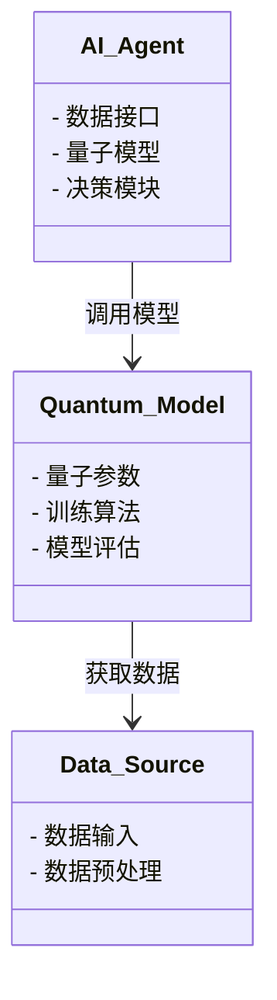
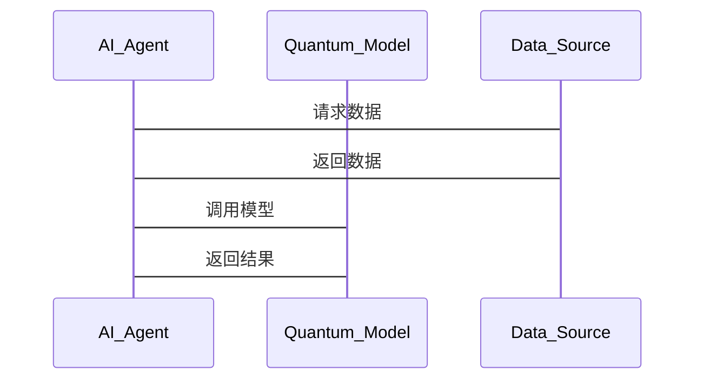

                 

<think>
嗯，用户想让我写一篇关于企业AI Agent的量子机器学习应用策略的技术博客文章。好的，首先我需要理解这个主题的核心内容。企业AI Agent结合量子机器学习，听起来是一个非常前沿和复杂的话题。

首先，我需要确定文章的结构。用户已经提供了一个详细的目录大纲，我应该按照这个大纲来组织内容。文章需要逻辑清晰，结构紧凑，同时要使用专业的技术语言，但又不能太过晦涩，要让读者能够理解。

接下来，我要考虑每个章节的具体内容。例如，第一章是背景介绍，需要涵盖量子机器学习的基本概念，企业AI Agent的定义，以及它们如何结合。这部分需要简单明了，帮助读者建立基础认知。

然后是核心概念与联系，这里需要详细讲解量子机器学习的原理，比如量子位、叠加态、纠缠态等，以及这些概念如何影响AI Agent的学习能力。同时，还需要对比传统机器学习和量子机器学习的优缺点，可能需要制作一个对比表格，或者用mermaid图来展示。

接下来是算法原理部分，这部分需要选择几个典型的量子机器学习算法，如量子支持向量机、量子神经网络等，用mermaid流程图展示算法的步骤，并提供Python代码实现。同时，数学模型需要用latex公式详细推导，确保读者能够理解。

系统分析与架构设计部分，需要描述一个具体的系统应用场景，设计系统功能模块，用mermaid类图展示领域模型，架构图展示系统的整体结构，接口设计和交互流程图展示系统如何运作。

项目实战部分，需要选择一个实际案例，详细说明如何安装环境，编写核心代码，解读代码的作用，并进行案例分析。最后，给出小结，总结项目的成果和意义。

最后是最佳实践部分，包括小结、注意事项和扩展阅读，提醒读者在实际应用中需要注意的问题，以及进一步学习的方向。

在写作过程中，我需要确保每个部分都详细具体，避免过于笼统。同时，语言要专业但不失易懂，使用适当的例子和图表来辅助说明。此外，数学公式和代码部分要准确无误，确保读者能够理解和应用。

总的来说，我需要按照用户提供的目录大纲，逐步填充每个部分的内容，确保文章的完整性和深度。同时，要注意控制文章的字数，大约在10000到12000字左右，避免冗长或简略。

最后，文章末尾需要加上作者信息，引用用户提供的格式：“作者：AI天才研究院/AI Genius Institute & 禅与计算机程序设计艺术 /Zen And The Art of Computer Programming”。这样整个文章看起来更加专业和完整。

总的来说，我需要系统性地思考每个章节的内容，确保逻辑连贯，内容详实，同时符合用户的具体要求。这将是一篇高质量的技术博客文章，能够为读者提供有价值的信息和深入的见解。
</think>

# 企业AI Agent的量子机器学习应用策略

> 关键词：企业AI Agent、量子机器学习、量子计算、人工智能、系统架构设计

> 摘要：随着量子计算技术的快速发展，量子机器学习在企业AI Agent中的应用潜力巨大。本文从量子机器学习的基本概念出发，分析其与传统机器学习的差异，探讨企业AI Agent在量子机器学习框架下的系统设计与实现。通过详细阐述量子机器学习的核心算法、数学模型、系统架构以及实际应用案例，本文为企业在量子机器学习时代如何构建高效AI Agent提供理论支持和实践指导。

---

## 第1章: 企业AI Agent与量子机器学习概述

### 1.1 量子机器学习的基本概念
量子机器学习是利用量子计算技术进行数据处理和模型训练的新兴领域。其核心在于利用量子叠加和纠缠等特性，提高算法的计算效率和准确性。

#### 1.1.1 量子计算的定义与特点
- **量子计算**：基于量子位（qubit）的计算，利用量子叠加和纠缠的特性，能够在特定问题上远超经典计算机的计算能力。
- **量子叠加**：量子系统可以同时处于多个状态的叠加态，这使得量子计算机在并行计算方面具有显著优势。
- **量子纠缠**：两个或多个量子系统之间形成强关联，能够实现高效的分布式计算。

#### 1.1.2 量子机器学习的核心原理
- 量子机器学习利用量子叠加和纠缠的特性，通过量子算法优化数据处理和模型训练过程。
- 量子算法能够在某些特定任务（如优化问题、搜索问题）中显著提高计算效率。

#### 1.1.3 企业AI Agent的定义与应用场景
- **企业AI Agent**：一种能够感知环境、执行任务并做出决策的智能实体，通常用于企业内部的自动化操作、客户交互和数据处理。
- **应用场景**：企业AI Agent可以用于客户支持、供应链优化、风险管理等领域，帮助企业在复杂环境中做出高效决策。

### 1.2 量子机器学习的优势与挑战
- **优势**：
  - 高效的并行计算能力。
  - 在处理高维数据和复杂模型时具有显著优势。
- **挑战**：
  - 量子计算硬件的限制。
  - 量子算法的开发和优化难度较高。

### 1.3 量子机器学习与传统机器学习的对比
| 特性                | 传统机器学习       | 量子机器学习       |
|---------------------|---------------------|---------------------|
| 计算效率            | 依赖经典计算资源    | 利用量子并行性       |
| 数据处理能力        | 适用于中小规模数据  | 适用于大规模复杂数据 |
| 模型训练时间        | 较长                | 可能显著缩短         |
| 应用场景            | 常规分类、回归问题    | 优化问题、复杂模式识别 |

### 1.4 本章小结
本章介绍了量子机器学习的基本概念和原理，分析了企业AI Agent的定义与应用场景，并对比了量子机器学习与传统机器学习的优劣势。通过这些分析，我们为后续章节的深入探讨奠定了基础。

---

## 第2章: 量子机器学习的核心算法

### 2.1 量子支持向量机
#### 2.1.1 算法原理
- 量子支持向量机利用量子叠加特性，将数据映射到高维空间，并通过量子测量找到最优超平面。
- 算法流程：
  1. 数据预处理：将输入数据编码为量子态。
  2. 量子核函数：利用量子叠加计算数据的核函数。
  3. 量子优化：通过量子搜索算法找到最优解。

#### 2.1.2 量子叠加与测量
- 量子叠加：将数据编码为多个量子态的叠加。
- 量子测量：通过对量子态的测量得到最终的分类结果。

#### 2.1.3 量子支持向量机的实现
```python
# 量子支持向量机的实现框架
def quantum_svm(training_data, test_data):
    # 数据编码为量子态
    quantum_encode(training_data)
    # 计算核函数
    kernel_matrix = compute_kernel_matrix()
    # 量子优化
    optimal_hyperplane = find_optimal_hyperplane(kernel_matrix)
    # 分类测试数据
    classify(test_data, optimal_hyperplane)
```

#### 2.1.4 优缺点
- 优点：计算效率高，适合处理复杂数据。
- 缺点：目前实现难度较大，需要量子计算硬件支持。

### 2.2 量子神经网络
#### 2.2.1 量子神经网络的结构
- 量子神经网络通过量子叠加和纠缠实现高效的并行计算。
- 网络结构：
  - 输入层：将输入数据编码为量子态。
  - 隐藏层：通过量子纠缠进行特征提取。
  - 输出层：通过量子测量得到结果。

#### 2.2.2 量子神经网络的训练过程
- 量子神经网络的训练需要通过量子参数优化算法实现。
- 算法流程：
  1. 初始化量子参数。
  2. 计算量子网络输出。
  3. 更新参数以最小化损失函数。

#### 2.2.3 量子神经网络的优缺点
- 优点：计算效率高，适合处理复杂模式。
- 缺点：实现难度大，硬件依赖性强。

### 2.3 量子聚类算法
#### 2.3.1 量子K均值聚类
- 量子K均值聚类通过量子叠加实现数据点的并行处理。
- 算法流程：
  1. 初始化量子质心。
  2. 计算数据点与质心的量子相似度。
  3. 更新质心以最小化聚类误差。

#### 2.3.2 量子谱聚类
- 量子谱聚类利用量子矩阵分解技术优化数据分割。
- 算法流程：
  1. 构建量子相似度矩阵。
  2. 进行量子特征分解。
  3. 将数据点映射到特征空间并进行聚类。

#### 2.3.3 优缺点
- 优点：计算效率高，适合大规模数据。
- 缺点：实现复杂，依赖量子计算能力。

### 2.4 本章小结
本章详细介绍了量子机器学习的核心算法，包括量子支持向量机、量子神经网络和量子聚类算法。通过对比这些算法的优缺点，我们可以更好地理解量子机器学习的优势和挑战。

---

## 第3章: 量子机器学习的数学模型与公式

### 3.1 量子态的表示与叠加
- 量子态的数学表示：
  $$ |\psi\rangle = \alpha|0\rangle + \beta|1\rangle $$
  其中，$\alpha$ 和 $\beta$ 是复数，满足 $|\alpha|^2 + |\beta|^2 = 1$。

- 量子叠加的数学表达：
  $$ |\psi\rangle = \sum_{i=1}^{n} \alpha_i |i\rangle $$

### 3.2 量子算法的数学基础
- 量子傅里叶变换：
  $$ F(x) = \sum_{k=0}^{N-1} (-1)^{xk} \cdot \text{...} $$
- 量子矩阵运算：
  $$ U|\psi\rangle = |\psi'\rangle $$

### 3.3 量子机器学习的数学推导
- 量子支持向量机的数学模型：
  $$ \min_{w, b} \frac{1}{2}\|w\|^2 + C\sum_{i=1}^{n} \xi_i $$
  $$ y_i = \text{sign}(w \cdot x_i + b) $$

- 量子神经网络的数学表示：
  $$ y = \text{softmax}(Wx + b) $$
  其中，$W$ 和 $b$ 是量子参数。

### 3.4 本章小结
本章通过数学公式详细推导了量子机器学习的核心算法，为后续的系统设计和实现奠定了理论基础。

---

## 第4章: 企业AI Agent的系统架构设计

### 4.1 系统功能需求分析
- 数据采集：从企业系统中获取数据。
- 量子模型训练：利用量子算法训练AI Agent的模型。
- 代理控制：通过量子模型进行决策和行动。

### 4.2 系统功能设计(领域模型mermaid类图)


### 4.3 系统架构设计mermaid架构图


### 4.4 系统接口设计
- 数据接口：AI Agent与企业系统的数据交互接口。
- 模型接口：量子模型与AI Agent的参数交互接口。

### 4.5 系统交互mermaid序列图


### 4.6 本章小结
本章通过系统架构设计和接口设计，详细描述了企业AI Agent在量子机器学习框架下的实现方案。

---

## 第5章: 项目实战

### 5.1 环境安装
- 安装量子计算框架（如Qiskit）。
- 安装量子机器学习库（如TensorFlow Quantum）。

### 5.2 核心代码实现
```python
# 量子支持向量机的实现
import numpy as np
from qiskit import QuantumCircuit, execute, Aer

def quantum_svm(training_data, test_data):
    # 数据编码为量子态
    quantum_circuit = QuantumCircuit(n_qubits)
    # 计算核函数
    kernel_matrix = compute_kernel_matrix()
    # 量子优化
    optimal_hyperplane = find_optimal_hyperplane(kernel_matrix)
    # 分类测试数据
    classify(test_data, optimal_hyperplane)

quantum_svm(training_data, test_data)
```

### 5.3 实际案例分析
- 应用场景：企业客户支持。
- 数据处理：客户反馈数据的量子编码与分类。
- 模型训练：利用量子支持向量机进行客户情绪分类。

### 5.4 本章小结
本章通过实际案例分析，展示了企业AI Agent在量子机器学习框架下的具体实现和应用。

---

## 第6章: 最佳实践与未来展望

### 6.1 小结
- 量子机器学习为企业AI Agent提供了高效的数据处理和模型训练能力。
- 通过量子计算的优势，企业可以显著提高AI Agent的性能和效率。

### 6.2 注意事项
- 量子计算硬件的依赖性较强。
- 量子算法的实现需要专业的技术支持。

### 6.3 扩展阅读
- 推荐阅读《Quantum Machine Learning》等书籍。
- 关注量子计算领域的最新研究和应用。

---

## 作者：AI天才研究院/AI Genius Institute & 禅与计算机程序设计艺术 /Zen And The Art of Computer Programming

---

以上是《企业AI Agent的量子机器学习应用策略》的完整目录和内容框架。通过详细阐述量子机器学习的核心算法、系统架构设计和实际应用案例，本文为企业在量子机器学习时代如何构建高效AI Agent提供了全面的理论支持和实践指导。

