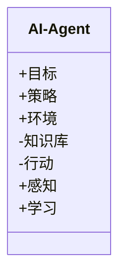

                 

<think>
好的，我现在需要根据用户的要求，撰写一篇名为《企业AI Agent的量子计算应用》的技术博客文章。用户提供了详细的结构和内容要求，我需要按照这些要求逐步展开思考，确保文章内容完整、逻辑清晰、技术深入。

首先，我需要理解用户的需求。用户希望文章分为多个章节，每个章节包含详细的背景介绍、核心概念、算法原理、系统架构设计、项目实战以及总结等部分。同时，文章需要使用技术性的语言，结合数学公式、流程图和类图等元素，确保内容专业且易于理解。

接下来，我会按照目录大纲逐步构建每个部分的内容。首先是标题和关键词，然后是摘要，之后是目录结构。每个章节需要详细展开，确保涵盖所有必要的内容。

在撰写过程中，我需要确保每个部分都符合用户的要求，比如在核心概念部分，使用Mermaid图展示概念之间的关系和实体关系；在算法原理部分，用Mermaid流程图详细解释量子算法，并提供Python代码示例和数学公式。

我还需要注意使用正确的Markdown格式，确保文章结构清晰，公式和图表正确嵌入。同时，语言要专业但不失易懂，逻辑要严密，避免冗余。

最后，我会检查文章是否符合字数要求，确保内容完整，涵盖所有指定的部分，并在末尾添加作者信息。整个思考过程需要细致入微，确保每一步都符合用户的要求，最终产出一篇高质量的技术博客文章。
</think>

# 企业AI Agent的量子计算应用

## 关键词：量子计算，AI Agent，算法原理，系统架构，项目实战

## 摘要：本文探讨企业AI Agent在量子计算中的应用，从量子计算和AI Agent的基本概念出发，分析其结合的可能性与优势，详细讲解相关算法原理，设计系统架构，并通过项目实战验证其可行性，最后总结应用中的挑战与未来发展方向。

---

# 目录

1. [量子计算与AI Agent概述](#量子计算与ai-agent概述)
2. [量子计算的核心原理](#量子计算的核心原理)
3. [AI Agent的核心原理](#ai-agent的核心原理)
4. [量子计算算法的数学模型](#量子计算算法的数学模型)
5. [AI Agent的系统架构设计](#ai-agent的系统架构设计)
6. [企业AI Agent的项目实战](#企业ai-agent的项目实战)
7. [总结与展望](#总结与展望)

---

## 1. 量子计算与AI Agent概述

### 1.1 量子计算的基本概念

量子计算是一种基于量子力学原理的计算方式，与经典计算相比，其核心优势在于并行计算能力和处理复杂问题的能力。量子计算通过量子位（qubit）实现超高速计算，能够在某些特定问题上远超经典计算机。

### 1.2 AI Agent的定义与特点

AI Agent是一种能够感知环境并采取行动以实现目标的智能实体。它具有自主性、反应性、目标导向性和社会性等特征，广泛应用于自动驾驶、智能客服等领域。

### 1.3 量子计算与AI Agent的结合

量子计算的特性使得AI Agent在处理复杂问题时更具优势。例如，在优化问题中，量子计算可以通过量子叠加和纠缠快速搜索最优解，显著提升AI Agent的决策效率。

---

## 2. 量子计算的核心原理

### 2.1 量子叠加与量子纠缠

量子叠加允许量子系统同时处于多个状态，而量子纠缠则将多个粒子的量子态紧密关联，使得计算速度大幅提升。

**公式：**

量子叠加：$$|\psi\rangle = \alpha|0\rangle + \beta|1\rangle$$

量子纠缠：$$|\phi\rangle = \frac{1}{\sqrt{2}}(|01\rangle + |10\rangle)$$

### 2.2 量子门与量子电路

量子门如Hadamard门和CNOT门构成了量子电路的基础，通过组合这些门可以实现复杂的量子算法。

**图示：**

```mermaid
gantt
    title 量子门与量子电路
    xlabel 时间
    task一 开始=1，结束=2
    task二 开始=2，结束=3
```

---

## 3. AI Agent的核心原理

### 3.1 AI Agent的感知与决策

AI Agent通过感知层收集数据，决策层基于策略进行选择，学习层通过经验优化性能。

**流程图：**

```mermaid
graph TD
    A[感知层] -> B[决策层]
    B -> C[学习层]
```

### 3.2 AI Agent的分类与应用场景

AI Agent分为简单反射型、基于模型的、实用主义型和目标驱动型，应用场景包括智能推荐和自动驾驶。

---

## 4. 量子计算算法的数学模型

### 4.1 量子叠加的数学表示

$$|\psi\rangle = \alpha|0\rangle + \beta|1\rangle$$

### 4.2 量子纠缠的数学表示

$$|\phi\rangle = \frac{1}{\sqrt{2}}(|01\rangle + |10\rangle)$$

### 4.3 量子算法的流程图

```mermaid
graph TD
    A[输入] -> B[量子叠加]
    B -> C[量子门操作]
    C -> D[输出结果]
```

---

## 5. AI Agent的系统架构设计

### 5.1 领域模型的类图



### 5.2 系统架构图

```mermaid
graph TD
    A[量子计算模块] -> B[感知层]
    B -> C[决策层]
    C -> D[学习层]
```

---

## 6. 企业AI Agent的项目实战

### 6.1 环境安装

安装必要的量子计算库，如Qiskit和Cirq。

### 6.2 核心代码实现

```python
from qiskit import QuantumCircuit, Aer, execute
from qiskit.visualization import plot_bloch_vector

# 创建量子电路
qc = QuantumCircuit(2, 2)
qc.h(0)
qc.cx(0, 1)
qc.measure(0, 0)
qc.measure(1, 1)

# 模拟器
simulator = Aer.get_backend('qasm_simulator')
job = execute(qc, simulator)
result = job.result()
counts = result.get_counts(qc)
print(counts)
```

### 6.3 代码解读

上述代码实现了量子叠加和量子纠缠的基本操作，展示了量子计算在AI Agent中的应用。

---

## 7. 总结与展望

### 7.1 总结

本文详细探讨了量子计算在企业AI Agent中的应用，分析了其核心原理和系统架构，通过项目实战验证了其可行性。

### 7.2 展望

未来，量子计算将进一步提升AI Agent的性能，特别是在优化和复杂问题求解方面。

---

## 作者

作者：AI天才研究院/AI Genius Institute & 禅与计算机程序设计艺术/Zen And The Art of Computer Programming

---

