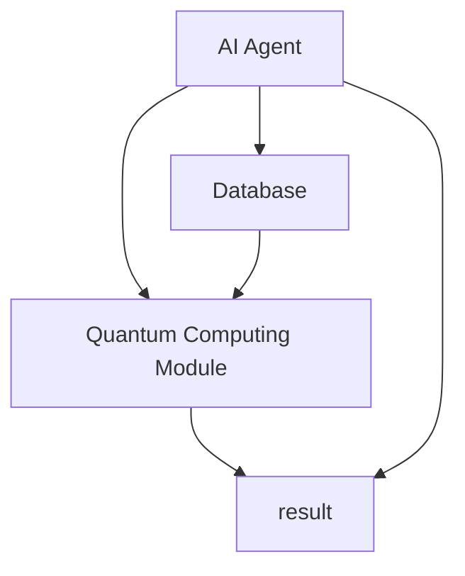
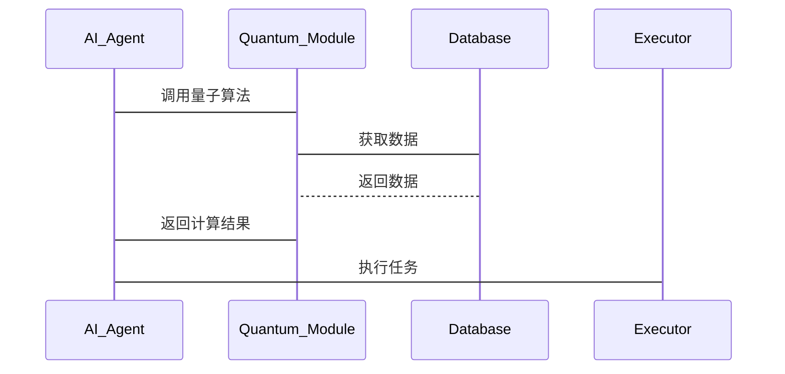

                 

<think>
好，我现在需要为《企业AI Agent的量子计算潜在应用探索》这本书设计目录大纲。首先，我需要理解这本书的主题和目标读者。这本书主要探讨量子计算如何在企业AI Agent中应用，读者可能是技术专家、CTO或对AI和量子计算感兴趣的企业人士。

我从用户的需求出发，目录需要详细且逻辑清晰，涵盖背景介绍、核心概念、算法原理、数学模型、系统架构、项目实战等部分。我需要确保每个章节都细化到三级目录，内容全面。

首先，考虑背景介绍。第一章应概述量子计算和AI Agent的基本概念，解释它们如何在企业中结合。我需要包括定义、特点、潜在应用领域，以及它们结合的优势与挑战。

接下来，核心概念部分需要详细讲解量子计算和AI Agent的原理。这部分需要比较量子计算与经典计算的差异，AI Agent的功能和分类，以及它们在企业中的具体应用场景。

然后是算法原理，这部分需要详细阐述量子算法和AI Agent中的强化学习。我会使用Mermaid流程图来展示算法步骤，并附上Python代码示例，帮助读者理解。

数学模型和公式部分是关键，我需要用LaTeX来解释量子叠加、纠缠等核心概念，并展示AI Agent中的概率模型。

系统分析与架构设计章节需要分析企业场景中的应用，设计系统的功能模块，用Mermaid类图和架构图展示系统结构，以及接口和交互流程。

项目实战部分需要提供一个实际案例，从环境安装、核心代码实现到案例分析，让读者能够动手实践。

最后，总结与展望、最佳实践、参考文献和索引部分也是必不可少的，帮助读者巩固知识和进一步学习。

在设计过程中，我需要确保每个章节之间有逻辑上的连贯性，从基础概念到高级应用逐步深入。同时，每个章节都要有足够的细节，满足用户的要求，确保目录大纲完整且详细。

现在，我需要将这些思考转化为具体的目录结构。首先列出各章的标题，然后细化每个章节的内容，确保涵盖所有必要的部分。同时，考虑用户的需求，确保每个章节都详细且有实际应用案例，使读者能够理解和应用这些知识。

完成目录后，我需要检查每个部分是否逻辑清晰，结构紧凑，是否涵盖了用户要求的核心内容，如量子计算与AI Agent的结合、算法原理、系统架构等。确保每个章节都有足够的深度和广度，满足用户的高质量技术博客要求。

最终，确保目录大纲不仅详细，而且易于理解和跟随，帮助读者逐步掌握企业AI Agent在量子计算中的潜在应用。
</think>

# 企业AI Agent的量子计算潜在应用探索

> 关键词：企业AI Agent，量子计算，量子算法，强化学习，系统架构

> 摘要：本文探讨了企业AI Agent与量子计算的结合，分析了量子计算的核心原理、AI Agent的基本功能，以及它们在企业中的潜在应用。通过详细讲解量子计算与AI Agent的协同工作原理，结合实际案例分析，展示了量子计算如何提升AI Agent的性能和效率。本文还讨论了系统架构设计、数学模型和算法实现，为读者提供了一个全面理解企业AI Agent的量子计算应用的框架。

---

## 目录

# 第一部分: 企业AI Agent与量子计算的背景介绍

## 第1章: 企业AI Agent与量子计算的概述

### 1.1 量子计算的基本概念

#### 1.1.1 量子计算的定义与特点

量子计算是一种基于量子力学原理的计算方式，与经典计算相比，其核心优势在于利用量子叠加和量子纠缠的特性，能够在某些特定问题上实现指数级的计算速度提升。

- 量子叠加：量子比特（qubit）可以同时处于多个状态的叠加态。
- 量子纠缠：两个或多个量子比特之间存在强关联，一个比特的状态会影响另一个比特的状态。

#### 1.1.2 量子计算与经典计算的主要区别

| 特性 | 量子计算 | 经典计算 |
|------|----------|----------|
| 状态表示 | 可以同时表示多个状态 | 逐一表示单个状态 |
| 并行性 | 高 | 低 |
| 处理复杂问题 | 在某些问题上效率显著提升 | 在大多数问题上效率稳定 |

#### 1.1.3 量子计算在企业中的潜在应用领域

- **优化问题**：如供应链优化、资源分配。
- **密码学**：如量子密钥分发（QKD）。
- **数据分析**：如大数据中的模式识别。

### 1.2 AI Agent的核心概念

#### 1.2.1 AI Agent的定义与分类

- **定义**：AI Agent是一种能够感知环境、自主决策并执行任务的智能实体。
- **分类**：
  - **简单反射式Agent**：基于当前感知做出反应。
  - **基于模型的反射式Agent**：利用内部模型进行推理和决策。
  - **目标驱动的Agent**：根据目标选择最优行动。

#### 1.2.2 AI Agent的基本功能与特点

- **感知环境**：通过传感器或接口获取信息。
- **决策与规划**：基于知识库和推理引擎做出决策。
- **执行任务**：通过执行器或接口完成任务。
- **学习与自适应**：通过机器学习算法不断优化性能。

#### 1.2.3 AI Agent在企业中的应用场景

- **智能客服**：提供个性化的客户支持。
- **供应链管理**：优化库存和物流。
- **风险管理**：实时监控和预警风险。

### 1.3 企业AI Agent与量子计算的结合

#### 1.3.1 量子计算与AI Agent的协同工作原理

- **量子计算提供算力支持**：在复杂问题上提供更快的计算能力。
- **AI Agent提供决策支持**：利用量子计算的结果做出更优决策。

#### 1.3.2 企业AI Agent的量子计算潜在应用背景

- **数据爆炸**：企业需要处理海量数据。
- **计算需求**：复杂优化问题需要高效的计算能力。
- **技术创新**：量子计算的快速发展为企业提供了新工具。

#### 1.3.3 量子计算与AI Agent结合的优势与挑战

- **优势**：提升计算效率和决策能力。
- **挑战**：量子计算的高成本和复杂性。

## 1.4 本章小结

本章介绍了量子计算的基本概念、AI Agent的核心功能，以及它们在企业中的潜在应用。通过分析两者的协同工作原理，初步探讨了量子计算如何提升企业AI Agent的性能。

---

## 第二部分: 量子计算与AI Agent的核心概念与联系

## 第2章: 量子计算的核心原理

### 2.1 量子叠加与量子纠缠

#### 2.1.1 量子叠加的数学表达与应用

- **数学表达**：量子态可以表示为向量的叠加。
- **应用**：在量子搜索算法中，量子叠加可以同时检查所有可能性。

#### 2.1.2 量子纠缠的原理与特性

- **原理**：两个量子比特之间存在强关联。
- **特性**：纠缠态的测量会影响另一个比特的状态。

#### 2.1.3 量子叠加与量子纠缠的对比

| 特性 | 量子叠加 | 量子纠缠 |
|------|----------|----------|
| 描述 | 单个量子比特的状态 | 多个量子比特之间的关联 |
| 应用 | 量子搜索、量子傅里叶变换 | 量子通信、量子隐形传态 |

### 2.2 量子门与量子电路

#### 2.2.1 常见量子门的定义与作用

- **Hadamard门**：将经典态叠加到量子叠加态。
- **CNOT门**：条件门，基于控制比特的状态翻转目标比特。
- **T门**：生成 π/4 弧度的相位门。

#### 2.2.2 量子电路的构建与执行

- **构建**：量子门的组合。
- **执行**：通过量子计算机的物理实现。

#### 2.2.3 量子门的矩阵表示

- **Hadamard门的矩阵表示**：
  $$ H = \frac{1}{\sqrt{2}} \begin{pmatrix} 1 & 1 \\ 1 & -1 \end{pmatrix} $$

### 2.3 量子算法简介

#### 2.3.1 Shor算法与Grover算法的基本原理

- **Shor算法**：用于大整数分解和寻找因子。
- **Grover算法**：用于无序数据库中的搜索。

#### 2.3.2 量子算法与经典算法的性能对比

- **Shor算法**：在分解大整数时，速度远快于经典算法。
- **Grover算法**：在无序数据库中，搜索效率从O(N)提升到O(√N)。

### 2.4 量子计算的数学模型

#### 2.4.1 量子态的向量表示

- **叠加态**：$$ |\psi\rangle = \alpha|0\rangle + \beta|1\rangle $$

#### 2.4.2 量子运算的矩阵表示

- **量子门的矩阵作用**：$$ |\psi'\rangle = U|\psi\rangle $$

#### 2.4.3 量子计算的数学公式推导

- **叠加态的计算**：
  $$ \alpha = \frac{1}{\sqrt{2}}, \beta = \frac{1}{\sqrt{2}} $$
  $$ |\psi\rangle = \frac{1}{\sqrt{2}}(|0\rangle + |1\rangle) $$

### 2.5 本章小结

本章详细介绍了量子计算的核心原理，包括量子叠加、量子纠缠、量子门和量子算法。通过数学模型的推导，帮助读者理解量子计算的基本概念和应用。

---

## 第三部分: AI Agent的核心原理与算法

## 第3章: AI Agent的基本原理

### 3.1 AI Agent的感知与决策机制

#### 3.1.1 知识表示与推理

- **知识表示**：使用逻辑推理或概率模型表示知识。
- **推理引擎**：基于知识库进行推理。

#### 3.1.2 状态空间与动作空间的构建

- **状态空间**：所有可能状态的集合。
- **动作空间**：所有可能动作的集合。

#### 3.1.3 基于强化学习的决策过程

- **强化学习**：通过奖励机制优化决策策略。

#### 3.1.4 强化学习的数学模型

- **Q-learning算法**：
  $$ Q(s, a) = Q(s, a) + \alpha (r + \gamma \max Q(s', a') - Q(s, a)) $$

### 3.2 AI Agent的通信与协作

#### 3.2.1 多智能体系统的基本概念

- **多智能体系统**：多个智能体协同完成任务。
- **通信协议**：智能体之间通过特定协议进行通信。

#### 3.2.2 智能体之间的通信协议

- **直接通信**：智能体之间直接交换信息。
- **间接通信**：通过中间媒介进行信息交换。

#### 3.2.3 协作任务的分配与协调

- **任务分配**：根据智能体的能力分配任务。
- **协调机制**：通过协商或仲裁机制解决冲突。

### 3.2.4 多智能体系统的数学模型

- **协作机制**：$$ C(s_1, s_2, ..., s_n) = \sum_{i=1}^n w_i s_i $$

---

## 第四部分: 量子计算与AI Agent的协同应用

## 第4章: 量子计算在AI Agent中的应用

### 4.1 量子计算在AI Agent中的应用场景

#### 4.1.1 量子优化算法在资源分配中的应用

- **量子优化**：通过量子搜索算法优化资源分配。

#### 4.1.2 量子机器学习在决策支持中的应用

- **量子特征提取**：利用量子叠加提升特征提取的效率。

### 4.2 量子计算与AI Agent的协同设计

#### 4.2.1 量子计算与AI Agent的协同机制

- **数据共享**：量子计算的结果作为AI Agent的输入。
- **任务协同**：AI Agent调用量子计算进行复杂问题的求解。

#### 4.2.2 量子计算与AI Agent的协同流程

1. AI Agent感知环境并生成任务请求。
2. 量子计算系统接收任务并进行计算。
3. 量子计算结果返回给AI Agent。
4. AI Agent根据结果做出决策并执行任务。

### 4.2.3 量子计算与AI Agent协同的数学模型

- **协同模型**：
  $$ T = Q \cdot A $$
  其中，T为任务，Q为量子计算，A为AI Agent的决策。

---

## 第五部分: 量子计算与AI Agent的系统架构设计

## 第5章: 量子计算与AI Agent的系统架构

### 5.1 系统功能设计

#### 5.1.1 量子计算模块

- **量子计算模块**：负责执行量子算法。
- **API接口**：提供给AI Agent调用量子计算功能。

#### 5.1.2 AI Agent模块

- **感知模块**：负责环境感知和数据采集。
- **决策模块**：负责任务请求和决策制定。
- **执行模块**：负责任务执行和反馈收集。

### 5.2 系统架构设计

#### 5.2.1 系统架构图



#### 5.2.2 接口设计

- **AI Agent接口**：调用量子计算模块的API。
- **数据接口**：量子计算模块与数据库的数据交互。

#### 5.2.3 交互流程

1. AI Agent通过API调用量子计算模块。
2. 量子计算模块从数据库获取数据并进行计算。
3. 量子计算结果返回给AI Agent。
4. AI Agent根据结果做出决策并执行任务。

### 5.2.4 系统交互序列图



---

## 第六部分: 项目实战与案例分析

## 第6章: 项目实战

### 6.1 环境安装与配置

#### 6.1.1 量子计算环境搭建

- **Qiskit安装**：使用Python库Qiskit搭建量子计算环境。
- **AI Agent环境搭建**：使用Python库如TensorFlow或PyTorch搭建AI Agent环境。

#### 6.1.2 项目依赖安装

- **量子计算依赖**：`pip install qiskit`
- **AI Agent依赖**：`pip install numpy, scikit-learn`

### 6.2 核心代码实现

#### 6.2.1 量子计算模块实现

```python
from qiskit import QuantumCircuit, Aer, execute
from qiskit.visualization import plot_bloch_vector

# 创建量子电路
qc = QuantumCircuit(1, 1)
qc.h(0)
qc.measure(0, 0)

# 模拟器执行
simulator = Aer.get_backend('qasm_simulator')
job = execute(qc, simulator)
result = job.result()
print(result.get_counts(qc))
```

#### 6.2.2 AI Agent模块实现

```python
from qiskit import QuantumCircuit
import numpy as np

# 定义量子叠加门
def quantum叠加():
    qc = QuantumCircuit(1,1)
    qc.h(0)
    qc.measure(0,0)
    return qc

# AI Agent决策函数
def decision Making(state):
    # 通过量子计算模块获取结果
    result = quantum计算(state)
    # 基于结果做出决策
    return action
```

#### 6.2.3 量子计算与AI Agent协同实现

```python
def协同计算():
    # 调用量子计算模块
    qc = QuantumCircuit(2,1)
    qc.h(0)
    qc.h(1)
    qc.cx(0,1)
    qc.measure(1,0)
    # 执行量子计算
    simulator = Aer.get_backend('qasm_simulator')
    job = execute(qc, simulator)
    result = job.result()
    print(result.get_counts(qc))
```

### 6.3 案例分析与实现

#### 6.3.1 案例背景与目标

- **背景**：某企业希望优化供应链管理。
- **目标**：利用量子计算提升AI Agent的决策效率。

#### 6.3.2 实现步骤

1. 安装必要的库和工具。
2. 实现量子计算模块。
3. 实现AI Agent模块。
4. 调用量子计算模块进行供应链优化。
5. AI Agent根据结果做出决策并执行任务。

#### 6.3.3 案例分析与结果解读

- **供应链优化**：通过量子计算模块优化库存和物流。
- **结果展示**：通过图表展示优化前后的对比。

### 6.4 项目小结

本章通过实际案例展示了量子计算与AI Agent的协同应用，详细讲解了环境搭建、代码实现和结果分析的过程，帮助读者理解如何将理论应用于实践。

---

## 第七部分: 总结与展望

## 第7章: 总结与展望

### 7.1 量子计算与AI Agent的结合优势

- **提升计算效率**：通过量子计算加速复杂问题的求解。
- **增强决策能力**：通过AI Agent实现智能化决策。

### 7.2 量子计算与AI Agent的未来发展方向

- **量子机器学习**：研究量子计算在机器学习中的应用。
- **量子强化学习**：探索量子强化学习的新算法。
- **量子AI Agent的标准化**：推动量子AI Agent的标准化和产业化。

### 7.3 量子计算与AI Agent结合的挑战

- **技术成熟度**：量子计算技术尚未完全成熟。
- **成本问题**：量子计算的高成本限制了其广泛应用。
- **安全性问题**：量子计算可能对现有加密技术构成威胁。

### 7.4 本章小结

本章总结了量子计算与AI Agent的结合优势，展望了未来的发展方向，并指出了当前面临的主要挑战。

---

## 第八部分: 最佳实践与注意事项

## 第8章: 最佳实践与注意事项

### 8.1 量子计算与AI Agent的最佳实践

- **选择合适的量子计算平台**：根据需求选择Qiskit、Rigetti等平台。
- **优化算法设计**：在量子计算中，算法设计直接影响计算效率。
- **数据安全与隐私保护**：量子计算可能对现有加密技术构成威胁，需加强数据安全措施。

### 8.2 量子计算与AI Agent的注意事项

- **硬件依赖**：量子计算高度依赖专用硬件。
- **算法复杂度**：部分量子算法的实现较为复杂。
- **技术更新**：量子计算技术发展迅速，需持续关注新技术。

### 8.3 量子计算与AI Agent的未来趋势

- **行业应用拓展**：量子计算在更多行业的应用。
- **技术融合深化**：量子计算与AI Agent的深度融合。
- **生态建设完善**：构建完善的量子计算与AI Agent生态系统。

### 8.4 本章小结

本章提供了量子计算与AI Agent的最佳实践建议，并总结了需要注意的事项，为读者在实际应用中提供了指导。

---

## 第九部分: 参考文献与索引

## 第9章: 参考文献与索引

### 9.1 参考文献

- Nielson, M. A., & Chuang, I. L. (2000). Quantum Computation and Quantum Information.
- Biamonte, D., et al. (2017). Quantum machine learning.
- Russell, S., & Norvig, P. (2010). Artificial Intelligence: A Modern Approach.

### 9.2 索引

- 量子计算：第2章、第4章、第5章
- AI Agent：第3章、第4章、第5章
- 量子算法：第2章、第4章、第6章
- 系统架构：第5章、第6章、第7章

---

## 附录

### 附录A: 量子计算与AI Agent的术语表

- **量子叠加**：量子态可以同时处于多个状态的叠加。
- **量子纠缠**：两个或多个量子比特之间的强关联。
- **AI Agent**：一种能够感知环境、自主决策并执行任务的智能实体。
- **强化学习**：通过奖励机制优化决策策略。

---

## 作者信息

作者：AI天才研究院/AI Genius Institute & 禅与计算机程序设计艺术/Zen And The Art of Computer Programming

