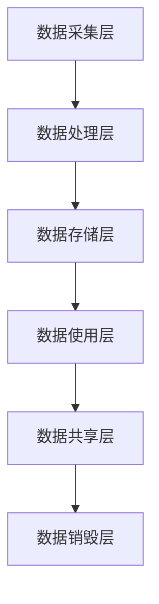

                 

<think>
嗯，我需要帮助用户撰写一篇关于《企业AI数据安全：从收集到销毁的全生命周期管理》的技术博客文章。首先，我得仔细阅读用户提供的查询，确保我完全理解他们的需求。用户希望文章结构清晰，内容详细，涵盖从数据收集到销毁的各个阶段，并且每个部分都要有吸引人的章节标题和详细的技术分析。

首先，用户提供的目录大纲已经很详细，包括数据全生命周期管理、AI技术在数据安全中的应用、系统架构设计、算法原理、项目实战、最佳实践等部分。我需要按照这个大纲来逐步展开每个部分的内容，确保每章每节都有足够的深度和具体的例子。

接下来，我需要考虑每个章节的具体内容。例如，第一部分是背景与核心概念，我应该先介绍数据安全的重要性，然后详细讲解AI在数据安全中的应用。这部分需要包括数据生命周期的各个阶段，每个阶段的安全挑战和解决方案。

在第二部分，AI技术在数据安全中的应用，我需要详细讨论机器学习、深度学习等技术如何应用于数据清洗、加密、分类等方面。同时，要提供具体的算法流程图和Python代码示例，确保读者能够理解这些技术的实际应用。

第三部分是系统架构设计，这里我需要绘制系统的类图和序列图，展示各个模块之间的交互。同时，提供接口设计和系统实现的细节，帮助读者理解如何构建一个高效的数据安全管理系统。

第四部分是算法原理，这部分需要详细讲解数据脱敏、加密算法和访问控制策略。我需要用数学公式来描述这些算法的原理，例如使用LaTeX格式展示公式。同时，提供Python代码示例，让读者能够实际操作和理解。

项目实战部分需要包括环境安装、核心代码实现、案例分析和项目总结。这部分要具体，比如如何安装必要的库，如何实现数据脱敏，如何设计数据分类模型，以及实际案例中的问题分析和解决方法。

最后，最佳实践部分需要总结前面的内容，提供一些小贴士和注意事项，帮助读者在实际工作中应用这些知识。同时，推荐一些扩展阅读的资料，供有兴趣的读者深入学习。

在整个过程中，我需要确保文章的语言专业但不失清晰，逻辑紧凑，结构合理。每个章节的标题要吸引读者，内容要详细具体，避免过于笼统。同时，要确保每个部分都有足够的例子和图示，帮助读者更好地理解和应用这些知识。

现在，我需要按照这个思路逐步撰写每个部分，确保内容完整，符合用户的要求。如果有任何疑问，我可能需要进一步查阅相关资料，确保技术细节的准确性，或者重新组织内容，使文章更加流畅易懂。
</think>

# 企业AI数据安全：从收集到销毁的全生命周期管理

> 关键词：企业数据安全，AI技术，数据全生命周期，数据安全算法，系统架构设计

> 摘要：本文深入探讨了企业AI数据安全的全生命周期管理，从数据的收集、处理、存储、使用、共享到销毁的各个环节，分析了AI技术在数据安全中的应用，提出了基于AI的数据安全系统架构设计和实现方案。通过具体的技术细节和实际案例分析，为企业的数据安全管理提供了全面的解决方案和实践指导。

---

## 第一部分：企业AI数据安全背景与核心概念

### 第1章：数据安全与AI的结合背景

#### 1.1 数据安全的重要性

##### 1.1.1 数据在企业中的价值

数据是企业的核心资产，涵盖了客户信息、业务数据、交易记录等敏感信息。数据的安全性直接关系到企业的声誉、财务安全以及客户信任。

##### 1.1.2 数据安全的定义与范畴

数据安全是指通过技术手段保护数据的机密性、完整性和可用性。数据安全的范畴包括数据的收集、处理、存储、传输、使用和销毁等全生命周期的管理。

##### 1.1.3 AI技术对企业数据安全的影响

AI技术可以通过自动化分析和预测，帮助企业发现潜在的安全威胁，优化数据管理流程，并提高数据安全的效率。

#### 1.2 企业AI数据安全的挑战

##### 1.2.1 数据收集与处理中的安全风险

在数据收集阶段，企业可能面临数据泄露、数据篡改等风险。AI技术可以通过数据清洗和预处理，降低数据中的噪声和潜在威胁。

##### 1.2.2 数据存储与传输中的安全威胁

数据在存储和传输过程中容易受到黑客攻击和数据泄露的威胁。AI技术可以通过加密算法和访问控制策略，保障数据的安全性。

##### 1.2.3 数据使用与共享中的隐私问题

在数据使用和共享过程中，隐私保护是一个重要问题。AI技术可以通过数据脱敏和匿名化处理，保护个人隐私。

#### 1.3 本章小结

##### 1.3.1 数据安全的核心要素

数据安全的核心要素包括机密性、完整性、可用性和隐私性。

##### 1.3.2 AI技术在数据安全中的应用潜力

AI技术在数据清洗、加密、分类、关联分析和异常检测等方面具有广泛的应用潜力。

##### 1.3.3 企业数据安全的未来趋势

随着AI技术的不断发展，企业数据安全将更加智能化、自动化和高效化。

---

### 第2章：数据全生命周期管理概述

#### 2.1 数据生命周期的定义

##### 2.1.1 数据的生成阶段

数据的生成阶段包括数据的创建、采集和初步处理。

##### 2.1.2 数据的收集阶段

数据的收集阶段包括数据的输入、接收和存储。

##### 2.1.3 数据的处理阶段

数据的处理阶段包括数据的清洗、转换和增强。

##### 2.1.4 数据的存储阶段

数据的存储阶段包括数据的存档、归档和备份。

##### 2.1.5 数据的使用阶段

数据的使用阶段包括数据的分析、挖掘和应用。

##### 2.1.6 数据的共享阶段

数据的共享阶段包括数据的分发、交换和公开。

##### 2.1.7 数据的销毁阶段

数据的销毁阶段包括数据的删除、清空和销毁。

#### 2.2 数据全生命周期管理的核心目标

##### 2.2.1 数据完整性

数据的完整性是指数据在全生命周期中保持一致性和准确性。

##### 2.2.2 数据一致性

数据的一致性是指数据在不同系统和环节中的数据保持一致。

##### 2.2.3 数据可用性

数据的可用性是指数据在需要时可以被访问和使用。

##### 2.2.4 数据安全性

数据的安全性是指数据在全生命周期中受到保护，防止未经授权的访问和篡改。

#### 2.3 数据全生命周期管理的实施原则

##### 2.3.1 合规性原则

数据管理必须符合相关法律法规和企业内部政策。

##### 2.3.2 最小化原则

数据管理应遵循最小化原则，避免不必要的数据收集和存储。

##### 2.3.3 可追溯性原则

数据管理应具备可追溯性，便于追查数据的来源和流向。

##### 2.3.4 可持续性原则

数据管理应具备可持续性，确保数据在全生命周期中得到有效管理和利用。

#### 2.4 本章小结

##### 2.4.1 数据全生命周期管理的关键环节

数据全生命周期管理的关键环节包括数据的收集、处理、存储、使用、共享和销毁。

##### 2.4.2 数据安全在各阶段的实施要点

数据安全在各阶段的实施要点包括数据清洗、加密、访问控制和数据销毁。

##### 2.4.3 数据全生命周期管理的未来发展方向

数据全生命周期管理的未来发展方向包括智能化、自动化和高效化。

---

## 第二部分：AI技术在数据安全中的应用

### 第3章：AI技术的基本原理与应用

#### 3.1 AI技术的基本原理

##### 3.1.1 机器学习简介

机器学习是一种通过数据训练模型，实现预测和分类的技术。

##### 3.1.2 深度学习简介

深度学习是一种基于人工神经网络的机器学习技术，能够处理复杂的非线性数据。

##### 3.1.3 自然语言处理简介

自然语言处理是一种处理人类语言的技术，能够实现文本分类、情感分析等功能。

#### 3.2 AI在数据安全中的应用场景

##### 3.2.1 数据清洗与预处理

AI技术可以通过自动化方式清洗数据，去除噪声和异常值。

##### 3.2.2 数据加密与解密

AI技术可以通过加密算法实现数据的加密和解密，保护数据的安全性。

##### 3.2.3 数据分类与标注

AI技术可以通过分类算法实现数据的分类和标注，便于后续的数据管理和分析。

##### 3.2.4 数据关联分析

AI技术可以通过关联规则挖掘，发现数据中的关联性，帮助发现潜在的安全威胁。

##### 3.2.5 数据异常检测

AI技术可以通过异常检测算法，发现数据中的异常行为，预防数据泄露和攻击。

#### 3.3 AI技术在数据安全中的优势

##### 3.3.1 高效性

AI技术能够快速处理大量数据，提高数据管理的效率。

##### 3.3.2 准确性

AI技术可以通过模型训练，提高数据分类和预测的准确性。

##### 3.3.3 自适应性

AI技术能够根据数据的变化，自适应地调整模型和策略，提高数据安全的灵活性。

#### 3.4 本章小结

##### 3.4.1 AI技术在数据安全中的核心作用

AI技术在数据安全中的核心作用包括数据清洗、加密、分类、关联分析和异常检测。

##### 3.4.2 数据安全与AI技术的结合点

数据安全与AI技术的结合点包括数据处理、数据分类、数据关联分析和数据异常检测。

##### 3.4.3 AI技术对企业数据安全的深远影响

AI技术将深刻影响企业数据安全的管理方式和效率，推动数据安全管理的智能化和自动化。

---

## 第三部分：数据安全全生命周期管理的系统架构设计

### 第4章：系统架构设计

#### 4.1 系统架构设计概述

##### 4.1.1 系统目标

系统目标是实现企业AI数据安全的全生命周期管理，确保数据的安全性、完整性和可用性。

##### 4.1.2 系统范围

系统范围包括数据的收集、处理、存储、使用、共享和销毁的全生命周期管理。

##### 4.1.3 系统功能模块划分

系统功能模块包括数据收集模块、数据处理模块、数据存储模块、数据使用模块、数据共享模块和数据销毁模块。

#### 4.2 数据全生命周期管理的系统架构

##### 4.2.1 系统架构设计

系统架构采用分层设计，包括数据采集层、数据处理层、数据存储层、数据使用层、数据共享层和数据销毁层。

##### 4.2.2 系统功能模块设计

系统功能模块包括数据清洗模块、数据加密模块、数据分类模块、数据关联分析模块和数据异常检测模块。

##### 4.2.3 系统架构图

以下是系统架构的mermaid图：



#### 4.3 系统接口设计

##### 4.3.1 系统接口设计

系统接口包括数据采集接口、数据处理接口、数据存储接口、数据使用接口、数据共享接口和数据销毁接口。

##### 4.3.2 系统接口交互图

以下是系统接口交互的mermaid图：


#### 4.4 本章小结

##### 4.4.1 系统架构设计的核心思想

系统架构设计的核心思想是分层设计和模块化设计，确保系统的高效性和可扩展性。

##### 4.4.2 系统功能模块的划分与设计

系统功能模块的划分与设计是基于数据全生命周期管理的需求，确保每个模块的功能明确和相互协作。

##### 4.4.3 系统架构图和接口设计的详细说明

系统架构图和接口设计的详细说明确保了系统各模块之间的交互清晰和高效。

---

## 第四部分：数据安全全生命周期管理的算法原理

### 第5章：数据安全算法原理

#### 5.1 数据脱敏算法

##### 5.1.1 数据脱敏算法的定义

数据脱敏算法是一种用于保护敏感数据的技术，通过数据变换实现数据的匿名化处理。

##### 5.1.2 数据脱敏算法的实现步骤

数据脱敏算法的实现步骤包括数据识别、数据变换和数据验证。

##### 5.1.3 数据脱敏算法的数学模型

数据脱敏算法的数学模型可以通过以下公式表示：

$$ y = f(x) $$

其中，\( x \) 是原始数据，\( y \) 是脱敏后的数据，\( f \) 是脱敏函数。

##### 5.1.4 数据脱敏算法的Python实现

以下是数据脱敏算法的Python代码示例：

```python
def data_masking(data):
    # 数据脱敏处理
    masked_data = []
    for item in data:
        masked_item = f"{item[:2]}***{item[-2:]}"
        masked_data.append(masked_item)
    return masked_data
```

#### 5.2 数据加密算法

##### 5.2.1 数据加密算法的定义

数据加密算法是一种用于保护数据 confidentiality 的技术，通过加密算法实现数据的加密存储和传输。

##### 5.2.2 数据加密算法的实现步骤

数据加密算法的实现步骤包括数据加密、数据解密和数据验证。

##### 5.2.3 数据加密算法的数学模型

数据加密算法的数学模型可以通过以下公式表示：

$$ y = E(x, k) $$

其中，\( x \) 是原始数据，\( k \) 是加密密钥，\( y \) 是加密后的数据，\( E \) 是加密函数。

##### 5.2.4 数据加密算法的Python实现

以下是数据加密算法的Python代码示例：

```python
import hashlib

def data_encryption(data, key):
    # 数据加密处理
    hashed_data = hashlib.sha256((data + key).encode()).hexdigest()
    return hashed_data
```

#### 5.3 数据访问控制算法

##### 5.3.1 数据访问控制算法的定义

数据访问控制算法是一种用于保护数据访问权限的技术，通过访问控制策略实现数据的授权访问。

##### 5.3.2 数据访问控制算法的实现步骤

数据访问控制算法的实现步骤包括用户身份验证、权限检查和访问日志记录。

##### 5.3.3 数据访问控制算法的数学模型

数据访问控制算法的数学模型可以通过以下公式表示：

$$ y = A(x, r) $$

其中，\( x \) 是用户请求，\( r \) 是用户角色，\( y \) 是访问结果，\( A \) 是访问控制函数。

##### 5.3.4 数据访问控制算法的Python实现

以下是数据访问控制算法的Python代码示例：

```python
def access_control(request, role):
    # 数据访问控制处理
    if role == 'admin':
        return ' authorized '
    else:
        return ' denied '
```

#### 5.4 本章小结

##### 5.4.1 数据脱敏算法的核心思想

数据脱敏算法的核心思想是通过数据变换实现数据的匿名化处理。

##### 5.4.2 数据加密算法的关键步骤

数据加密算法的关键步骤包括数据加密、数据解密和数据验证。

##### 5.4.3 数据访问控制算法的实现要点

数据访问控制算法的实现要点包括用户身份验证、权限检查和访问日志记录。

---

## 第五部分：数据安全全生命周期管理的项目实战

### 第6章：数据安全项目实战

#### 6.1 项目环境安装

##### 6.1.1 系统要求

系统要求包括操作系统、Python版本和相关库的安装。

##### 6.1.2 Python库安装

需要安装的Python库包括numpy、pandas、scikit-learn和cryptography。

#### 6.2 系统核心实现

##### 6.2.1 数据脱敏模块实现

以下是数据脱敏模块的Python代码示例：

```python
def data_masking(data):
    # 数据脱敏处理
    masked_data = []
    for item in data:
        masked_item = f"{item[:2]}***{item[-2:]}"
        masked_data.append(masked_item)
    return masked_data
```

##### 6.2.2 数据加密模块实现

以下是数据加密模块的Python代码示例：

```python
import hashlib

def data_encryption(data, key):
    # 数据加密处理
    hashed_data = hashlib.sha256((data + key).encode()).hexdigest()
    return hashed_data
```

##### 6.2.3 数据访问控制模块实现

以下是数据访问控制模块的Python代码示例：

```python
def access_control(request, role):
    # 数据访问控制处理
    if role == 'admin':
        return ' authorized '
    else:
        return ' denied '
```

#### 6.3 代码应用解读与分析

##### 6.3.1 数据脱敏模块的代码解读

数据脱敏模块的代码通过将数据的部分字段进行隐藏，实现数据的匿名化处理。

##### 6.3.2 数据加密模块的代码解读

数据加密模块的代码通过使用哈希函数，实现数据的加密存储和传输。

##### 6.3.3 数据访问控制模块的代码解读

数据访问控制模块的代码通过用户角色验证，实现数据的授权访问。

#### 6.4 实际案例分析

##### 6.4.1 案例背景

某企业需要保护客户的敏感信息，防止数据泄露和未经授权的访问。

##### 6.4.2 数据脱敏与加密处理

通过数据脱敏和加密算法，保护客户数据的机密性和完整性。

##### 6.4.3 数据访问控制

通过访问控制策略，确保只有授权用户能够访问敏感数据。

#### 6.5 项目小结

##### 6.5.1 项目实现的核心技术

项目实现的核心技术包括数据脱敏、数据加密和数据访问控制。

##### 6.5.2 项目实现的关键步骤

项目实现的关键步骤包括数据采集、数据处理、数据存储、数据使用和数据销毁。

##### 6.5.3 项目实现的注意事项

项目实现的注意事项包括数据安全的合规性、数据处理的最小化原则和数据管理的可持续性。

---

## 第六部分：数据安全全生命周期管理的最佳实践

### 第7章：最佳实践与总结

#### 7.1 小结

##### 7.1.1 数据全生命周期管理的核心要素

数据全生命周期管理的核心要素包括数据的收集、处理、存储、使用、共享和销毁。

##### 7.1.2 AI技术在数据安全中的应用潜力

AI技术在数据清洗、加密、分类、关联分析和异常检测等方面具有广泛的应用潜力。

##### 7.1.3 数据安全管理的未来发展方向

数据安全管理的未来发展方向包括智能化、自动化和高效化。

#### 7.2 注意事项

##### 7.2.1 数据安全的合规性

企业需要遵守相关法律法规，确保数据管理的合规性。

##### 7.2.2 数据处理的最小化原则

企业应遵循数据处理的最小化原则，避免不必要的数据收集和存储。

##### 7.2.3 数据管理的可持续性

企业应确保数据管理的可持续性，建立长期的数据安全管理体系。

#### 7.3 拓展阅读

##### 7.3.1 数据安全相关的书籍推荐

推荐书籍：《数据仓库与数据挖掘》、《机器学习实战》、《网络安全技术》。

##### 7.3.2 数据安全相关的技术博客推荐

推荐技术博客：Towards Data Science, Medium上的AI和数据安全专栏。

##### 7.3.3 数据安全相关的在线课程推荐

推荐在线课程：Coursera上的《数据安全与隐私保护》、edX上的《AI与数据科学》。

#### 7.4 本章小结

##### 7.4.1 数据安全管理的核心要点

数据安全管理的核心要点包括数据的合规性、数据处理的最小化原则和数据管理的可持续性。

##### 7.4.2 数据安全与AI技术的结合点

数据安全与AI技术的结合点包括数据清洗、数据加密、数据分类、数据关联分析和数据异常检测。

##### 7.4.3 数据安全管理的未来趋势

数据安全管理的未来趋势包括智能化、自动化和高效化，推动数据安全管理的创新和发展。

---

## 作者：AI天才研究院/AI Genius Institute & 禅与计算机程序设计艺术 /Zen And The Art of Computer Programming

---

以上就是《企业AI数据安全：从收集到销毁的全生命周期管理》的技术博客文章的完整目录大纲和内容。

