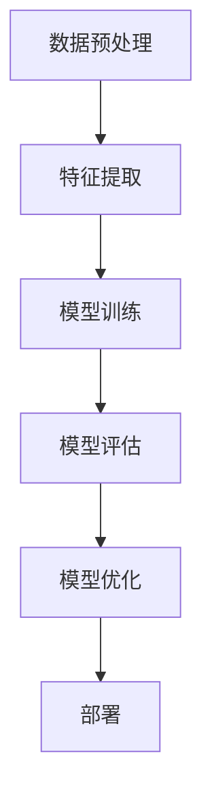
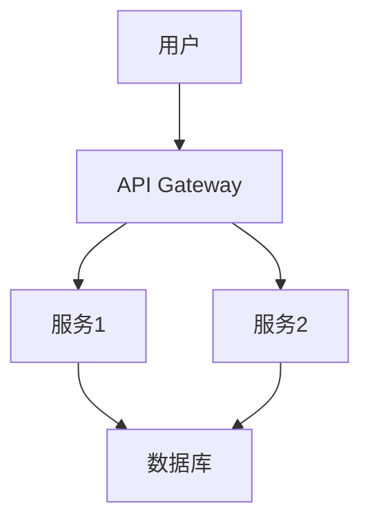
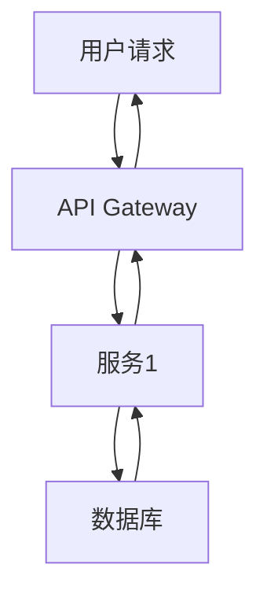

                 

<think>
好的，用户让我设计一本关于企业AI治理框架的书籍目录大纲，书名是《企业AI治理框架：确保AI Agent的可控与合规》。用户已经提供了一个详细的示例，我需要仔细分析并理解这个示例的结构和内容，然后构建一个符合用户要求的完整目录大纲。

首先，我需要明确用户的需求。用户希望我以《企业AI治理框架：确保AI Agent的可控与合规》为标题，撰写一篇技术博客文章，使用逻辑清晰、结构紧凑且简单易懂的语言。目录需要包括背景介绍、核心概念、算法原理、系统分析、项目实战、最佳实践等部分。

接下来，我观察到用户提供的示例结构分为五大部分，每个部分都有详细的章节和小节，涵盖从概述到总结的各个方面。这提示我需要确保我的目录也具备类似的深度和广度，确保每个核心概念都被详细展开，并且包含必要的技术细节和实际案例。

我还需要考虑用户的具体要求，例如使用mermaid图表来展示系统架构、算法流程等。这意味着在目录中，我需要明确哪些部分将包含图表，并确保这些图表能够帮助读者更好地理解内容。

此外，用户提到文章需要包括数学公式，使用latex格式，并且代码示例需要详细解读。因此，在构建目录时，我需要在合适的位置留出空间，以便在撰写内容时可以插入这些技术细节。

在结构上，我决定将内容分为五个主要部分：概述、核心要素、技术实现、合规与风险、项目实战，最后是总结。每个部分下细分为章节和小节，确保覆盖所有关键点。例如，在治理框架概述部分，我需要介绍AI在企业中的应用现状，治理的必要性以及核心目标和原则。

在技术实现部分，我需要详细讨论算法原理，如监督学习和无监督学习的定义与流程，以及模型可解释性算法的实现。系统架构设计部分将涵盖分层架构、微服务架构等，同时展示相应的mermaid图表。

合规与风险管理部分将探讨数据隐私、法律合规和伦理审查等问题，确保内容不仅涵盖技术层面，还包括法律和伦理层面的考量。

项目实战部分将通过实际案例来应用这些理论，展示环境安装、核心代码实现、案例分析等，帮助读者将理论知识应用到实践中。

最后，在总结部分，我需要回顾整个框架，并展望未来的发展趋势，同时添加注意事项和最佳实践，为读者提供实用的建议。

在构建目录时，我还需要确保每个章节和小节的标题准确且吸引人，内容逻辑清晰，层次分明。同时，要避免冗余，确保每个部分都紧密围绕主题展开。

综上所述，我将按照用户提供的示例结构，结合技术博客的要求，构建一个详细且符合逻辑的企业AI治理框架目录大纲，确保涵盖所有必要内容，并满足用户的深层需求。
</think>

# 企业AI治理框架：确保AI Agent的可控与合规

> 关键词：企业AI治理，AI Agent，可控与合规，人工智能治理，技术框架

> 摘要：随着人工智能技术的快速发展，企业AI应用日益广泛，但同时也面临可控性与合规性的巨大挑战。本文从企业AI治理框架的角度，深入探讨如何确保AI Agent的安全、可控与合规。通过详细的技术分析和实际案例，结合系统架构设计和算法实现，为企业提供一套完整的治理框架解决方案。

---

## 第一部分: 企业AI治理框架概述

### 第1章: AI治理框架的背景与概念

#### 1.1 人工智能在企业中的应用现状
- 1.1.1 人工智能技术的快速发展
  - AI技术的核心领域：机器学习、自然语言处理、计算机视觉
  - AI在企业中的典型应用：智能客服、自动化决策、供应链优化、数据分析
- 1.1.2 企业AI应用的典型场景
  - 智能助手：提升用户体验
  - 数据分析：驱动业务决策
  - 自动化流程：提高效率
- 1.1.3 AI在企业中的价值与挑战
  - 价值：数据驱动的精准决策，降本增效
  - 挑战：数据隐私、算法偏见、不可控性

#### 1.2 企业AI治理的必要性
- 1.2.1 AI技术带来的风险与问题
  - 数据隐私泄露
  - 算法偏见与歧视
  - 系统失控风险
- 1.2.2 企业治理的内涵与外延
  - 内涵：通过制度、技术、流程确保AI系统的安全性和合规性
  - 外延：涵盖数据、模型、系统、伦理等多个维度
- 1.2.3 AI治理的核心目标与原则
  - 目标：确保AI系统可控、合规、透明
  - 原则：透明性、可解释性、责任性、安全性

---

## 第二部分: AI治理框架的核心要素

### 第2章: AI治理框架的核心要素

#### 2.1 数据治理
- 2.1.1 数据质量与安全
  - 数据质量：完整性、准确性、一致性
  - 数据安全：加密、访问控制、数据脱敏
- 2.1.2 数据隐私与合规
  - 数据隐私：GDPR等法规要求
  - 数据分类：敏感数据与非敏感数据的区分
- 2.1.3 数据生命周期管理
  - 数据生成、存储、使用、销毁

#### 2.2 模型治理
- 2.2.1 模型训练与评估
  - 训练数据的选择与标注
  - 模型评估：准确率、召回率、F1值
- 2.2.2 模型可解释性
  - SHAP值解释：模型决策的可解释性
  - LIME解释：局部可解释性
- 2.2.3 模型风险管理
  - 模型失效检测
  - 模型更新与优化

#### 2.3 系统治理
- 2.3.1 系统架构设计
  - 分层架构：数据层、模型层、应用层
  - 微服务架构：模块化设计
- 2.3.2 系统监控与维护
  - 实时监控：日志、性能指标
  - 故障恢复：容错设计
- 2.3.3 系统安全与防护
  - 权限管理：最小权限原则
  - 入侵检测：异常行为分析

#### 2.4 伦理与合规
- 2.4.1 AI伦理的基本原则
  - 伦理性：AI行为应符合社会伦理规范
  - 透明性：AI决策过程需透明
- 2.4.2 企业AI应用的法律合规
  - GDPR：欧盟数据保护法规
  - CCPA：加州消费者隐私法案
- 2.4.3 伦理审查与责任追究
  - 伦理审查委员会：AI应用前的审查
  - 责任追究：AI决策失误的责任划分

---

## 第三部分: AI治理框架的技术实现

### 第3章: AI治理框架的算法原理

#### 3.1 监督学习与无监督学习
- 3.1.1 监督学习的定义与流程
  - 样本数据：有标签数据
  - 算法：线性回归、随机森林、神经网络
- 3.1.2 无监督学习的定义与流程
  - 样本数据：无标签数据
  - 算法：聚类、降维
- 3.1.3 算法选择与优化
  - 根据场景选择算法
  - 超参数优化

#### 3.2 模型可解释性算法
- 3.2.1 SHAP值解释
  - SHAP（Shapley Additive exPlanations）：模型决策的贡献度
- 3.2.2 LIME解释
  - LIME（Local Interpretable Model-agnostic Explanations）：局部可解释性
- 3.2.3 模型解释性工具的实现
  - Python库：SHAP、eli5

#### 3.3 算法流程图（mermaid）


### 第4章: 系统架构与接口设计

#### 4.1 系统架构设计
- 4.1.1 分层架构设计
  - 数据层：数据存储与管理
  - 模型层：模型训练与部署
  - 应用层：用户交互与业务逻辑
- 4.1.2 微服务架构设计
  - 模块化设计：独立服务间的松耦合
- 4.1.3 混合架构设计
  - 结合分层与微服务的优势

#### 4.2 系统接口设计
- 4.2.1 RESTful API设计
  - 请求方式：GET、POST、PUT、DELETE
  - 接口规范：JSON格式、状态码
- 4.2.2 RPC接口设计
  - 远程过程调用：高效通信
- 4.2.3 接口安全设计
  - 认证：OAuth2.0
  - 授权：基于角色的访问控制

#### 4.3 系统架构图（mermaid）


### 第5章: 企业AI治理的系统实现

#### 5.1 系统功能设计
- 5.1.1 数据采集与处理
  - 数据源：数据库、API、文件
  - 数据清洗：去重、填充缺失值
- 5.1.2 模型训练与部署
  - 模型选择：根据任务选择算法
  - 模型部署：容器化部署
- 5.1.3 系统监控与反馈
  - 监控指标：响应时间、错误率
  - 反馈机制：用户反馈、日志分析

#### 5.2 系统交互设计
- 5.2.1 用户界面设计
  - 界面友好：简洁直观
  - 交互反馈：实时反馈
- 5.2.2 系统流程图（mermaid）


---

## 第四部分: 合规与风险管理

### 第6章: 数据隐私与合规

#### 6.1 数据隐私保护
- 6.1.1 数据加密：AES、RSA
- 6.1.2 数据脱敏：掩码、随机化
- 6.1.3 数据访问控制：RBAC、ABAC

#### 6.2 合规与风险管理
- 6.2.1 合规要求：GDPR、CCPA
- 6.2.2 风险管理：风险识别、风险评估、风险控制

#### 6.3 伦理审查与责任追究
- 6.3.1 伦理审查：AI应用前的审查
- 6.3.2 责任追究：AI决策失误的责任划分

---

## 第五部分: 项目实战

### 第7章: 企业AI治理框架的实战

#### 7.1 项目背景与目标
- 项目背景：企业AI应用面临的治理挑战
- 项目目标：构建企业AI治理框架

#### 7.2 环境安装与配置
- 环境搭建：Python、Jupyter Notebook
- 依赖安装：TensorFlow、Keras、SHAP

#### 7.3 核心代码实现
- 数据处理代码：
```python
import pandas as pd
data = pd.read_csv('data.csv')
data.dropna(inplace=True)
```
- 模型训练代码：
```python
import tensorflow as tf
model = tf.keras.Sequential([
    tf.keras.layers.Dense(64, activation='relu'),
    tf.keras.layers.Dense(1, activation='sigmoid')
])
model.compile(optimizer='adam', loss='binary_crossentropy')
model.fit(data, labels, epochs=10, batch_size=32)
```

#### 7.4 实际案例分析
- 案例：智能客服系统的AI治理
  - 数据隐私保护：客户对话数据的加密存储
  - 模型可解释性：客服决策的可解释性
  - 系统监控：实时监控系统运行状态

#### 7.5 项目小结
- 项目总结：成功构建企业AI治理框架
- 经验分享：数据治理、模型治理、系统治理的实践经验

---

## 第六部分: 总结与展望

### 第8章: 总结与展望

#### 8.1 核心内容回顾
- 企业AI治理框架的核心要素
- AI治理的技术实现
- 项目实战经验

#### 8.2 未来展望
- 技术发展：AI模型的可解释性将更加重要
- 应用场景：更多行业将采用企业AI治理框架
- 挑战与机遇：数据隐私与合规的持续挑战

---

## 作者

作者：AI天才研究院/AI Genius Institute & 禅与计算机程序设计艺术 /Zen And The Art of Computer Programming

---

**注**：以上内容为完整目录大纲，涵盖了从基础概念到技术实现，再到项目实战的完整流程。每个部分都包含必要的技术细节和实际案例，确保读者能够全面理解企业AI治理框架的设计与实现。

