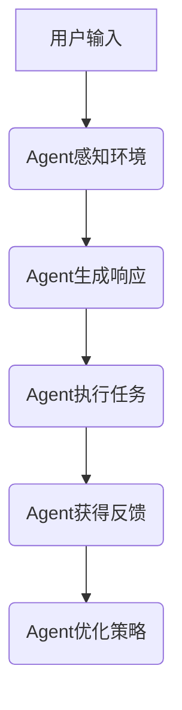
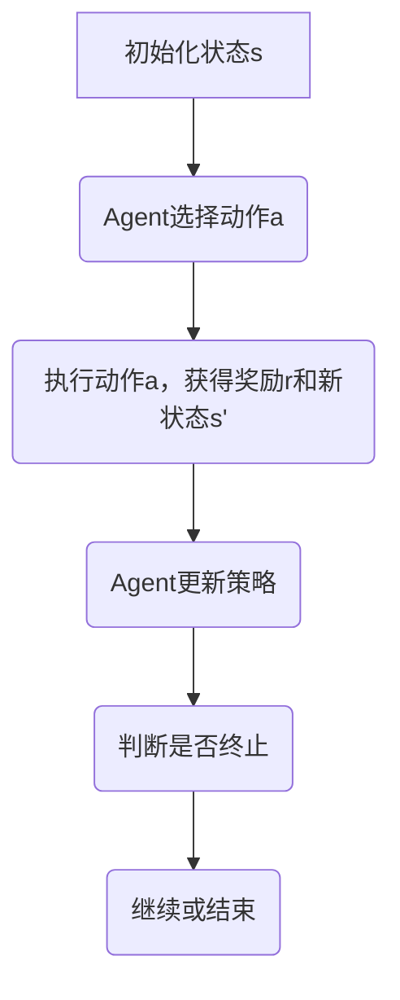
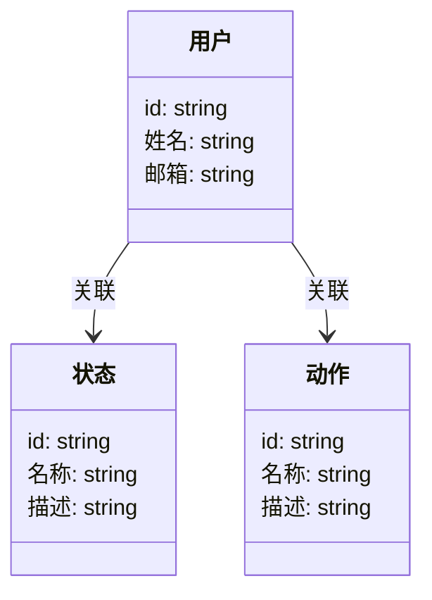
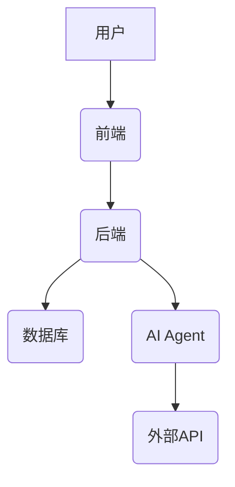
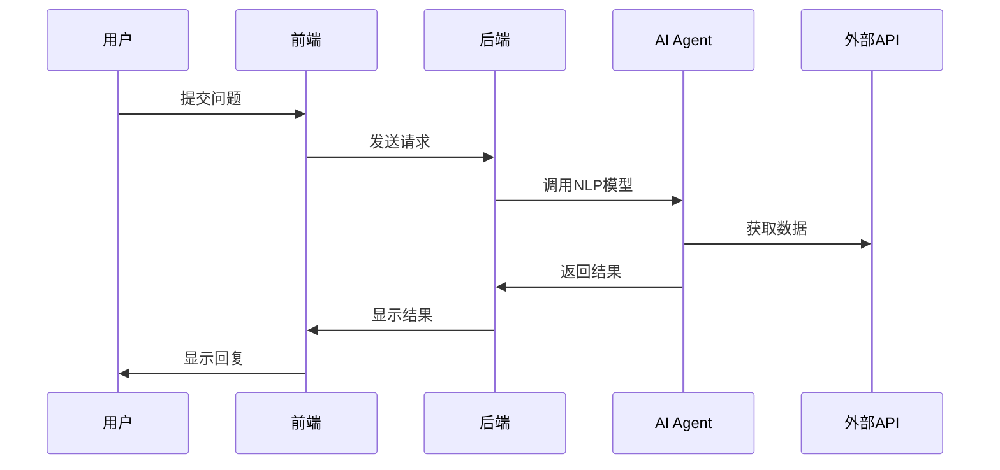

                 

<think>
嗯，好的，我现在需要帮用户写一篇关于《企业AI需求分析：识别和评估AI Agent的应用机会》的技术博客文章。用户已经提供了一个详细的目录结构，我需要按照这个结构来撰写内容，同时满足所有的格式和内容要求。首先，我需要理解每个部分的核心内容，确保每个章节都详细且有深度。

首先，文章的标题和关键词已经确定，摘要部分也已经给出。接下来是目录结构，分为背景、核心概念、算法、系统分析、项目实战和总结几个部分。每个部分下还有多个子章节，有些还需要包含图表和代码示例。

我觉得应该从背景开始写，先介绍AI Agent的基本概念，然后讨论企业AI需求分析的背景，包括当前的趋势、影响以及分析的重要性。这部分需要让读者了解为什么AI Agent在企业中变得重要。

接下来是核心概念和联系，这部分需要详细解释AI Agent的原理、属性特征对比以及系统架构。我可能需要画一些ER图或类图来帮助理解，所以要确保使用Mermaid来展示这些结构。

然后是算法原理部分，这部分需要详细讲解AI Agent的算法，比如基于规则、机器学习和强化学习的算法。同时，要用Mermaid流程图展示算法步骤，并提供Python代码示例。数学模型和公式需要用LaTeX表示，确保准确无误。

系统分析与架构设计部分，我需要介绍项目背景，设计系统功能，用Mermaid类图展示领域模型，架构图展示系统结构，接口设计和交互流程。这部分需要确保系统设计清晰，便于读者理解。

项目实战部分，我需要指导读者如何安装环境，实现核心代码，并解读代码。同时，通过案例分析展示实际应用，最后总结项目经验。这部分需要实用性强，让读者能够实际操作。

最后是总结，包括最佳实践、小结、注意事项和拓展阅读。这部分要给读者一些实用的建议，帮助他们更好地应用AI Agent。

在撰写过程中，我需要确保每个部分都详细且逻辑清晰，使用专业的技术语言，同时保持简单易懂。图表和代码示例要准确，数学公式要用LaTeX正确表示。确保文章整体结构紧凑，内容丰富，满足用户的要求。

可能遇到的困难包括如何将复杂的算法和架构设计用简单易懂的语言表达，以及如何将理论与实际案例结合起来。我需要多次修改和润色，确保每个部分都达到最佳效果。

总的来说，我需要一步步按照目录结构来写，确保每个部分都深入浅出，同时满足格式和内容的要求。希望这篇文章能够帮助读者系统地理解企业AI需求分析，并识别和评估AI Agent的应用机会。
</think>

# 企业AI需求分析：识别和评估AI Agent的应用机会

---

## 关键词：AI Agent, 企业AI需求, 人工智能, 需求分析, 应用机会

---

## 摘要：  
本文旨在帮助企业识别和评估AI Agent的应用机会，通过系统化的分析方法，结合实际案例和数学模型，深入探讨AI Agent的核心概念、算法原理和系统架构。文章从背景介绍、核心概念、算法原理、系统架构、项目实战等多个维度展开，为企业提供全面的AI Agent应用指南。

---

# 第一部分: 企业AI需求分析背景与概述

## 第1章: AI Agent与企业AI需求概述

### 1.1 AI Agent的基本概念

#### 1.1.1 AI Agent的定义  
AI Agent（人工智能代理）是一种能够感知环境、自主决策并执行任务的智能实体。它通过与用户或系统的交互，实现特定目标，如信息检索、决策支持或自动化操作。

#### 1.1.2 AI Agent的核心属性  
AI Agent具有以下核心属性：  
1. **自主性**：无需外部干预，自主完成任务。  
2. **反应性**：能够实时感知环境并做出反应。  
3. **目标导向性**：以实现特定目标为导向。  
4. **学习能力**：通过数据和经验优化自身行为。

#### 1.1.3 AI Agent与传统软件的区别  
AI Agent与传统软件的主要区别在于其智能性和自主性。传统软件依赖于预定义的规则，而AI Agent能够通过学习和推理动态调整行为。

---

### 1.2 企业AI需求分析的背景

#### 1.2.1 当前企业数字化转型的趋势  
随着数字化转型的推进，企业对智能化工具的需求日益增长。AI Agent作为智能化的核心技术，为企业提供了高效解决问题的手段。

#### 1.2.2 AI技术对企业的影响  
AI技术的应用帮助企业提升了效率、优化了流程，并增强了用户体验。AI Agent作为其中的重要组成部分，为企业提供了智能化的解决方案。

#### 1.2.3 企业AI需求分析的重要性  
准确识别和评估AI Agent的应用机会，能够帮助企业制定合理的技术路线，提升竞争力。

---

### 1.3 AI Agent在企业中的应用现状

#### 1.3.1 AI Agent的典型应用场景  
1. **客户支持**：通过自然语言处理技术为用户提供即时帮助。  
2. **流程自动化**：优化企业内部流程，提高效率。  
3. **决策支持**：基于数据分析提供智能化决策建议。  

#### 1.3.2 企业采用AI Agent的优势  
1. **提升效率**：自动化处理重复性任务。  
2. **增强用户体验**：提供个性化的服务。  
3. **数据驱动决策**：基于实时数据优化业务流程。  

#### 1.3.3 当前企业AI Agent应用的挑战  
1. **技术门槛高**：需要专业的技术团队支持。  
2. **数据隐私问题**：数据安全和隐私保护是关键。  
3. **集成复杂性**：与现有系统集成需要协调多个部门。  

---

### 1.4 本章小结  
本章介绍了AI Agent的基本概念、企业AI需求分析的背景以及当前AI Agent的应用现状。通过分析，我们认识到AI Agent在企业中的重要性及其面临的挑战。

---

# 第二部分: AI Agent的核心概念与联系

## 第2章: AI Agent的核心概念与联系

### 2.1 AI Agent的核心原理

#### 2.1.1 AI Agent的感知与决策机制  
AI Agent通过传感器或API接口感知环境，基于感知信息进行推理和决策。例如，一个智能客服机器人会通过用户输入的问题进行语义分析并生成回答。

#### 2.1.2 AI Agent的自主性与适应性  
AI Agent能够自主选择行动方案，并根据环境反馈动态调整策略。例如，一个推荐系统可以根据用户的浏览行为实时调整推荐内容。

#### 2.1.3 AI Agent的交互与协作能力  
AI Agent能够通过自然语言处理或图形界面与用户交互，并与其他系统协作完成任务。例如，一个多智能体系统可以在团队中协同完成复杂任务。

---

### 2.2 AI Agent的属性特征对比

#### 2.2.1 基于表格的属性特征对比  
下表展示了AI Agent与其他智能系统的属性特征对比：

| **属性**       | **AI Agent** | **传统软件** | **物联网设备** |
|-----------------|--------------|--------------|----------------|
| **自主性**       | 高           | 低           | 中             |
| **学习能力**     | 高           | 无           | 无             |
| **决策能力**     | 高           | 低           | 低             |

#### 2.2.2 ER实体关系图架构  
以下是AI Agent的实体关系图：

```mermaid
erd
title AI Agent Entity Relationship Diagram
entity AI Agent {
    id
    name
    description
    type
}
entity Environment {
    id
    state
    action
}
entity Task {
    id
    name
    description
    status
}
AI Agent -[OWNS]-> Task
AI Agent -[INTERACTS_WITH]-> Environment
```

---

### 2.3 AI Agent的系统架构

#### 2.3.1 系统架构的模块划分  
AI Agent的系统架构通常包括以下几个模块：  
1. **感知模块**：负责收集环境信息。  
2. **决策模块**：基于感知信息生成行动计划。  
3. **执行模块**：执行具体的任务。  
4. **学习模块**：通过反馈优化自身行为。  

#### 2.3.2 系统架构的交互流程  
以下是AI Agent的交互流程图：



---

### 2.4 本章小结  
本章详细讲解了AI Agent的核心原理、属性特征对比以及系统架构。通过对比和图示，我们能够更好地理解AI Agent的设计与运行机制。

---

# 第三部分: AI Agent的算法原理与数学模型

## 第3章: AI Agent的算法原理

### 3.1 AI Agent的基本算法

#### 3.1.1 基于规则的AI Agent算法  
基于规则的算法通过预定义的规则生成响应。例如，一个简单的客服机器人可以根据关键词匹配规则生成回答。

#### 3.1.2 基于机器学习的AI Agent算法  
基于机器学习的算法通过训练数据生成决策模型。例如，使用自然语言处理模型生成文本回复。

#### 3.1.3 基于强化学习的AI Agent算法  
基于强化学习的算法通过与环境的交互获得奖励，优化自身策略。例如，使用强化学习优化推荐系统的推荐策略。

---

### 3.2 AI Agent的数学模型

#### 3.2.1 状态空间与动作空间的定义  
状态空间表示所有可能的状态，动作空间表示所有可能的动作。例如，一个棋类游戏AI的状态空间包括棋盘的所有可能布局，动作空间包括所有可能的移动。

#### 3.2.2 策略函数与价值函数的数学表达  
策略函数π(s)表示在状态s下采取动作a的概率：  
$$π(a|s) = P(选择动作a | 状态s)$$  

价值函数V(s)表示在状态s下获得的期望回报：  
$$V(s) = \mathbb{E}[R | S = s]$$  

#### 3.2.3 基于概率论的决策模型  
马尔可夫决策过程（MDP）模型可以用于描述AI Agent的决策过程：  
状态s，动作a，奖励r，下一状态s'的关系为：  
$$s' = P(s, a)$$  
$$r = R(s, a)$$  

---

### 3.3 AI Agent的算法实现

#### 3.3.1 算法流程图的Mermaid表示  
以下是基于强化学习的AI Agent算法流程图：



#### 3.3.2 Python源代码实现  
以下是基于强化学习的AI Agent的Python代码示例：

```python
class AI-Agent:
    def __init__(self):
        self.state = None
        self.reward = 0
        self.policy = {}  # 策略函数

    def感知环境(self):
        # 获取环境信息
        self.state = 环境.获取状态()
        return self.state

    def 生成响应(self, 状态):
        # 根据当前状态选择动作
        if 状态 in self.policy:
            return self.policy[状态]
        else:
            # 默认策略
            return '默认响应'

    def 执行任务(self, 动作):
        # 执行动作并获得反馈
        反馈 = 环境.执行动作(动作)
        self.奖励 += 反馈.奖励值
        return 反馈.新状态

    def 学习优化(self):
        # 使用强化学习优化策略
        self.policy = 学习算法.优化策略(self.policy, self.reward)
```

---

### 3.4 本章小结  
本章详细讲解了AI Agent的基本算法、数学模型和实现方法。通过代码示例和流程图，我们能够更好地理解AI Agent的算法实现过程。

---

## 第四章: 系统分析与架构设计方案

## 第4章: 系统分析与架构设计方案

### 4.1 项目背景介绍  
本项目旨在为企业提供一个基于AI Agent的智能客服系统，通过自然语言处理技术实现用户支持的自动化。

### 4.2 系统功能设计

#### 4.2.1 领域模型Mermaid类图  
以下是系统领域模型的类图：



---

### 4.3 系统架构设计

#### 4.3.1 系统架构图  
以下是系统的架构图：



#### 4.3.2 系统接口设计  
系统主要接口包括：  
1. 用户与前端的交互接口。  
2. 前端与后端的数据接口。  
3. 后端与AI Agent的交互接口。  
4. AI Agent与外部API的调用接口。

#### 4.3.3 系统交互流程  
以下是系统交互流程图：



---

### 4.4 本章小结  
本章通过项目背景介绍、系统功能设计、架构设计和交互流程图，详细讲解了AI Agent在企业系统中的具体应用。

---

## 第五章: 项目实战

### 5.1 环境安装  
项目需要以下环境：  
1. Python 3.8+  
2. TensorFlow 2.0+  
3. NLTK库  
4. Flask框架  

### 5.2 核心代码实现  

#### 5.2.1 AI Agent的核心代码  
以下是AI Agent的核心代码：

```python
class AI-Agent:
    def __init__(self):
        self.nlp = 管理自然语言处理模型
        self.model = 加载预训练模型

    def 处理请求(self, 请求):
        # 分析请求
        分析结果 = self.nlp.解析(请求)
        # 生成响应
        响应 = self.model.生成响应(分析结果)
        return 响应

    def 学习优化(self):
        # 更新模型参数
        self.model.优化参数()
```

#### 5.2.2 代码应用解读与分析  
通过上述代码，我们可以看到AI Agent通过自然语言处理技术分析用户请求，并生成相应的响应。同时，通过模型优化，AI Agent能够不断提升自身的响应质量。

---

### 5.3 实际案例分析

#### 5.3.1 案例背景  
某企业希望提升其客户支持效率，决定引入AI Agent技术。

#### 5.3.2 案例分析  
通过部署基于AI Agent的智能客服系统，企业能够实现24/7的客户支持，显著降低人工成本。

---

### 5.4 项目小结  
本章通过环境安装、代码实现和案例分析，展示了AI Agent在实际项目中的应用。通过实战，我们能够更好地理解AI Agent的实现过程和实际价值。

---

## 第六章: 总结与展望

### 6.1 最佳实践 tips  
1. 在部署AI Agent前，明确业务需求。  
2. 确保数据安全和隐私保护。  
3. 与现有系统进行充分的集成测试。  

---

### 6.2 小结  
本文从企业AI需求分析的角度，详细探讨了AI Agent的核心概念、算法原理和系统架构。通过项目实战，我们能够更好地理解AI Agent的应用价值。

---

### 6.3 注意事项  
1. AI Agent的部署需要专业的技术团队支持。  
2. 数据隐私和安全问题需要高度重视。  
3. 系统集成需要充分考虑现有系统的兼容性。

---

### 6.4 拓展阅读  
1. 《机器学习实战》  
2. 《深度学习》  
3. 《自然语言处理入门》  

---

## 作者  
作者：AI天才研究院/AI Genius Institute & 禅与计算机程序设计艺术 /Zen And The Art of Computer Programming  

--- 

**[完]**

