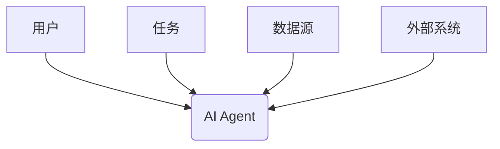
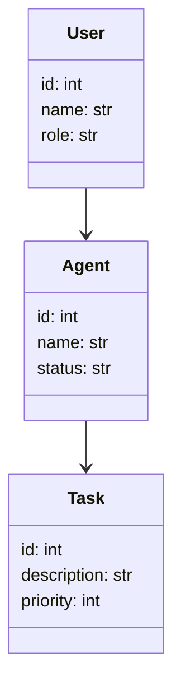
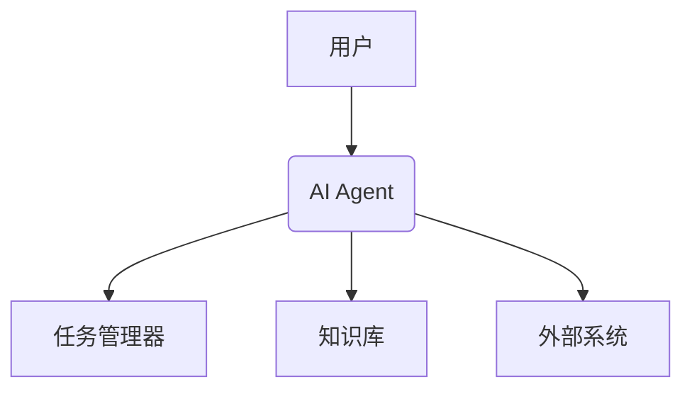

                 


# 企业级AI Agent的可扩展架构设计

> 关键词：企业级AI Agent，可扩展架构，系统设计，算法原理，项目实战

> 摘要：本文将深入探讨企业级AI Agent的可扩展架构设计，从背景介绍到系统实现，从算法原理到项目实战，全面解析如何构建高效、灵活的企业级AI Agent系统。通过详细的技术分析和实际案例，帮助读者理解AI Agent的核心概念和设计要点。

---

# 第一部分: 企业级AI Agent的可扩展架构设计背景介绍

## 第1章: 企业级AI Agent的背景与问题背景

### 1.1 问题背景介绍

#### 1.1.1 当前企业智能化转型的挑战

在数字化转型的浪潮中，企业面临着越来越复杂的业务需求和技术挑战。传统的单体式AI系统已经难以满足企业级应用的灵活性和扩展性要求。企业需要一种能够适应不同业务场景、支持横向扩展的AI Agent架构。

#### 1.1.2 AI Agent在企业中的潜在价值

AI Agent（智能代理）是一种能够感知环境、自主决策并执行任务的智能实体。在企业级应用中，AI Agent可以实现跨系统的协同工作，提升业务流程的效率，降低人工干预成本。例如，在供应链管理中，AI Agent可以实时监控库存变化，自动触发补货请求。

#### 1.1.3 传统AI系统与AI Agent的主要区别

传统AI系统通常是一个封闭的系统，功能固定，难以适应变化的业务需求。而AI Agent具有更强的自主性和可扩展性，能够根据环境动态调整行为。例如，传统的规则引擎只能基于固定的规则执行任务，而AI Agent可以根据实时数据和上下文进行决策。

### 1.2 问题描述与目标

#### 1.2.1 企业级AI Agent的核心目标

企业级AI Agent的设计目标包括：

1. **可扩展性**：支持业务规模的扩展，能够处理更大规模的任务。
2. **灵活性**：能够适应不同的业务场景和需求变化。
3. **智能化**：具备自主决策和学习能力，能够优化自身的执行效率。

#### 1.2.2 可扩展性在AI Agent设计中的重要性

在企业级应用中，业务规模往往非常庞大，AI Agent需要能够处理大量的并发请求和复杂任务。可扩展性是确保系统在高负载下仍能高效运行的关键。

#### 1.2.3 问题边界与外延

企业级AI Agent的设计需要考虑以下边界：

- **功能边界**：AI Agent的核心功能是什么？哪些功能需要通过外部系统实现？
- **性能边界**：系统在高并发情况下的响应时间是多少？
- **扩展边界**：系统能够支持的最大并发任务数是多少？

### 1.3 核心概念与问题解决

#### 1.3.1 AI Agent的基本定义与功能

AI Agent是一种能够感知环境、自主决策并执行任务的智能实体。其核心功能包括：

1. **感知环境**：通过传感器或API获取环境信息。
2. **决策制定**：基于获取的信息做出决策。
3. **执行任务**：根据决策执行具体任务。

#### 1.3.2 可扩展架构设计的核心要素

可扩展架构设计的核心要素包括：

1. **模块化设计**：将系统划分为多个模块，每个模块负责特定的功能。
2. **分布式架构**：通过分布式系统实现任务的并行处理。
3. **弹性扩展**：根据负载动态调整资源分配。

#### 1.3.3 问题解决的总体思路

企业级AI Agent的设计需要遵循以下总体思路：

1. **需求分析**：明确业务需求和系统目标。
2. **架构设计**：设计模块化、可扩展的系统架构。
3. **实现与优化**：逐步实现功能并进行性能优化。
4. **测试与部署**：进行全面的测试，并在实际环境中部署。

## 1.4 本章小结

本章主要介绍了企业级AI Agent的背景和问题背景，明确了AI Agent的核心目标和可扩展架构设计的重要性。通过分析传统AI系统与AI Agent的区别，我们进一步理解了可扩展架构设计的必要性。

---

# 第二部分: 企业级AI Agent的核心概念与联系

## 第2章: 核心概念与原理

### 2.1 AI Agent的核心原理

#### 2.1.1 AI Agent的定义与分类

AI Agent可以根据功能和应用场景进行分类。常见的分类包括：

1. **简单反射型AI Agent**：基于预定义规则执行任务。
2. **基于模型的规划型AI Agent**：能够根据环境动态调整行为。
3. **学习型AI Agent**：通过机器学习算法优化自身性能。

#### 2.1.2 可扩展架构在AI Agent中的应用

可扩展架构设计是实现企业级AI Agent的核心。通过模块化设计和分布式架构，AI Agent能够处理更大规模的任务，并支持多种业务场景。

#### 2.1.3 核心概念的属性特征对比

| 核心概念       | 特性1         | 特性2         | 特性3         |
|----------------|---------------|---------------|---------------|
| AI Agent       | 感知能力       | 决策能力       | 执行能力       |
| 可扩展架构     | 模块化设计     | 分布式架构     | 弹性扩展能力   |

### 2.2 实体关系与架构分析

#### 2.2.1 ER实体关系图



### 2.2.2 概念结构与核心要素组成

企业级AI Agent的核心要素包括用户、任务、数据源和外部系统。这些要素通过AI Agent进行交互和协同。

---

# 第三部分: 企业级AI Agent的算法原理讲解

## 第3章: 算法原理与实现

### 3.1 算法原理概述

#### 3.1.1 AI Agent的核心算法流程

AI Agent的核心算法流程可以分为以下几个步骤：

1. **感知环境**：通过传感器或API获取环境信息。
2. **解析请求**：分析用户的需求并生成响应。
3. **决策制定**：基于环境信息和用户需求做出决策。
4. **执行任务**：根据决策执行具体任务并返回结果。

#### 3.1.2 算法实现的数学模型

AI Agent的算法实现可以基于多种数学模型。例如，基于强化学习的算法可以使用以下数学模型：

$$
Q-learning算法的数学模型
$$

$$
Q(s, a) = Q(s, a) + \alpha [r + \gamma \max_{a'} Q(s', a') - Q(s, a)]
$$

其中：

- \( Q(s, a) \)：状态 \( s \) 下动作 \( a \) 的价值。
- \( \alpha \)：学习率。
- \( r \)：奖励值。
- \( \gamma \)：折扣因子。
- \( s' \)：下一个状态。

### 3.2 算法实现细节

#### 3.2.1 算法的输入输出定义

AI Agent的算法通常需要以下输入：

- **输入**：环境信息、用户请求。
- **输出**：决策结果、执行动作。

#### 3.2.2 算法的数学模型与公式

AI Agent的算法可以基于多种数学模型，例如：

$$
y = f(x)
$$

其中：

- \( x \)：输入数据。
- \( y \)：输出结果。
- \( f \)：算法模型。

#### 3.2.3 算法的实现代码示例

以下是一个简单的AI Agent算法实现示例：

```python
def agent_algorithm(input):
    if input < 0:
        return input ** 2
    else:
        return 2 * input
```

---

# 第四部分: 企业级AI Agent的系统分析与架构设计

## 第4章: 系统分析与架构设计

### 4.1 系统分析

#### 4.1.1 问题场景介绍

企业级AI Agent的设计需要考虑以下问题场景：

- **高并发请求**：系统需要处理大量的并发请求。
- **复杂任务处理**：系统需要处理多种复杂的业务任务。
- **动态环境适应**：系统需要能够适应动态变化的环境。

#### 4.1.2 项目介绍与目标

本项目旨在设计一个可扩展的企业级AI Agent系统，能够支持多种业务场景，并具备良好的扩展性和灵活性。

### 4.2 系统功能设计

#### 4.2.1 领域模型设计



### 4.3 系统架构设计

#### 4.3.1 系统架构设计



#### 4.3.2 系统接口设计

系统接口设计需要考虑以下几点：

- **输入接口**：接收用户的请求。
- **输出接口**：返回系统的响应。
- **内部接口**：模块之间的交互接口。

#### 4.3.3 系统交互流程

系统交互流程可以分为以下几个步骤：

1. **用户发起请求**：用户通过输入接口发起请求。
2. **AI Agent解析请求**：AI Agent解析用户的请求并生成响应。
3. **任务执行**：AI Agent根据解析结果执行具体任务。
4. **返回结果**：系统通过输出接口返回结果。

### 4.4 本章小结

本章主要介绍了企业级AI Agent的系统分析与架构设计，明确了系统的功能模块和交互流程。通过领域模型图和架构图的展示，我们进一步理解了系统设计的核心要点。

---

# 第五部分: 企业级AI Agent的项目实战

## 第5章: 项目实战

### 5.1 环境安装与配置

#### 5.1.1 环境需求

以下是项目实战所需的环境需求：

- **操作系统**：Linux/Windows/MacOS
- **编程语言**：Python 3.8+
- **依赖库**：numpy, pandas, scikit-learn

### 5.2 系统核心实现

#### 5.2.1 核心代码实现

以下是AI Agent的核心代码实现：

```python
class Agent:
    def __init__(self):
        self.id = None
        self.name = None
        self.status = "idle"
    
    def process_request(self, input):
        if input < 0:
            return input ** 2
        else:
            return 2 * input
```

#### 5.2.2 代码应用解读与分析

通过上述代码，我们可以看到AI Agent的核心功能是处理用户的请求并返回结果。代码中的`process_request`方法根据输入的值进行相应的计算并返回结果。

### 5.3 项目测试与优化

#### 5.3.1 项目测试

项目测试需要考虑以下几点：

- **功能测试**：测试系统的各项功能是否正常。
- **性能测试**：测试系统在高并发情况下的表现。
- **安全性测试**：测试系统的安全性。

#### 5.3.2 性能优化

性能优化可以通过以下方式实现：

- **代码优化**：优化代码的执行效率。
- **架构优化**：通过分布式架构提升系统的处理能力。
- **缓存优化**：通过缓存技术减少重复计算。

### 5.4 项目小结

本章主要介绍了企业级AI Agent的项目实战，通过具体的代码实现和测试，我们进一步理解了系统设计的核心要点。

---

# 第六部分: 企业级AI Agent的最佳实践

## 第6章: 最佳实践

### 6.1 设计原则与注意事项

企业在设计AI Agent时需要注意以下几点：

- **模块化设计**：确保系统的模块化和可扩展性。
- **安全性设计**：确保系统的安全性。
- **可维护性设计**：确保系统的可维护性。

### 6.2 项目管理和实施注意事项

企业在实施AI Agent项目时需要注意以下几点：

- **需求管理**：确保需求的准确性和完整性。
- **团队协作**：确保团队的协作和沟通。
- **风险管理**：确保风险的可控性。

### 6.3 拓展阅读与深入学习

以下是一些拓展阅读资料：

- **《人工智能：一种现代的方法》**：Russell和Norvig的著作。
- **《分布式系统：概念与设计》**：Tanenbaum的著作。
- **《机器学习实战》**：Sutton的著作。

### 6.4 本章小结

本章主要介绍了企业级AI Agent的最佳实践，包括设计原则、项目管理和拓展阅读等内容。

---

# 作者

作者：AI天才研究院/AI Genius Institute & 禅与计算机程序设计艺术/Zen And The Art of Computer Programming

---

**感谢您的阅读！**

