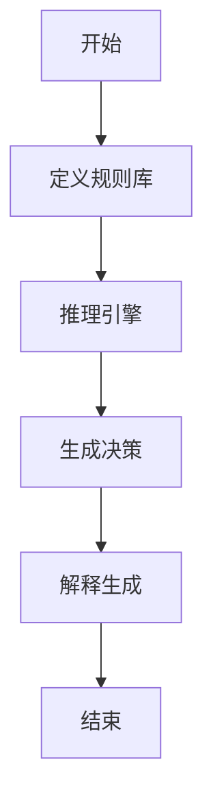
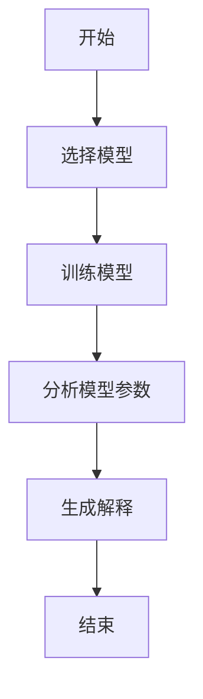
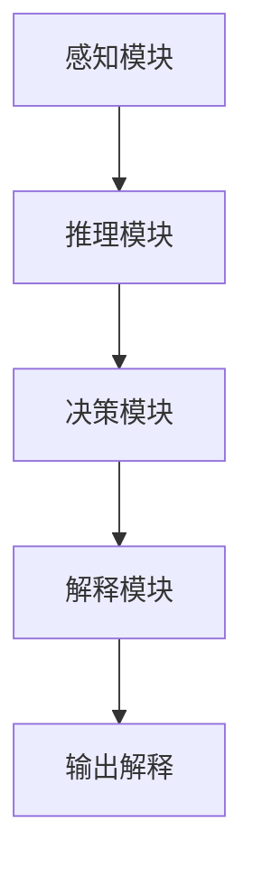

                 


# 企业级AI Agent的可解释性设计与实现

> 关键词：企业级AI Agent，可解释性设计，AI系统设计，可信赖性，系统架构

> 摘要：本文系统性地探讨了企业级AI Agent的可解释性设计与实现这一重要课题。文章首先介绍了企业级AI Agent的基本概念及其在企业中的应用场景，然后深入分析了可解释性设计的核心原理与方法，包括基于规则和基于模型的可解释性设计。接着，文章详细讲解了可解释性设计的算法原理，给出了数学模型与公式，并通过mermaid流程图展示了典型算法的工作流程。随后，文章从系统架构的角度，设计了一个企业级AI Agent的系统架构，并通过mermaid图展示了系统的模块划分与交互流程。最后，文章通过实际案例分析了可解释性设计在企业级AI Agent中的应用，并总结了设计与实现中的关键经验与注意事项。

---

## 第1章: 企业级AI Agent的背景与概念

### 1.1 AI Agent的基本概念

#### 1.1.1 什么是AI Agent
AI Agent（人工智能代理）是指能够感知环境并采取行动以实现目标的智能实体。它可以是一个软件程序、一个机器人，或者任何能够自主决策的系统。AI Agent的核心目标是通过感知和行动与环境交互，以达到预定的目标。

#### 1.1.2 AI Agent的核心特征
AI Agent具有以下几个核心特征：
1. **自主性**：能够自主决策，无需外部干预。
2. **反应性**：能够实时感知环境并做出反应。
3. **目标导向性**：所有行为都以实现特定目标为导向。
4. **学习能力**：能够通过经验改进自身的行为。

#### 1.1.3 企业级AI Agent的定义与特点
企业级AI Agent是指在企业环境中应用的智能代理，其目标是为企业提供自动化决策支持、优化业务流程或提高效率。其特点包括：
1. **高可用性**：需要在企业级系统中稳定运行。
2. **可解释性**：决策过程需要透明，以便于审计和优化。
3. **可扩展性**：能够处理大规模数据和复杂场景。
4. **可信赖性**：用户需要信任AI Agent的决策能力。

### 1.2 可解释性在AI Agent中的重要性

#### 1.2.1 可解释性的定义与内涵
可解释性是指AI系统的行为能够被人类理解和解释。在AI Agent中，可解释性意味着其决策过程和结果能够被用户或开发者明确理解，从而增强系统的可信度和可管理性。

#### 1.2.2 可解释性在企业级AI Agent中的作用
1. **提高用户信任**：用户能够理解AI Agent的决策过程，从而更愿意依赖它。
2. **支持决策优化**：通过分析AI Agent的决策过程，可以发现优化的空间。
3. **符合法规要求**：许多行业法规要求AI系统的决策过程必须透明。

#### 1.2.3 可解释性与AI Agent的可信赖性
可信赖性是企业级AI Agent的核心要求之一。通过可解释性，用户可以理解AI Agent的决策逻辑，从而增强对系统的信任。可信赖性不仅依赖于系统的性能，还依赖于系统的透明性和可解释性。

### 1.3 企业级AI Agent的背景与应用

#### 1.3.1 AI Agent在企业中的应用场景
企业级AI Agent的应用场景包括：
1. **智能客服**：通过自然语言处理技术为用户提供支持。
2. **自动化决策**：在金融、医疗等领域进行自动化决策。
3. **流程优化**：优化企业内部的业务流程。
4. **风险管理**：实时监控并识别潜在风险。

#### 1.3.2 企业级AI Agent的发展现状
目前，企业级AI Agent的发展呈现出以下几个特点：
1. **技术成熟度高**：基于机器学习和自然语言处理的AI Agent技术逐渐成熟。
2. **应用范围广**：从客服到金融，AI Agent的应用场景不断扩展。
3. **可解释性需求增加**：随着法规的日益严格，可解释性成为企业级AI Agent的重要特征。

#### 1.3.3 未来趋势与挑战
未来，企业级AI Agent的发展趋势包括：
1. **更强的可解释性**：用户对AI系统的决策过程要求越来越高。
2. **更高的安全性**：确保AI Agent的决策不会带来重大风险。
3. **更广泛的应用场景**：AI Agent将在更多领域发挥重要作用。

---

## 第2章: 可解释性设计的核心概念

### 2.1 可解释性设计的原理

#### 2.1.1 解释性模型的基本原理
解释性模型是指能够清晰地解释其决策过程的模型。在AI Agent中，可解释性设计的核心是构建一个能够被用户理解的解释性模型。

#### 2.1.2 可解释性设计的特征
可解释性设计的特征包括：
1. **透明性**：用户能够理解系统的工作原理。
2. **可追溯性**：用户能够追溯系统决策的依据。
3. **简洁性**：解释过程需要简洁明了。

#### 2.1.3 可解释性与模型复杂性的关系
模型复杂性与可解释性之间存在一定的反比关系。复杂度高的模型通常具有更强的预测能力，但其决策过程往往难以解释。

### 2.2 可解释性设计的核心要素

#### 2.2.1 解释性维度
解释性维度包括：
1. **局部可解释性**：解释单个决策的依据。
2. **全局可解释性**：解释整个系统的决策逻辑。

#### 2.2.2 解释性粒度
解释性粒度是指解释的详细程度。粒度越细，解释越详细，但可能越难理解。

#### 2.2.3 解释性可信度
解释性可信度是指用户对系统解释的信任程度。可信的解释需要基于可靠的数据和逻辑。

### 2.3 可解释性设计的数学模型

#### 2.3.1 解释性度量的数学表达
解释性度量可以通过以下公式表示：
$$
E = \frac{S}{T}
$$
其中，$S$ 表示解释的准确程度，$T$ 表示解释的透明度。

#### 2.3.2 解释性模型的优化目标
解释性模型的优化目标包括：
1. **最大化解释性度量 $E$**。
2. **最小化模型复杂度**。

#### 2.3.3 解释性评估的数学方法
解释性评估可以通过以下步骤进行：
1. **定义评估指标**：例如，准确率、透明度等。
2. **计算评估指标**：例如，$E = \frac{S}{T}$。
3. **优化模型参数**：以最大化解释性度量为目标。

---

## 第3章: 企业级AI Agent的可解释性设计方法

### 3.1 基于规则的可解释性设计

#### 3.1.1 基于符号逻辑的解释性设计
基于符号逻辑的解释性设计是指通过预定义的规则和逻辑推理来实现可解释性。例如，使用逻辑规则来描述决策过程。

#### 3.1.2 基于规则的解释性模型实现
基于规则的解释性模型实现可以通过以下步骤进行：
1. **定义规则库**：例如，定义“如果条件满足，则采取行动”。
2. **推理引擎**：根据规则库进行推理，生成决策。
3. **解释生成**：将推理过程转化为人类可理解的解释。

#### 3.1.3 基于规则的解释性评估
基于规则的解释性评估可以通过以下步骤进行：
1. **评估解释的准确率**：例如，计算解释与实际决策的匹配度。
2. **评估解释的透明度**：例如，计算解释的复杂度。

### 3.2 基于模型的可解释性设计

#### 3.2.1 基于模型的解释性设计原理
基于模型的解释性设计原理是指通过构建可解释的模型来实现可解释性。例如，使用线性回归模型进行预测，并解释其权重。

#### 3.2.2 基于模型的解释性设计实现
基于模型的解释性设计实现可以通过以下步骤进行：
1. **选择可解释的模型**：例如，线性回归模型。
2. **训练模型**：使用训练数据进行模型训练。
3. **解释模型**：通过分析模型参数来解释决策过程。

#### 3.2.3 基于模型的解释性评估
基于模型的解释性评估可以通过以下步骤进行：
1. **评估解释的准确率**：例如，计算解释与实际决策的匹配度。
2. **评估解释的透明度**：例如，计算解释的复杂度。

---

## 第4章: 企业级AI Agent的可解释性设计算法原理

### 4.1 可解释性设计的算法原理

#### 4.1.1 基于规则的解释性算法
基于规则的解释性算法是一种通过预定义规则来进行解释的算法。其流程如下：



#### 4.1.2 基于模型的解释性算法
基于模型的解释性算法是一种通过分析模型参数来进行解释的算法。其流程如下：



### 4.2 可解释性设计的数学模型

#### 4.2.1 基于规则的数学模型
基于规则的数学模型可以表示为：
$$
D = \sum_{i=1}^{n} r_i \cdot x_i
$$
其中，$r_i$ 是规则的权重，$x_i$ 是输入特征。

#### 4.2.2 基于模型的数学模型
基于模型的数学模型可以表示为：
$$
y = \beta_0 + \beta_1 x_1 + \beta_2 x_2 + \dots + \beta_k x_k
$$
其中，$\beta_i$ 是模型参数，$x_i$ 是输入特征。

---

## 第5章: 企业级AI Agent的系统架构设计

### 5.1 系统架构设计概述

#### 5.1.1 系统模块划分
企业级AI Agent的系统架构可以划分为以下几个模块：
1. **感知模块**：负责感知环境。
2. **推理模块**：负责逻辑推理。
3. **决策模块**：负责生成决策。
4. **解释模块**：负责生成可解释的解释。

#### 5.1.2 系统架构的mermaid图


### 5.2 系统架构设计的详细分析

#### 5.2.1 感知模块的设计
感知模块负责从环境中获取信息。例如，通过API获取数据。

#### 5.2.2 推理模块的设计
推理模块负责根据感知到的信息进行逻辑推理。例如，使用规则引擎进行推理。

#### 5.2.3 决策模块的设计
决策模块负责根据推理结果生成决策。例如，基于预定义的规则生成决策。

#### 5.2.4 解释模块的设计
解释模块负责将决策过程转化为人类可理解的解释。例如，生成自然语言描述。

---

## 第6章: 企业级AI Agent的项目实战

### 6.1 项目实战概述

#### 6.1.1 项目环境安装
项目实战需要安装以下工具：
1. Python 3.8+
2. pip
3. `mermaid` 和 `graphviz` 库

#### 6.1.2 系统核心实现源代码
以下是系统核心实现的源代码示例：

```python
# 示例代码：基于规则的解释性设计
class RuleBasedAgent:
    def __init__(self, rules):
        self.rules = rules
    
    def explain_decision(self, input_data):
        for rule in self.rules:
            if rule.apply(input_data):
                return rule.explain(input_data)
        return "无明确规则匹配"
```

### 6.2 代码应用解读与分析

#### 6.2.1 代码实现的详细解读
上述代码实现了一个基于规则的AI Agent。`RuleBasedAgent` 类包含一个规则列表，每个规则都有一个 `apply` 方法和一个 `explain` 方法。`explain_decision` 方法遍历所有规则，找到匹配的规则并生成解释。

#### 6.2.2 代码实现的优化建议
1. **增加解释的粒度**：可以根据需要增加解释的详细程度。
2. **优化规则的匹配效率**：可以使用更高效的规则匹配算法。

### 6.3 实际案例分析和详细讲解

#### 6.3.1 案例背景介绍
假设我们正在开发一个智能客服系统，需要对客户的问题进行分类。

#### 6.3.2 案例分析与实现
以下是具体的实现步骤：
1. **定义规则库**：例如，定义“如果是关于技术的问题，则分类为技术支持”。
2. **训练模型**：使用规则库进行推理。
3. **生成解释**：将推理过程转化为自然语言解释。

#### 6.3.3 案例总结与经验分享
通过实际案例分析，我们可以得出以下结论：
1. **可解释性设计的关键在于规则的清晰性**。
2. **规则的复杂度会影响解释的透明度**。

### 6.4 项目小结

#### 6.4.1 项目实现的关键点
1. **规则的设计与实现**。
2. **解释的生成与优化**。

#### 6.4.2 项目实现的注意事项
1. **确保规则的可维护性**。
2. **优化解释的生成效率**。

---

## 第7章: 最佳实践与注意事项

### 7.1 最佳实践

#### 7.1.1 设计阶段
1. **明确可解释性需求**：在设计阶段明确可解释性的目标和要求。
2. **选择合适的可解释性设计方法**：根据具体场景选择基于规则或基于模型的设计方法。

#### 7.1.2 实现阶段
1. **确保规则的清晰性**：规则的设计需要简洁明了。
2. **优化解释的生成效率**：确保解释生成过程高效。

### 7.2 小结

#### 7.2.1 可解释性设计的核心价值
可解释性设计的核心价值在于提高系统的可信度和可管理性。

#### 7.2.2 企业级AI Agent的未来发展方向
未来，企业级AI Agent的发展方向将更加注重可解释性设计，以满足法规要求和用户需求。

### 7.3 注意事项

#### 7.3.1 可解释性设计的挑战
1. **模型复杂性与可解释性的矛盾**。
2. **用户对解释的理解能力**。

#### 7.3.2 可解释性设计的实现难点
1. **规则的设计与维护**。
2. **解释的生成与优化**。

### 7.4 拓展阅读

#### 7.4.1 可解释性设计的深入研究
1. **可解释性设计的数学模型**。
2. **可解释性设计的优化方法**。

#### 7.4.2 企业级AI Agent的前沿技术
1. **基于图的可解释性设计**。
2. **基于强化学习的可解释性设计**。

---

## 作者：AI天才研究院/AI Genius Institute & 禅与计算机程序设计艺术 /Zen And The Art of Computer Programming

---

**以上是文章的完整目录和部分章节内容，您可以根据需要进一步扩展每个部分的内容，添加更多细节和实例。**

