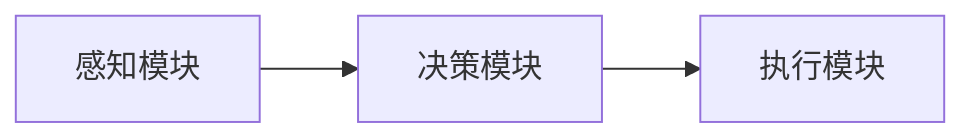
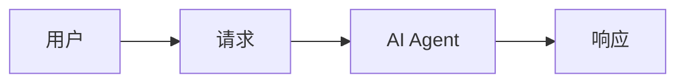
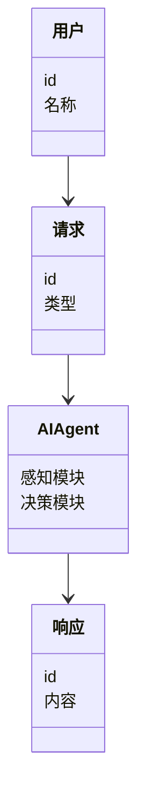
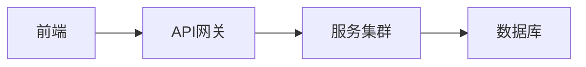
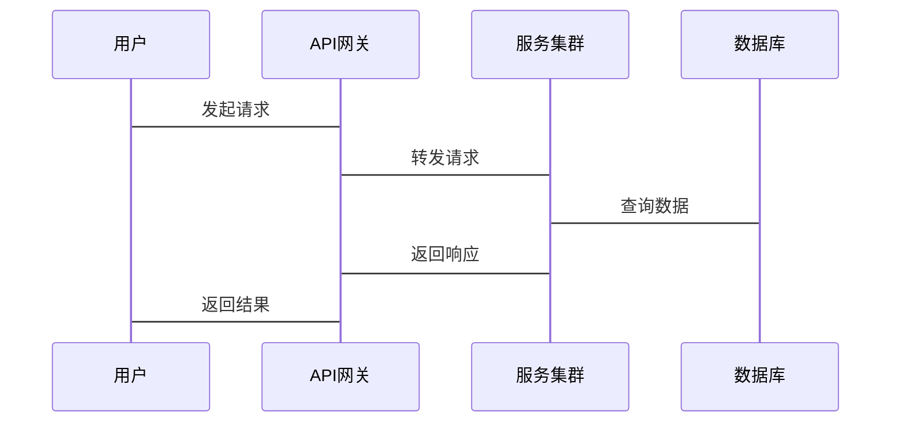

                 

<think>
好，我需要按照用户的要求来设计这本书的目录大纲。首先，用户需要一个详细的目录，涵盖企业级AI Agent的性能优化策略，包括背景、核心概念、算法原理、系统架构、项目实战和总结等部分。

我从背景开始，先介绍AI Agent的基本概念和企业级应用的背景。然后是核心概念，包括组成和结构，属性对比，以及ER关系图。接下来是算法原理，要详细解释基础算法，给出数学模型和公式，以及优化策略。系统架构部分需要展示类图、架构图和序列图。项目实战部分要有环境安装、代码实现和案例分析。最后总结一下最佳实践和注意事项。

在细化每个部分时，我要确保有三级目录，每部分都包含足够的细节和实例。比如在算法原理部分，加入数学公式和代码示例。在系统架构部分，使用Mermaid图来展示结构。项目实战部分，要让读者能够实际操作，所以代码和环境配置要详细。

最后，检查是否覆盖了所有要求，确保逻辑清晰，内容全面。这样读者能够系统地理解企业级AI Agent的性能优化策略，并能够实际应用这些知识。
</think>

# 《企业级AI Agent的性能优化策略》

---

## 关键词：
- 企业级AI Agent
- 性能优化
- 算法原理
- 系统架构
- 项目实战

---

## 摘要：
本文系统地探讨了企业级AI Agent的性能优化策略，从背景、核心概念到算法原理、系统架构，再到项目实战，层层深入地分析了如何提升AI Agent的性能。文章结合实际案例，详细解读了优化方法，包括模型压缩、蒸馏技术等，并通过Mermaid图和Python代码示例，帮助读者更好地理解和应用这些策略。

---

# 第一部分: 企业级AI Agent的背景与基础

## 第1章: 企业级AI Agent的背景与概念

### 1.1 AI Agent的基本概念
#### 1.1.1 AI Agent的定义与特点
AI Agent（智能体）是一种能够感知环境、自主决策并执行任务的实体。企业级AI Agent具有高可用性、强实时性和高准确性等特点。

#### 1.1.2 企业级AI Agent的特殊性
企业级AI Agent需要处理复杂的业务逻辑和大规模数据，对性能和稳定性要求极高。

#### 1.1.3 企业级AI Agent的应用场景
- 智能客服
- 自动化运维
- 智能风控

### 1.2 企业级AI Agent的背景
#### 1.2.1 当前AI技术的发展现状
AI技术的快速发展为企业级AI Agent的应用提供了技术基础。

#### 1.2.2 企业级AI Agent的需求驱动
企业希望通过AI Agent提高效率、降低成本。

#### 1.2.3 企业级AI Agent的挑战与机遇
- 挑战：数据量大、实时性要求高、复杂性高。
- 机遇：AI技术进步、云计算资源丰富。

### 1.3 企业级AI Agent的核心问题
#### 1.3.1 性能优化的核心目标
提升响应速度、准确性和稳定性。

#### 1.3.2 性能优化的关键维度
- 响应时间
- 资源利用率
- 任务吞吐量

#### 1.3.3 性能优化的边界与外延
明确优化的范围和限制条件。

### 1.4 本章小结
介绍了企业级AI Agent的基本概念和背景，明确了优化的核心目标和关键维度。

---

# 第二部分: 企业级AI Agent的核心概念与联系

## 第2章: 企业级AI Agent的核心概念

### 2.1 AI Agent的组成与结构
#### 2.1.1 AI Agent的组成要素
- 感知模块
- 决策模块
- 执行模块

#### 2.1.2 各要素之间的关系
感知模块负责收集数据，决策模块进行分析，执行模块完成任务。

#### 2.1.3 企业级AI Agent的特殊结构
复杂的业务逻辑和高并发处理能力。

### 2.2 核心概念的属性对比
#### 2.2.1 概念属性特征对比表
| 概念 | 特性1 | 特性2 | 特性3 |
|------|-------|-------|-------|
| 感知模块 | 数据采集 | 数据处理 | 数据分析 |

#### 2.2.2 核心概念的关系图


### 2.3 企业级AI Agent的ER实体关系图


### 2.4 本章小结
详细阐述了企业级AI Agent的核心概念及其关系，为后续优化策略奠定了基础。

---

# 第三部分: 企业级AI Agent的算法原理与优化策略

## 第3章: 企业级AI Agent的算法原理

### 3.1 基础算法原理
#### 3.1.1 常见AI算法概述
- 机器学习算法
- 深度学习算法

#### 3.1.2 AI Agent的核心算法
- 决策树算法
- 强化学习算法

#### 3.1.3 算法的数学模型
$$
\text{损失函数} = \sum_{i=1}^{n}(y_i - \hat{y_i})^2
$$

### 3.2 优化策略
#### 3.2.1 模型压缩技术
- 知识蒸馏
- 参数剪枝

#### 3.2.2 虚拟化与资源分配
- 负载均衡
- 资源动态分配

#### 3.2.3 分布式计算优化
- 分布式训练
- 并行计算

### 3.3 优化策略的数学模型
$$
\text{压缩比} = \frac{\text{原始模型大小}}{\text{压缩后模型大小}}
$$

### 3.4 本章小结
详细分析了企业级AI Agent的算法原理和优化策略，重点介绍了模型压缩和分布式计算技术。

---

# 第四部分: 企业级AI Agent的系统分析与架构设计

## 第4章: 企业级AI Agent的系统架构

### 4.1 问题场景介绍
#### 4.1.1 业务场景描述
- 高并发请求处理
- 复杂任务执行

### 4.2 系统功能设计
#### 4.2.1 领域模型设计


#### 4.2.2 系统架构设计


#### 4.2.3 系统接口设计
- API接口定义
- 接口调用流程

#### 4.2.4 系统交互设计


### 4.3 本章小结
详细分析了企业级AI Agent的系统架构，展示了类图、架构图和交互图。

---

# 第五部分: 企业级AI Agent的项目实战

## 第5章: 项目实战

### 5.1 环境安装
#### 5.1.1 安装Python环境
- 安装Python 3.8+
- 安装虚拟环境

#### 5.1.2 安装依赖库
- 安装TensorFlow、Keras等深度学习库

### 5.2 系统核心实现
#### 5.2.1 代码实现
```python
import tensorflow as tf
from tensorflow.keras import layers

# 定义模型
model = tf.keras.Sequential([
    layers.Dense(64, activation='relu'),
    layers.Dense(10, activation='softmax')
])

# 编译模型
model.compile(optimizer='adam',
              loss='sparse_categorical_crossentropy',
              metrics=['accuracy'])

# 训练模型
model.fit(x_train, y_train, epochs=10, batch_size=32)
```

#### 5.2.2 代码解读与分析
- 模型定义：使用Dense层构建神经网络。
- 编译模型：选择优化器和损失函数。
- 训练模型：使用训练数据进行模型训练。

### 5.3 实际案例分析
#### 5.3.1 案例背景
- 高并发场景下的模型优化。

#### 5.3.2 案例分析
- 使用模型压缩技术减少模型大小。
- 通过分布式训练提升训练效率。

### 5.4 本章小结
通过实际案例展示了企业级AI Agent的性能优化策略，验证了优化方法的有效性。

---

# 第六部分: 总结与展望

## 第6章: 总结与最佳实践

### 6.1 最佳实践
#### 6.1.1 模型优化技巧
- 使用知识蒸馏技术
- 优化模型结构

#### 6.1.2 系统优化技巧
- 优化资源分配
- 提升系统吞吐量

### 6.2 小结
企业级AI Agent的性能优化需要从算法、系统架构等多个方面入手，通过理论与实践结合，才能实现性能的全面提升。

### 6.3 注意事项
- 优化需结合实际业务场景
- 注意模型压缩的 trade-off

### 6.4 拓展阅读
推荐相关书籍和论文，供读者深入学习。

---

# 作者：AI天才研究院/AI Genius Institute & 禅与计算机程序设计艺术 /Zen And The Art of Computer Programming

---

希望这篇目录大纲能够满足你的需求！如果需要进一步补充或修改，请随时告诉我。

