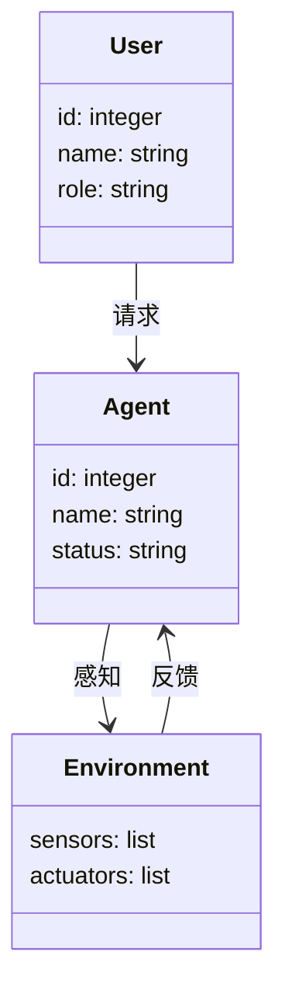

                 


# 企业级AI Agent的用户体验设计原则

> 关键词：企业级AI Agent，用户体验设计，人工智能，用户交互，系统架构

> 摘要：本文详细探讨了企业级AI Agent的用户体验设计原则，从核心概念到算法实现，再到系统架构和项目实战，结合实际案例分析，提供了一套完整的用户体验设计方法论，帮助读者理解和实现高效的AI Agent系统。

---

## 第1章: AI Agent的基本概念

### 1.1 AI Agent的定义与特征

#### 1.1.1 AI Agent的定义
AI Agent（人工智能代理）是一种能够感知环境、执行任务并做出决策的智能实体。它通过传感器获取信息，利用推理引擎进行分析，并通过执行器与环境交互。AI Agent可以是软件程序、机器人或其他智能设备。

#### 1.1.2 AI Agent的核心特征
- **自主性**：AI Agent能够自主决策和行动，无需外部干预。
- **反应性**：能够实时感知环境变化并做出响应。
- **目标导向**：以实现特定目标为导向，优化行动策略。
- **学习能力**：通过数据和经验不断优化自身性能。

#### 1.1.3 AI Agent与传统AI的区别
| 特性       | 传统AI                  | AI Agent                |
|------------|-------------------------|--------------------------|
| 行为方式    | 静态计算，不主动执行    | 动态交互，主动执行任务  |
| 应用场景    | 数据分析、模式识别      | 自动化操作、智能决策     |
| 交互方式    | 单向输入输出            | 双向交互，实时反馈       |

---

### 1.2 企业级AI Agent的背景与意义

#### 1.2.1 企业级AI Agent的应用场景
- **客户服务**：智能客服系统，自动处理客户咨询。
- **流程自动化**：企业内部流程自动化，提高效率。
- **决策支持**：基于数据的智能决策支持系统。
- **风险管理**：实时监控并防范潜在风险。

#### 1.2.2 企业级AI Agent的市场需求
随着企业数字化转型的推进，对自动化、智能化的需求日益增长。AI Agent能够帮助企业实现业务流程的智能化，降低人工成本，提高效率。

#### 1.2.3 企业级AI Agent的技术挑战
- **复杂性**：企业环境复杂，需求多样。
- **实时性**：需要实时响应，对系统性能要求高。
- **安全性**：涉及企业数据安全，需确保系统安全性。

---

## 第2章: 用户体验设计的核心原则

### 2.1 用户体验设计的基本概念

#### 2.1.1 用户体验的定义
用户体验（UX）是用户在与系统交互过程中所感受到的体验，包括功能性、易用性和情感因素。

#### 2.1.2 用户体验的核心要素
- **可用性**：系统易于使用，用户能够高效完成任务。
- **可访问性**：系统对所有用户开放，包括残障人士。
- **可靠性**：系统在各种情况下都能稳定运行。
- **可扩展性**：系统能够适应未来的需求变化。

#### 2.1.3 用户体验与企业级AI Agent的关系
AI Agent作为企业系统的一部分，用户体验直接影响系统的接受度和使用效果。

---

### 2.2 用户体验设计的原则

#### 2.2.1 以用户为中心的设计原则
- **用户研究**：了解用户需求、习惯和痛点。
- **任务分析**：将用户任务分解为具体步骤。
- **原型设计**：基于用户需求设计界面原型。

#### 2.2.2 可用性原则
- **简化流程**：减少用户操作步骤。
- **清晰反馈**：提供明确的操作反馈。
- **一致性**：保持界面和操作的一致性。

#### 2.2.3 可访问性原则
- **包容性设计**：考虑残障人士的需求。
- **可调节性**：提供多种输入方式（键盘、鼠标、语音）。

#### 2.2.4 可靠性原则
- **错误处理**：提供错误提示和解决建议。
- **容错设计**：防止用户误操作导致的系统崩溃。

---

## 第3章: 企业级AI Agent的算法实现

### 3.1 基于规则的AI Agent算法

#### 3.1.1 算法定义
基于规则的AI Agent通过预定义的规则库进行推理和决策。

#### 3.1.2 算法流程
1. **信息感知**：获取环境数据。
2. **规则匹配**：匹配最合适的规则。
3. **决策执行**：根据匹配的规则执行操作。
4. **反馈处理**：根据反馈调整规则。

#### 3.1.3 算法优缺点
- **优点**：规则简单明确，易于理解和维护。
- **缺点**：规则数量庞大，难以覆盖所有场景。

#### 3.1.4 算法实现代码
```python
class RuleBasedAgent:
    def __init__(self, rules):
        self.rules = rules

    def perceive(self, environment):
        # 获取环境数据
        return environment

    def decide(self, input_data):
        # 匹配规则
        for rule in self.rules:
            if rule.matches(input_data):
                return rule.action
        return default_action

    def execute(self, action):
        # 执行操作
        return result

    def feedback(self, result):
        # 处理反馈
        pass
```

---

## 第4章: 系统架构与设计

### 4.1 系统功能设计

#### 4.1.1 领域模型设计


#### 4.1.2 系统架构设计


---

## 第5章: 项目实战

### 5.1 环境安装与配置

```bash
pip install flask
pip install numpy
pip install scikit-learn
```

### 5.2 核心功能实现

```python
from flask import Flask
from sklearn.tree import DecisionTreeClassifier

app = Flask(__name__)
model = DecisionTreeClassifier()

@app.route('/agent/train', methods=['POST'])
def train():
    data = request.json
    model.fit(data['X'], data['y'])
    return jsonify({'status': 'success'})

@app.route('/agent/predict', methods=['POST'])
def predict():
    data = request.json
    result = model.predict(data['X_test'])
    return jsonify({'result': result.tolist()})
```

---

## 第6章: 最佳实践

### 6.1 用户体验设计原则总结

1. **以用户为中心**：始终关注用户需求和体验。
2. **简化流程**：减少用户操作步骤。
3. **清晰反馈**：提供明确的操作反馈。
4. **容错设计**：防止用户误操作导致系统崩溃。

### 6.2 项目小结
通过本文的分析和实战，我们掌握了企业级AI Agent的用户体验设计原则，从算法实现到系统架构，再到实际项目应用，为读者提供了完整的解决方案。

### 6.3 注意事项
- **数据安全**：确保用户数据的安全性。
- **系统监控**：实时监控系统运行状态。
- **持续优化**：根据用户反馈不断优化系统。

### 6.4 拓展阅读
- 《人机交互：从设计到实现》
- 《AI系统设计模式》
- 《用户体验设计手册》

---

## 作者：AI天才研究院 & 禅与计算机程序设计艺术

通过本文的详细分析和实战，我们深入探讨了企业级AI Agent的用户体验设计原则，从理论到实践，为读者提供了完整的解决方案。

