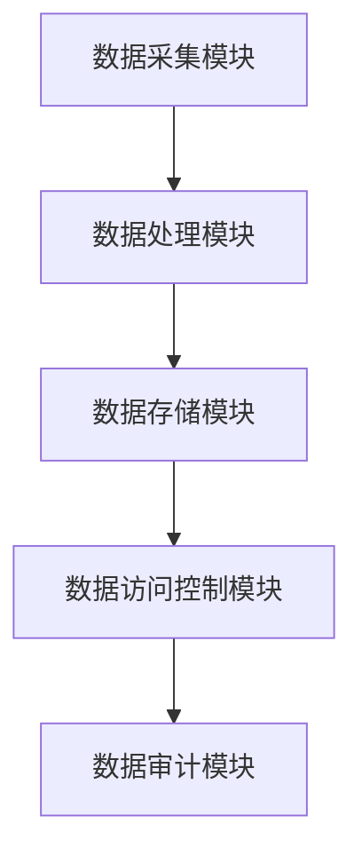

                 


# 企业级AI Agent的隐私保护与合规性考虑

> 关键词：企业级AI Agent, 隐私保护, 数据安全, GDPR, AI合规性, 数据匿名化  
> 摘要：随着企业级AI Agent的广泛应用，隐私保护和合规性问题变得日益重要。本文从技术与法律双重角度，系统性地探讨了企业级AI Agent在隐私保护方面的关键挑战，并提出了相应的解决方案。通过分析数据加密、匿名化处理、访问控制等技术手段，结合GDPR等法规要求，本文为构建合规且安全的企业级AI Agent提供了理论和实践指导。

---

## 第一部分: 企业级AI Agent的背景与核心概念

### 第1章: AI Agent的基本概念与背景

#### 1.1 AI Agent的定义与特点
- **AI Agent的定义**：AI Agent（人工智能代理）是指能够感知环境、自主决策并执行任务的智能实体。它通过与用户或系统的交互，完成特定目标。
- **AI Agent的核心特点**：
  - **自主性**：无需外部干预，自主完成任务。
  - **反应性**：能够实时感知环境并做出响应。
  - **目标导向性**：所有行为都围绕特定目标展开。
  - **学习能力**：通过数据和反馈不断优化自身行为。

#### 1.2 企业级AI Agent的应用场景
- **企业内部AI Agent的应用**：
  - **流程自动化**：优化企业内部流程，如供应链管理、客户关系管理等。
  - **决策支持**：辅助高层管理者进行数据分析和决策。
  - **风险管理**：实时监控企业运营中的潜在风险。
- **对外服务中的AI Agent**：
  - **客户服务**：通过聊天机器人提供24/7的客户支持。
  - **智能推荐**：基于用户行为推荐个性化的产品或服务。
  - **外部数据处理**：与第三方系统交互，处理敏感数据。

#### 1.3 企业级AI Agent的特殊性
- **数据敏感性**：企业级AI Agent可能处理大量敏感数据，如客户信息、财务数据等。
- **合规性要求**：企业级AI Agent必须符合相关法律法规，如GDPR、CCPA等。
- **安全风险**：由于涉及企业核心数据，AI Agent面临更高的安全风险。

---

### 第2章: 隐私保护与合规性的重要性

#### 2.1 隐私保护的核心概念
- **隐私保护的定义**：确保个人或企业的数据在收集、处理和存储过程中不被未经授权的主体访问或滥用。
- **数据隐私与隐私保护的关系**：
  - 数据隐私是隐私保护的基础，隐私保护是数据隐私的实现手段。
- **企业级AI Agent中的隐私风险**：
  - 数据泄露：AI Agent可能因攻击或漏洞导致数据泄露。
  - 数据滥用：AI Agent可能在未经授权的情况下滥用数据。
  - 数据存储风险：AI Agent存储的大量数据可能成为攻击目标。

#### 2.2 合规性考虑的必要性
- **合规性在企业中的地位**：
  - 合规性是企业合法运营的基础，不合规可能导致法律处罚。
- **AI Agent与法律法规的冲突**：
  - 数据收集范围与GDPR的要求不符。
  - 数据处理方式违反用户隐私权。
  - 数据存储位置不符合特定地区的法律要求。
- **企业级AI Agent的合规性挑战**：
  - 不同地区有不同的法律法规，企业需要满足多个合规要求。
  - AI Agent的功能复杂性增加了合规性审查的难度。

#### 2.3 企业级AI Agent的隐私保护与合规性核心概念
- **隐私保护的关键技术**：
  - 数据加密技术。
  - 数据匿名化技术。
  - 访问控制机制。
- **合规性管理的核心要素**：
  - 数据收集与处理的合规性。
  - 用户同意与数据使用。
  - 数据安全与隐私保护。
- **隐私保护与合规性的关系**：
  - 隐私保护是合规性的基础。
  - 合规性是隐私保护的保障。
  - 两者共同促进企业级AI Agent的健康发展。

---

## 第二部分: 企业级AI Agent的隐私保护技术

### 第3章: 数据加密与隐私保护

#### 3.1 数据加密技术
- **对称加密与非对称加密**：
  - **对称加密**：加密和解密使用相同的密钥，速度快，适用于大量数据加密。
  - **非对称加密**：加密和解密使用不同的密钥，安全性高，适用于数据签名和身份验证。
- **加密算法的选择与应用**：
  - **AES**：适合对称加密，广泛应用于数据存储和传输。
  - **RSA**：适合非对称加密，常用于数据签名和身份验证。
- **加密技术在AI Agent中的应用**：
  - 数据存储加密：保护敏感数据不被未经授权的访问。
  - 数据传输加密：确保数据在传输过程中的安全性。

#### 3.2 数据匿名化技术
- **数据匿名化的定义**：通过技术手段去除数据中的个人身份信息，使其无法被重新识别。
- **数据匿名化的主要方法**：
  - **k-匿名化**：确保每个数据记录至少有k个其他记录与之相同。
  - **数据扰动**：通过添加噪声或随机化处理，防止数据被精确还原。
  - **数据泛化**：将数据细化为更通用的类别或范围。
- **数据匿名化的实现步骤**：
  1. 数据预处理：识别敏感字段。
  2. 应用匿名化技术：对敏感字段进行处理。
  3. 验证匿名化效果：确保匿名化后的数据无法被重新识别。

#### 3.3 访问控制机制
- **访问控制的定义**：通过规则和策略限制数据访问权限，确保只有授权用户可以访问特定数据。
- **访问控制的主要类型**：
  - **基于角色的访问控制（RBAC）**：根据用户角色分配权限。
  - **基于属性的访问控制（ABAC）**：根据用户属性和上下文分配权限。
  - **基于规则的访问控制（RBAC）**：根据预定义的规则分配权限。
- **访问控制在AI Agent中的应用**：
  - 数据访问权限管理：确保只有授权的AI Agent可以访问特定数据。
  - 用户权限管理：根据用户角色分配数据访问权限。

---

### 第4章: 数据匿名化技术的实现与应用

#### 4.1 数据匿名化的实现步骤
- **数据预处理**：
  - 识别敏感字段：如姓名、地址、电话号码等。
  - 数据清洗：去除无关数据，保留敏感数据。
- **数据匿名化处理**：
  - 使用k-匿名化技术：确保每个数据记录至少有k个其他记录与之相同。
  - 数据扰动：通过添加噪声或随机化处理，防止数据被精确还原。
  - 数据泛化：将数据细化为更通用的类别或范围。
- **数据匿名化后的验证**：
  - 检查匿名化后的数据是否无法被重新识别。
  - 确保匿名化后的数据仍能支持数据分析和决策。

#### 4.2 数据匿名化的实现代码示例
```python
import pandas as pd
import numpy as np

def anonymize_data(dataframe, sensitive_columns, k=3):
    # 创建一个匿名化后的数据框
    anonymized_df = dataframe.copy()
    
    # 对每个敏感列进行匿名化处理
    for col in sensitive_columns:
        # 使用k-匿名化技术
        anonymized_df[col] = anonymized_df[col].apply(lambda x: 
            f"{x[:len(x)//k]}{'*' * (len(x) - len(x)//k)}")
    
    return anonymized_df

# 示例数据
data = {
    '姓名': ['张三', '李四', '王五', '赵六'],
    '地址': ['北京市', '上海市', '广州市', '深圳市'],
    '电话': ['13812345678', '13912345678', '13712345678', '13612345678']
}
df = pd.DataFrame(data)

# 定义敏感列
sensitive_columns = ['姓名', '地址', '电话']

# 调用匿名化函数
anonymized_df = anonymize_data(df, sensitive_columns)

# 输出匿名化后的数据
print(anonymized_df)
```

#### 4.3 数据匿名化的应用案例
- **医疗领域**：保护患者隐私，确保医疗数据的安全性。
- **金融领域**：保护客户隐私，防止金融数据泄露。
- **零售领域**：保护消费者隐私，确保个性化推荐的安全性。

---

## 第三部分: 企业级AI Agent的系统架构与合规性设计

### 第5章: 系统架构设计

#### 5.1 系统模块划分
- **数据采集模块**：负责收集企业内外部数据。
- **数据处理模块**：对数据进行清洗、转换和匿名化处理。
- **数据存储模块**：将处理后的数据存储在安全的数据库中。
- **数据访问控制模块**：根据用户角色和权限控制数据访问。
- **数据审计模块**：记录数据操作日志，便于审计和追溯。

#### 5.2 系统架构设计图


---

## 结语

企业级AI Agent的隐私保护与合规性是当前技术与法律领域的重要课题。通过采用数据加密、数据匿名化和访问控制等技术手段，结合GDPR等法规要求，企业可以有效保护用户隐私，确保AI Agent的合规性。未来，随着技术的不断发展，隐私保护与合规性考虑将更加复杂，企业需要持续关注技术与法律的最新动态，不断完善隐私保护与合规性策略，以应对日益严峻的隐私与合规挑战。

---

**作者：AI天才研究院/AI Genius Institute & 禅与计算机程序设计艺术 /Zen And The Art of Computer Programming**

