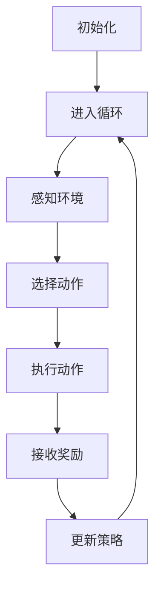
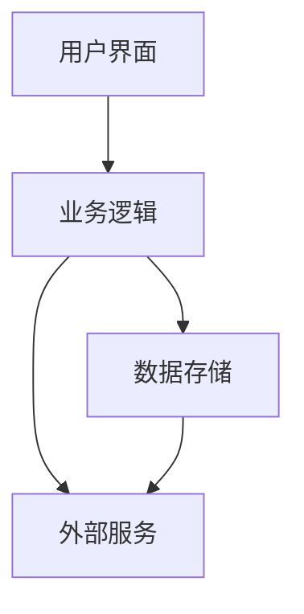

                 


# 企业级AI Agent需求分析方法

> 关键词：企业级AI Agent、需求分析、系统架构、算法原理、项目实战

> 摘要：本文系统地探讨了企业级AI Agent的需求分析方法，从背景介绍、核心概念、算法原理到系统架构设计，再到项目实战，全面分析了如何高效地进行AI Agent的需求分析。通过实际案例和详细的技术分析，帮助读者掌握企业级AI Agent的需求分析技巧，提升系统设计能力。

---

## 第1章: 企业级AI Agent概述

### 1.1 问题背景与定义

#### 1.1.1 企业级AI Agent的背景
随着人工智能技术的飞速发展，企业级AI Agent（智能体）逐渐成为企业数字化转型的核心驱动力。AI Agent通过自动化处理复杂任务，帮助企业提高效率、降低成本，并增强决策能力。然而，AI Agent的设计和实现需要深入分析其需求，以确保其在企业环境中的有效性和可靠性。

#### 1.1.2 AI Agent的核心概念
AI Agent是指在计算机系统中，能够感知环境、自主决策并执行任务的智能实体。企业级AI Agent不仅具备这些基本特征，还具有高可用性、可扩展性和安全性等特性，能够适应复杂的业务场景。

#### 1.1.3 企业级AI Agent的定义与特点
企业级AI Agent是一种在企业环境中运行的智能体，能够通过感知环境、分析数据、制定策略并执行操作来完成复杂的业务任务。其特点包括：
- **高可用性**：能够在复杂环境中稳定运行。
- **可扩展性**：能够根据业务需求进行扩展。
- **安全性**：具备强大的安全防护能力，防止数据泄露和恶意攻击。
- **智能性**：能够通过机器学习和数据分析提升决策能力。

### 1.2 问题描述与解决思路

#### 1.2.1 企业级AI Agent的应用场景
企业级AI Agent广泛应用于多个领域，例如：
- **智能客服**：通过自然语言处理技术为用户提供24/7的在线支持。
- **供应链管理**：优化库存管理、物流调度和生产计划。
- **智能风控**：实时监控企业运营中的风险，并采取相应的控制措施。

#### 1.2.2 需求分析的核心问题
在企业级AI Agent的需求分析中，关键问题包括：
- **功能需求**：AI Agent需要完成哪些具体任务？
- **性能需求**：系统在处理大量数据时的响应速度和准确性要求。
- **约束条件**：系统运行的环境限制，例如网络延迟、设备兼容性等。

#### 1.2.3 企业级AI Agent的解决思路
解决企业级AI Agent的需求分析问题，可以采用以下步骤：
1. **需求收集与整理**：通过访谈、问卷调查等方式收集相关需求。
2. **需求分析与建模**：利用系统工程方法对需求进行分析和建模。
3. **需求验证与确认**：通过原型验证和专家评审确认需求的可行性和合理性。

### 1.3 本章小结
本章主要介绍了企业级AI Agent的背景、核心概念和应用场景，并指出了需求分析中的关键问题和解决思路。

---

## 第2章: 企业级AI Agent的需求分析框架

### 2.1 需求分析的核心要素

#### 2.1.1 业务目标与用户需求
企业级AI Agent的业务目标是通过智能化手段提升企业效率和竞争力。用户需求则包括具体的功能需求和用户体验需求。

#### 2.1.2 功能需求与性能指标
功能需求是AI Agent需要实现的具体功能，例如数据处理、决策支持等。性能指标则是衡量系统性能的关键指标，例如处理速度、准确率等。

#### 2.1.3 约束条件与边界条件
约束条件是指系统在设计和实现过程中需要遵守的限制，例如预算、技术限制等。边界条件则是系统与外部环境的接口和交互方式。

### 2.2 需求分析的步骤与方法

#### 2.2.1 需求收集与整理
需求收集是通过多种渠道获取需求信息，整理则是将收集到的需求进行分类和汇总。

#### 2.2.2 需求分析与建模
通过系统工程方法对需求进行分析，并建立相应的模型，例如数据流图、实体关系图等。

#### 2.2.3 需求验证与确认
通过原型验证和专家评审等方式，确认需求的可行性和合理性。

### 2.3 需求分析的工具与技术

#### 2.3.1 需求工程工具
常用的工具有JIRA、Rational Requisite、Miro等。

#### 2.3.2 用户故事与场景分析
通过用户故事和场景分析，明确用户需求和使用场景。

#### 2.3.3 数据流图与系统边界分析
数据流图用于描述系统的数据流和处理过程，系统边界分析用于明确系统的输入输出。

### 2.4 本章小结
本章详细探讨了企业级AI Agent需求分析的核心要素、步骤和工具，为后续的系统设计奠定了基础。

---

## 第3章: 企业级AI Agent的核心概念与联系

### 3.1 核心概念原理

#### 3.1.1 AI Agent的基本原理
AI Agent通过感知环境、分析数据、制定策略并执行操作来完成任务。其基本原理包括数据处理、决策制定和任务执行三个阶段。

#### 3.1.2 企业级AI Agent的扩展特性
企业级AI Agent在基本原理的基础上，还具备高可用性、可扩展性和安全性等扩展特性。

#### 3.1.3 核心概念的数学模型
企业级AI Agent的核心概念可以用数学模型进行描述。例如，决策过程可以表示为一个优化问题，目标是最优化决策结果。

### 3.2 核心概念属性特征对比

#### 3.2.1 属性对比表格
以下是AI Agent和企业级AI Agent的核心属性对比：

| 属性         | AI Agent         | 企业级AI Agent    |
|--------------|------------------|-------------------|
| 可用性         | 中等             | 高                |
| 可扩展性       | 低               | 高                |
| 安全性         | 一般             | 强                |

#### 3.2.2 特征对比分析
通过对比分析，可以发现企业级AI Agent在可用性、可扩展性和安全性等方面具有显著优势。

#### 3.2.3 属性与特征的关联关系
企业级AI Agent的高可用性和高安全性是其在企业环境中成功应用的关键因素。

### 3.3 ER实体关系图架构

#### 3.3.1 实体识别与关系建模
通过ER图识别系统中的实体，并描述它们之间的关系。

#### 3.3.2 实体关系图的绘制
以下是AI Agent系统中实体关系的Mermaid图：

```mermaid
erDiagram
    actor 用户
    actor 系统
    actor 数据源
    actor 执行器
    用户 --> 系统 : 提供输入
    系统 --> 数据源 : 获取数据
    系统 --> 执行器 : 执行操作
```

#### 3.3.3 实体关系图的验证与优化
通过专家评审和实际应用验证，不断优化实体关系图，确保其准确性和实用性。

### 3.4 本章小结
本章详细分析了企业级AI Agent的核心概念、属性特征和实体关系图，为后续的需求分析和系统设计提供了理论基础。

---

## 第4章: 企业级AI Agent需求分析的算法原理

### 4.1 算法原理概述

#### 4.1.1 算法的基本原理
AI Agent的决策过程通常基于某种算法，例如强化学习、决策树等。

#### 4.1.2 算法的核心思想
以强化学习为例，其核心思想是通过试错和奖励机制，优化决策策略。

#### 4.1.3 算法的实现步骤
1. 初始化智能体的初始状态。
2. 智能体感知环境并采取行动。
3. 环境返回奖励信号。
4. 智能体更新策略并重复上述步骤。

### 4.2 算法流程图

#### 4.2.1 算法流程图的绘制
以下是强化学习算法的Mermaid流程图：



#### 4.2.2 流程图的详细说明
流程图详细描述了强化学习算法的执行步骤，从初始化到策略更新，形成了一个闭环。

#### 4.2.3 流程图的优化与改进
通过分析流程图，可以发现某些步骤可以并行处理，从而提高算法效率。

### 4.3 算法的数学模型与公式

#### 4.3.1 数学模型的建立
强化学习的目标是最大化累积奖励，其数学模型可以表示为：

$$ V(s) = \max_a Q(s,a) $$

其中，$V(s)$ 是状态 $s$ 的价值函数，$Q(s,a)$ 是状态 $s$ 下动作 $a$ 的价值函数。

#### 4.3.2 公式的推导与解释
通过贝尔曼方程，我们可以推导出价值函数的更新公式：

$$ Q(s,a) = r + \gamma \max_{a'} Q(s',a') $$

其中，$\gamma$ 是折扣因子，$r$ 是奖励值。

#### 4.3.3 公式的应用与验证
通过实际应用验证公式的正确性，并根据反馈调整参数，以优化算法性能。

### 4.4 本章小结
本章详细分析了企业级AI Agent需求分析中的算法原理，包括基本原理、流程图和数学模型。

---

## 第5章: 企业级AI Agent需求分析的系统分析与架构设计

### 5.1 系统分析

#### 5.1.1 系统分析的步骤与方法
系统分析包括需求收集、需求分析和需求验证三个步骤。

#### 5.1.2 系统分析的工具与技术
常用的工具有Rational System Architect、Lucidchart等。

#### 5.1.3 系统分析的结果与输出
系统分析的结果包括需求规格说明书、数据流图和实体关系图等。

### 5.2 系统架构设计

#### 5.2.1 系统架构的设计原则
系统架构设计应遵循模块化、可扩展性和安全性原则。

#### 5.2.2 系统架构的实现步骤
1. 确定系统模块划分。
2. 设计模块之间的接口。
3. 绘制系统架构图。

#### 5.2.3 系统架构图的绘制
以下是系统架构的Mermaid图：



#### 5.2.4 系统架构的验证与优化
通过评审和测试验证系统架构的可行性和合理性，并根据反馈进行优化。

### 5.3 本章小结
本章详细探讨了企业级AI Agent的系统分析与架构设计，为后续的项目实施提供了指导。

---

## 第6章: 企业级AI Agent需求分析的项目实战

### 6.1 项目背景与目标

#### 6.1.1 项目背景
本项目旨在开发一个企业级AI Agent，用于优化企业的供应链管理。

#### 6.1.2 项目目标
通过AI Agent实现供应链的智能优化，提升企业的运营效率。

### 6.2 项目需求分析

#### 6.2.1 需求收集与整理
通过访谈和问卷调查，收集供应链管理中的关键需求。

#### 6.2.2 需求分析与建模
利用数据流图和实体关系图对需求进行分析和建模。

#### 6.2.3 需求验证与确认
通过原型验证和专家评审确认需求的可行性和合理性。

### 6.3 项目实现

#### 6.3.1 系统功能设计
系统功能包括数据采集、决策支持和执行控制三个模块。

#### 6.3.2 系统实现
以下是关键模块的Python代码示例：

```python
class Agent:
    def __init__(self):
        self.data = []
    
    def collect_data(self):
        # 从数据源获取数据
        pass
    
    def make_decision(self):
        # 基于数据做出决策
        pass
    
    def execute_action(self):
        # 执行决策结果
        pass

# 示例用法
agent = Agent()
agent.collect_data()
agent.make_decision()
agent.execute_action()
```

#### 6.3.3 代码实现与解读
通过代码实现AI Agent的核心功能，并详细解读代码的实现过程。

### 6.4 项目测试与优化

#### 6.4.1 测试计划
制定详细的测试计划，包括单元测试、集成测试和系统测试。

#### 6.4.2 测试结果与分析
通过测试验证系统功能和性能，分析测试结果并提出优化建议。

### 6.5 本章小结
本章通过实际项目案例，详细展示了企业级AI Agent需求分析的全过程，包括需求分析、系统设计和项目实现。

---

## 第7章: 总结与展望

### 7.1 本章总结
本文系统地探讨了企业级AI Agent的需求分析方法，从背景介绍、核心概念、算法原理到系统架构设计，再到项目实战，全面分析了如何高效地进行AI Agent的需求分析。

### 7.2 未来展望
随着人工智能技术的不断发展，企业级AI Agent的需求分析方法将更加智能化和自动化。未来的研究方向包括更高效的算法设计、更灵活的系统架构和更强大的安全防护。

---

## 作者：AI天才研究院 & 禅与计算机程序设计艺术

---

### 注意事项：
- 以上文章为示例内容，实际撰写时需根据具体需求调整内容和结构。
- 代码示例中的具体实现可根据实际需求进行修改和完善。
- 图表和公式需根据实际内容进行调整和补充。

### 拓展阅读：
- 《AI Agent设计与实现》
- 《企业级系统架构设计》
- 《需求工程方法与实践》

