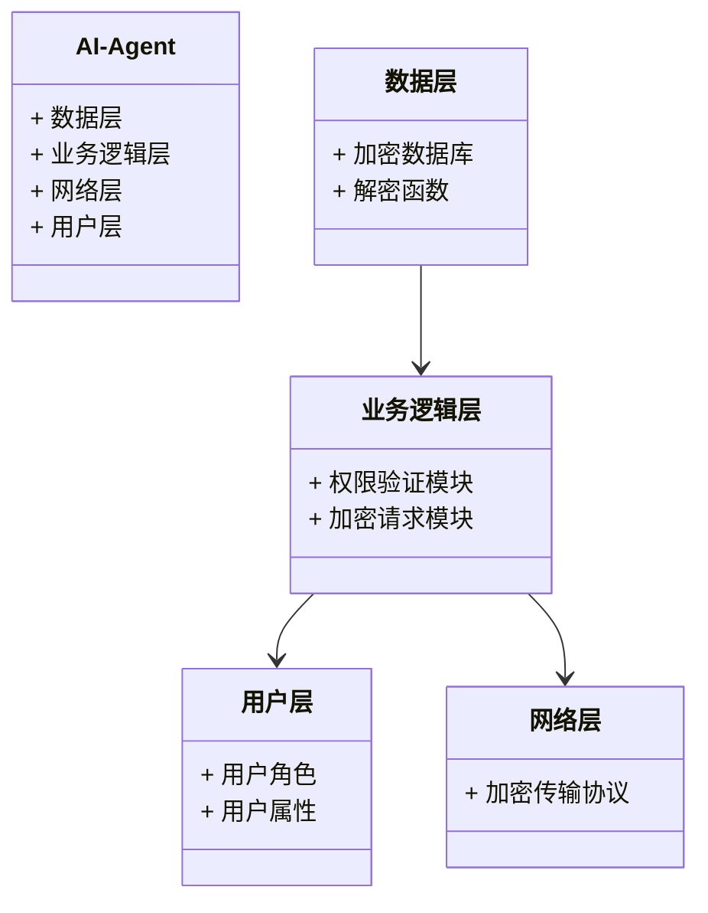
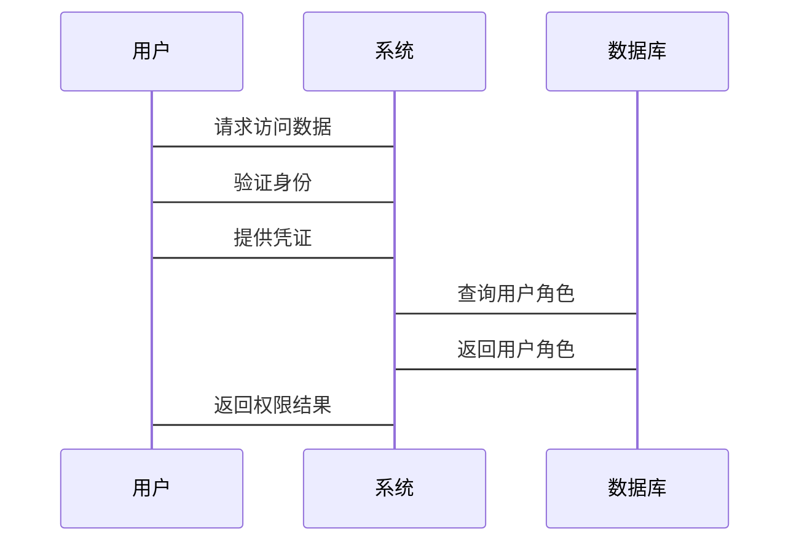

                 


# 保障AI Agent安全：数据加密与访问控制实践

---

## 关键词

- AI Agent
- 数据加密
- 访问控制
- 安全设计
- 加密算法
- 访问控制模型

---

## 摘要

随着人工智能技术的快速发展，AI Agent（智能体）在各个领域的应用越来越广泛。然而，AI Agent的安全性问题也随之浮现，尤其是在数据加密与访问控制方面。本文从AI Agent的基本概念出发，详细探讨了数据加密与访问控制的核心原理、算法实现、系统架构设计以及实际案例分析。通过理论与实践相结合的方式，帮助读者全面了解并掌握如何在AI Agent中实现数据加密与访问控制，确保系统的安全性和数据的隐私性。

---

## 第一部分：AI Agent安全概述

### 第1章：AI Agent的基本概念与安全的重要性

#### 1.1 AI Agent的定义与特点

AI Agent是一种能够感知环境并采取行动以实现目标的智能实体。它具备以下特点：

- **自主性**：能够在没有外部干预的情况下自主决策。
- **反应性**：能够根据环境变化实时调整行为。
- **社会性**：能够与其他系统或用户进行交互协作。

#### 1.2 数据安全的重要性

数据安全是AI Agent安全的核心，主要体现在以下几个方面：

- **数据机密性**：确保数据不被未经授权的用户访问。
- **数据完整性**：防止数据在存储或传输过程中被篡改。
- **数据可用性**：确保合法用户能够及时访问数据。

---

## 第二部分：数据加密原理与技术

### 第2章：数据加密的核心概念

#### 2.1 加密算法的分类与原理

加密算法主要分为对称加密和非对称加密两种类型：

- **对称加密**：加密和解密使用相同的密钥。常见的算法有AES（高级加密标准）和DES（数据加密标准）。
- **非对称加密**：加密和解密使用不同的密钥，通常称为公钥和私钥。常见的算法有RSA（ Rivest-Shamir-Adleman）。

#### 2.2 加密算法的数学模型

以AES加密算法为例，其数学模型可以表示为：

$$
\text{加密} = f(\text{明文}, \text{密钥})
$$

其中，$f$表示加密函数，$\text{明文}$是原始数据，$\text{密钥}$用于生成加密密钥。

### 第3章：访问控制模型

#### 3.1 基于角色的访问控制（RBAC）

RBAC模型通过角色和权限的分配来控制用户的访问权限。例如，一个用户被分配了“管理员”角色，可以访问系统的所有功能。

- **优点**：权限管理灵活，适合大型系统。
- **缺点**：角色设计复杂，可能导致权限冲突。

#### 3.2 基于属性的访问控制（ABAC）

ABAC模型基于用户的属性（如职位、部门）来动态分配权限。例如，一个用户属于“研发部门”，可以访问研发相关的数据。

- **优点**：权限控制粒度细，适合复杂场景。
- **缺点**：实现复杂，需要动态计算属性。

---

## 第三部分：AI Agent中的数据加密与访问控制实践

### 第4章：系统分析与架构设计

#### 4.1 系统功能设计

AI Agent的数据加密与访问控制系统需要实现以下功能：

- 数据加密：对敏感数据进行加密存储和传输。
- 访问控制：基于用户角色或属性动态控制数据访问权限。

#### 4.2 系统架构设计

以下是系统的架构设计类图：



---

## 第四部分：项目实战

### 第5章：项目实战与案例分析

#### 5.1 环境安装

以下是项目实战所需的环境配置：

- 操作系统：Linux
- 开发工具：Python 3.8+
- 加密库：cryptography库
- 访问控制库：django-simple-acl

#### 5.2 核心实现代码

以下是AES加密算法的Python实现：

```python
from cryptography.hazmat.primitives import hashes
from cryptography.hazmat.primitives.asymmetric import padding
from cryptography.hazmat.primitives.kdf import pbkdf2
from cryptography.hazmat.primitives.ciphers import Cipher, algorithms, modes
from cryptography.hazmat.backends import default_backend

def aes_encrypt(plaintext, key):
    backend = default_backend()
    key = pbkdf2.PBKDF2HMAC(
        algorithm=hashes.SHA256(),
        salt=b'salt',
        iterations=100000,
        key_bytes=32,
        backend=backend
    ).derive(key.encode())
    iv = os.urandom(16)
    cipher = Cipher(algorithms.AES(key), modes.CBC(iv), backend)
    encryptor = cipher.encryptor()
    plaintext = plaintext + (16 - (len(plaintext) % 16)) * ' '
    ciphertext = encryptor.update(plaintext.encode()) + encryptor.finalize()
    return ciphertext, iv

def aes_decrypt(ciphertext, iv, key):
    backend = default_backend()
    key = pbkdf2.PBKDF2HMAC(
        algorithm=hashes.SHA256(),
        salt=b'salt',
        iterations=100000,
        key_bytes=32,
        backend=backend
    ).derive(key.encode())
    cipher = Cipher(algorithms.AES(key), modes.CBC(iv), backend)
    decryptor = cipher.decryptor()
    plaintext = decryptor.update(ciphertext).decode().strip()
    return plaintext
```

#### 5.3 案例分析

以下是一个基于RBAC的访问控制案例：



---

## 第五部分：总结与展望

### 第6章：总结与展望

#### 6.1 总结

本文详细探讨了AI Agent中的数据加密与访问控制实践，从理论到实践，为读者提供了全面的指导。

#### 6.2 展望

未来，随着AI技术的不断发展，数据加密与访问控制技术也将更加智能化和动态化。建议读者持续关注相关领域的最新动态和技术发展。

---

## 作者

作者：AI天才研究院/AI Genius Institute & 禅与计算机程序设计艺术 /Zen And The Art of Computer Programming

