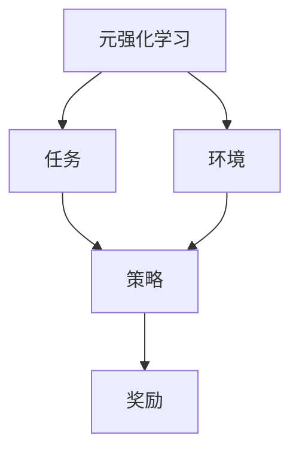
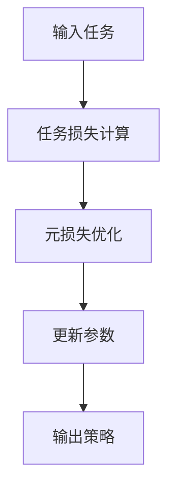
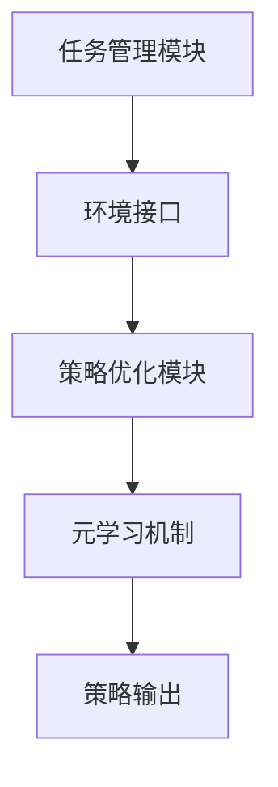

                 

<think>
好的，我现在要设计一本名为《元强化学习：快速适应新环境的AI Agent》的书籍目录大纲。首先，我需要理解这本书的核心内容，即元强化学习，它是什么，它和传统的强化学习有什么不同，以及它在实际应用中的价值。

元强化学习的目标是让AI代理能够快速适应新的环境，这在传统的强化学习中是一个挑战，因为传统强化学习通常需要大量的数据和时间来训练，且在面对新环境时需要从头开始学习，这显然不够高效。而元强化学习则通过元学习机制，使得代理能够利用之前的经验快速适应新任务。

接下来，我需要考虑这本书的结构。通常，技术书籍可以分为几个主要部分，如基础、核心概念、算法原理、系统设计、项目实战、小结等。我需要确保每个部分都涵盖必要的内容，并且逻辑清晰。

在第一部分，我应该从背景介绍开始，让读者了解元强化学习的必要性。包括传统强化学习的局限性，元强化学习的定义和目标，以及它在实际中的应用场景。

接下来是核心概念与联系，这部分需要深入讲解元强化学习的原理，比如元学习机制、快速适应方法，以及与其他学习方法的对比。同时，我需要用表格和图示来帮助读者更好地理解这些概念。

然后是算法原理部分，这里需要详细讲解几种主流的元强化学习算法，如MAML、ReMAML、Meta-Q-Learning等。每个算法都需要用数学公式和流程图来说明，确保读者能够理解其工作原理。

接下来是系统分析与架构设计，这部分可能需要介绍一个实际的项目，比如一个多领域任务的元强化学习系统。用图示展示领域模型、系统架构和接口设计，这样读者可以了解如何将理论应用到实际系统中。

项目实战部分，需要提供具体的环境安装步骤，代码实现，以及案例分析。这部分要让读者能够动手实践，理解如何在实际项目中应用元强化学习。

最后，最佳实践、小结、注意事项和拓展阅读部分，帮助读者巩固所学内容，并指导他们进一步学习和应用。

在编写过程中，我需要确保每个章节都细化到三级目录，使用markdown格式，并且内容完整，涵盖用户要求的所有方面。同时，要注意不要超过2000字的限制，保持简洁明了。

现在，我需要按照这些思路一步步构建目录大纲，确保每个部分都符合要求，结构合理，内容全面。
</think>

# 元强化学习：快速适应新环境的AI Agent

## 关键词
元强化学习, 快速适应, AI Agent, 环境适应, 强化学习, 元学习机制

## 摘要
本文将深入探讨元强化学习（Meta-Reinforcement Learning）这一前沿技术，介绍其核心概念、算法原理、系统架构及实际应用。通过详细分析，我们将揭示元强化学习如何使AI代理能够在新环境中快速适应和优化策略，从而显著提升其执行复杂任务的能力。

---

# 第一部分：元强化学习概述

## 第1章：元强化学习的背景与问题背景

### 1.1 传统强化学习的局限性
传统强化学习在处理新任务时需要从头开始学习，效率低下。其局限性包括：
- 需要大量数据支持
- 适应新任务时间较长
- 无法快速迁移已有经验

### 1.2 元强化学习的定义与目标
元强化学习是一种通过元学习机制，使AI代理能够快速适应新任务的强化学习方法。其目标是在有限时间内，利用已有经验快速优化新环境中的策略。

### 1.3 元强化学习的应用场景
- 多任务学习
- 快速适应新任务
- 连续控制与离散控制中的应用

---

## 第2章：元强化学习的核心概念与联系

### 2.1 元强化学习的核心概念原理
- **元学习机制**：通过学习如何快速学习新任务。
- **快速适应方法**：利用先前经验快速调整策略。
- **知识迁移策略**：将已学知识应用到新任务中。

### 2.2 核心概念属性特征对比表格
| 概念       | 学习速度 | 适应能力 | 任务多样性 |
|------------|----------|----------|-----------|
| 传统强化学习 | 较慢     | 较低     | 有限       |
| 元强化学习  | 快速     | 强        | 高         |

### 2.3 ER实体关系图架构


---

## 第3章：元强化学习算法原理

### 3.1 元强化学习算法概述
- **元学习算法的基本框架**：包括元损失函数和任务损失函数。
- **快速适应算法的核心思想**：通过优化元损失函数，使代理能够快速适应新任务。

### 3.2 基于MAML的元强化学习算法
#### 3.2.1 MAML算法的数学模型
$$ \text{Meta-Loss}(θ) = \sum_{i=1}^{n} \text{KL}(P_i || Q_i) $$

#### 3.2.2 MAML算法的流程图


---

## 第4章：元强化学习的系统分析与架构设计

### 4.1 问题场景介绍
- **多领域任务**：代理需要在多个领域中快速切换并适应。
- **动态环境**：环境条件不断变化，需要快速调整策略。

### 4.2 项目介绍
- **项目目标**：开发一个多领域任务的元强化学习系统。
- **系统功能设计**：包括任务切换、环境适应、策略优化等功能。

### 4.3 系统架构设计


---

## 第5章：元强化学习的项目实战

### 5.1 环境安装
- **安装Python**：确保系统安装了Python 3.8及以上版本。
- **安装依赖库**：使用pip安装必要的库，如`numpy`, `tensorflow`, `pytorch`等。

### 5.2 核心代码实现
```python
import torch
import torch.nn as nn

class MetaLearner(nn.Module):
    def __init__(self, input_dim, hidden_dim):
        super(MetaLearner, self).__init__()
        self.fc1 = nn.Linear(input_dim, hidden_dim)
        self.fc2 = nn.Linear(hidden_dim, 1)
    
    def forward(self, x):
        x = self.fc1(x)
        x = torch.sigmoid(x)
        x = self.fc2(x)
        return x

# 初始化元学习器
input_dim = 10
hidden_dim = 20
meta_learner = MetaLearner(input_dim, hidden_dim)
```

### 5.3 代码应用解读与分析
- **输入处理**：将输入数据转换为模型所需的格式。
- **前向传播**：通过元学习器生成策略。
- **反向传播与优化**：使用梯度下降优化模型参数。

### 5.4 实际案例分析
- **案例背景**：在一个多任务环境中训练元强化学习模型。
- **训练过程**：展示训练过程中的损失变化。
- **结果分析**：分析模型在不同任务中的表现。

---

## 第6章：元强化学习的最佳实践

### 6.1 小结
- 元强化学习通过元学习机制，显著提升了AI代理在新环境中的适应能力。
- 在实际应用中，需根据具体任务选择合适的算法和架构。

### 6.2 注意事项
- **数据质量**：确保数据的多样性和代表性。
- **计算资源**：元强化学习需要大量的计算资源。
- **模型调参**：合理选择超参数以获得最佳性能。

### 6.3 拓展阅读
- 推荐阅读相关领域的最新论文和书籍，深入理解元强化学习的前沿技术。

---

## 第7章：总结与展望

### 7.1 总结
- 元强化学习是一种高效的AI代理训练方法。
- 通过元学习机制，代理能够快速适应新环境并优化策略。

### 7.2 展望
- 元强化学习在多领域中的应用前景广阔。
- 随着算法的优化和计算能力的提升，元强化学习将发挥更大的作用。

---

## 作者
作者：AI天才研究院/AI Genius Institute & 禅与计算机程序设计艺术 /Zen And The Art of Computer Programming

---

通过以上目录，读者可以系统地了解元强化学习的核心概念、算法原理、系统架构及实际应用，为深入理解和应用这一技术打下坚实的基础。

