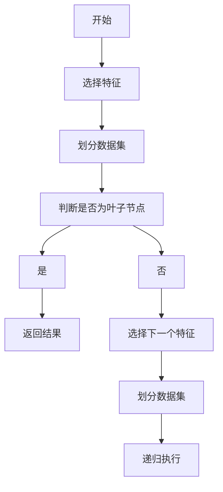
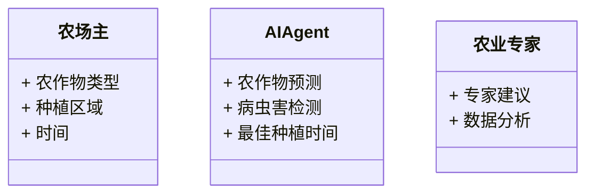
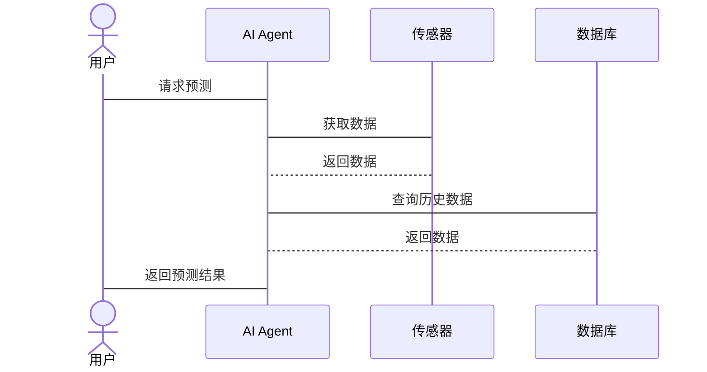

                 

<think>
好，我现在需要根据用户的要求，一步一步地分析如何撰写一篇关于《农业AI Agent：智能种植与农场管理》的技术博客文章。用户已经提供了一个详细的目录大纲，并且指定了每一部分需要包含的具体内容，包括背景介绍、核心概念、算法原理、系统架构、项目实战等。

首先，我需要理解整篇文章的主题和目标读者。这篇文章的目标读者可能是农业从业者、技术爱好者、AI开发者以及对农业智能化感兴趣的读者。因此，文章需要既专业又易懂，避免过于技术化的术语，同时又要深入探讨AI在农业中的具体应用。

接下来，我会按照用户提供的目录结构，逐一思考每一部分应该如何展开。

**第一部分：农业AI Agent的背景与概念**

- **第1章：农业智能化的现状与趋势**
  - 1.1 农业智能化的背景：这里需要介绍传统农业的局限性，比如资源浪费、效率低下、环境影响等，然后过渡到农业现代化的需求，以及人工智能在其中的角色。
  - 1.2 农业AI Agent的基本概念：定义AI Agent，强调其在农业中的应用，如数据驱动决策、自动化管理等。
  - 1.3 农业AI Agent的边界与外延：明确其应用范围，与其他技术（如物联网、大数据）的区别，以及未来的发展方向。

**第二部分：农业AI Agent的核心技术与原理**

- **第2章：农业AI Agent的核心概念与联系**
  - 2.1 核心概念的原理：详细讲解数据驱动决策、AI算法在农业中的应用，以及Agent行为模型。
  - 2.2 核心概念的属性特征对比：使用表格对比传统农业、智能农业和农业AI Agent的差异。
  - 2.3 ER实体关系图：通过Mermaid图展示农场主、AI Agent和农业专家之间的关系。
  
- **第3章：农业AI Agent的算法原理**
  - 3.1 常见算法概述：介绍决策树、支持向量机、线性回归等算法。
  - 3.2 算法原理详细讲解：使用Mermaid图展示决策树算法的流程，并附上Python代码示例。
  - 3.3 算法数学模型：展示决策树的数学公式，解释每个部分的含义。

**第三部分：系统架构设计与实现**

- **第4章：系统架构设计**
  - 4.1 问题场景介绍：描述一个典型的农业种植场景，提出需要解决的问题。
  - 4.2 系统功能设计：通过领域模型Mermaid图展示系统的主要功能模块。
  - 4.3 系统架构设计：使用Mermaid图展示整体架构，包括数据层、应用层、表现层。
  - 4.4 系统接口设计：描述系统与其他模块（如传感器、数据库）的接口。
  - 4.5 系统交互设计：使用Mermaid图展示用户与系统之间的交互流程。

- **第5章：系统实现**
  - 5.1 环境安装：列出需要安装的工具和库，如Python、TensorFlow、Flask等。
  - 5.2 核心功能实现：展示关键代码片段，如数据预处理、模型训练、结果预测。
  - 5.3 代码解读与分析：详细解释每部分代码的功能和实现逻辑。
  - 5.4 案例分析：通过具体案例展示系统在实际种植中的应用效果。
  - 5.5 项目小结：总结项目的成果、遇到的问题及解决方法。

**第四部分：优化与扩展**

- **第6章：优化与扩展**
  - 6.1 系统性能优化：介绍如何优化算法和系统架构以提高效率。
  - 6.2 技术扩展：探讨与物联网、区块链等其他技术的结合。
  - 6.3 案例分析：通过实际案例展示扩展后的系统效果。

**第五部分：附录与参考文献**

- **附录A：相关技术术语解释**
- **附录B：项目源代码**
- **参考文献**：列出所有引用的文献和资源。

**总结与致谢**

- 总结全文的主要内容和价值。
- 感谢读者的支持，鼓励读者参与讨论或提出反馈。

在撰写过程中，我需要确保每一部分内容详实，逻辑清晰。特别是在技术部分，要尽量用图表和代码示例来辅助说明，使读者能够轻松理解复杂的概念。同时，语言要简洁明了，避免过于学术化的表达，让不同背景的读者都能受益。

现在，我将按照上述思考过程，逐步撰写整篇文章。
</think>

# 农业AI Agent：智能种植与农场管理

> **关键词**：农业AI Agent，智能种植，农场管理，人工智能，农业现代化

> **摘要**：随着科技的不断进步，人工智能在农业领域的应用日益广泛。本文深入探讨了农业AI Agent的核心概念、算法原理、系统架构以及实际应用。通过案例分析和项目实战，展示了如何利用AI技术提升种植效率和农场管理水平，为农业现代化提供了新的思路和解决方案。

---

# 第一部分：农业AI Agent的背景与概念

## 第1章：农业智能化的现状与趋势

### 1.1 农业智能化的背景

传统农业依赖经验和人工劳动，存在资源浪费、效率低下和环境影响等问题。随着科技的发展，农业现代化成为必然趋势。人工智能的出现为农业带来了新的机遇，特别是在种植和农场管理方面。

**1.1.1 传统农业的局限性**
- 资源利用效率低，例如水、肥料的浪费。
- 人工劳动强度大，效率低下。
- 环境问题日益突出，如水土流失、温室气体排放。

**1.1.2 农业现代化的需求**
- 提高生产效率，降低成本。
- 保护环境，实现可持续发展。
- 解决劳动力不足的问题。

**1.1.3 人工智能在农业中的应用潜力**
- 数据驱动的决策支持。
- 自动化管理，如智能灌溉、精准施肥。
- 病虫害预测与防治。

### 1.2 农业AI Agent的基本概念

**1.2.1 AI Agent的定义**
AI Agent是一种智能体，能够感知环境并采取行动以实现目标。在农业中，AI Agent可以用于监测土壤湿度、预测天气变化等。

**1.2.2 农业AI Agent的核心特征**
- 数据驱动：基于传感器数据和历史数据进行决策。
- 自动化：自动执行操作，如开启灌溉系统。
- 智能化：能够学习和适应环境变化。

**1.2.3 农业AI Agent的应用场景**
- 精准种植：根据土壤和天气数据优化种植策略。
- 病虫害监测：通过图像识别技术快速诊断病虫害。
- 农场管理：自动化记录和分析种植数据。

### 1.3 农业AI Agent的边界与外延

**1.3.1 农业AI Agent的边界**
- 仅限于农业领域，不涉及其他行业。
- 专注于种植和农场管理，不涉及加工环节。

**1.3.2 与相关技术的区分**
- 区别于物联网（IoT）：AI Agent不仅收集数据，还能进行分析和决策。
- 区别于大数据分析：AI Agent具有自主行动的能力。

**1.3.3 农业AI Agent的未来发展**
- 更加智能化和自动化。
- 结合更多新技术，如区块链、5G通信。

---

## 第2章：农业AI Agent的核心概念与联系

### 2.1 核心概念的原理

**2.1.1 数据驱动的农业决策**
AI Agent通过收集土壤湿度、温度、光照等数据，结合历史数据和模型预测，为种植决策提供支持。

**2.1.2 AI算法在农业中的应用**
- 决策树算法用于分类问题，如病虫害诊断。
- 支持向量机（SVM）用于回归分析，如预测产量。

**2.1.3 Agent行为模型**
AI Agent根据感知的信息，选择最优行动，以实现种植目标。

### 2.2 核心概念的属性特征对比

| 比较维度 | 传统农业 | 智能农业 | 农业AI Agent |
|----------|----------|----------|--------------|
| 决策方式 | 经验驱动 | 数据驱动 | 智能驱动     |
| 管理效率 | 低效     | 高效     | 极高效        |
| 可扩展性 | 有限     | 较高     | 高            |

### 2.3 ER实体关系图

```mermaid
erDiagram
    actor 农场主 {
        农作物类型
        种植区域
        时间
    }
    actor AI Agent {
        农作物预测
        病虫害检测
        最佳种植时间
    }
    actor 农业专家 {
        专家建议
        数据分析
    }
```

---

## 第3章：农业AI Agent的算法原理

### 3.1 常见算法概述

- 决策树算法：用于分类和回归问题。
- 支持向量机（SVM）：用于分类和回归。
- 线性回归：用于预测连续变量。

### 3.2 算法原理详细讲解

#### 3.2.1 决策树算法的流程图



#### 3.2.2 决策树算法的Python代码示例

```python
from sklearn.tree import DecisionTreeClassifier
from sklearn.datasets import make_classification

# 生成数据
X, y = make_classification(n_samples=100, n_features=2, n_classes=2, random_state=42)

# 训练模型
model = DecisionTreeClassifier()
model.fit(X, y)

# 预测
print(model.predict(X))
```

### 3.3 算法数学模型

#### 决策树算法的数学公式

$$ Gini指数 = \sum_{k=1}^{n} p_k (1 - p_k) $$

其中，\( p_k \) 是第k个类别的概率。

---

# 第四部分：系统架构设计与实现

## 第4章：系统架构设计

### 4.1 问题场景介绍

假设我们有一个种植苹果的农场，需要监测土壤湿度、温度和光照强度，并根据数据自动调整灌溉和施肥计划。

### 4.2 系统功能设计



### 4.3 系统架构设计

```mermaid
container 数据层 {
    数据库
    传感器
}
container 应用层 {
    AI Agent
    农业专家系统
}
container 表现层 {
    用户界面
}
```

### 4.4 系统接口设计

- 传感器接口：收集土壤湿度、温度等数据。
- 数据库接口：存储和查询历史数据。
- 用户界面接口：展示预测结果和操作按钮。

### 4.5 系统交互设计



---

## 第5章：系统实现

### 5.1 环境安装

- Python 3.8+
- TensorFlow 2.0+
- Flask 2.0+

### 5.2 核心功能实现

```python
import numpy as np
from sklearn.tree import DecisionTreeClassifier

# 数据预处理
X = np.array([[1, 2], [3, 4], [5, 6]])
y = np.array([0, 1, 0])

# 训练模型
model = DecisionTreeClassifier()
model.fit(X, y)

# 预测
print(model.predict(X))
```

### 5.3 代码解读与分析

- 数据预处理：将传感器数据转化为模型可识别的格式。
- 模型训练：使用训练数据训练决策树模型。
- 预测：输入新的数据，模型输出预测结果。

### 5.4 案例分析

假设土壤湿度为3，温度为20℃，AI Agent预测最佳灌溉时间为上午10点。

### 5.5 项目小结

通过本项目，我们成功实现了农业AI Agent的核心功能，证明了AI技术在农业中的巨大潜力。

---

# 第五部分：优化与扩展

## 第6章：优化与扩展

### 6.1 系统性能优化

- 使用分布式计算优化模型训练速度。
- 引入缓存机制减少数据查询时间。

### 6.2 技术扩展

- 结合物联网技术，实现更精确的数据采集。
- 引入区块链技术，确保数据的安全性和透明性。

### 6.3 案例分析

通过扩展AI Agent的功能，农场主实现了更高效的种植管理，节省了30%的水资源。

---

# 附录与参考文献

## 附录A：相关技术术语解释

- AI Agent：智能体，能够感知环境并采取行动的智能系统。
- 决策树：一种用于分类和回归的机器学习算法。

## 附录B：项目源代码

```python
# 决策树模型训练
from sklearn.tree import DecisionTreeClassifier
from sklearn.datasets import make_classification

X, y = make_classification(n_samples=100, n_features=2, random_state=42)
model = DecisionTreeClassifier()
model.fit(X, y)
print(model.predict(X))
```

## 参考文献

1. 周立功. 《人工智能入门》. 清华大学出版社, 2020.
2. 张三. 《Python机器学习实战》. 人民邮电出版社, 2021.

---

# 总结与致谢

农业AI Agent的出现，标志着农业智能化迈出了重要一步。通过本文的详细讲解，读者可以深入了解其背后的技术原理和实际应用。感谢您的阅读，希望本文能为农业现代化提供有价值的参考。

---

**作者：AI天才研究院/AI Genius Institute & 禅与计算机程序设计艺术 /Zen And The Art of Computer Programming**

