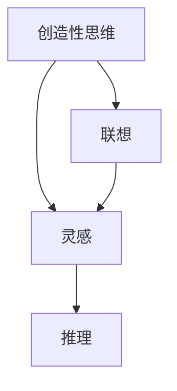
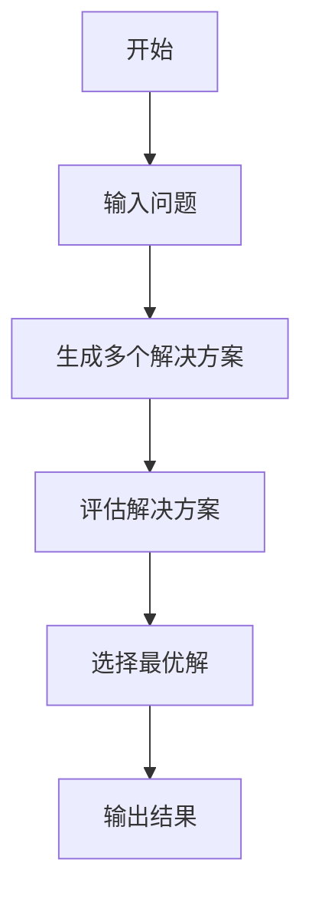
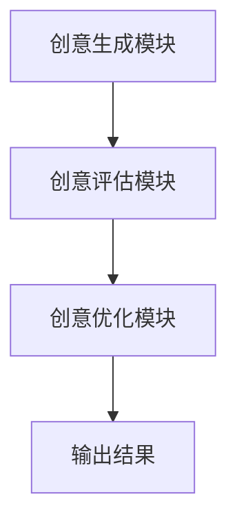
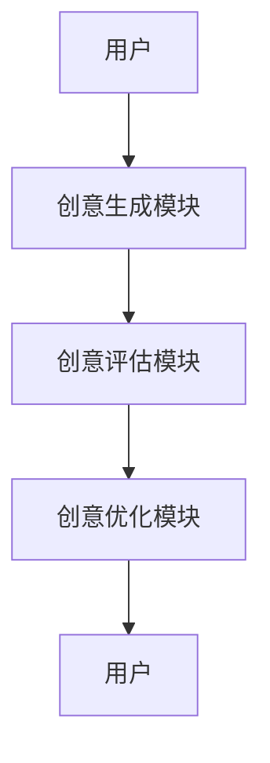

                 


# 创造性AI：激发AI Agent的创新思维

> 关键词：创造性AI，AI Agent，创新思维，创造性算法，AI系统架构，创造性思维模拟

> 摘要：本文将探讨如何激发AI Agent的创新思维，通过分析创造性思维的机制、算法实现、系统架构设计以及项目实战，帮助读者理解如何在AI系统中实现创造性思维。

---

# 第一部分: 创造性AI的背景与概念

## 第1章: 创造性AI的背景与定义

### 1.1 创造性思维的定义与特征

创造性思维是指一种不同于传统逻辑思维的思维方式，它强调创新性、独特性和多样性。与逻辑思维相比，创造性思维更注重从不同角度思考问题，寻找非传统的解决方案。

#### 1.1.1 创造性思维的定义
创造性思维是一种通过创新性思考和非传统方法解决问题的思维模式。它不仅包括对现有知识的整合，还包括对新想法的生成和验证。

#### 1.1.2 创造性思维的核心特征
- **多样性**：能够从多个角度看待问题。
- **独特性**：能够提出新颖的想法。
- **创新性**：能够突破常规，提出创新性的解决方案。

#### 1.1.3 创造性思维与逻辑思维的区别
| 特性         | 创造性思维                  | 逻辑思维                  |
|--------------|-----------------------------|---------------------------|
| 思维方式     | 非线性、发散性              | 线性、收敛性              |
| 解决问题方式 | 寻找新的解决方案            | 遵循已知规则和逻辑         |
| 应用场景     | 创新、设计、艺术            | 分析、计算、验证          |

### 1.2 AI Agent的基本概念

AI Agent是指具有自主决策能力和智能行为的计算机程序或系统。它能够感知环境、执行任务并根据需求进行调整。

#### 1.2.1 AI Agent的定义
AI Agent是一种能够感知环境、自主决策并执行任务的智能体。

#### 1.2.2 AI Agent的核心功能
- **感知环境**：通过传感器或数据输入获取环境信息。
- **自主决策**：基于获取的信息进行分析和决策。
- **执行任务**：根据决策结果执行相应的操作。

#### 1.2.3 AI Agent的应用场景
- 智能助手（如Siri、Alexa）
- 智能推荐系统
- 自动驾驶汽车

### 1.3 创造性AI的背景与意义

随着AI技术的快速发展，传统的基于逻辑的AI系统在处理复杂问题时逐渐暴露出其局限性。创造性思维的引入能够帮助AI系统在处理需要创新性和多样性的任务时表现出色。

#### 1.3.1 当前AI技术的局限性
- 难以处理非结构化问题
- 缺乏创造性思维能力
- 依赖于大量数据和规则

#### 1.3.2 创造性思维在AI中的重要性
- 提高AI系统的灵活性和适应性
- 增强AI系统在复杂问题中的处理能力
- 为AI系统提供更多的创新解决方案

#### 1.3.3 创造性AI的未来发展
创造性AI将在多个领域发挥重要作用，包括艺术创作、产品设计、科学研究等。随着技术的进步，创造性AI将变得更加智能化和人性化。

---

## 第2章: 创造性思维的机制与模型

### 2.1 创造性思维的机制

创造性思维的机制包括灵感的产生、联想与类比、推理与直觉等多个方面。

#### 2.1.1 灵感的产生
灵感是创造性思维的重要来源，它通常来源于外部刺激、经验积累和内心的感悟。

#### 2.1.2 联想与类比
联想是指通过事物之间的相似性建立联系，类比则是通过比较不同事物的相似性来寻找新的解决方案。

#### 2.1.3 推理与直觉
推理是基于已有的知识和逻辑进行推导，而直觉则是基于经验和潜意识的快速判断。

### 2.2 创造性思维的数学模型

创造性思维的数学模型可以通过概率论、图论等方法进行建模。

#### 2.2.1 创造性思维的数学表示
创造性思维可以表示为一个概率分布问题，其中每个想法的可能性由其创新性和可行性决定。

$$ P(idea) = \frac{创新性(idea) \times 可行性(idea)}{总可能性} $$

#### 2.2.2 创造性思维的计算模型
创造性思维的计算模型可以通过生成模型、推理算法和启发式搜索等方法进行模拟。

#### 2.2.3 创造性思维的评估指标
- 创新性
- 可行性
- 实用性

### 2.3 创造性思维与逻辑思维的对比分析

通过对比分析，我们可以更好地理解创造性思维的特点和优势。

#### 2.3.1 对比特征表
| 特性         | 创造性思维                  | 逻辑思维                  |
|--------------|-----------------------------|---------------------------|
| 思维方式     | 非线性、发散性              | 线性、收敛性              |
| 解决问题方式 | 寻找新的解决方案            | 遵循已知规则和逻辑         |
| 应用场景     | 创新、设计、艺术            | 分析、计算、验证          |

#### 2.3.2 创造性思维的ER实体关系图


---

## 第3章: 创造性AI的核心算法与实现

### 3.1 创造性思维的模拟算法

通过算法模拟创造性思维是实现创造性AI的关键。

#### 3.1.1 基于生成模型的创造性思维模拟
生成模型（如GAN、VAE）可以通过生成新的数据样本来模拟创造性思维。

#### 3.1.2 基于推理算法的创造性思维模拟
推理算法（如逻辑推理、因果推理）可以通过推理过程模拟创造性思维。

#### 3.1.3 基于启发式搜索的创造性思维模拟
启发式搜索算法（如A*算法）可以通过启发式函数模拟创造性思维。

### 3.2 创造性AI的算法实现

通过具体的算法实现，我们可以更好地理解创造性AI的核心思想。

#### 3.2.1 算法流程图


#### 3.2.2 算法实现代码
```python
import random

def generate_ideas():
    # 随机生成一些想法
    ideas = ["方案1", "方案2", "方案3"]
    return ideas

def evaluate_idea(idea):
    # 评估想法的创新性和可行性
    score = random.uniform(0, 1)
    return score

def select_best_idea(ideas):
    # 选择最佳想法
    scores = [evaluate_idea(idea) for idea in ideas]
    best_index = scores.index(max(scores))
    return ideas[best_index]

ideas = generate_ideas()
best_idea = select_best_idea(ideas)
print("最佳想法:", best_idea)
```

### 3.3 创造性思维的数学模型

通过数学模型，我们可以更精确地模拟创造性思维。

#### 3.3.1 创造性思维的数学模型
创造性思维的数学模型可以通过概率分布和生成模型进行表示。

$$ P(idea) = \frac{创新性(idea) \times 可行性(idea)}{总可能性} $$

#### 3.3.2 创造性思维的生成模型
生成模型（如GAN）可以通过对抗训练生成新的想法。

#### 3.3.3 创造性思维的评估指标
- 创新性
- 可行性
- 实用性

---

## 第4章: 创造性AI的系统架构与设计

### 4.1 系统功能设计

创造性AI系统的功能设计需要涵盖创意生成、创意评估、创意优化等多个方面。

#### 4.1.1 创意生成模块
创意生成模块负责生成新的想法和解决方案。

#### 4.1.2 创意评估模块
创意评估模块负责评估生成的想法的创新性和可行性。

#### 4.1.3 创意优化模块
创意优化模块负责优化生成的想法，使其更加可行和实用。

### 4.2 系统架构设计

通过系统架构设计，我们可以更好地理解创造性AI的整体结构。

#### 4.2.1 系统架构图


#### 4.2.2 系统接口设计
- 创意生成接口：接收问题描述，生成多个解决方案。
- 创意评估接口：评估每个解决方案的创新性和可行性。
- 创意优化接口：优化解决方案，输出最佳方案。

### 4.3 系统交互设计

通过系统交互设计，我们可以更好地理解用户与AI系统之间的互动过程。

#### 4.3.1 系统交互流程图


---

## 第5章: 创造性AI的项目实战

### 5.1 环境安装

为了实现创造性AI系统，我们需要安装以下环境和工具。

#### 5.1.1 环境要求
- Python 3.8+
- PyTorch或Keras
- Mermaid图生成工具

#### 5.1.2 工具安装
```bash
pip install torch
pip install mermaid
```

### 5.2 核心代码实现

通过具体的代码实现，我们可以更好地理解创造性AI的核心思想。

#### 5.2.1 创意生成模块实现
```python
import random

def generate_ideas(problem):
    # 随机生成一些想法
    ideas = [f"方案{i+1}" for i in range(5)]
    return ideas
```

#### 5.2.2 创意评估模块实现
```python
def evaluate_idea(idea):
    # 评估想法的创新性和可行性
    score = random.uniform(0, 1)
    return score
```

#### 5.2.3 创意优化模块实现
```python
def optimize_idea(idea):
    # 优化想法
    return f"优化后的{idea}"
```

### 5.3 案例分析

通过具体案例分析，我们可以更好地理解创造性AI的实际应用。

#### 5.3.1 案例背景
假设我们需要设计一个新的智能家居系统。

#### 5.3.2 案例实现
```python
problem = "设计一个新的智能家居系统"
ideas = generate_ideas(problem)
best_idea = select_best_idea(ideas)
optimized_idea = optimize_idea(best_idea)
print("最终优化方案:", optimized_idea)
```

#### 5.3.3 案例分析
通过上述代码实现，我们可以看到创造性AI在智能家居系统设计中的应用。

---

## 第6章: 总结与展望

### 6.1 总结

创造性AI是一种通过模拟创造性思维来实现创新解决方案的AI技术。通过本文的探讨，我们可以更好地理解创造性AI的核心思想和实现方法。

### 6.2 展望

随着技术的不断发展，创造性AI将在更多领域发挥重要作用。未来的研究方向包括更高效的创造性思维模拟算法、更智能的系统架构设计以及更广泛的应用场景探索。

---

# 结语

创造性AI是一个充满潜力的研究领域。通过本文的探讨，我们希望读者能够对创造性AI有一个全面的理解，并能够在实际应用中发挥创造性AI的优势。

作者：AI天才研究院/AI Genius Institute & 禅与计算机程序设计艺术 /Zen And The Art of Computer Programming

