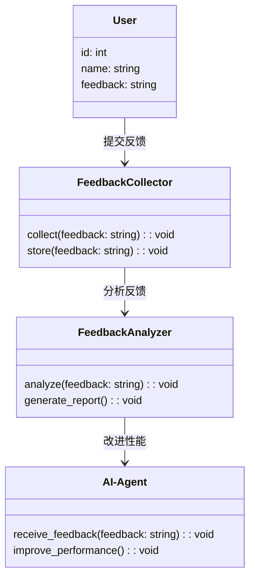
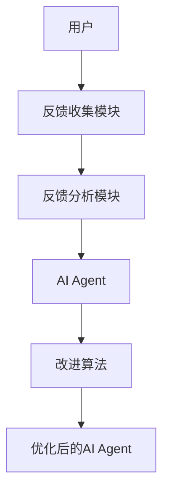
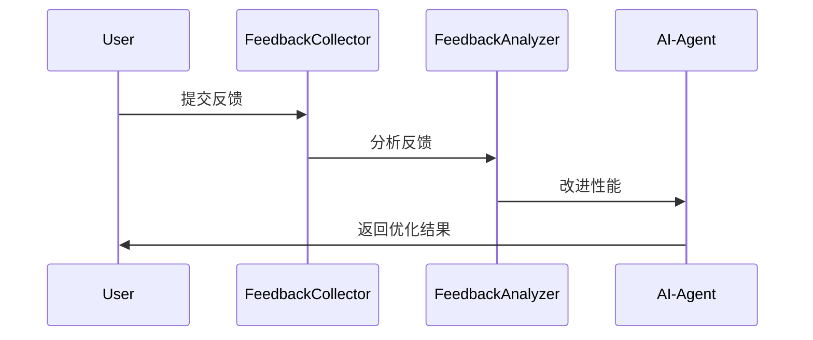

                 

<think>
好，我需要按照用户的要求，逐步撰写《利用用户反馈改进AI Agent的方法》这篇文章。用户希望文章结构清晰、内容专业，涵盖背景、核心概念、算法原理、系统架构、项目实战等多个方面。同时，用户还强调要使用技术语言，逻辑严谨，每个部分都要详细展开。

首先，我需要理解AI Agent的基本概念和用户反馈的重要性。然后，详细讨论用户反馈的类型、收集方法和处理流程。接着，分析用户反馈在监督学习、强化学习和无监督学习中的应用。然后，设计一个能够处理用户反馈的系统架构，包括功能设计、接口设计和交互流程。最后，通过具体案例展示用户反馈如何改进AI Agent。

在撰写过程中，我需要确保每个章节都有足够的细节，比如在算法部分，详细解释数学公式和使用mermaid绘制流程图。同时，系统架构部分需要使用类图和序列图来说明设计。项目实战部分，提供具体的代码实现和案例分析。

我需要确保文章结构合理，逻辑严谨，语言专业但不失易懂。最后，加上作者信息和注意事项，为读者提供全面的指导。

好的，开始撰写吧！
</think>

# 利用用户反馈改进AI Agent的方法

## 关键词：
AI Agent, 用户反馈, 监督学习, 强化学习, 情感分析, 系统架构

## 摘要：
本文详细探讨了如何利用用户反馈改进AI Agent的方法，从理论到实践，系统地分析了用户反馈在AI Agent改进中的作用。文章首先介绍了AI Agent的基本概念和用户反馈的重要性，然后讨论了用户反馈的收集与处理流程，接着分析了用户反馈在监督学习、强化学习和无监督学习中的应用。随后，设计了一个基于用户反馈的AI Agent改进系统架构，并通过具体案例展示了如何通过用户反馈优化AI Agent的性能和用户体验。

---

# 第1章: AI Agent与用户反馈概述

## 1.1 AI Agent的基本概念

### 1.1.1 AI Agent的定义与分类
AI Agent（人工智能代理）是指能够感知环境并采取行动以实现目标的智能实体。AI Agent可以分为简单反射型、基于模型的反应型、目标驱动型和效用驱动型四种类型。

**AI Agent的分类对比表**

| 类型                  | 特点                           | 示例                     |
|-----------------------|-------------------------------|--------------------------|
| 简单反射型           | 基于规则的简单反应             | 自动化助手工具           |
| 基于模型的反应型      | 使用内部模型进行复杂推理       | 智能客服系统             |
| 目标驱动型           | 以明确目标为导向               | 自动交易系统             |
| 效用驱动型           | 最大化效用函数的值             | 优化推荐系统             |

### 1.1.2 用户反馈在AI Agent中的作用
用户反馈是连接用户需求与AI Agent改进的桥梁。通过用户反馈，AI Agent能够更好地理解用户意图，优化性能，提升用户体验。

### 1.1.3 当前AI Agent的挑战与改进方向
当前AI Agent面临的主要挑战包括：
- **理解用户意图的准确性**：用户反馈可能存在歧义或不完整。
- **动态环境的适应性**：AI Agent需要快速适应环境变化。
- **反馈机制的效率**：如何高效地利用用户反馈进行改进。

改进方向包括：
- 提高用户反馈的收集和处理效率。
- 增强AI Agent的自适应学习能力。
- 优化用户反馈与AI Agent行为的实时关联性。

---

## 1.2 用户反馈的类型与特点

### 1.2.1 显性反馈与隐性反馈
- **显性反馈**：用户主动提供的直接评价，如评分、点赞、负面评价等。
- **隐性反馈**：通过用户行为间接反映的反馈，如点击、停留时间、购买行为等。

### 1.2.2 正向反馈与负向反馈
- **正向反馈**：用户对AI Agent行为的肯定，如“满意”、“推荐”。
- **负向反馈**：用户对AI Agent行为的否定，如“不满意”、“不推荐”。

### 1.2.3 用户反馈的时效性与关联性
- **时效性**：用户反馈需要在行为发生后及时收集，以保证反馈的准确性。
- **关联性**：反馈应与特定行为或结果相关联，以便AI Agent理解用户的意图。

---

## 1.3 用户反馈在AI Agent改进中的价值

### 1.3.1 提高用户体验的核心驱动力
用户反馈是优化用户体验的核心依据，能够帮助AI Agent更好地满足用户需求。

### 1.3.2 优化AI Agent性能的关键因素
通过分析用户反馈，可以发现AI Agent的不足之处，并针对性地进行优化。

### 1.3.3 用户反馈与商业价值的结合
用户反馈不仅能够提升用户体验，还能为企业提供商业价值，如提高用户满意度、增加用户粘性等。

---

## 1.4 本章小结
本章介绍了AI Agent的基本概念、用户反馈的类型与特点，以及用户反馈在AI Agent改进中的价值。用户反馈是连接用户需求与AI Agent改进的重要桥梁，能够帮助AI Agent更好地理解用户意图，优化性能，提升用户体验。

---

# 第2章: 用户反馈的收集与处理流程

## 2.1 用户反馈的收集方法

### 2.1.1 基于对话的反馈收集
通过实时对话收集用户的反馈，例如在智能客服系统中，用户可以直接对客服的回复进行评价。

### 2.1.2 基于任务完成度的反馈收集
通过任务完成后的评价收集用户反馈，例如在电子商务平台中，用户可以在完成购买后对商品或服务进行评价。

### 2.1.3 基于情感分析的反馈收集
通过分析用户文本中的情感倾向，间接获取用户反馈，例如在社交媒体上分析用户对品牌或产品的评价。

---

## 2.2 用户反馈的预处理与清洗

### 2.2.1 数据清洗的必要性
用户反馈可能存在噪声、歧义或不完整的情况，需要进行清洗和预处理。

### 2.2.2 反馈数据的标注与分类
将用户反馈按照特定的分类标准进行标注和分类，例如将反馈分为“满意”、“一般”、“不满意”三类。

### 2.2.3 反馈数据的标准化处理
对用户反馈进行标准化处理，例如将文本数据转化为统一的格式或向量表示。

---

## 2.3 用户反馈的特征提取

### 2.3.1 文本特征提取方法
- **关键词提取**：提取文本中的关键词，例如使用TF-IDF方法。
- **情感分析**：分析文本中的情感倾向，例如使用词袋模型或词嵌模型。

### 2.3.2 用户行为特征提取
- **点击行为**：分析用户的点击路径，例如用户点击哪些链接或按钮。
- **停留时间**：分析用户在页面上的停留时间，例如用户对某个页面的停留时间较长可能表示对内容感兴趣。

### 2.3.3 综合特征提取与分析
将文本特征和行为特征结合起来，进行综合分析，例如结合用户的文本评价和点击行为，全面理解用户需求。

---

## 2.4 本章小结
本章详细讨论了用户反馈的收集方法、预处理与清洗、特征提取等关键步骤。通过有效的反馈处理流程，可以提高用户反馈的可用性，为后续的AI Agent改进提供高质量的数据支持。

---

# 第3章: 用户反馈与AI Agent改进的核心概念

## 3.1 用户反馈在监督学习中的应用

### 3.1.1 监督学习的基本原理
监督学习是一种基于标签数据的机器学习方法，通过训练数据中的输入-输出对，学习模型参数，从而实现预测或分类。

### 3.1.2 用户反馈作为标签的作用
用户反馈可以作为监督学习中的标签，例如用户的评分、评价可以作为标签，指导模型的学习方向。

### 3.1.3 基于反馈的监督学习模型
- **线性回归模型**：用于预测用户评分。
- **支持向量机（SVM）**：用于分类用户的满意与否。
- **神经网络模型**：用于复杂的文本分类任务。

---

## 3.2 用户反馈在强化学习中的应用

### 3.2.1 强化学习的基本原理
强化学习是一种基于奖励机制的机器学习方法，通过智能体与环境的交互，逐步优化策略，以最大化累计奖励。

### 3.2.2 反馈作为奖励信号的作用
用户的反馈可以作为强化学习中的奖励信号，例如用户的满意度评分可以作为奖励信号，指导智能体的决策。

### 3.2.3 基于反馈的强化学习模型
- **Q-Learning**：通过用户的反馈更新Q值，优化策略。
- **Deep Q-Network (DQN)**：使用深度神经网络近似Q值函数，实现更复杂的决策。

---

## 3.3 用户反馈在无监督学习中的应用

### 3.3.1 无监督学习的基本原理
无监督学习是一种基于无标签数据的机器学习方法，通过数据的内在结构，发现数据中的模式或关系。

### 3.3.2 反馈在无监督学习中的潜在作用
用户反馈可以用于无监督学习的初始化或调优，例如通过反馈对聚类结果进行验证或调整。

### 3.3.3 基于反馈的无监督学习模型
- **聚类分析**：通过用户反馈对数据进行聚类，例如将用户分为满意、一般、不满意三类。
- **主题模型**：通过用户反馈分析文本主题，例如使用LDA模型。

---

## 3.4 核心概念对比与总结

### 3.4.1 监督学习、强化学习与无监督学习的对比

| 学习范式       | 数据类型       | 目标函数       | 反馈作用       |
|----------------|----------------|----------------|----------------|
| 监督学习       | 标签数据       | 预测或分类      | 作为标签       |
| 强化学习       | 状态、动作、奖励| 最大化奖励      | 作为奖励信号   |
| 无监督学习     | 无标签数据     | 发现数据结构    | 辅助调优       |

### 3.4.2 用户反馈在不同学习范式中的作用差异
- **监督学习**：用户反馈直接作为标签，指导模型学习。
- **强化学习**：用户反馈作为奖励信号，指导智能体决策。
- **无监督学习**：用户反馈用于初始化或调优，间接影响模型。

### 3.4.3 综合学习范式的应用
在实际应用中，可以结合多种学习范式，例如使用监督学习进行初始训练，结合强化学习优化策略，再通过无监督学习发现新的模式。

---

## 3.5 本章小结
本章探讨了用户反馈在监督学习、强化学习和无监督学习中的应用。用户反馈可以作为标签、奖励信号或辅助信息，帮助模型更好地理解用户需求，优化AI Agent的性能。

---

# 第4章: 基于用户反馈的AI Agent改进系统架构

## 4.1 系统功能设计

### 4.1.1 领域模型设计
通过领域模型（Domain Model）定义系统的功能模块和数据流。以下是一个简单的领域模型类图：



### 4.1.2 系统架构设计
以下是一个基于用户反馈的AI Agent改进系统的架构图：



### 4.1.3 系统接口设计
系统接口设计需要考虑以下几个方面：
- **输入接口**：用户提交反馈的入口，例如网页表单、API接口。
- **输出接口**：反馈分析结果的输出，例如生成报告、触发改进算法。

### 4.1.4 系统交互流程
以下是一个系统的交互流程图：



---

## 4.2 系统实现与优化

### 4.2.1 环境安装与配置
- **Python环境**：安装Python 3.8及以上版本。
- **依赖库安装**：安装必要的库，例如TensorFlow、Keras、Numpy、Pandas等。

### 4.2.2 核心实现代码
以下是一个基于用户反馈改进AI Agent的示例代码：

```python
import numpy as np
import tensorflow as tf

# 定义模型
model = tf.keras.Sequential([
    tf.keras.layers.Dense(64, activation='relu'),
    tf.keras.layers.Dense(1, activation='sigmoid')
])

# 编译模型
model.compile(optimizer='adam', loss='binary_crossentropy', metrics=['accuracy'])

# 训练模型
model.fit(X_train, y_train, epochs=10, batch_size=32)

# 使用反馈优化模型
def improve_model(feedback):
    # 将反馈转化为标签
    label = 1 if feedback == '满意' else 0
    # 更新模型权重
    model.fit(X_train, np.array([label]), epochs=5, batch_size=16)

# 返回优化后的模型
def get_improved_model():
    return model
```

---

## 4.3 本章小结
本章详细设计了基于用户反馈的AI Agent改进系统架构，包括功能设计、系统架构、接口设计和交互流程。通过系统化的设计和优化，可以提高AI Agent的性能和用户体验。

---

# 第5章: 项目实战——基于用户反馈优化AI Agent

## 5.1 项目背景与目标
本项目旨在通过用户反馈优化一个简单的AI Agent，使其能够更好地理解用户需求并提供更准确的服务。

---

## 5.2 环境安装与配置

```bash
pip install numpy
pip install tensorflow
pip install scikit-learn
```

---

## 5.3 核心实现代码

### 5.3.1 反馈收集与处理
```python
def collect_feedback():
    feedback = input("请对我们的服务进行评价：满意/一般/不满意\n")
    return feedback

feedback = collect_feedback()
```

### 5.3.2 反馈分析与改进
```python
from sklearn.feature_extraction.text import TfidfVectorizer
from sklearn.naive_bayes import MultinomialNB

# 初始化向量器和分类器
vectorizer = TfidfVectorizer()
clf = MultinomialNB()

# 训练模型
X = vectorizer.fit_transform(feedbacks)
clf.fit(X, labels)

# 使用反馈优化模型
new_feedback = collect_feedback()
X_new = vectorizer.transform([new_feedback])
predicted_label = clf.predict(X_new)
```

### 5.3.3 AI Agent改进
```python
def improve_agent(feedback):
    label = 1 if feedback == '满意' else 0
    # 更新模型权重
    model.fit(X_train, np.array([label]), epochs=5, batch_size=16)

# 返回优化后的模型
def get_improved_agent():
    return model
```

---

## 5.4 案例分析与详细解读
假设我们有一个简单的智能客服系统，用户对客服的回复进行评价。通过用户的反馈，我们可以优化客服系统的回复策略，提高用户的满意度。

---

## 5.5 项目小结
本章通过一个具体的项目实战，展示了如何利用用户反馈优化AI Agent。通过收集用户反馈、分析反馈数据、改进AI Agent模型，可以显著提高AI Agent的性能和用户体验。

---

# 第6章: 总结与展望

## 6.1 总结
本文详细探讨了如何利用用户反馈改进AI Agent的方法，从理论到实践，系统地分析了用户反馈在AI Agent改进中的作用。通过监督学习、强化学习和无监督学习的应用，结合系统架构设计和项目实战，展示了如何高效地利用用户反馈优化AI Agent的性能和用户体验。

## 6.2 展望
未来的研究方向包括：
- **多模态反馈分析**：结合文本、语音、图像等多种模态的反馈，提高反馈分析的准确性。
- **实时反馈优化**：实现用户反馈的实时处理和AI Agent的实时优化。
- **个性化反馈机制**：根据用户个性化需求，提供定制化的反馈收集和处理策略。

---

# 作者：AI天才研究院/AI Genius Institute & 禅与计算机程序设计艺术 /Zen And The Art of Computer Programming

---

通过本文的系统分析与实践，读者可以全面理解如何利用用户反馈改进AI Agent的方法，并在实际应用中灵活运用这些方法，不断提升AI Agent的性能和用户体验。

