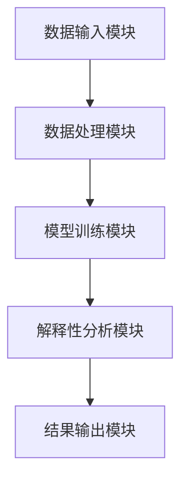

                 


# 可解释性设计：理解AI Agent的决策过程

## 关键词：可解释性设计、AI Agent、决策过程、解释性模型、LIME、SHAP

## 摘要：  
在人工智能快速发展的今天，AI Agent（智能体）在各个领域的应用越来越广泛。然而，AI Agent的决策过程往往缺乏透明度和可解释性，这不仅影响了用户对AI系统的信任，还可能导致决策错误难以追溯和修正。因此，可解释性设计成为了AI发展的重要方向。本文从可解释性设计的基本概念出发，深入分析AI Agent的决策过程，探讨如何通过解释性模型实现决策过程的透明化，并结合具体案例，展示可解释性设计在实际应用中的价值和挑战。通过本文的阅读，读者可以全面理解可解释性设计的核心原理和实现方法，掌握如何在实际项目中应用这些技术，从而推动AI Agent的决策过程更加透明、可靠和可信赖。

---

## 第一部分: 可解释性设计基础

## 第1章: 可解释性设计概述

### 1.1 可解释性设计的定义与背景

#### 1.1.1 什么是可解释性设计
可解释性设计是指在设计和实现人工智能系统时，确保系统的行为和决策过程能够被人类理解和解释。通过可解释性设计，用户可以清晰地理解AI系统是如何做出决策的，从而增强系统的透明度和可信度。

#### 1.1.2 可解释性设计的重要性
随着AI技术的广泛应用，人们越来越依赖AI系统做出决策。然而，许多AI系统（如深度神经网络）由于其复杂性，决策过程往往难以解释。这不仅影响了用户的信任，还可能导致决策错误无法追溯和修正。因此，可解释性设计在以下几个方面具有重要意义：
1. **提高用户信任**：通过透明的决策过程，用户可以信任AI系统的决策。
2. **支持决策审查**：可解释性设计为决策审查提供了基础，帮助发现和修正错误。
3. **促进跨学科协作**：可解释性设计为不同领域的专家提供了共同理解AI决策过程的桥梁。

#### 1.1.3 AI Agent决策过程的复杂性
AI Agent的决策过程通常涉及复杂的算法和大量数据，其复杂性主要体现在以下几个方面：
1. **高维数据空间**：AI Agent需要处理大量高维数据，导致决策过程难以直观理解。
2. **非线性关系**：AI Agent的决策往往基于复杂的非线性关系，这使得决策过程难以分解和解释。
3. **模糊性和不确定性**：AI Agent需要在不确定性和模糊性中做出决策，这进一步增加了决策过程的复杂性。

---

### 1.2 可解释性设计的核心概念

#### 1.2.1 解释性模型的分类
解释性模型是实现可解释性设计的核心工具，常见的解释性模型可以分为以下几类：
1. **基于规则的解释性模型**：通过预定义的规则解释AI决策过程。例如，基于决策树的解释性模型。
2. **基于特征重要性的解释性模型**：通过分析特征对决策的影响程度来解释AI决策过程。例如，基于LIME或SHAP的解释性模型。
3. **基于模拟的解释性模型**：通过模拟AI决策过程来解释其行为。例如，基于反事实分析的解释性模型。

#### 1.2.2 可解释性与不可解释性模型的对比
| 特性                | 可解释性模型                                | 不可解释性模型                              |
|---------------------|-------------------------------------------|-------------------------------------------|
| **透明度**          | 高                                         | 低                                         |
| **可解释性**         | 易于理解和解释                             | 难以理解和解释                             |
| **计算效率**         | 较低                                       | 较高                                       |
| **准确性**           | 可能较低                                   | 高                                         |
| **应用场景**         | 适用于需要解释性的场景                     | 适用于不需要解释性的场景                   |

#### 1.2.3 可解释性设计的目标与边界
可解释性设计的目标是通过解释性模型，使AI决策过程更加透明和可理解。其边界在于，可解释性设计并不是为了完全消除AI的复杂性，而是为了在保证决策准确性的前提下，提供一种可理解的解释方式。

---

### 1.3 可解释性设计的实现路径

#### 1.3.1 从数据到决策的可解释性
AI Agent的决策过程可以看作是一个从数据到决策的转换过程。通过可解释性设计，我们可以分解这一过程，分析每个步骤的输入、输出和转换规则，从而实现决策过程的可解释性。

#### 1.3.2 模型的可解释性评估标准
为了评估模型的可解释性，我们可以从以下几个方面进行考量：
1. **解释的清晰度**：解释是否清晰易懂。
2. **解释的完整性**：解释是否涵盖了所有关键因素。
3. **解释的准确性**：解释是否准确反映了模型的决策过程。

#### 1.3.3 可解释性设计的伦理与法律考量
可解释性设计不仅仅是技术问题，还涉及到伦理和法律问题。例如，如何在保护用户隐私的同时，提供足够的解释性；如何在法律纠纷中，利用可解释性设计提供决策依据等。

---

### 1.4 本章小结
本章从可解释性设计的基本概念出发，分析了其重要性、核心概念以及实现路径。通过对比可解释性与不可解释性模型，明确了可解释性设计的目标和边界，并探讨了其实现路径中的关键问题。

---

## 第2章: AI Agent决策过程的复杂性

### 2.1 AI Agent的基本概念

#### 2.1.1 什么是AI Agent
AI Agent（智能体）是指能够感知环境、自主决策并执行任务的智能系统。AI Agent可以是软件程序，也可以是物理机器人，其核心目标是通过感知和行动来实现特定任务。

#### 2.1.2 AI Agent的分类与应用场景
AI Agent可以分为以下几类：
1. **简单反射型智能体**：基于简单的规则做出反应。
2. **基于模型的反射型智能体**：基于环境模型做出决策。
3. **目标驱动型智能体**：基于目标驱动决策。
4. **效用驱动型智能体**：基于效用函数驱动决策。

AI Agent的应用场景包括：自动驾驶、智能助手、推荐系统、医疗诊断等。

#### 2.1.3 AI Agent决策过程的特点
AI Agent的决策过程通常具有以下特点：
1. **实时性**：决策过程需要在有限时间内完成。
2. **不确定性**：决策过程需要在不确定性和模糊性中进行。
3. **动态性**：环境和条件可能会动态变化，需要实时调整决策。

---

### 2.2 AI Agent决策过程的复杂性分析

#### 2.2.1 高维数据空间的挑战
AI Agent需要处理大量高维数据，这使得决策过程难以直观理解。例如，在图像识别任务中，AI Agent需要处理数百万个像素，每个像素都可能对最终决策产生影响。

#### 2.2.2 非线性关系的复杂性
AI Agent的决策过程通常基于复杂的非线性关系。例如，在自然语言处理任务中，AI Agent需要理解词语之间的复杂关系，这些关系往往是非线性的。

#### 2.2.3 模糊性和不确定性的影响
AI Agent需要在模糊性和不确定性中做出决策。例如，在医疗诊断中，AI Agent需要在有限的信息和模糊的症状中做出诊断决策。

---

### 2.3 可解释性设计在AI Agent中的必要性

#### 2.3.1 提高用户信任度
通过可解释性设计，AI Agent的决策过程可以被用户理解和信任，从而增强用户对AI系统的信任。

#### 2.3.2 支持决策审查与优化
可解释性设计为AI Agent的决策过程提供了审查和优化的基础，帮助发现和修正决策错误。

#### 2.3.3 促进跨学科协作
可解释性设计为不同领域的专家提供了共同理解AI决策过程的桥梁，从而促进跨学科协作。

---

### 2.4 本章小结
本章分析了AI Agent决策过程的复杂性，并探讨了可解释性设计在其中的必要性。通过分析高维数据空间、非线性关系和模糊性等挑战，明确了可解释性设计在AI Agent中的重要性。

---

## 第3章: 可解释性设计的核心原理

### 3.1 可解释性模型的原理

#### 3.1.1 解释性模型的特征
解释性模型具有以下特征：
1. **可理解性**：模型的行为和决策过程可以被人类理解。
2. **可解释性**：模型的决策过程可以被清晰地解释。
3. **可操作性**：模型的解释可以被用于实际操作和决策。

#### 3.1.2 解释性模型的数学基础
解释性模型的数学基础通常包括线性回归、树模型等简单模型。这些模型具有良好的可解释性，但可能在复杂性和准确性上有所不足。

#### 3.1.3 解释性模型的实现方法
解释性模型的实现方法包括：
1. **基于规则的解释**：通过预定义的规则解释模型决策过程。
2. **基于特征重要性的解释**：通过分析特征对决策的影响程度解释模型决策过程。
3. **基于模拟的解释**：通过模拟模型决策过程解释其行为。

---

### 3.2 解释性模型与可解释性设计的关系

#### 3.2.1 解释性模型在可解释性设计中的作用
解释性模型是实现可解释性设计的核心工具，通过解释性模型，我们可以理解AI Agent的决策过程，并将其转化为人类可理解的形式。

#### 3.2.2 解释性模型的选择与优化
在选择解释性模型时，需要综合考虑模型的可解释性、准确性和计算效率。通常，简单的模型（如线性回归）具有较高的可解释性，但准确性和复杂性可能不足；复杂的模型（如深度神经网络）具有较高的准确性和复杂性，但可解释性较差。

#### 3.2.3 解释性模型的评估与验证
为了验证解释性模型的有效性，我们需要从以下几个方面进行评估：
1. **解释的清晰度**：解释是否清晰易懂。
2. **解释的完整性**：解释是否涵盖了所有关键因素。
3. **解释的准确性**：解释是否准确反映了模型的决策过程。

---

### 3.3 可解释性设计的数学模型

#### 3.3.1 解释性模型的数学表达
解释性模型的数学表达通常比较简单，例如：
- 线性回归模型：$y = \beta_0 + \beta_1x_1 + \beta_2x_2 + \dots + \beta_nx_n$
- 决策树模型：通过树状结构表示决策规则。

#### 3.3.2 可解释性设计的优化算法
为了实现可解释性设计，我们需要在模型的准确性和可解释性之间进行权衡。一种常见的优化算法是逐步优化法，通过逐步优化模型的可解释性和准确性，找到最佳平衡点。

---

### 3.4 本章小结
本章从可解释性设计的核心原理出发，分析了解释性模型的特征、数学基础和实现方法，并探讨了其在可解释性设计中的作用。通过对比不同解释性模型的优缺点，明确了在实际应用中如何选择和优化解释性模型。

---

## 第4章: 可解释性设计的算法原理

### 4.1 解释性模型的算法选择

#### 4.1.1 LIME算法
LIME（Local Interpretable Model-agnostic Explanations）是一种常用的解释性算法，它通过在局部数据上训练简单的解释性模型，来解释复杂模型的决策过程。LIME的实现步骤如下：
1. 对复杂模型的输出进行采样。
2. 在局部数据上训练简单的解释性模型。
3. 输出解释结果。

#### 4.1.2 SHAP值
SHAP（Shapley Additive exPlanations）是一种基于Shapley值的解释性算法，它通过计算每个特征对模型输出的贡献值，来解释模型的决策过程。SHAP值的计算公式如下：
$$ SHAP\_value = \sum_{i=1}^{n} \phi_i $$
其中，$\phi_i$表示第i个特征对模型输出的贡献值。

#### 4.1.3 其他解释性算法
除了LIME和SHAP，还有其他解释性算法，例如：
- **TreeSHAP**：基于树模型的SHAP值计算方法。
- **ALE**（Accumulated Local Explanations）：通过累加特征对模型输出的影响来解释模型决策过程。

---

### 4.2 解释性模型的实现步骤

#### 4.2.1 数据预处理
在实现解释性模型之前，需要对数据进行预处理，包括：
1. **数据清洗**：去除缺失值和异常值。
2. **数据归一化**：将数据归一化到同一范围内。
3. **特征选择**：选择对模型输出影响较大的特征。

#### 4.2.2 模型训练与评估
训练解释性模型并评估其准确性和可解释性：
1. **训练解释性模型**：使用预处理后的数据训练解释性模型。
2. **评估模型性能**：通过准确率、召回率等指标评估模型性能。

#### 4.2.3 解释性模型的生成与验证
生成解释性模型并验证其解释性：
1. **生成解释性结果**：通过解释性模型生成解释性结果。
2. **验证解释性结果**：通过对比复杂模型和解释性模型的输出，验证解释性结果的准确性。

---

### 4.3 解释性模型的数学推导

#### 4.3.1 LIME算法的数学推导
LIME算法的核心思想是通过局部线性近似来解释复杂模型的决策过程。具体步骤如下：
1. 对复杂模型的输出进行采样，得到局部数据集。
2. 在局部数据集上训练线性回归模型。
3. 输出线性回归模型的系数，解释复杂模型的决策过程。

#### 4.3.2 SHAP值的计算过程
SHAP值的计算过程基于Shapley值的理论，具体步骤如下：
1. 计算每个特征对模型输出的贡献值。
2. 累加所有特征的贡献值，得到最终的SHAP值。

---

### 4.4 本章小结
本章详细介绍了可解释性设计中常用的解释性算法，包括LIME和SHAP，并探讨了其实现步骤和数学推导。通过对比不同解释性算法的优缺点，明确了在实际应用中如何选择和优化解释性算法。

---

## 第5章: 可解释性设计的系统架构

### 5.1 系统功能设计

#### 5.1.1 系统功能需求
可解释性设计系统需要实现以下功能：
1. **数据预处理**：对输入数据进行清洗和归一化。
2. **模型训练**：训练可解释性模型。
3. **解释性分析**：生成和验证解释性结果。

#### 5.1.2 系统功能流程
系统功能流程如下：
1. 用户输入数据。
2. 系统对数据进行预处理。
3. 系统训练可解释性模型。
4. 系统生成解释性结果。
5. 用户验证解释性结果。

---

### 5.2 系统架构设计

#### 5.2.1 系统架构概述
可解释性设计系统的架构通常包括以下几个部分：
1. **数据输入模块**：接收输入数据。
2. **数据处理模块**：对数据进行预处理。
3. **模型训练模块**：训练可解释性模型。
4. **解释性分析模块**：生成和验证解释性结果。
5. **结果输出模块**：输出解释性结果。

#### 5.2.2 系统架构图


---

### 5.3 系统接口设计

#### 5.3.1 系统接口描述
可解释性设计系统的接口通常包括：
1. **输入接口**：接收输入数据。
2. **输出接口**：输出解释性结果。
3. **控制接口**：控制系统的运行和停止。

#### 5.3.2 系统接口流程
系统接口流程如下：
1. 用户通过输入接口输入数据。
2. 系统通过控制接口启动数据处理模块。
3. 数据处理模块对数据进行预处理。
4. 模型训练模块训练可解释性模型。
5. 解释性分析模块生成解释性结果。
6. 结果输出模块通过输出接口输出解释性结果。

---

### 5.4 本章小结
本章从系统功能和架构的角度，详细介绍了可解释性设计系统的实现过程。通过系统架构图和接口设计，明确了系统的各个部分如何协作，从而实现可解释性设计的目标。

---

## 第6章: 可解释性设计的项目实战

### 6.1 项目环境安装

#### 6.1.1 安装Python环境
安装Python 3.8及以上版本，并安装必要的库：
```bash
pip install python>=3.8
pip install scikit-learn
pip install lime
pip install shap
```

#### 6.1.2 安装Jupyter Notebook
安装Jupyter Notebook用于代码实现和结果展示：
```bash
pip install jupyter
```

---

### 6.2 项目核心实现

#### 6.2.1 数据预处理
```python
import pandas as pd
import numpy as np

# 加载数据
data = pd.read_csv('data.csv')

# 数据清洗
data.dropna(inplace=True)

# 数据归一化
from sklearn.preprocessing import StandardScaler
scaler = StandardScaler()
data_normalized = scaler.fit_transform(data)
```

#### 6.2.2 模型训练
```python
from sklearn.ensemble import RandomForestClassifier
from sklearn.model_selection import train_test_split

# 划分训练集和测试集
X_train, X_test, y_train, y_test = train_test_split(data_normalized, data['label'], test_size=0.2)

# 训练随机森林模型
model = RandomForestClassifier()
model.fit(X_train, y_train)
```

#### 6.2.3 解释性分析
```python
from lime lime import Lime
from shap explainer import Explainer

# 使用LIME解释模型
explainer = Lime(model, feature_names=data.columns)
explanation = explainer.explain_instance(X_test[0], y_test[0], top_labels=1)

# 使用SHAP解释模型
shap_explainer = Explainer(model, data_normalized)
shap_values = shap_explainer.shap_values(X_test[0])
```

---

### 6.3 项目案例分析

#### 6.3.1 数据分析
假设我们有一个分类任务，目标是预测用户是否会购买某商品。通过可解释性设计，我们可以分析每个特征对预测结果的影响。

#### 6.3.2 模型分析
通过LIME和SHAP解释性模型，我们可以分析每个特征对模型输出的贡献值，从而理解模型的决策过程。

#### 6.3.3 结果分析
通过对比复杂模型和解释性模型的输出，我们可以验证解释性结果的准确性，并发现可能存在的决策错误。

---

### 6.4 项目总结
通过本项目，我们实现了可解释性设计的核心功能，包括数据预处理、模型训练和解释性分析。通过对比不同解释性算法的优缺点，明确了在实际应用中如何选择和优化解释性算法。

---

## 第7章: 可解释性设计的最佳实践

### 7.1 最佳实践 tips

#### 7.1.1 解释性模型的选择
在选择解释性模型时，需要综合考虑模型的可解释性、准确性和计算效率。

#### 7.1.2 数据预处理的重要性
数据预处理是实现可解释性设计的关键步骤，需要仔细清洗和归一化数据。

#### 7.1.3 解释性结果的验证
解释性结果需要通过对比复杂模型和解释性模型的输出进行验证，确保解释性结果的准确性和可靠性。

---

### 7.2 小结
可解释性设计是实现透明和可信AI系统的重要手段，通过本文的分析和实践，我们掌握了可解释性设计的核心原理和实现方法。

---

### 7.3 注意事项
1. **数据隐私保护**：在处理用户数据时，需要注意数据隐私保护，避免数据泄露。
2. **模型的可解释性与准确性**：在实现可解释性设计时，需要在模型的可解释性和准确性之间进行权衡。
3. **解释性结果的可视化**：通过可视化工具，可以更直观地展示解释性结果，帮助用户理解和信任AI系统的决策过程。

---

### 7.4 拓展阅读
1. **《可解释的人工智能：模型、方法与应用》**：系统介绍可解释性设计的核心理论和应用。
2. **《LIME: Interpretable Machine Learning with Python》**：详细讲解LIME算法的实现和应用。
3. **《SHAP值：从理论到实践》**：深入分析SHAP值的计算方法和实际应用。

---

## 作者：AI天才研究院/AI Genius Institute & 禅与计算机程序设计艺术 /Zen And The Art of Computer Programming

---

**（全文完）**

