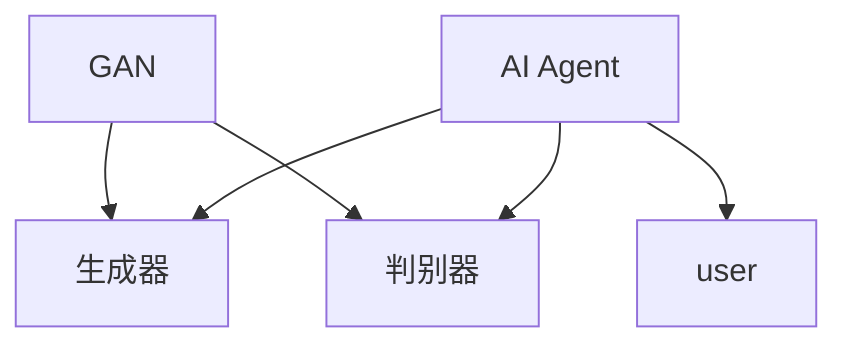

                 

<think>
好的，我现在要写一篇关于《基于GAN的AI Agent创造性内容生成》的技术博客文章。首先，我需要理清文章的结构和每个部分的内容。

首先，我得明确文章的核心主题，就是将生成对抗网络（GAN）应用到AI Agent中，使其能够生成创造性内容。这涉及到GAN的原理和AI Agent的设计，以及两者如何结合来实现内容生成。

接下来，我需要规划文章的结构。用户已经提供了一个详细的目录大纲，我需要按照这个大纲来填充内容。首先，是背景介绍与核心概念，包括问题背景、核心概念和问题解决。这部分需要解释为什么创造性内容生成是一个挑战，GAN和AI Agent各自的作用，以及它们如何结合。

然后是GAN的核心原理，这部分需要详细讲解GAN的基本架构，包括生成器和判别器，以及它们的数学模型和训练过程。这部分可能需要一些数学公式的插入，比如生成器和判别器的损失函数。

接下来是AI Agent的设计与实现，这部分需要讨论状态表示、动作选择、奖励机制，以及如何将这些概念应用到创造性内容生成中。可能还需要一些图表来展示系统架构和流程。

然后是GAN与AI Agent的结合，这部分需要具体说明GAN如何被AI Agent用于生成内容，可能包括联合学习框架和反馈机制。

接下来是系统分析与架构设计，这部分需要介绍系统的功能设计、架构图、接口设计和交互流程。这部分可能需要用Mermaid图来展示系统结构。

然后是项目实战，包括环境配置、核心代码实现、案例分析和项目小结。这部分需要提供实际的代码示例，帮助读者理解如何实现。

最后是优化与扩展，讨论模型的优化、多模态生成、模型压缩和部署，以及实际应用中的挑战。

总结与展望部分，需要回顾整书内容，总结关键点，并展望未来的研究方向。

在撰写过程中，我需要确保每个部分都详细具体，使用清晰的逻辑和专业的技术语言。同时，要使用Mermaid图和数学公式来增强理解。我还需要注意文章的整体连贯性，确保各个章节之间有良好的过渡。

可能遇到的困难包括如何将复杂的数学公式和系统架构用简单易懂的方式表达出来。为了克服这一点，我可以使用图表和分步解释，帮助读者理解。

另外，我需要确保每个部分的小结能够总结关键点，帮助读者巩固所学内容。同时，加入一些最佳实践的提示，可以为读者提供实用的建议。

总的来说，我需要按照用户提供的大纲，逐步填充内容，确保每个章节都详细且逻辑清晰。通过这样的思考过程，我可以系统地完成这篇文章的撰写。
</think>

# 基于GAN的AI Agent创造性内容生成

> 关键词：生成对抗网络（GAN）、AI Agent、创造性内容生成、深度学习、强化学习

> 摘要：本文探讨了如何利用生成对抗网络（GAN）构建AI Agent，使其能够生成创造性内容。通过分析GAN的原理、AI Agent的设计，以及它们的结合方式，本文详细阐述了如何在创造性内容生成中应用这些技术。文章从理论到实践，系统地介绍了基于GAN的AI Agent的设计与实现，并通过实际案例展示了其应用前景。

---

# 第一部分: 基于GAN的AI Agent创造性内容生成概述

## 第1章: 背景介绍与核心概念

### 1.1 问题背景

创造性内容生成是人工智能领域的重要任务，旨在通过算法生成文本、图像、音乐等具有创造性的内容。然而，传统的生成方法往往受限于数据分布的覆盖范围，难以生成多样化和高质量的内容。

#### 1.1.1 创造性内容生成的挑战

- **多样性不足**：传统生成模型可能无法覆盖所有可能的内容组合。
- **质量控制**：生成的内容可能缺乏创意或不符合预期。
- **用户互动性**：生成过程通常缺乏与用户的实时互动。

#### 1.1.2 GAN在创造性内容生成中的作用

生成对抗网络（GAN）通过生成器和判别器的对抗训练，能够在生成过程中逐步提升生成内容的质量和多样性。GAN的优势在于其能够学习数据的分布，并生成逼真的样本。

#### 1.1.3 AI Agent在创造性内容生成中的优势

AI Agent作为智能代理，能够根据用户的反馈实时调整生成策略，提供更加个性化的生成服务。通过结合GAN的强大生成能力，AI Agent能够实现动态、互动的创造性内容生成。

### 1.2 核心概念与联系

#### 1.2.1 GAN的基本原理

GAN由生成器和判别器组成，生成器通过对抗判别器生成高质量的样本。判别器的目标是区分真实数据和生成数据，而生成器的目标是欺骗判别器，使其无法区分真实数据和生成数据。

#### 1.2.2 AI Agent的定义与功能

AI Agent是一种智能系统，能够感知环境、执行任务并根据反馈调整行为。在创造性内容生成中，AI Agent可以作为生成器的控制器，实时调整生成策略。

#### 1.2.3 GAN与AI Agent的结合

通过将AI Agent作为生成器的控制器，我们可以实现动态的生成过程。AI Agent可以根据用户的反馈实时调整生成器的参数，从而生成更加符合用户需求的内容。

### 1.3 问题描述与解决

#### 1.3.1 创造性内容生成的核心问题

创造性内容生成的核心问题在于如何平衡生成内容的多样性和质量，同时实现与用户的实时互动。

#### 1.3.2 GAN在解决创造性内容生成中的应用

通过GAN，我们可以生成高质量且多样化的数据。AI Agent可以根据用户的反馈实时调整生成策略，从而实现动态生成。

#### 1.3.3 AI Agent在创造性内容生成中的具体实现

AI Agent通过与生成器的交互，实时调整生成策略，实现动态生成。

### 1.4 本章小结

本章介绍了创造性内容生成的挑战，以及GAN和AI Agent在其中的作用。通过结合GAN和AI Agent，我们可以实现动态、互动的创造性内容生成。

---

## 第2章: GAN的算法原理

### 2.1 GAN的基本架构

GAN由生成器和判别器组成，生成器通过对抗判别器生成高质量的样本。判别器的目标是区分真实数据和生成数据，而生成器的目标是欺骗判别器，使其无法区分真实数据和生成数据。

#### 2.1.1 生成器网络

生成器是一个深度神经网络，其输入是随机噪声，输出是生成的样本。生成器的目标是生成能够欺骗判别器的样本。

#### 2.1.2 判别器网络

判别器也是一个深度神经网络，其输入是样本，输出是样本是真实还是生成的概率。判别器的目标是尽可能区分真实样本和生成样本。

#### 2.1.3 GAN的损失函数

生成器的损失函数为：
$$ \mathcal{L}_G = -\mathbb{E}_{z \sim p_z}[\log(1 - D(G(z)))] $$

判别器的损失函数为：
$$ \mathcal{L}_D = -\mathbb{E}_{x \sim p_{data}}[\log(D(x))] - \mathbb{E}_{z \sim p_z}[\log(1 - D(G(z)))] $$

### 2.2 GAN的训练过程

#### 2.2.1 最小化最大化游戏

GAN的训练过程是一个最小化最大化游戏，生成器和判别器交替优化各自的损失函数。

#### 2.2.2 梯度下降与优化策略

通常使用梯度下降法优化生成器和判别器的参数。生成器和判别器的更新步骤如下：

1. 更新判别器参数：
$$ D \leftarrow D - \eta_D \frac{\partial \mathcal{L}_D}{\partial D} $$
2. 更新生成器参数：
$$ G \leftarrow G - \eta_G \frac{\partial \mathcal{L}_G}{\partial G} $$

其中，$\eta_D$ 和 $\eta_G$ 分别是判别器和生成器的学习率。

#### 2.2.3 训练中的挑战与解决方案

- **模式坍缩**：生成器可能无法生成多样化的样本。
  - 解决方案：使用改进的GAN变体，如Wasserstein GAN（WGAN）。
- **梯度消失**：生成器和判别器的梯度可能过小。
  - 解决方案：使用Relu激活函数或其他激活函数。

### 2.3 GAN的数学模型

#### 2.3.1 生成器的损失函数

生成器的损失函数为：
$$ \mathcal{L}_G = -\mathbb{E}_{z \sim p_z}[\log(1 - D(G(z)))] $$

#### 2.3.2 判别器的损失函数

判别器的损失函数为：
$$ \mathcal{L}_D = -\mathbb{E}_{x \sim p_{data}}[\log(D(x))] - \mathbb{E}_{z \sim p_z}[\log(1 - D(G(z)))] $$

### 2.4 本章小结

本章详细介绍了GAN的基本架构、训练过程和数学模型，为后续章节奠定了理论基础。

---

## 第3章: AI Agent的设计与实现

### 3.1 状态表示

#### 3.1.1 创造性内容生成的状态空间

AI Agent的状态空间包括生成器的状态和用户的反馈状态。生成器的状态可能包括当前生成的样本和生成器的参数，用户的反馈状态包括用户的评价和偏好。

#### 3.1.2 状态的特征提取与表示方法

可以通过将生成的样本转换为特征向量来表示状态。例如，对于图像生成，可以提取图像的特征向量作为状态表示。

### 3.2 动作选择

#### 3.2.1 动作空间的定义

动作空间包括生成器的参数调整和生成策略的选择。例如，可以调整生成器的噪声分布或改变生成器的网络结构。

#### 3.2.2 动作选择的策略

可以通过强化学习的方法训练AI Agent的动作选择策略。例如，使用深度Q网络（DQN）来选择最佳的动作。

### 3.3 奖励机制

#### 3.3.1 奖励函数的设计

奖励函数需要根据生成内容的质量和用户的反馈设计。例如，可以根据生成内容的创新性和相关性设计奖励函数。

#### 3.3.2 奖励信号的传递与优化

奖励信号可以通过反向传播算法优化生成器和判别器的参数。例如，使用策略梯度法（Policy Gradient）优化生成器的动作选择策略。

### 3.4 本章小结

本章介绍了AI Agent的状态表示、动作选择和奖励机制，为后续章节的系统设计奠定了基础。

---

## 第4章: GAN与AI Agent的结合

### 4.1 GAN用于创造性内容生成的原理

通过结合GAN和AI Agent，我们可以实现动态的生成过程。AI Agent可以根据用户的反馈实时调整生成策略，从而生成更加符合用户需求的内容。

#### 4.1.1 联合学习框架

联合学习框架包括生成器、判别器和AI Agent三部分。生成器和判别器通过GAN的对抗训练生成高质量样本，AI Agent通过与生成器的交互实时调整生成策略。

#### 4.1.2 反馈机制

反馈机制包括生成器的反馈和用户的反馈。生成器的反馈用于优化生成策略，用户的反馈用于调整生成方向。

### 4.2 GAN与AI Agent的联合优化

#### 4.2.1 多目标优化

通过多目标优化，可以在生成质量、生成多样性和用户满意度之间找到平衡。

#### 4.2.2 联合训练策略

可以通过联合训练生成器、判别器和AI Agent，实现系统的整体优化。

### 4.3 本章小结

本章介绍了GAN与AI Agent的结合方式，以及如何通过联合优化实现动态生成。

---

## 第5章: 系统分析与架构设计

### 5.1 系统功能设计

#### 5.1.1 功能模块划分

系统包括生成器模块、判别器模块和AI Agent模块。生成器模块负责生成样本，判别器模块负责区分真实样本和生成样本，AI Agent模块负责与生成器和用户的交互。

#### 5.1.2 功能流程设计

生成器生成样本，判别器对样本进行分类，AI Agent根据分类结果和用户反馈调整生成策略。

### 5.2 系统架构设计

#### 5.2.1 系统架构图



### 5.3 系统接口设计

#### 5.3.1 系统接口描述

- **生成接口**：AI Agent调用生成器生成样本。
- **判别接口**：AI Agent调用判别器对样本进行分类。
- **反馈接口**：AI Agent接收用户的反馈并调整生成策略。

#### 5.3.2 接口交互流程

1. AI Agent调用生成器生成样本。
2. 判别器对生成样本进行分类。
3. AI Agent接收用户的反馈。
4. AI Agent根据反馈调整生成策略。

### 5.4 本章小结

本章详细介绍了系统的功能设计和架构设计，为后续章节的实现提供了指导。

---

## 第6章: 项目实战

### 6.1 环境配置

#### 6.1.1 环境需求

- **硬件需求**：建议使用GPU加速训练。
- **软件需求**：安装Python、TensorFlow、Keras等深度学习框架。

### 6.2 核心代码实现

#### 6.2.1 生成器实现

```python
import tensorflow as tf
from tensorflow.keras import layers

def make_generator_model():
    model = tf.keras.Sequential()
    model.add(layers.Dense(256, activation='relu', input_shape=(100,)))
    model.add(layers.Dense(512, activation='relu'))
    model.add(layers.Dense(784, activation='sigmoid'))  # 28x28图像
    return model
```

#### 6.2.2 判别器实现

```python
def make_discriminator_model():
    model = tf.keras.Sequential()
    model.add(layers.Dense(256, activation='relu', input_shape=(784,)))
    model.add(layers.Dense(128, activation='relu'))
    model.add(layers.Dense(1, activation='sigmoid'))
    return model
```

#### 6.2.3 GAN训练过程

```python
generator = make_generator_model()
discriminator = make_discriminator_model()

# 定义损失函数和优化器
cross_entropy = tf.keras.losses.BinaryCrossentropy()
generator_optimizer = tf.keras.optimizers.Adam(0.0002)
discriminator_optimizer = tf.keras.optimizers.Adam(0.0002)

# 训练过程
def train_step(real_images, generator, discriminator, generator_optimizer, discriminator_optimizer):
    noise = tf.random.normal([batch_size, 100])
    generated_images = generator(noise)
    
    real_labels = tf.ones((batch_size, 1))
    generated_labels = tf.zeros((batch_size, 1))
    
    # 训练判别器
    with tf.GradientTape() as tape:
        discriminator_loss = cross_entropy(real_labels, discriminator(real_images)) + cross_entropy(generated_labels, discriminator(generated_images))
    gradients_of_discriminator = tape.gradient(discriminator_loss, discriminator.trainable_weights)
    discriminator_optimizer.apply_gradients(zip(gradients_of_discriminator, discriminator.trainable_weights))
    
    # 训练生成器
    with tf.GradientTape() as tape:
        generated_labels_ones = tf.ones((batch_size, 1))
        generator_loss = cross_entropy(generated_labels_ones, discriminator(generated_images))
    gradients_of_generator = tape.gradient(generator_loss, generator.trainable_weights)
    generator_optimizer.apply_gradients(zip(gradients_of_generator, generator.trainable_weights))

### 6.3 案例分析与实现解读

#### 6.3.1 案例分析

以图像生成为例，训练GAN生成手写数字图像。训练过程中，生成器和判别器交替优化，生成器逐渐生成逼真的图像，判别器逐渐难以区分真实图像和生成图像。

#### 6.3.2 代码实现解读

上述代码实现了生成器和判别器的构建，并定义了损失函数和优化器。训练过程中，生成器和判别器交替更新参数，逐步优化生成质量。

### 6.4 项目小结

本章通过实际案例展示了基于GAN的AI Agent的实现过程，包括环境配置、代码实现和案例分析。

---

## 第7章: 模型优化与实际应用

### 7.1 模型优化策略

#### 7.1.1 模型改进

- **引入正则化**：在生成器和判别器中引入正则化项，防止过拟合。
- **优化激活函数**：选择更适合的激活函数，如LeakyReLU。

#### 7.1.2 提升生成质量

- **调整网络结构**：增加网络层数或使用残差网络。
- **优化训练策略**：使用渐进式增长训练策略。

### 7.2 模型扩展与实际应用

#### 7.2.1 多模态生成

扩展GAN模型，使其能够生成多模态内容，如图像和文本。

#### 7.2.2 模型压缩与部署

通过模型压缩技术，如剪枝和量化，降低模型的计算复杂度，便于部署。

### 7.3 实际应用中的挑战与解决方案

- **计算资源限制**：使用分布式训练或云计算资源。
- **生成内容的质量控制**：通过人工审核或自动检测机制控制生成内容的质量。

### 7.4 本章小结

本章讨论了模型优化策略和实际应用中的挑战，为基于GAN的AI Agent的进一步研究提供了方向。

---

## 第8章: 总结与展望

### 8.1 全文总结

本文详细探讨了基于GAN的AI Agent创造性内容生成的理论和实践。通过结合GAN的强大生成能力和AI Agent的智能代理特性，我们能够实现动态、互动的创造性内容生成。

### 8.2 未来展望

未来的研究方向包括：

- **多模态生成**：生成多种类型的内容。
- **实时互动生成**：实现与用户的实时互动生成。
- **个性化生成**：根据用户的个性化需求生成定制内容。

### 8.3 作者简介

作者：AI天才研究院/AI Genius Institute & 禅与计算机程序设计艺术 /Zen And The Art of Computer Programming

---

通过以上章节的详细阐述，本文系统地介绍了基于GAN的AI Agent创造性内容生成的理论基础、算法实现和实际应用，为相关研究和实践提供了有价值的参考。

